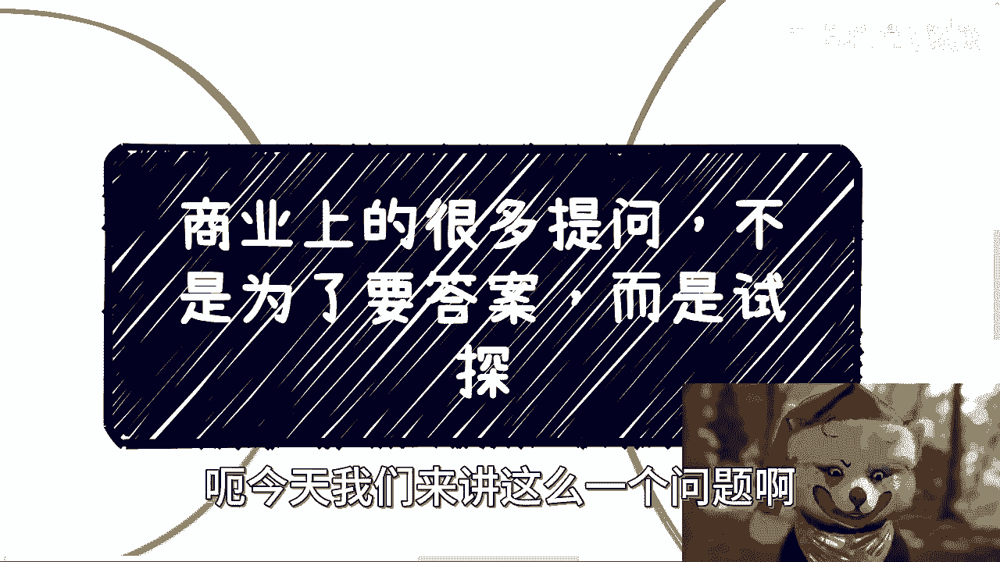
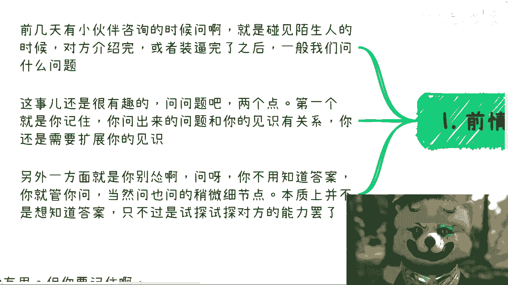
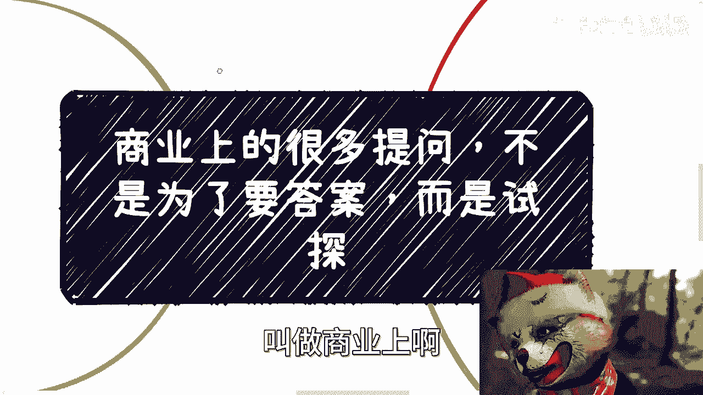
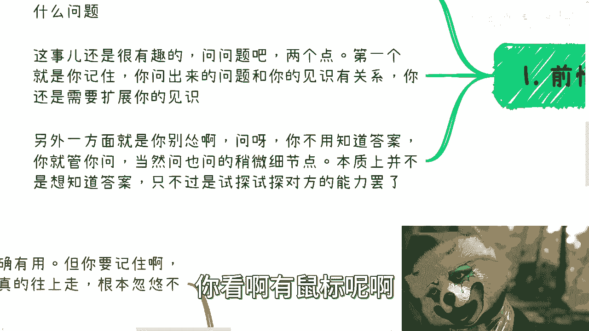
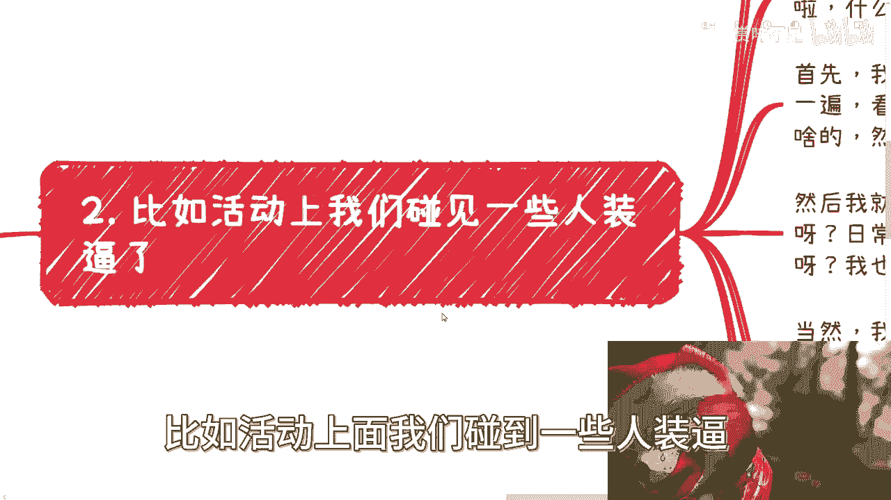
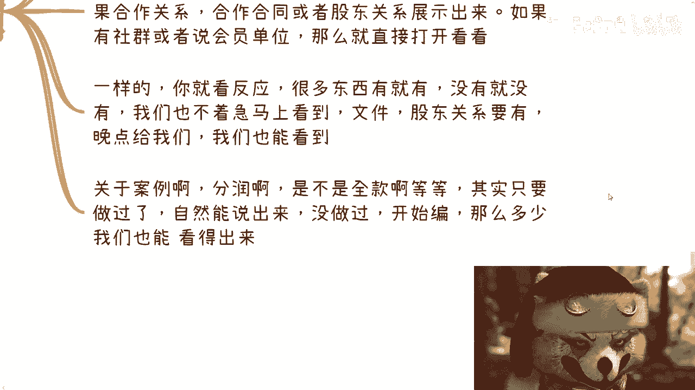
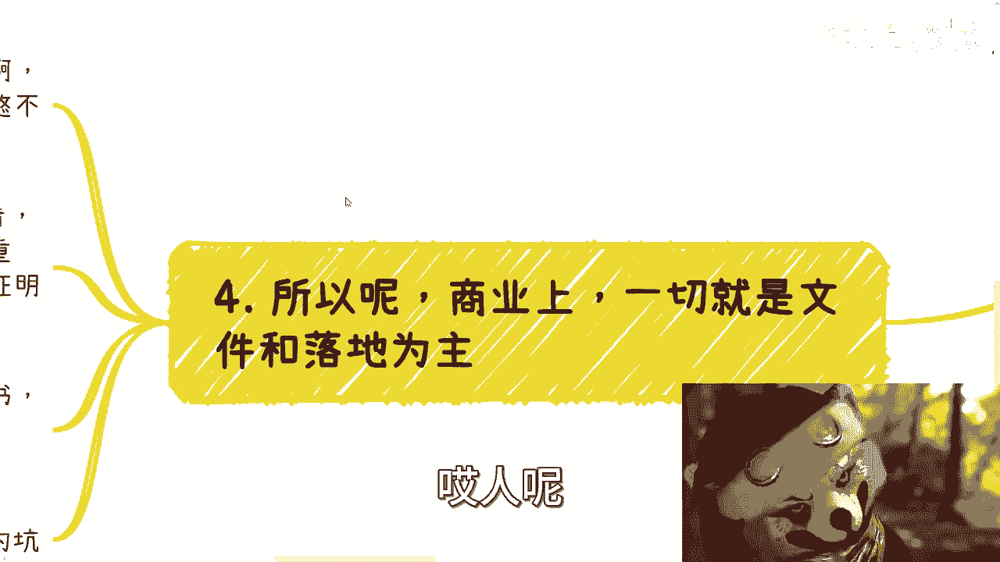
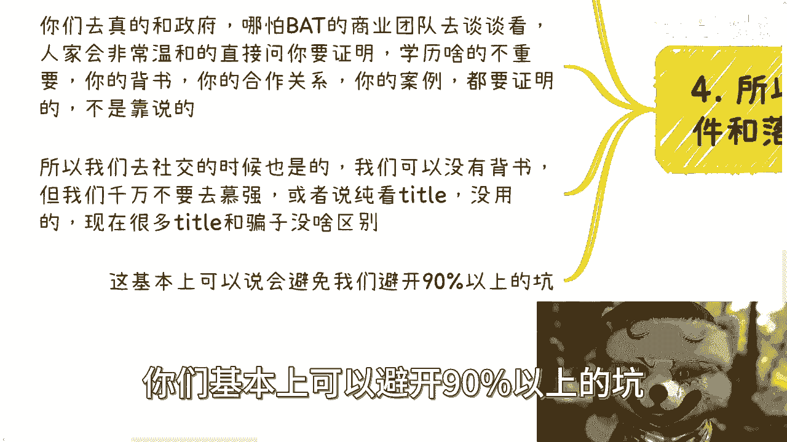
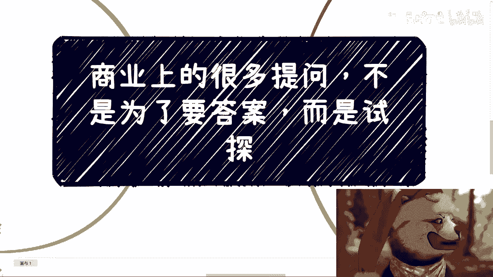

# 课程名称：商业提问的艺术 - 第1课：提问的核心是试探而非答案 🎯

在本节课中，我们将学习商业社交中的一个关键技巧：如何通过提问来试探对方，而非单纯寻求答案。掌握这一技能，能帮助你在初次见面或商业活动中，有效判断对方的真实性和能力。

---

## 概述：提问的两个核心要点

上一节我们介绍了课程主题，本节中我们来看看有效提问的两个基本前提。

首先，你提出的问题深度与你的个人见识直接相关。没有见识，问题就缺乏深度，对方可能不愿回答，你也无法达到试探的目的。

其次，不要因为害怕而不敢提问。提问本身没有风险，关键在于你提问的意图。

**核心逻辑可以概括为：**
`有效提问 = 个人见识 × 提问勇气`

---

## 实战场景：如何试探“装逼者”

在社交活动中，常会遇到喜欢夸大其词的人。我们的目标不是评判对方言论的对错，而是通过一系列问题，试探其言论的真实性和背后的能力。

以下是针对这类场景的具体提问策略：

1.  **探查组织背景**
    *   “咱们协会/公司的主要业务是什么？”
    *   “日常的合作方一般是哪些？”
    *   “组织有多少会员单位或客户？”

2.  **询问加入门槛**
    *   “如果我想加入，需要满足什么条件？”
    *   “有没有相关的入会章程或PDF文件可以参考？”

3.  **深挖合作细节**
    *   “您提到和XX部门有合作，具体是怎么开展的呢？”
    *   “过去举办过哪些活动？筹备周期和投入产出比如何？”
    *   “合作案例是全额收费吗？发票如何开具？”

4.  **要求事实佐证**
    *   “您提到的资源，有相关的合同或盖章文件可以证明吗？”
    *   “您说的400家会员单位，有名单可以看看吗？”
    *   “这个案例的利润是如何分配的？”

**关键点**：提问时态度要温和，采取“扮猪吃老虎”的策略，避免攻击性。你的目的是观察对方的反应——他是在思考、编造，还是对答如流？即使对方是经验丰富的“编造者”，持续深入、多角度地追问细节，也能让其露出破绽。

---

## 核心理念：一切以可验证的事实为准

在商业世界中，空头衔和华丽的说辞价值有限。无论是面对政府、企业还是高校，真正的合作都需要扎实、可验证的材料作为支撑。

不要迷信“背书”或“抬头”。一个有效的验证方法是：**凡有声称，必求证据**。

如果对方声称拥有某种资源或关系，就温和而坚定地要求查看脱敏后的合同、盖章文件或股东关系证明。对方若能提供，至少证明其有执行能力；若不能，则其言论的真实性存疑。

**核心验证公式：**
`可信度 = 可验证的事实证据 / 口头承诺`

---

## 行动指南：将原则融入DNA

要将本节课的内容转化为实际能力，你需要养成以下思维习惯：

*   **信息清晰化**：无论是接收信息还是传递信息，首先确保其本身清晰、无歧义。模棱两可的信息没有深入讨论的价值。
*   **拒绝慕强心理**：不要被对方的头衔吓住。聚焦于“他能做什么”以及“如何证明”，而非“他是什么”。
*   **敢于要求验证**：在社交中，我们自身可以没有强大背书，但绝不能盲目崇拜他人的背书。温和地要求验证，是保护自己、筛选伙伴的最佳方式。

---

## 总结

本节课我们一起学习了商业提问的艺术。我们认识到，**商业上很多提问不是为了答案，而是为了试探**。通过精心设计的问题，探查对方的细节、逻辑和可验证的事实，我们能够有效辨别信息的真伪与对方的虚实。

记住，提问的勇气与深度同样重要，而一切商业交往的基石，最终都落在**可验证的事实**之上。掌握这一技能，能帮助你在复杂的商业环境中避开大多数陷阱。