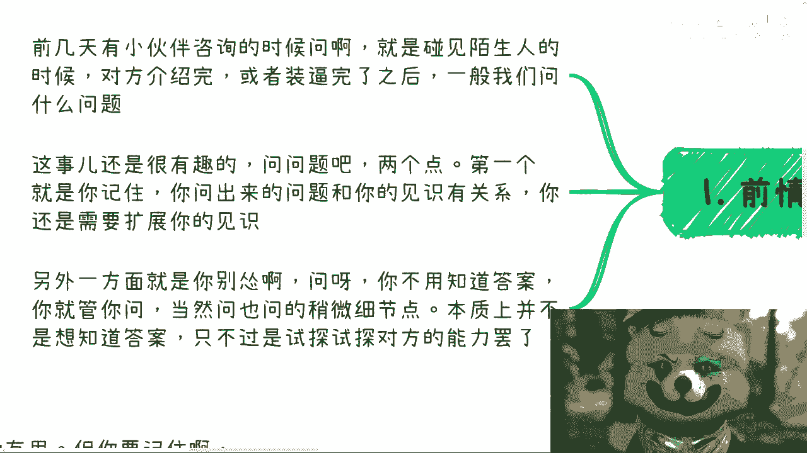
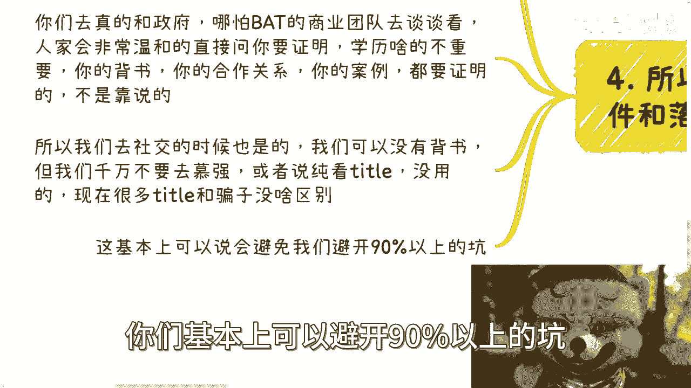
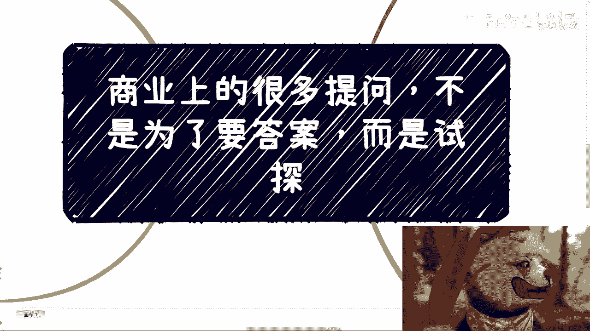

# 商业上的很多提问不是为了答案，而是试探 - P1 - 赏味不足 - BV1tN411s7qM

好好好，大家好啊，今天我们来讲这么一个问题啊。

前两天有小伙伴咨询的时候呢，他是这么说的啊，他说呃碰到陌生人，因为他去参加参加了一个活动啊，他说碰到陌生人呢啊这个等对方介绍完啊，或者装逼装完了啊，一般我们问什么问题，或者说呢他表示他不知道问什么啊。

脑中一片空白啊，他表示不知道问啥玩意儿啊，我们来看啊，首先我给他的这个主题。

你们看到这个主题叫做什么，叫做商业上很多的提问啊。

我们不是为了要答案啊，只不过是试探，你看啊，呃这个事呢很有趣，你看啊问问题呢，首先有两个点，第一你得记住，你问出来的问题跟你的见识有关系啊，你没有见识，你问出来的问题就没有深度，没有深度。

人家就不会回答你，不会回答你，你就没有办法去试探他，对不对啊，这是第一点，第二点就是另外一方面，你别怂啊，你就问啊，因为很多人就感觉我的，我不知道怎么问，我这个怕问了，有问题，怕毛啊啊你问个问题问错了。

警察还能抓你啊，你说你说是不是啊，好那么你就问啊，但是呢本质上就是说你千万啊，有很多人很老实，我发现就是你问啊，你不用去知道答案，你懂吗，就是对方在跟你讲，你在那边分析哦，他讲的对不对，别啊我跟你讲。

你别啊，你就管你问你问难呃，本质上并不是说你要去知道答案啊，你要去试探试探对方的这个能力，你要去试探对方的这个是不是装逼啊，你问问题也可以问的稍微细节一点啊，我来给你们举例子啊，你看啊有鼠标呢好看啊。

第一啊，比如活动上面我们碰到一些人装逼对吧好。

你看我我就很讨厌装逼啊，呃当然我意思是我很讨厌别人装逼啊，但是我很喜欢我自己装逼，哈哈对吧，我出去谈商业的时候，一般啊我不说话，我跟你讲，我一般不说话，但是话又说回来，我以前很喜欢说啊。

但是因为我不是也跟大家说嘛对吧，一直走商业，走商业走这么多年，人会变嘛对吧，我现在就不喜欢说嗯，嗯要说呢我就去问嗯，当然我不会是那种攻击性很强的啊，你记住啊，你去提问也是的，你一定要扮猪吃老虎啊。

你不要一上来就攻击性很强，别人会警惕，就像什么，你要你钓鱼嘛对吧，你要放个鱼饵啊，你不能上来，你说我的，我得吃你们，那他妈谁上钩啊，对不对啊，我们活动上面碰到一些人啊，他一般会说啊，我当然我随便举例子。

你们别仅限于这些啊，你比如说碰到一些什么协会会长，秘书长啊，什么执行会长啊，唉反正他妈的开头一大堆对吧，反正他们说啥是啥，我也不懂啊，首先我表示我也不懂啊，我要去查，那么我首先呢先通过google啊。

我先去查这个什么SP协会，到底怎么是个什么组织架构对吧，那到底是有没有直属单位啊，第二呢它的主体，因为协会永远不可能是个主体，你懂吗，就协会它一定是有一个有一个商业主体的，就你要到企查上面去搜啊。

或者到网站上去搜，他的商业主体是什么，那么这个主体到底是民企呢，还是说是合资呢，还说什么东西呢，你得去看看啊，还是说压根就是个野鸡对吧，你不知道的，他自己取个名字对吧啊，好随着呢，随后呢我就会问啊。

我说协会啊啊好啊，好，没问题啊，那咱们协会的业务是什么呀对吧，那这个我不懂啊，我说日常合作方一般是谁呀，啊咱们协会有多少会员单位啊，啊然后我说我也想进协会啊，我有什么门槛吗，对吧啊。

我一般就问这些问题好，你看啊，当然啊从事实的角度来讲呢，我肯定不会加入啊，谁他妈的花这个冤冤枉钱对吧，那么但是呢你一系列的问题问出来啊，你要明白你的目的不是看他回答对不对，你要看他回答啊。

你也许不懂商业，也许不懂协会，但是对方的表达，你比如说他是不是在思考哎是不是在编对吧，是不是在瞎扯啊，是不是在无中生有，那我觉得以大家的智商总该看得出来啊，对吧好，那么有人要说了，有人要说了。

他说吕老师你这样不对啊，那他说就算是骗子啊，就算是编的，那他有可能已经编了很多次了呢，对吧，他已经融会贯通了呢，对吧好，那也很简单啊，你别只问这些问题，你问完之后你再往下问呗，你是一个个体。

他还能预测你问出什么问题来呀，对不对啊，那同样的我们在打比方啊，他说呃因为他肯定会介绍，对不对哈，那比如说他说哎呀我们这上面是金信委，上面是科委对吧好，没问题啊，你说的对吧好，那我问啊。

哎那个呃你直接就问他，那个哎那个柯伟这边你们怎么合作的啊，科伟每一年这个之前有办过什么活动吗，对吧唉这个我也想了解了解啊，怎么样，你就往上靠啊，你看他怎么回答，对不对。

就是很多时候呢你就管你问问题不大的，大家都那个素未谋面对吧，然后你也不是问他要钱，你不就问问题，问问题怎么了啊，问题他不回答，你又不少块肉，对不对啊，你想啊，一个协会吧，一个正经协会，一个秘书长。

一个正经秘书长，哪个人会连这些都说不清楚啊，对吧哦，他连正经的文件，连正经的一些，比如说就像我们说的，你要加入协会，那那一般家协会他肯定会已经有文件了，至少有个PDF对吧，比如说会员单位登记啊对吧。

或者理事会单位登记啊对吧，你连这些文件都拿不出来，你搞个锤子啊，那你还跟我说不是野鸡，那当然了，你不能现场拆穿人家啊，那这是一种啊对吧，你看啊，哎呀我跟你讲也是一样的。

那北方他妈的我谈合作谈的老多老多了啊，真他妈都是吹，我跟你讲，我这么说真不夸张啊，比如说来200个人，他妈我就没见过一个不是吹的，那百分之百都他妈吹啊，所以我才跟你们讲，你妈昨天还有人私信我。

说说吕老师为什么做商业，不不不不推荐去北方，那你去呗，你去试试看啊，我跟你讲去北方，这叫什么，就来南方啊，我我比如说我们称之为叫做什么叫地狱模式，你去北方，那他妈就说这他妈地府模式，你妈哎这对不对啊。

你看啊我不管啊，我就问比如说啊，我说你这个当他们当时过来合作啊，我就我就问我说你们合作过什么案例呢，对吧，你们之前合作案例收费多少呀对吧，是不是都收全款呢，然后你们整个筹备花了多少时间啊。

投入产出比怎么样啊对吧，来的人会不会花这个为什么会花这个钱啊对吧，好看啊，我为什么会问，第一我要去了解细节，我要让他来证明，告诉我他的确做过对吧，这是第一点，第二点我跟你说啊。

你们会发现他妈的很多案例其实都他妈扯淡，为什么，因为包括最近你说数字人啊对吧，这个培训啊，很多东西啊，他很多案例根本就不收钱，你知道吗，他很多案例根本就他妈是公益，然后拿出来来忽悠你。

就说哎呀这个案例很牛逼啊，我们以前怎么样怎么样啊对吧，我跟你讲，我管的这个案例牛不牛逼，但凡不能赚到钱，就说明什么，说明你没有价值，我就这句话，我管你合作是谁呀，你跟我说，你懂吗，就是但凡你收不到钱。

我不管你是向下问老百姓收钱，还是向上问国家收钱，你都收不到钱，你告诉我你有什么价值对吧，你别跟我他妈的吹吹天花乱坠，所以这也是为什么我会去问他们，我说你到底比如说收没收全款啊对吧。

然后这个发票信息发的是什么呀，对吧好，那么包括什么呢，我就问他，我说你手上有啥资源，你说的这些资源和你什么关系，有什么什么管委会啊，有什么什么人才基地对吧，什么合作没问题啊，你合同拿出来。

我看看有没有合同吗，对不对哦，你说这些都是他妈的有头有脸的啊，跟你合同没合同的，我不相信对吧，你要么就有股东股东关系，你看我这次去北京对吧，我说给人社部上课啊，然后我的合作方式大家都也都看到了吗。

中关村那个创新人才基地对吧，我有合同啊，他怎么可能不签合同的，不签合同怎么合作，不签合同怎么交税，你不交税怎么合法，你真是的，对不对，这其实逻辑就是这个样子啊，你包括什么，包括就是说你说你有社群。

对你有会员单位没问题啊，你跟我说什么啊，我有400多个会员单位没问题，你列出来我看看对不对，然后包括什么，包括就是之前有那个咨询我的人也是的，他说他说什么，他说我找了一个合作方，说这个合作方跟他讲呢。

有什么旅旅旅旅游局还是文旅厅合作，没问题啊，我说让他把合同拿出来，我管你什么地方，文旅推，我只看合同啊，他跟我说有什么敏感信息，我说我不要看你信息啊，我主要看文婷那章，我别的我不要的，你给我看到张。

别逼逼对吧，你们不给我看到张谁他妈跟你合作啊，哦你说文旅厅就文旅厅啊，你真是的对不了，就是你有东西一样的拿出来啊，那当然你问他问题，你看啊你就看反应很多东西，我跟你讲有就有没有就没有。

也不是说他一两天就能弄得出来的，那当然啊他如果一两天弄得出来，也说明他本事也可以啊，所以说你不用着急，你就问他啊，然后呢你比如说你也可以说嘛，你说给个台阶下，你就说哎这个我们你可以整理整理吧。

一两天后给我们也可以呀，对吧，文件股东关系合同章，我们只要能看到就可以对吧，我不管你怎么样，你要有本事搞得到，你就搞得就像我那天跟那个咨询人说的，我说他但凡有本事，只要搞得文理学院章对吧，那我就认啊。

你要是真的，我就认你假的，OK我也认了，你假的，到时候有问题了，我报警了，怎么了呢，我认就行了呀，反正是你出的，我有我干嘛不认了，对不对，你有本事作假，那我就有本事报警，对不对，你看看谁搞得过谁呗。

啊关于案例啊对吧，我以前也会问问别人，我说关于案例啊，你分数怎么分呢，对吧，是不是是不是全款啊对吧，其实我跟你讲，你只要能他只要真的能做过，他自然能说得出来，你没做过，他编哎呀，你想嘛啊，无论对方是谁。

他哪怕是个哪怕是个老油条，他编也没这么容易编的出来的啊，你。

有一定的认知哎，肯定看得出来的啊，好所以啊我跟你讲商业上啊，一切就是就是唉人呢都是我跟你讲。

都是一路走过来的，我以前也这样子啊，什么意思呢，就是说很多人说背书有用啊，我跟你讲背书的确有用，但你要记住啊，你忽悠老百姓，忽悠往下忽悠好忽悠没问题的，你吹没问题，你真的往上走，我跟你讲，你忽悠不动的。

你懂吗，就是说你真的往上走，你得就是还是得要积累出来踏踏实实的东西，就是说你们比如说真的去跟政府，哪怕哪怕不是政府，不是企业啊，这不是国企，央企业，是跟那些企业的商业团队去谈，你去谈谈看你就知道了。

人家一定啊，我跟你讲，一定肯定绝对会非常温和的，直接来问你，证明就是他不会来问你要什么学历，这种东西不重要的，他会问你要什么，比如说你提到过的哎，比如说研究院啊对吧，基地啊，你说我有些合作啊，怎么样啊。

只要你提到过的，他都会问你的，哎，那个把你的这个案例啊，把你的合作关系对吧，包括就是说呃这个脱敏的合作的合同对吧，或者怎么样，你都要拿出来对吧，你不是靠说的，说的没有用的，没人会信你，而且退换不来讲。

你要知道啊，就是政府企业对吧，甚至就是高校很多时候啊，就是他要去做，他就算信你，他得把这个东西往上申报啊对吧，那申报他怎么领导，领导看什么，领导要看东西啊，领导又不是来看你靠吹的了，对不对。

所以我们去社交的时候，我跟你讲也是啊，就是说我们自己可以没背书，但是我们千千万万不要去幕墙，你懂吗，就是因为中国的这个教育啊，我发现啊其实基本盘都一样，就是大家都是幕墙的，就就喜欢看探头啊。

就是对方比如说是个院士啊，牛逼牛逼啊，对方是个教授，牛逼牛逼，你就像今天有个咨询我的小伙伴似的，就跟我说，哎我那个教授对吧，看看怎么利用，我说我说教授本身能不能用，我不知道，但是你先告诉我他能干嘛。

对不对，然后他就跟我说，哎呀，这个教授跟上面什么什么地方好像有点关系，我说那什么关系对吧，你你你说清楚什么关系对吧，然后就说哎上面认识的人很多，我说呢什么人到底是什么，听什么科，什么局什么人。

你说清楚啊对吧，我真的我跟你们讲，只要我问出来一问三不知的，你懂吗，所以说不要去看抬头没用的，现在他妈的这么多态度跟骗子没什么区别，你们要是真的能把这件事情，我说的这些能融入你们的DNA。

我就说你们本可以避开90%以上的。

可你懂吗，就是就是做事情都是一样的，就是你记住啊，不管是别人给你的信息，还是你自己的信息，包括你们来找我咨询，问问题的时候，你要记住你自己先问你自己，问题本身有没有模棱两可，你要是有模棱两可。

你先去问清楚，你知道吧，你要问不清楚，那就说明这件事情没有他没有走的必要，就没有往下去浪费时间的必要，对吧哦，行好吧，我感觉这一期蛮欢快的，蛮欢乐的啊，就这么着吧，大概大家有什么这个细节问题啊。

包括这个怎么赚钱对吧，比如说什么哎最近找我什么留学的啊，什么什么什么职业规划的，海外国内职业规划也蛮多的啊，反正大家看吧，有啥你们问题列好，问题列好，我们再走咨询好吧。

