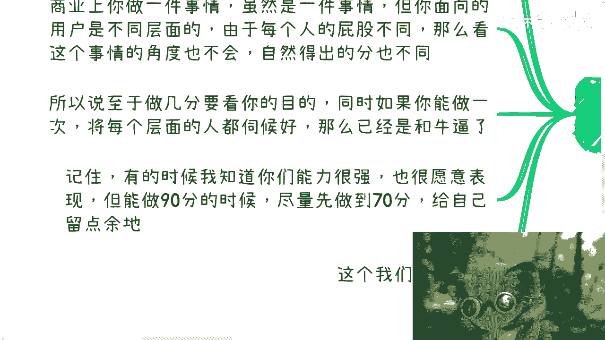
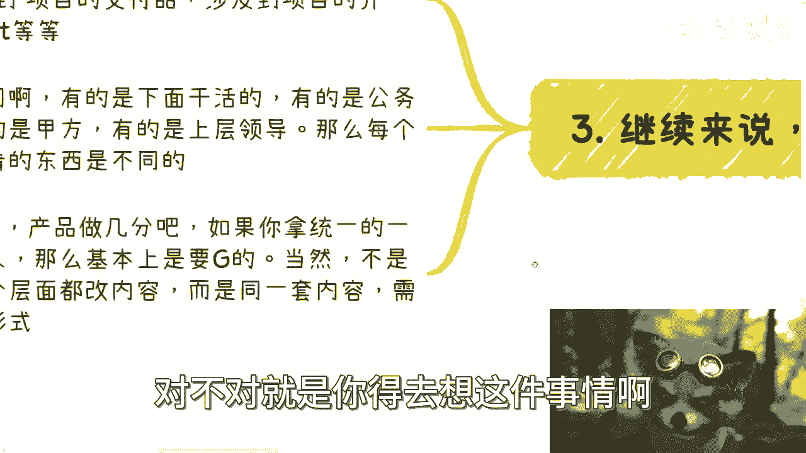
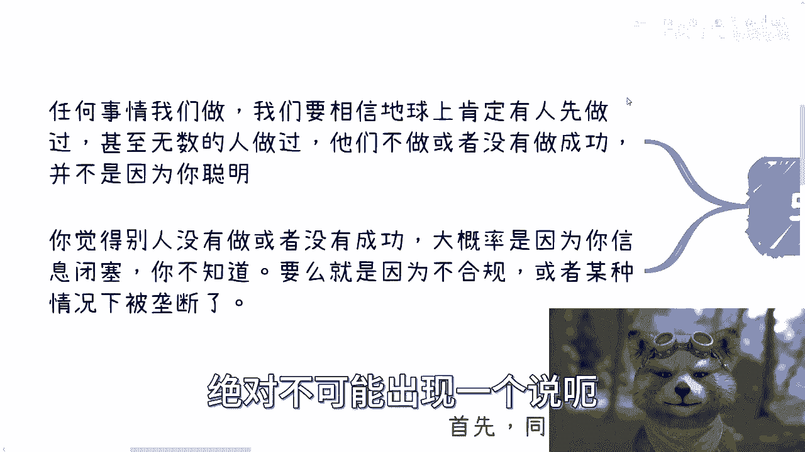

# 商业决策课 01：如何权衡“60分”与“100分”？🎯

在本节课中，我们将探讨一个常见的商业决策困境：面对一项任务或项目，我们是应该追求“60分”的及格线，还是力求“100分”的完美？我们将通过具体案例，分析不同利益相关者的视角，并学习如何根据目标灵活分配资源和精力。

---

## 前沿：这不是一道选择题

上一节我们提出了核心问题，本节中我们来看看问题的本质。首先必须明确，这并非一个简单的二选一问题，更不是一句“成年人全都要”就能解决的。商业行为中的“分数”衡量逻辑非常复杂。

核心在于，任何一项商业行为都面向不同层面的用户或利益相关者。由于每个人的立场（“屁股”）不同，看待同一件事的角度和得出的结论自然不同，因此对“分数”的评价标准也截然不同。所以，做到几分取决于你的具体目的。

如果能通过一件事，同时满足所有层面相关者的需求，或者能将一件事拆解出轻重缓急，针对不同部分分配不同的完成度（例如某些部分60分，某些部分100分），那已经是极高的商业能力。

此外，一个重要的原则是：即使你有能力做到90分，有时也应先做到70分或60分，为自己留有改进和提升的余地。这一点我们后续会详细讨论。

---

## 案例分析：筹办政府活动

为了理解多层面需求，我们来看一个具体案例：筹办一场政府活动。这个案例能充分展示，不同利益相关者关注的重点有何天壤之别。

假设你作为运营方承办一场纯官方活动，你会接触到各个层面的参与者：

以下是活动中涉及的主要相关方列表：
*   **媒体**：官方媒体与自媒体。
*   **领导**：仅出席的领导与需要致辞的领导。
*   **嘉宾**：政府嘉宾、企业嘉宾与普通参会者。
*   **其他**：参会人员、展台方等。

对于高层领导而言，活动的核心往往是“面子工程”，即宣传（PR）效果。这意味着他们极度关注所有可能被记录和传播的细节。

以下是领导可能关注的细节列表：
*   **视觉物料**：门头、KT板（广告板）、背景板、电子屏内容。
*   **现场布置**：植物摆放、桌椅摆放、席卡（姓名牌）位置。
*   **人员形象**：迎宾、礼仪、工作人员着装的统一与规范。
*   **流程仪式**：领导上台顺序、行走路线、上下台方式、是否需礼仪引导。
*   **影音记录**：摄影师、无人机拍摄的图片与视频质量。

如果你只关注活动流程本身是否顺畅（你认为的“重点”），并将其做到100分，但忽略了领导重视的这些“面子”细节，结果很可能不尽如人意。在这个场景中，**领导眼中的重点（面子工程）需要做到100分，而你自己认为的活动运营重点，可能只需做到60分即可**。

此外，还有大量其他细节需要协调，例如茶歇、晚宴、嘉宾接待、休息室安排、灯光音效等。总结来说，活动的成功与否，往往不取决于你所以为的核心环节是否完美，而取决于能否满足关键决策者（此处是领导）最在意的那些点。

---

## 项目演示：因人而异的材料准备

承接上节政府活动的例子，这种“看人下菜碟”的思维同样适用于日常商业项目。本节我们来看看如何为不同对象准备项目材料。

当你进行一个项目（如招投标、方案汇报）时，通常会准备一系列材料：项目介绍PPT、Demo账号、商业计划书、公司介绍等。你或许觉得现有材料已经很完善，但关键在于，面对不同的听众，你需要呈现不同的侧重点。

你的听众可能包括：普通合作伙伴、甲方基层员工、甲方决策层、高层领导或其助理等。每个人的职位、立场和关注点都不同。

因此，使用完全相同的材料去应对所有人，效果大概率不会好。这并不是要求你为每一类人都制作全新的PPT，而是要在**核心内容不变的基础上，调整呈现形式和强调的重点**。

以下是针对不同听众的调整策略示例：
*   **面对高层领导**：可能需要增加战略蓝图、未来规划、投入产出比（ROI）等宏观“饼图”，强调愿景和影响力。
*   **面对技术评估人员**：需要深入产品细节、技术架构、数据图表，强调可行性和稳定性。
*   **面对财务或采购**：需要明晰预算构成、成本分析、报价细节，强调合规性与成本效益。

所以，“做到60分还是100分”并非一个内部复盘时能一刀切回答的问题。它的答案取决于你当时服务的对象是谁，以及他们的核心诉求是什么。

---

## 产品规划：为未来留出余地

在明确了需满足多方需求后，我们还需要用发展的眼光看待工作。本节我们来谈谈为什么有时“留一手”是更明智的选择。

这一点其实很简单：做事情不能一开始就竭尽全力。这既是为了给自己后续的改进和提升留出空间，也是为了项目的可持续发展，便于未来继续“画饼”（规划升级）。

特别是在公司或面对企业/政府客户时，但凡有过实际项目管理或交付经验的人都会明白这个道理。产品需要满足当前需求，但设计时就必须考虑明年的迭代计划。

例如，很多项目合同包含“升级维护”费用（通常占总报价的10%-15%）。如果你第一版就把所有功能做得尽善尽美，后续的“升级维护”将无事可做，这会让你显得缺乏规划，并可能因此失去供应商的资格。因此，**有意识地保留一些可扩展的功能或“补丁”，是为未来创造价值的关键**。

---

## 核心思维：保持客观与谦逊

最后，我们升华一下本节课的思维模式。我想强调一个观点：**地球上几乎不存在没人做过的事**。

我们不要总认为自己能想到独一无二的绝妙点子。商业发展到今天，你能想到的绝大多数点子，很可能早已有人尝试过。如果你觉得某个领域没人做或没人做成，99.9%的概率是因为你信息闭塞，而非事实如此。

当然，还有一种可能是：很多人做过了，钱也赚到了，但现在时机已过，或模式已不合规，市场不再买单。

这个思维同样适用于日常沟通。例如，在一次商务会议中，面对客户、乙方或政府人员，什么话该说、什么问题该问，都需要斟酌。很多时候，有些话我们不说，不是没想到或不懂，而是因为说了没有意义，甚至可能搞砸事情。

当你想到一个自认为很聪明的点子时，请先冷静思考：这是因为我真的足够聪明，还是仅仅在钻空子？亦或是前人早已想过，但因不合规或无关痛痒而放弃了？保持这种客观和谦逊的思维，能避免我们陷入自以为是的陷阱。

---

## 总结

本节课中，我们一起学习了如何权衡商业行为中的“完成度”。

1.  **破除二分法**：“60分还是100分”不是选择题，答案取决于服务对象的核心诉求。
2.  **识别关键利益相关者**：像分析政府活动一样，理清不同层面用户的关注点，并优先满足关键决策者的需求。
3.  **材料因人而异**：根据听众的角色调整沟通重点和材料呈现方式。
4.  **规划要有前瞻性**：为产品和项目留出升级迭代的空间，确保可持续发展。
5.  **保持客观谦逊**：相信绝大多数问题已有前人探索，避免陷入自以为是的创新陷阱。

商业决策的精髓在于平衡与取舍，希望本课能帮助你更灵活地应对各种挑战。