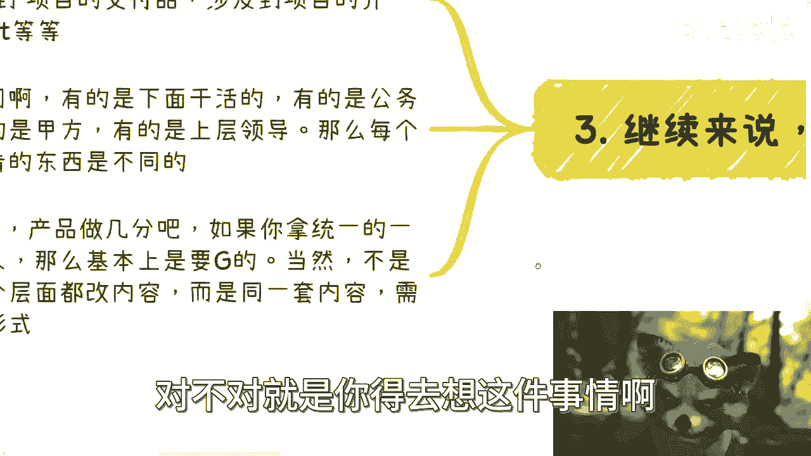

# 商业上的行为，我们是做到60呢还是100分呢 - P1 - 赏味不足 - BV19c411d7Pe

大家好，今天礼拜五礼拜五我们就叫什么。

就是轻松一点啊，随便扯一下啊，今天我要来讲的呢是这个商业上的行为呢，我们是做到60分还是100分啊，这个当然也跟最近这个咨询有点关系，但是相对来讲就没这么严肃啊。

我觉得可以扯扯淡，首先第一点前沿啊，首先啊同样的这个跟前面很多问题也是一样，它必然不是个选择题，更不是一个成年人，两个都要吧，你60分100分都要要不了呃，但凡说60分或者100分呢，那肯定就都不对啊。

而且里面的这个逻辑呢也其实非常的复杂，那倒不是说只有60分或者100分，也不是说有其他的啊，待会我们来讲，商业上呢你做任何一件事情啊，你要明白，就是虽然是一件事情，但是你面向的用户啊，它是不同层面的。

由于每个用户每一个跟你这件商业有关的，这个人的屁股不一样，那么看这件事情的角度也会不一样，那么自然得出的结论也会不一样，也就是他得出的这个分数肯定也不一样啊，所以说呢至于你说做几分，那要看你的目的。

同时如果你能做一次，就是事情只做一件，对不对，但是呢你这件事情能把每个层面上的人，都伺候好啊，那么你能把一件事情本身拆分出个轻重缓急，拆分出一个，比如说哪个应该60分，30分，哪个应该100分对吧。

那你已经牛逼了啊，我只能我我说你绝对牛逼了啊，那么记住啊，有的时候呢我知道啊这个大家能力很强，大家也很希望表现自己啊，也很怎么样啊，呃但是呢你要记住一点，就是很多时候啊你也许能做90分。

尽量先做到70分或者60分，你要给自己留点余地，留点也不叫后路啊，留点余地，这个呢后面我们也回来讲的。

嗯OK好。

那么我们先来讲故事了对吧，我们来举个例子，比如说你给政府办个活动啊，呃我跟你讲这个东西我又要骄傲了对吧，我可以说我可以这么跟你们讲啊，你们不论是谁，你们但凡只要给政府办过活动，我指的不是那种说啊。

政府拿你们拿你们的活动去满足KPI啊，而是说你们真正的做过那种就是纯政府的活动，就是你相当于就是外包啊，或者说你就是运营方啊，你呢就帮助真正的对吧，纯政府官方啊去做活动，我跟你讲，你但凡只要做过一个。

我不管你去做什么什么什么会议也好，活动也好，杀戮也好都可以，你基本上这块天赋技能你就点点满了，那为什么，因为这里面我可以说你能接触到的，不能接触到的，跟你有关的，跟你没关系的，反正你都会接触到。

你知道吧，你看啊，比如说我们打个比方，比如说你办个活动吧，你涉及到的层面有哪些，我们举个例子，比如说媒体对吧，有官方的媒体，有散户媒体啊，然后上面的领导对吧，有可能就是来走个过场的领导，有致辞的领导啊。

然后有嘉宾好，有政府嘉宾，有企业嘉宾啊，有散户的嘉宾啊，然后来参会的人对吧，然后还有各种展台，展台展位等等等，对不对好，那你想啊，如果你要做，你要怎么考虑，你看似很简单，我相信很多人做对吧。

他肯定想的是说啊，把领导伺候好，把这个活动做好，但其实说是这么说，但你要是单纯这么去想，那就没这么简单，对你比如说啊你对于真正的大领导来讲，比如说摄影师拍出来的，比如说无人机拍出来的对吧。

比如说这个这个他自己拍出来的对吧，就是说你要这些图片啊，你的演讲的视频，你的各个方面这些都要好，那这些好，我们再往里面切这些好意味着什么，意味着你的门头，你的kt板对吧，有很多人要问我kt版什么东西啊。

你自己去查好吧，你从你的门头，从你的kt板，从迎宾，从礼仪，从水骑对吧，你看有很多人要水汽也不知道对吧，那你水池怎么做，你水机跟别的东西都不一样啊对吧，你主KB要吧对吧，包括三折页，四折页对吧。

你的宣传物料到每个人的着装，到你的背景对吧，到甚至到你每一株植物的摆放，你电子屏怎么显示显示几分钟，对不对，你都要做到，我为什么，因为这些都是领导拍照的东西对吧，好那么还有什么嘉宾的西卡怎么放啊。

领导的西卡怎么放啊对吧，领导怎么站啊，谁先上谁后上啊，上了之后怎么下来呀对吧，谁在前谁在后啊对吧，从哪边上哪边下啊，要不要礼仪带上去啊等等等等等，对不对，但这些你都要搞清楚的，我跟你讲这些东西。

那就这么说啊，也许你们真的来做了，我跟你们讲这些，如果我真的跟你们讲这些，我是你们的leader对吧，我们现在这家公司你肯定心里会骂的，你妈，把这些东西他妈的还要搞的妈的，这明显就他妈让我们加班，对吧。

但其实我跟你讲，你要明白这些东西对政府的人来讲极其重要，就重要到无与伦比，你懂吗，没有办法的，我跟你说啊，我们为什么要说这些东西，就是因为你这些东西不关注这些东西不关注你。

如果说哎我单纯把这个会做的很好对吧，从上到下流程做的很好，不好意思，没有吊用，你懂吗，你一样会骂成狗啊，那么好了，各种别的东西呢，我跟你们讲，我就不展开了好吧，我就不想看了。

因为这个东西讲他妈的没底了啊，茶歇啊，流程啊对吧，来的人啊怎么接待啊，晚宴啊，来的嘉宾怎么进场啊，怎么离场啊，应该怎么去休息室啊，休息室应该有有有有什么茶歇啊，有什么茶水啊对吧，然后怎么个流程啊。

你得都得有人管吧对吧，灯光音效等等等，这他妈的细节多了对吧，总结来讲，其实你认为活动的核心是活动，但其实其核心在于这些细节，或者说你认为的重点，它不是重点，所以说你把重点做到100分，你觉得有用吗。

没有用，你要把领导觉得重点做到100分，你自己这些东西做到60分对啊，就像我们说的领导关系是什么，领导关系的是面子，那面子是什么，就是P啊，PR是什么，就是宣传对吧好。

那么我们来看第三三怎么到这里去了啊，那么继续来说啊，比如说我们做个项目，你想啊，比如说你今天做个项目，这个项目有可能是招投标对吧，有可能是别的方案，但咱不去说他啊，你可能会涉及到的是什么，你看啊。

项目介绍PPT对吧，你的demo的demo账号，涉及到的比如说商业计划书，项目的交付，到你的产品介绍等等等等等，包括公司介绍对吧好，你也许觉得我手上已经有了这么多的，那个那个那个PPT或者文件啊。

你觉得老牛逼了老牛逼了哈，但是你要明白一点啊，你面对不同的人，你的东西其实是不一样的，你知道吗，就说你面对的人不同，有的人他是跟你的合作伙伴，就他跟你一样是老百姓，就普通群众对吧好。

那有的人是公务员里面的基层对吧，有的人呢是甲方啊，有的人呢是上层领导对吧，有的人是可能啊，上层领导的这个这个小弟对吧，或者助理对吧，那么你要明白啊，就像我们刚刚说的。

每一个人他关注的点啊其实都是不一样的对吧，那么你想啊你关注点都是不一样，那么我先不说你的那些单纯的PPT，你比如说你产品的这个介绍啊对吧，或者说你各种这个服务的介绍啊，你所有的人都拿统一的东西去看。

我跟你说，你大概率就是要记的对吧，因为什么，因为你你你你一样的呀，所有这些人站在不同的位置，不同的屁股对吧，不同的眼光，他看你这个东西，当然当然有的人会满意，那有的人肯定不满意对吧。

那你每那那当然并不是说我们你说啊，我们是不是针对每一层都得做个做个，做个全新的PPT或者一个介绍，不是啊对吧，就说你的内容，比如说你的整个PPT的主架构对吧，你的内容上面可以不变对吧。

但是你你你内容不变，但是你展现形式要变了啊，你面对不同的人，你得有比如说有的是图表，有的是比如说那个要增加一些那个投入产出，要增加一些预算，增加一些未来的，就有有有有的饼嘛要切掉两块的。

另外有些人嘛饼嘛增加两块，对不对，就是你得去想这件事情啊。

不是说我们今天就是一刀切的，你说啊我们这个这个比如说你们内部复盘。

然后呢大家说哎你觉得我们这个东西做多少啊，对吧。

是做了60万100分啊，那不是这么个判断逻辑啊，那么第四点就是很多项目呢产品呢你要留余地，我觉得这事儿呢其实没啥好说的，因为简单来讲你做事情不能竭尽全力啊，因为你要为后面的发展留余地。

我跟你讲所有的事情都是一样的啊，自己做，你一方面是想要做好，要呃你一方面是想想好，你要给自己以后留点提升空间，另外一方面呢你要为了细水长流，给未来的顶流点空间继续去画对吧，那么我跟你们这么说。

但凡这件就是在公司里面，我觉得这个事呢是通用的，就是但凡在公司里面做过管理对吧，或者说就是说给那些呃企业或政府，做过单子的人，他基本上都懂，就我觉得只要自己做过，踏踏实实做过，他一定是懂的，为什么。

因为他他做完他就知道啊，产品呢本身呢它是需要满足需求的，但是你做今年你一定要先在今年的时候，你就想好明年做什么，你明年的时候得想好后年做什么，你知道吧，就是你今天做一个产品啊，你不可能做到十全十美。

这没毛病，但是你一定要留有一定的功能，或者留有一定的我们称之为补丁啊对吧，或者别的东西啊，你要为明年想好吧，甚至我们说有非常多的单子，他是有个叫什么叫叫升级维护对吧，那你升级维护一般啊。

我们就说一般是你整个报价的10%，到15%对吧，那你你我就问你嘛，你现在做的很好，你升级维护升级维护什么东西，你到时候再挖空心思升级吗，那不好意思，我跟你讲，你你你的这种没有规划的行为。

早晚会让你从供应商的队列调出去，好吧好，那么我们来说，最后就是我呢一直跟大家说这样一句话啊，我说任何事情呢，我们做，我们要相信地球上的肯定是有人先做过的，而且呢甚至无数的人做过啊。

我们不要老想着自己很聪明啊，不可能的，你别想了啊，就是很多人就跟我说，哎我觉得这个领域啊这个东西没人做，那个领域这个东西没人做，怎么可能呢，对不对，你说某个到发展到今天对吧，发展到今天2023年了。

有任何一个东西这个东西没人做，你你自己想想看，对不对啊，那么你觉得没别人没人做或者没有成功，我跟你说啊，大概率就我现在了解下来啊，基本上可以说99。9%的概率，就是因为你信息闭塞，你不知道别人做过。

而不是说得出的结论是没有人做，或者没有人做成功，你觉得可能吗，对不对啊，那么当然还有一种可能性是什么，就是也许有很多人做过了啊，他该赚钱也都赚掉了，但是呢他现在当下你当你要做的时候，可能他已经不合规了。

或者说他已经过了这个风口了，没有人愿意买单了，无非就这两种可能性没有了啊，绝对不可能出现一个说呃，就我这么说吧。

在我们可呃社交范围内的这些人啊，大部分都是普通人对吧，就是在我们社交范围里面的人，你不要去想说啊，有一个东西是什么啊，大家晚上头脑风暴你想得出来，他想不出来，怎么可能呢，怎么可能呢对吧，就像什么。

就像我跟你们讲啊，就像就像我们比如说今天一起在线下开个会，对吧，好我们可能对方对面面对的是客户，也可能面对的是乙方，也可能面对的是政府对吧，你要明白什么话能说什么话，不能说。

什么问题能问什么问题不能问啊，你比如说我跟你们一起去，有很多问题，或者有很多话是我不愿是，是我没想到吗，或者是因为这些问题我没我还不懂吗对吧，我不说是因为我不敢说嘛，不是对吧，我不说。

就是因为说这些情况有很多时候，你说了没有意义对吧，你说了只会让这个case搞砸，那你说说他干嘛呢啊，那很多时候就是你想到一个问题的时候，说想到一个点的时候，你一定要去思考清楚。

就是就是这个问题是因为我足够聪明，我想出来的呢，还是说我足够的，这个会这个这个小小小聪明很多对吧，足够的钻空子，想出来了呢，还是说其实很多人已经想过了，但是他不合规对吧。

或者说他根本这个东西无关痛痒对啊，所以我觉得就是大大家呢，其实就很缺乏这种思维，真的就是我不是说我们要贬低自己啊，而是说客观的看待啊，不要是吧，就动不动觉得嗯啊这个东西啊，我想出来我牛逼啊，不好意思啊。

行啊，那就先这么着好吧，嗯唉其实最近咨询也蛮蛮让我感慨的，回头我再总结一个内容给你们，哎呀真的蛮感慨的，我我一般啊，一般我不太骂，说实话我不太骂，除非我忍不住对吧，就像我就像那句话，怎么说的啊。

一般我不笑，除非我忍不住啊，我是有觉得修养好吧行，那就先这么着吧，大家有什么问题，反正整理好那个question list。

