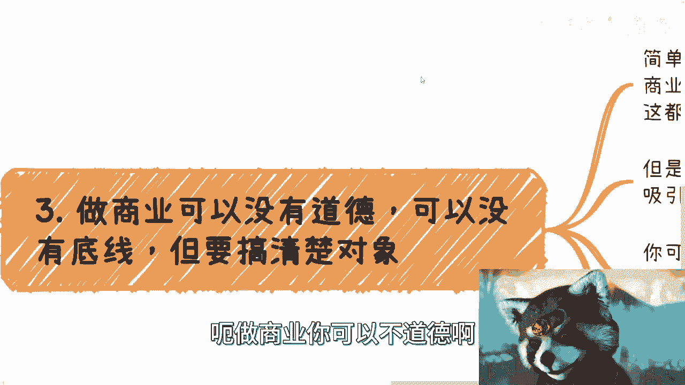

# 商业上，不要给对方第二次机会 - P1 - 赏味不足 - BV1ku411n75p

哈喽大家好啊，这个最近听说模仿我的人特别多是吧，我蛮欣慰的啊，说明模式上至少是成功的是吧，这个前两天有人跟我说，让我把这个雪茄放眼睛上，我试过啊，有点过于血腥，所以我还是放我脑门上比较好一点。

呃首先啊先说前两天有个小伙伴问我，他说每个家庭呢多少都有些亲戚啊，有的呢有钱有的没钱啊，应该怎么去看待呃，我是想单独出一期来着，但是回头我再说吧，啊想想吧，这亲戚这个事我就我先在这个地方说个概述吧。

哦就是说你该谈钱就谈钱啊，该走正规的商业合同，就走正规商业合同啊，没有就免谈，因为亲戚这个事呢，十个家庭里面11个都是坑的啊，所以就是我觉得就这么看就可以了啊，就是包括就是像上海话叫什么花旁。

花旁就是啊动不动就是说对外来吹啊，对内也吹，那这种亲戚说不好听点，你跟他也没什么很大交集对吧，然后你还指望跟他啊去赚钱，或者指望他能够带给你什么东西，我跟你讲，妈的不坑你就不错了啊，好吧。

这个是这个氢气层氢气上的事儿啊，呃首先呢本次这个内容呢是也有小伙伴提到啊，就关于这个商业上面呃合作的问题啊，我在这方说的很清楚啊，不要给对方第二次机会啊，当然第一次机会给不给也看你自己啊。

不是说一定要给第一次机会哈，这个但凡咬文嚼字的话，那我也只能跟你们这么解释啊，呃首先先概览一下啊。

就是说呃你可以是跟他商业合作过，就大家赚过钱啊，呃但呢你会发现在整个流程当中呢，这个人可能有问题啊，或者是一个机构或者是个组织，就他有问题啊，啊这个问题很多，我后面会再来说啊。

第二个呢就是说你没有商业合作过，但是呢你发现他没有任何商业思维啊，没有商业思维这个东西啊，它其实是个很广的一个东西，那这就好像什么呢，这就好像你说一个人情商不高，就你说这个人情商不高。

他可能不仅仅体现在某一个方面，比如说啊跟他的这个为人处事啊，还是说跟他呃这个这个向领导汇报啊，还是说是这个出去跟别人吃饭对吧，或者说待人接物对吧，就他不是一个单独的一个点啊。

这个跟没有商业思维也是一个道理，就是他可能在某些层面，比如说不会赚钱啊，或者说这个不知道怎么跟别人合作，这个事的那也可能是什么呢，也可能是毫无底线啊，这种毫无底线就是就是没有逻辑性的，毫无底线啊。

这个我们后面也会来讲啊，那么第三点呢就是对外画饼啊，队内也画饼啊，我跟你讲这种是最讨厌的，你知道吗，就是画饼没问题啊，但是这个无差别画饼啊，这种人我跟你讲也要也不叫提防，就别合作了。

哎没什么低不低不提防啊，呃然后呢还有就是说你感觉不好的，我跟你讲，你感觉不好的，在商业上很准啊，相相信你的第六感就是你感觉不好的，也就别合作了啊，没什么好合作的啊，那么我们为什么说不要给第二次机会呢。

因为你给了啊，他就一定有概率出幺蛾子对吧，你不给是最好的，一了百了对吧，这种就是是个概率问题，那我就问嘛对吧，你自己做商业，你自己赚钱，那你为何要去冒这个风险呢，为什么要让你的商业逻辑上面。

出现一个未知数呢，对不对，你又不是说缺了这个人，缺了这个组织，缺了这个合作方对吧，地球就不转了，或者你这个单子就不做了，那么没有的呀对吧，我做到现在这么多的商业，我从来没有看到过哪个是什么。

缺了谁做不了的，不存在对吧，那他妈现在很多地方领导3年还一换呢。

我怕谁呀，说师傅了啊，那我觉得这是第一个，第二个呢我们来看看可能有些哪些问题啊。

那这个就啊故事会了啊，故事会我们一个来看啊，首先这个一直合作一直合作一直合作对吧，然后呢大家态度也很好啊，你好我好，大家好啊，态度好到就是你都不好意思啊，这个跟他说一些重话，你知道吧啊一直在合作啊。

各种合作，但就是不赚钱，你知道吗，就是不赚钱啊，而且呢就是说呃签合同也签了，但是签呢永远都是签的那种，就是说不痛不痒的对吧，没有任何的直接的这种金钱的关系在上面的，我跟你讲这种也别合作了啊。

因为这种我们以前碰到过好多，包括我以前早期吧，我在B站上还单独出过一期，就是说你要跟别人合作，你得先让别人感觉你能为他赚钱，你知道吗，就是说你要为他能够带来钱赚钱的机会，他才会跟你合作。

其实这种也是一样的，就是很多人哈他是在做事情的啊，你说他跟政府合作吧，合作的，你说他跟协会合作吧，也合作的很多很多，但是呢你跟他合作，你知道吗，就是就是你你跟一个人合作，你肯定得用心嘛，对吧。

你肯定得要就是说啊大家说好对吧，就这件事情既然做了，那我肯定得要个结果，对不对，那好很有可能呢你跟他做个一年两年，3年四年三年四年就算了，一年两年吧对吧，没不赚钱的啊，不赚钱的。

然后呢你这每次比如沟通啊，这个又是回到那个花棚对吧，就获得就是很厉害的啊，就是那种哎呀我很牛逼啊对吧，这边合作那边合作说半天啊，最后没有钱了哈，这种没意思啊，没有任何意思啊，首先这是第一点啊。

第二点呢就是谈不来琴啊，就是无论这个人是多么好的一个销售，无论这个人这个介绍产品介绍的多天花乱坠，无论这个人多外向哦，或者说开朗，或者说善于沟通，我跟你讲，我看出来了，就很多人啊。

他是这两点上面他有一个呃风水岭的，就是也许这个人很牛逼，但是有一部分人啊，就是你会发现他就是谈不来钱，就但凡开始弹琴了啊，他就开始给你支支吾来呀，就就好像你说他不自信吧，也不是啊。

你说他呃这个是不善于沟通吧，也不是你说他情商不高吧，也不是，但是他就是谈不来钱，就是每次比如说你谈他呃，这个你自己该分多少钱，他谈不来对吧，或者说你代表公司去谈也谈不来，唉我靠，我跟你讲。

这种人就也别合作啊，也别合作，因为因为你会发现有个很大的问题，就是一方面呢就是说呃这个难以沟通对吧，呃就是你跟他沟通一个东西就不爽快，你懂吗，那我觉得这是第一个，第二个呢其实最怕的不是这个。

最怕的就是说你跟他谈，他谈不来，对不对，好，然后呢那你给他个价格，比如说你说哎那个刘老师三三千块钱一天，你做不做对吧，那我可能还在那边，哎我谈不来唉，我就有种心里面就有好像有点难过啊，好像有点怎么样。

但是呢我又不好意思拒绝你对吧，那就这样吧啊3000就3000啊，然后呢这个等你合作完了，合作完呢，这个我越想越不开心啊，那么回头还得跟你闹矛盾，那这种就没有必要了，你知道吧，就是很多时候呢他属于不会谈。

但是那并不代表他没有情绪啊，那么这种人其实也没必要合作啊，那么第三类呢，就是我们刚刚说的就是对外画饼啊，对面也画饼，哎呦我去这种人我跟你讲，以前我碰到多了啊，就是你说他画饼会不会会老会了啊。

呃一把好手啊，一把好手top one啊，但他敢说第一没人敢说第二是吧啊，就这么啊，这个队内有画饼对吧，那说白了啊，就是说你我跟你讲，很多人他是一个惯性，就他吹牛逼吹的就是就是上头了，你知道吧啊。

然后呢就是说你比如说你对内对员工锤，我觉得无所谓啊，你不能对合伙人锤，你也不能对你的合作方吹，你知道吗，就是你要明白一点啊，就是你但凡商业合作，你的合伙人，你的合作方大家因为是利益既得利益者对吧。

大家来合作都是为了赚钱的，你但凡对自己人画饼，这跟骗没有任何区别啊，也就是说你除了会让别人觉得哎，我跟你以后不可能合作的对吧，因为你你纯粹的就是你连一起赚钱日子都骗，那谁不会骗，对不对。

那你你自己其实在把自己孤立掉，那么这种人其实也没什么好合作啊，这种人我们已经碰到过很多，卧槽真的还有什么呢，就是对钱啊或者关系上有小动作呢，什么意思呢，就是说那就打个比方吧，就以前我们合作啊。

有一个人呢他特别有这种掌控欲啊，控制欲，但是呢他碍于这种就是说自己的这种性格，各个方面呢就是说他又不会跟你强这个强行掉，或者直白的说你知道吧，但是呢他就开始后面做各种小动作，什么意思啊。

就比如说我们以前合作对吧，大家做一个品牌，然后呢你比如说啊你说这个三个人合伙啊，其中一个人呢可能对外啊，这个要做一些分享或者做一些这个活动啊，那么他可能会用到这个品牌对吧。

那我觉得大家作为这个联合创始人对吧，用自己的这个品牌出去很正常嘛，对不对，但是其中有一个人呢，他掌控欲都特别强，你知道吧，他呢又不说，那怎么办呢，他就跑到外面啊，就是碰到一个人就说哎这个这个你看啊。

那我们那个联合创始人出去，用我们的品牌呢都不跟我们商量啊，用我们的品牌呢都这个呃这个自说自话对吧，怎么样子，就是就是你说他做得不对吧，也没有完全不对对吧，因为你的确啊这个大家做什么东西。

你是就是说可能跟内部这个通个气对吧，这个商量一下也没毛病，但是所谓家丑不可外扬对吧，你有任何的想法，那你说而不是说第一时间跑到外面去逼逼，你知道吗，那很多时候你会发现啊，就是钱没几块钱对吧。

然后你说这个事儿也不是什么大事啊，但是呢你但凡哦我就告诉你啊，你但凡会发现在钱上或者关系上面啊，我不管是什么内部，就是啊股东这样的关系，还是说是外部的这种合作方的关系，但凡这种关系和钱上面有小动作的。

我跟你讲，这种人坚决不能留啊，坚决不能留，因为就是它的核心点，根本不在于大家一起赚钱啊，而在于搞这种有的没的，那么这种的话就是毫无格局啊，也毫无商业的sense，那没有必要啊。

那么还有一点呢就是商业思维不清晰啊，那么商业思维不清晰呢，就像我们刚刚说的，这是一个很笼统的一个概念啊，综合来讲啊，这个反正你聊下来就感觉比如说赚钱呃，赚钱层面啊，合作层面啊。

包括就是说自己这个投入产出比层面，包括整个的我们说商业的变现链路层面对吧，我跟你讲，就像所有人只要问我啊，刘老师啊，我做自媒体，你觉得行不行对吧，我选这个专业行不行对吧，我做什么东西行不行。

我跟你讲这种话问出来都是商业思维不清晰哦，好第三点呢就是说到啊。

说回到前两天我们说的这个道德，不道德的事情啊，我正好也想跟你们再聊一聊啊，呃做商业，你可以不道德啊。

你也可以没有底线，但要搞清楚对象，你搞清楚上下文什么意思啊，简单来讲，每个人都有自己的选择，你可以选择一个高道德的商业，高底线的商业，你也可以选择毫无底线的道德，和毫无底线的底线，没问题啊，对不对。

这都是自己的选择，没有问题，但我跟你讲，你记住一点，人与人以群分，物以类聚，我写错了啊，人以群分，物以类聚，什么意思，你做什么事情只会吸引跟你一样行为的群体，为什么，因为你做的行为大家都是看得到的哦。

那么你做的行为处于哪个level，你势必就一定会吸引那个群level的一个群体，而与此同时更高level或者别的一些群体的人啊，也许他们一样也很没道德，一样也很没底线，但是啊他不会像你一样。

不遵守某些规则的情况下，面是毫无道德，毫无底线，那么不好意思，他们也不可能跟你合作哦，那么简单量什么意思呢，就是说有很多的时候你可以白嫖别人，你也可以欺骗别人，你知道吧，你也可以利用别人。

我觉得这没有问题，但是你要在一定规章制度，一定的规则，这种规则可能是可能是潜移默化的一种潜规则，对啊就是可能不是那种铭文的啊，我们称之为就是说是这个行业都懂的，商业都懂的一种规则。

你如果不具备不遵守某些规则情况，下面你乱来对吧，你我跟你讲，你千万别去欺骗或者白嫖，未来很有可能跟你成为合作方的人，或者是你竞争对手的人，没有必要，为什么，因为没有人是永远的敌人，也没有人是永远的朋友。

商业上面只存在能不能一起赚钱，你知道吧啊，所以说本质上就是如果你路要越走越宽，你一定是要给自己，不叫给你留后路啊，是给你未来的商业合作留后路，你知道吗，要留出很多的可能性哦，就是万事你不按照规则去走。

那么你是很难往上走，你也很难把这个格局做大啊，所以这个事情我在这个地方要跟你们说清楚，说白了啊就是说你可以去做商业，你也可以去赚钱，赚钱就是做正规一点的商业，但是呢你别去坑你自己的团队或者合作方啊。

我觉得这个已经是这个最最根本的标准了。

OK那么我们来说第四点，很多人呢，那当然啊我说是这么说，但很多人还是会给第二次机会，为什么你比如看啊，比如说啊刘老师啊，这个我们已经合作过了对吧，这个啊有感情了对吧，要么呢可能就是比如说朋友关系啊。

要么呢就是说这个这个觉得自己不是那么狠的，一个111个人啊，这个也不会这么狠的拒绝别人啊，啊要么呢就觉得呢哎呀这个都不是什么大事，鸡毛蒜皮的对吧，能继续合作就继续合作，我跟你讲啊，但凡拥有以上想法的啊。

就说明你还不是一个成熟的，你还不是一个成熟的一个成年人哈，或者你还不是，你根本还不是一个成熟的这个这个叫什么，就是拥有商业size的这么一个人啊，那因为为什么，因为你就但凡啊就是你要去赚钱。

你要去做商业，你心里面一定要明白，就所有东西一切以什么，以你商业为重，以合作为重，以赚钱为重对吧，那么也就是说，你你你上面这些行为只会为你未来埋坑，那这何必呢对吧，就是说你但凡还会抱有这种侥幸心理。

那其实你就不适合去做生意，或者说你还需要去做改进哦。

好吧，所以说啊就说你说哎很多人在问嘛，他说哎我怎么算。

我怎么算这个有商业思维啊，怎么算呃，有这个比较成熟的这个商业思维，你怎么怎么不算，怎么算怎么算，没有商业思维对吧，其实我跟你讲很简单，就是所有东西整个链路你想清楚没有对吧，就像我们之前说的。

整个链路想清楚没有，怎么变现啊，这个钱到底谁付给你的啊，然后这些钱的这个付钱的人怎么来的对吧，你是有稳定的渠道呢，还是有稳定的客户呢，还是有稳定的这个合作方的，怎么样，你所有东西都要有啊对吧。

然后就像我们说的合同怎么签啊，税怎么交啊对吧，钱怎么给呀对吧，那你这些才叫商业，否则就像我们说的就是外快对吧。

那当然了，就是说也没有说外汇不能做嘛对吧，你有你就像我我做事情对吧，那可能比如说外汇商业一起做无所谓啊对吧，但是啊我以前这个视频里面跟你们说的很清楚，就是外快这件事情对大家来讲是没有积累的。

你是很难去可持续发展的啊，那么只有商业才有可能把你的合作方，把你的合伙人，把你的这些这个曾经做过的东西，真正的积累下来对吧，那么这些东西沉淀下来，未来才有可能给你带来更大的利益啊。

那否则的话你说呃那你就像这两天私信我，人蛮多嘛对吧，就就问他说哎这个吕老师啊对吧，我现在做个什么东西啊，然后呢哎我另外也有做一个东西，比如一小时多少多少钱啊，我也觉得蛮多的，根本其实这种问题不用问了。

这种问题你们就自己想对吧，你做那个东西可不可以做，可以做啊，我总不可能跟你说阿姨1100，比如说一个小时1000块钱，你不能做，能做啊，那你稳定了来，你能稳定赚几个人，你能稳定赚多久，对不对。

你你你不能在一个稳定和不稳定的，这个A与B之间去说，艾伦老师，我选A还是B，这没什么好问题啊，对不对，你肯定是得要有一个稳定的东西，我不管这个东西是份工作，还是你的背景，还是你的地位对吧。

还是你的这个各种各样的单子，就是你得有一个稳定的东西，你再来去选，说哎你看我要不要啊B啊，我要不要C我要不要D对吧啊，你说我现在稳定也没有啊，然后我就在那选了，哎你觉得我到底选哪个，这那你说选哪个是吧。

好吧就是说嗯好吧，就这么着吧啊这个亲戚这个事儿吧，我回头再想想，我也想想，反正核心就是别去相信他们啊，就结束了，要相信可以签合同啊，管他们呃，什么亲戚，你妈也得签合同，你懂吗啊行吧，就这么着吧啊呃好吧。

然后大家有什么这个感兴趣的话题啊，然后呃最好是通用性一点的，你们可以跟我讲好吧，然后的话反正有这个职业规划的，或者说手上牌不知道怎么打的好吧，你们最好就整理好，整理好word或者整理好脑图好吧。

