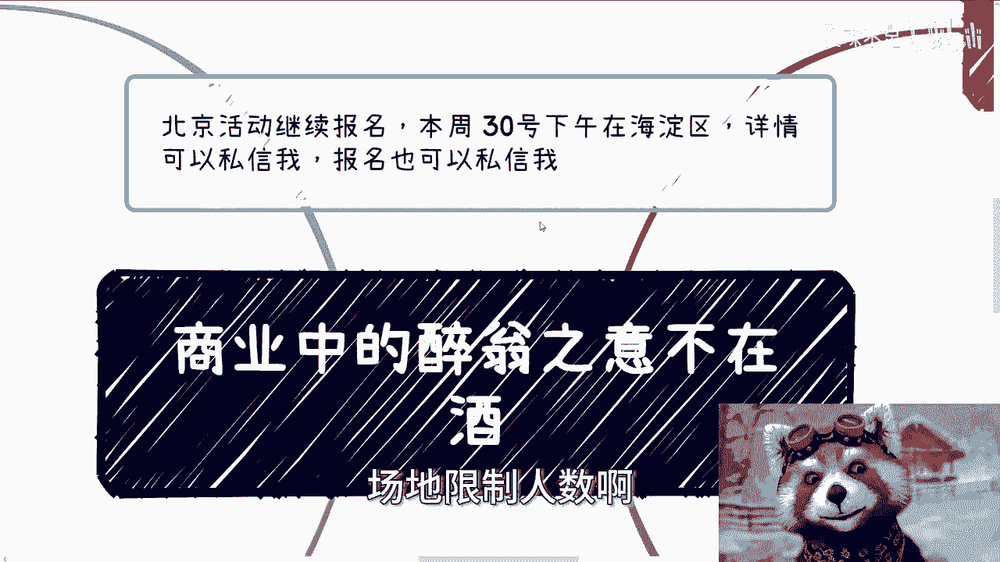
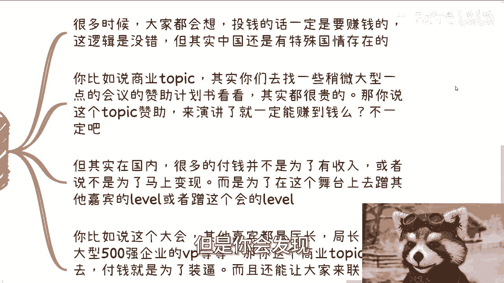
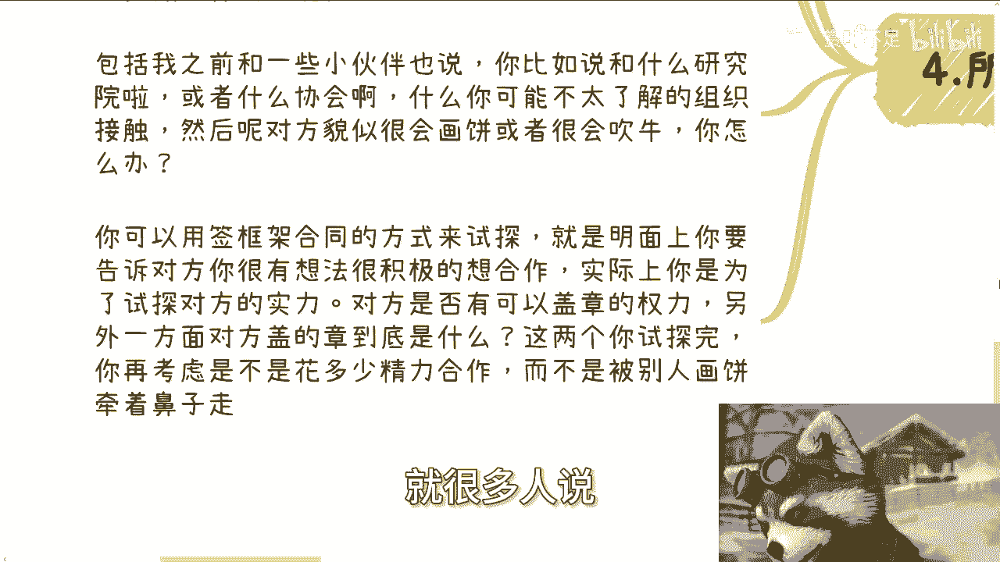
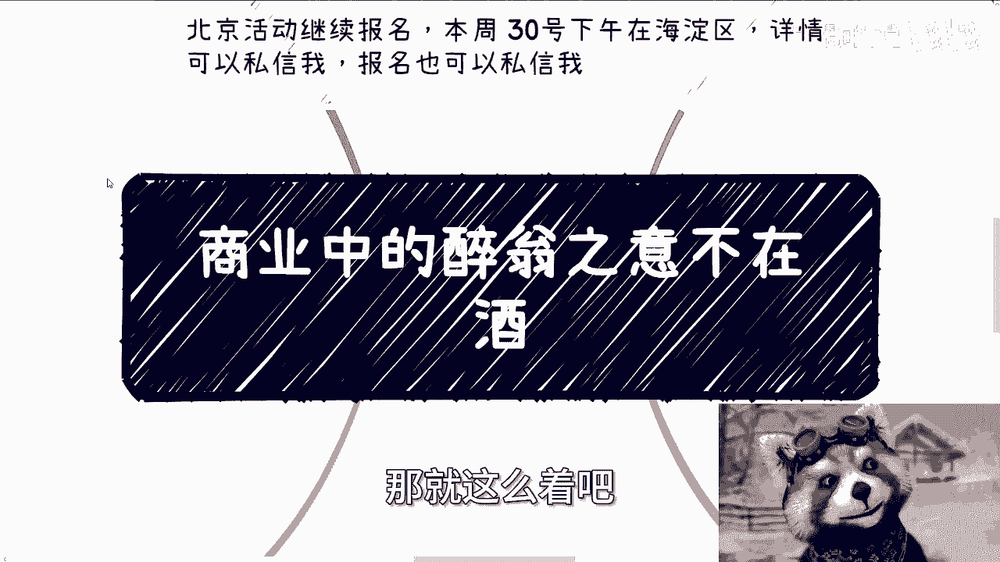

# 商业中的醉翁之意不在酒 - P1 - 赏味不足 - BV1ND421L7bS

好大家好嗯，北京活动继续报名好吧，本周30号下午还有几个名额，场地限制人数啊。

呃然后要记得带身份证啊，那么今天我们来讲的呢，是商业中的这个醉翁之意不在酒啊，不在酒呃。

先说一下前情提要，因为上周六就是前天，正好有个小伙伴呢从杭州过来找我咨询，线下聊的还蛮开心，然后聊的时候聊到了一些最近大机构在做的。

一些什么68881万多块的一个课程啊，我给他看了一个课程的这个内部资料啊，不对外的啊，他看完了表示就他表示啊这并没有什么东西，那当然我也认同，其实并没有什么东西啊，或者来说呢。

我觉得这个课程本身呢也就是可能大部分人啊，可能呃第一感觉会觉得学不到什么东西，我跟他讲，我说这他妈就对了，为什么呢，因为这就是双向筛选，因为你的出发点是学东西，那我就告诉你，但凡出发点是学东西的。

你花6888来做，来来来学一个课程，你就不是这种课程的受众，因为你要真的付钱了，你的定位就是韭菜，而且你付钱了，你一定会骂娘，为什么呢，因为你付了之后，你就会觉得不值啊，对吧啊。

因为啊，而且我大概率觉得你并不知道，你付钱到底为了什么啊，那么这种形式呢在商业上其实很多，其实说穿了啊，这些课程本来也没有指望，就是说这个用户端散户去报名，因为散户大部分不知道自己要去干嘛。

你付了钱学不到东西，然后就要喷人家，割韭菜没有意义的，就你你你有时候你仔细想想，你说人家也没拿刀架在你脖子上，也没人逼你付，对吧，你付了之后觉得啊我觉得觉得叫什么没有价值，那唉这个事情我觉得也蛮神奇的。

你说是吗，那么在商业上呢，其实并不存在什么学习不学习的事啊，说实话没有什么学习不学习的，我就告诉你们，你们但凡想要学习的东西，然后一个什么几万的十几万的课。

我跟你们说啊，没有学习这个概念的啊，只有赚钱不赚钱，别的都是假的啊。

那么第二这种高价的呢跟NBA呢，其实来的人目的都是一样的。

我们举个例子啊，比如说就说这个6888的课程，一套课程十个老师，如果你来参加，是为了参加这个活动，或者说你来了就为了学习，你肯定觉得不值，我给你打保票，你觉得不值。

因为这个课程这个东西的价值他主观性就很强。

同时这个课程价值本身的定位，就他妈不在这个地方哦，但你反过来想，如果大部分人都觉得不值，那是不是压根就没有人来参加这种课程，但是往往这种课程一次性也总有那么30人，50人参加，那有很多人我就问你。

那为啥呢，你总不能说他们吧，对哦那照你这么个说法，那那些都愿意掏6888来讲，你这么一个不的，你不愿意掏6888，那那那那是不是说比比你赚钱了对吧，比你有钱的啊，那么所以说你会发现只有一种可能性。

就是这些来的人的目的跟我们是不同的，就人家的思考方式是6888，来换十个老师的微信对吧，同时来认识一下一起来的这些小伙伴啊。

然后就说等于买了送了对吧，那么这样一看，其实688万啊，也不是也不是688吧，就是688左右吧，一个人一个微信在加线下交流，那其实也不贵啊对吧，那有的人要说了，那加了之后没有合作没有用啊。

是所以这些人我就一开始就说了，这些报名的人多多少少都有自己的想法，就是来了之后他就会找老师站台啊。

找主办方合作啊，或者说啊怎么样，他后面总归有办法赚回来的啊。

他就不是受众，就不是散户，那么第三个，其实我们之前说的大会赞助也是的。

之前我在去年的课程里面有提到过，那么很多时候大家都会想啊，他说陈老师，你说这个赞助包括什么圆桌会议啊，什么东西，这个啊赞助很贵啊，那么按照正常的商商人的思维，你说不能做亏本买卖对吧，那我投了一笔钱。

那我一定是要赚钱的，这个逻辑没有错啊，但是你会发现中国它是有一个特殊国情存在的。

比如说商业topic，其实你们去找一些稍微大型点的会议的赞助，计划书，你去看看，其实都很贵。

十几万，20几万甚至30几万一个topic都有，那你说这个topic赞助来演讲了，一定能赚到钱吗，不一定吧，那为什么每次都有很多人赞助呢对吧，这个其实在国内很多付钱并不是为了有收入。

或者并不是为了马上变现，而是为了在这个舞台上去蹭其他嘉宾的label，或者蹭这个会的label，你就比如说这个大会，其他嘉宾都是有社会地位的，有政治地位的，然后500强企业的一些VP coder对吧。

那你这个商业的TP上去付钱，为了什么，就是为了装逼，还能还为了让大家能联系你，你还能上去销售你的产品，一个500强企业的VP的这么一个场子，你花几10万啊，小几10万吧，比如说20多万，30万不贵啊。

真不贵啊，而且我告诉你们，很多时候的赞助是国企央企赞助的，他也要去看这个活动的主办方呃，指导单位是谁，他也要去看出一些嘉宾是谁，有很多时候他们的赞助叫什么叫做政治正确，你明白吗。

不是所有的钱都是只为了赚钱的啊，你要是只从这个角度去想。

那就是你格局小了啊，那么第四点回到我们周六聊的主题上面啊，你比如说周六他找我的时候，说这个内容呢啊这个比较贴近高校，我意思是我们可以先做高校宣讲，因为宣讲呢就是最容易切入高效方式。

或者说对于老百姓来讲是唯一的一个方式，你别的剧情很难去切啊，那么我们做宣传的目的其实是为了能够切进去，然后再和院长啊，校长啊，校长啊，老师啊在做进一步的沟通，那么才有进一步的合作的可能性。

那么你就会发现你你要是硬切，你切不动的，你不要说什么价格贵不贵，你哪怕九块九，你就切不动，你懂吗，因为学校就不是这么个地方啊，包括我之前跟一些小伙伴说，我说你比如说啊说什么研究院啦，什么协会啦啊什么。

比如说很多你不了解的组织，然后呢你接触对方，一接触发现对方貌似很会画饼啊，或者很会吹牛，你根本分不出真假对吧，我告诉你这时候怎么办啊，你可以跟他直接说，我们先签框架协议啊，来这个进行试探，为什么呢。

因为明面上你要告诉对方，你很有想法，很积极，你一定要表现出我的，你是大佬，我得跪舔你对吧，我他妈走投无路了对吧，你现在是我的救命稻草，实际上你是为了试探对方的实力，怎么试探呢，很简单啊。

对方不是给你画饼吹牛逼吗，对吧好，那对方是否有盖章的权利，很简单啊，一天两天对不对，你给他给他之后盖啊，我看你盖对吧，然后另外一方面是，我看你盖的到底是什么萝卜章对吧，你盖完章，这个章对应的主题。

我立马就能知道这个主体就是你网上查查，或者其他地方，你可以去查这个主体的呃，呃属性到底是什么对吧，你两个你试探完了，比如说他到底是个民企还是一个，就是就是就是一个比如说啊，没有任何背书的私企。

还是说就是一个嗯，嗯的确跟政府有点直接关系了，这种你这两个一试探完，你再去考虑我要不要跟他合作，我要不要花精力，我要不要听他的牛逼对吧，其实是这样子的，就很多人说我分我判断不出来没关系啊。

很简单啊，这个人到底是不是一个，就是说啊可能是个二传手，甚至就是说他就不是研究院的对吧，他可能是个二传手的，你也可以试探对吧，你但凡里面没有点，不是一个有那个那个实名的人，他不可能敲章的，对不对。

你他比如说他说研究院没问题啊，你敲呗，我看你敲，对不对，你不要跟我跟我吹，吹了没有勇气对吧。

所以其实很多时候都是这样子的，包括你知道是什么吗，包括就是我一直跟大家说，我说我说啊，这个你们有什么业务找我合作或者怎么样对吧，其实你会发现你们真的找我的时候，我会跟你们怎么聊吗，我你们跟我讲的业务。

我其实不关心的，我更关心的是我会给你们一些业务，然后我来看看你们能不能落地，为什么，因为这样子最短路径以及最短时间，我才能判断你们靠不靠谱啊，因为对我来讲，我只关心两件事情。

第一你做事情脑子思路逻辑思维清不清楚，第二你执行力怎么样对吧，因为很多时候大部分人我觉得大家说话，包括来说呃，沟通上面都没有问题的，但是差就差在执行上面对吧，比如说我跟你们讲了一个方案，我说哎一个月啊。

你去落地啊，我我我不是很在意，就是说你赚的钱多钱少，没关系的，你可以去落，我看一下你最终落下情况怎么样对吧，这个是最最主要的，那么等第一次落完了靠谱，我们再来谈后面真正的比较大的一些case。

或者说我才能信任大家，能够比如说介绍学校，介绍到其他地方，你否则一开始你跟我说，陈老闪，我我能讲什么东西对吧，我能做什么服务，你能不能帮我介绍，我怎么介绍，你想想看，对不对，我我不是说我对你有没有信任。

我跟你在个人关系，或者我跟你的感性上关系没有用，我对你100%信任，我都没办法把你介绍给别人，因为我的信任只建立在我的感性上，或者我对你的一面之词上，面对吧，那那我怎么知道呢，我得我只能靠真正的合作。

才来判断你靠不靠谱啊，你明白吧，所以说就是说就是说很多时候啊。

我们去做东西都是一样的啊，你不但要从你的角度出发，你还要从对方的角度出发，你多想想啊，好行，那就这么着吧好吧。

我们反正今天时间也不早了，嗯活动继续报名好吧，这个活动没几个名额，北京这边场地比较小，然后嗯那个嗯OK那继续啊，就是职业规划，商业规划对吧，融资啊，股权啊对吧，或者其他东西啊，就大家可以整理好啊。

或者说你们觉得结合自己的专业，结合自己的技能啊，在市场上，在中国这片土地上面，还有哪些可以赚钱的方式啊，你们想希望我帮你们多梳理一下的好吧，你们可以整理好，整理好背景啊，整理好问题的list。

然后我们再来做咨询，OK就这么着。

