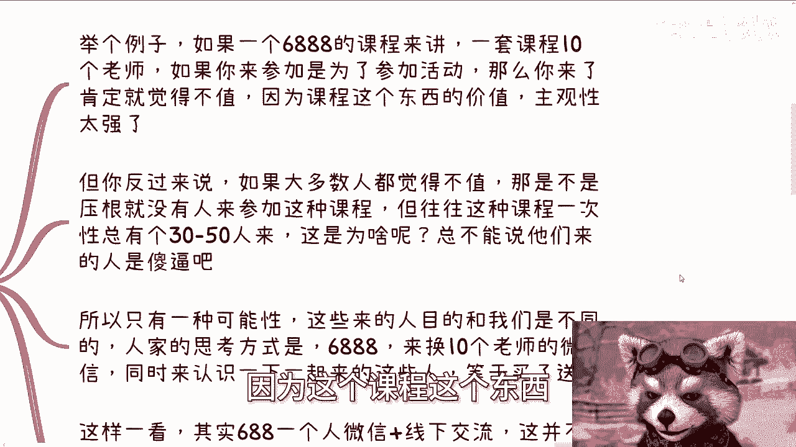

# 商业中的醉翁之意不在酒 - 课程 P1 - 🎯 赏味不足


在本节课中，我们将探讨商业世界中一种常见的现象：许多交易或合作的核心目的，往往并非表面上看起来的那样。我们将通过分析高价课程、会议赞助、商务合作等具体案例，来理解这种“醉翁之意不在酒”的商业逻辑。

---


## 1️⃣ 高价课程的“双向筛选”

上一节我们提到了课程概述，本节中我们来看看高价课程背后的逻辑。一个标价6888元的课程，其内容可能让许多以“学习”为目的的用户感到不值。但这恰恰是一种“双向筛选”机制。

**核心逻辑**：课程的价值定位不在于传授知识，而在于筛选出那些目的不在于“学习”的参与者。对于只想学东西的用户而言，他们不是目标受众；若他们付费，反而可能因期望落空而感到不满。


以下是这种逻辑的具体体现：
*   课程的真实价值不在于内容本身。
*   它旨在筛选出那些愿意为“附加价值”付费的人。
*   以学习为目的的付费者，很可能成为感到“被割韭菜”的负面用户。


---



## 2️⃣ 参与者的真实目的

既然课程内容本身价值有限，为何仍有人愿意支付高价参与？原因在于参与者的真实目的与“学习”无关。


**核心公式**：`支付费用 = 购买社交资源 + 获取合作机会`


对于目标受众而言，6888元换取的是与十位老师的直接联系（如微信）、以及与同期学员的线下交流机会。这笔费用被视为获取人脉和潜在合作机会的入场券。参与者通常自带资源或项目，旨在通过课程链接资源、寻找站台或合作方，从而在后续赚回这笔投资。


---


## 3️⃣ 会议赞助的“政治正确”与品牌背书


这种逻辑同样适用于商业会议赞助。动辄数十万的演讲席位，其直接商业回报可能并不明确。

**核心目的**：赞助行为往往不是为了即时变现，而是为了“蹭标签”和实现“政治正确”。
*   **蹭标签**：与有地位的嘉宾同台，提升自身品牌形象。
*   **政治正确**：特别是对国企、央企而言，赞助某些由权威机构指导的活动，是一种必要的姿态。


因此，仅从“投入产出比”的单一维度去评判这类赞助，格局就小了。


---

## 4️⃣ 商务合作中的“试探”与“验证”

在具体的商务接洽中，如何判断对方是实力派还是“画饼高手”？关键在于设计方法进行“试探”。

**核心策略**：提出签署框架协议。
1.  **表面态度**：表现出极大的合作热情与尊重，将对方置于高位。
2.  **真实目的**：通过要求对方盖章来验证其实力。
    *   **验证点一**：对方是否有盖章的权限？（流程与速度）
    *   **验证点二**：所盖公章对应的主体单位性质如何？（可通过公开渠道查询）

这种方法能高效区分出靠谱的合作方与中介方。


---

## 5️⃣ 建立信任的“最短路径”


无论是课程、赞助还是合作，建立信任不能只靠口头承诺。最有效的方式是通过具体、小型的合作任务来验证对方的执行力。

**核心代码**：
```plaintext
if (对方提出合作意向):
    我方提出一个具体、可落地的小型任务或方案。
    观察并评估对方的：
        1. 逻辑思维能力（思路是否清晰）
        2. 执行力（能否按时、按质完成）
    根据评估结果，决定是否开展深度合作或进行资源引荐。
```

感性信任是基础，但理性的、经过事实验证的信任，才是商业合作得以深入开展的基石。

---


## 📝 总结


本节课中我们一起学习了“醉翁之意不在酒”的商业思维。我们分析了高价课程的双向筛选、参与者获取人脉的真实目的、会议赞助的品牌与政治诉求、以及商务合作中通过“框架协议”和“小任务试执行”进行实力试探与信任建立的方法。


商业的本质是资源交换，很多交易表面上买卖的是A，实际目标却是B。理解这一点，要求我们不仅要从自身角度出发，更要学会从对方的角度思考其真实诉求与行动逻辑。