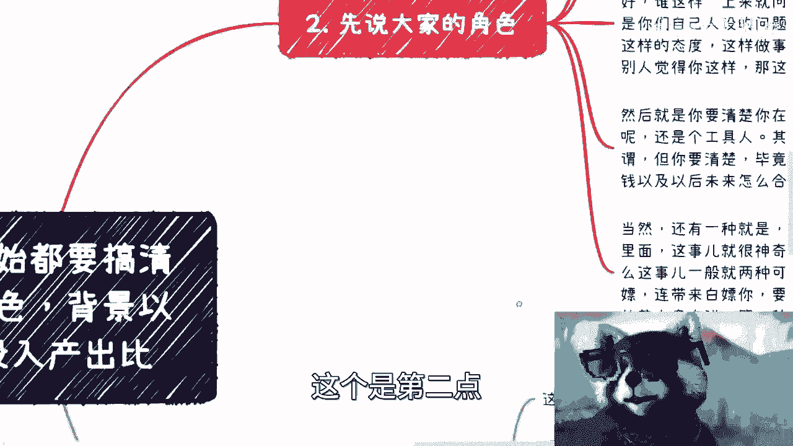
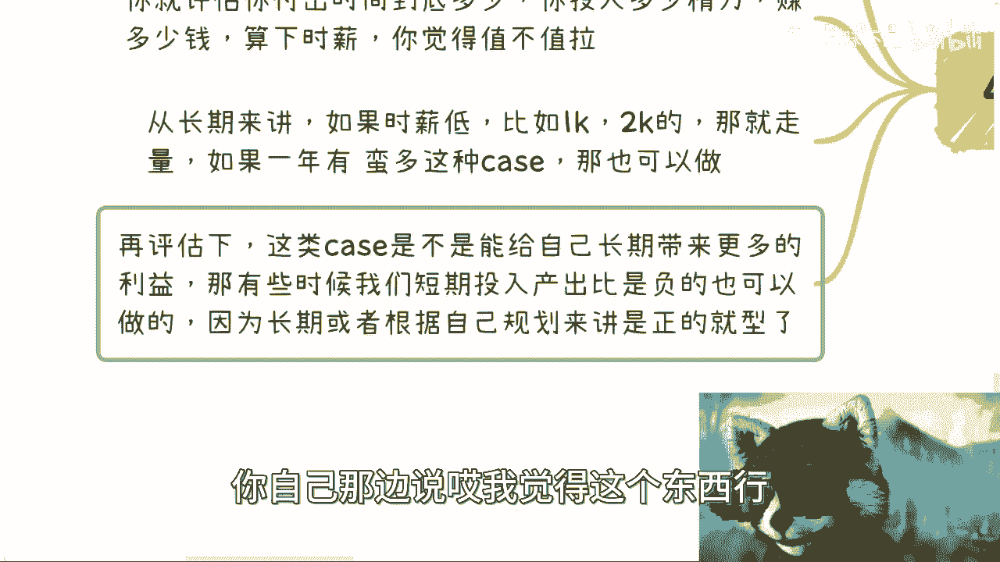
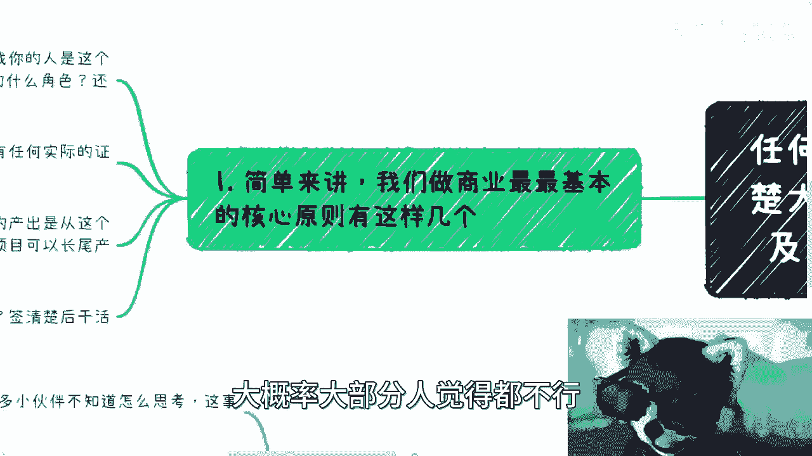
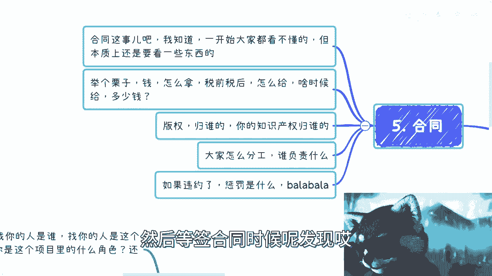
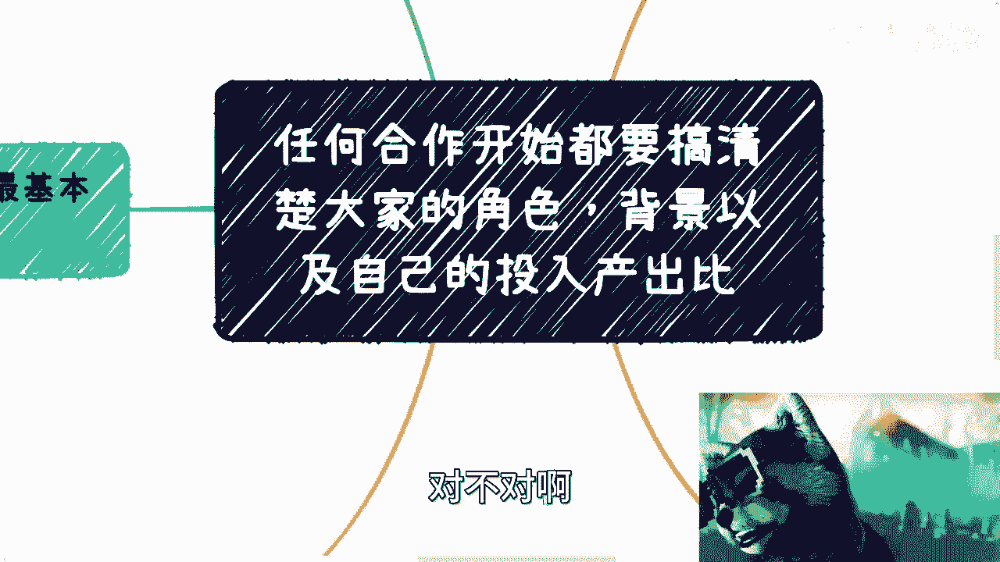
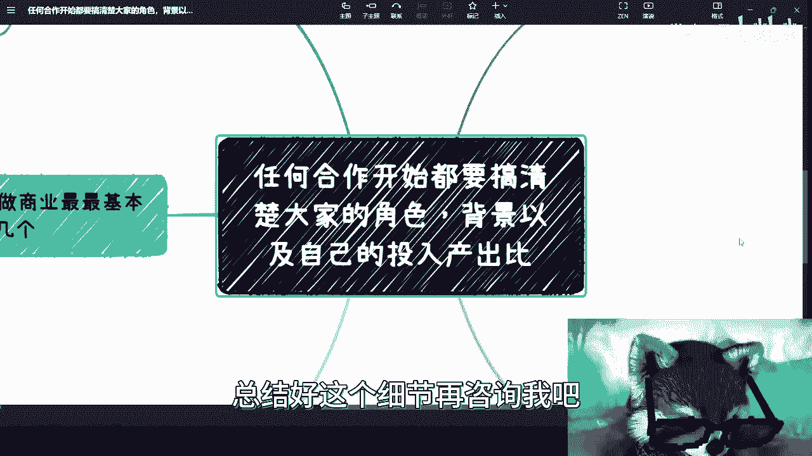

# 商业合作，你开干之前必须要搞清楚的事情 - P1 - 赏味不足 - BV1N14y1X7Ng

啊大家好啊，又是我是吧啊，这个说我叫什么，没有以前勤奋了是吧，那那不行啊，叛逆啊，就得勤奋一下是吧，嗯对然后这个主题啊就是任何合作啊，开始之前都要搞清楚大家的角色啊，然后背景以及自己的投入产出比啊。

当然最后还有合同，首先简单来讲啊，我们做商业，最最最最最最最最最最基本的核心原则。

有那么几个啊，第一个是来合作了对吧啊，好OK那找你的人是谁啊，找你的人是这个项目里的什么角色，你是这个项目里的什么角色，还有没有别人对吧，你要把这些东西问清楚啊，就有很多人做事情嘛，但什么都不知道啊。

这个一一股脑就干啊，那不行啊，那就像比如说以后打个比方，我来找你们合作对吧，你们也得问我对吧，那我在这个项目里面干嘛呢对吧，我参不参与啊对吧，那那你是什么角色呢对吧，你都得问清楚呢对吧，第二个是什么呢。

背景是什么对吧，一切都是需要证明的对吧，就比如说驴老师之前跟你们讲啊，这个我们今天这个合作老牛逼了对吧对吧，一顿一顿操作猛如虎，没有卵用的，你知道吗，一切他都是要有证明的哦。

商业合作上面一切有证明没有证明没有用的，那么这个事情就像我刚刚那个视频给你们讲的，就这个事情我们被坑过很多次，而且坑了无数次，应该说啊没有任何实际的证明，就不要开始合作啊。

第三个呢就是自己投入产出比到底是多少啊，评估一下你有的产出啊，那就是那当然啦，就是说有的产出啊，是从这个项目里面直接产出的，比如说你赚多少钱，或者你产出了多少的，这个叫什么积累的多少关系对吧。

有的产出呢是通过这个项目可以成为产出的，对吧，也就是说可能这一次你拿不到多少钱，但这个项目在未来的很长时间里面，他可能能够这个间接的给你带来很多钱对吧，你就像刚刚我们讲的那个叫什么竞赛，一个道理对吧。

但是呢这个事儿你得了，你得想清楚，但是话又说回来啊，就是你想清楚的，啊你想清楚的前提是什么，就是你得对这个项目还有所有的参与方，所有的东西，就是就是相当于整个这个事情你得了解吧，你不能说哦。

我有点知道了，但是呢我好像对整个全局那个模棱两可，一无所知，那你想清楚个屁，你说对不对啊，那么最后一点就是合同怎么签，对吧，那合同怎么签钱怎么给对吧，签清楚之后再干活，就这么简单。

就是你想想看所有的商业合同，你这些事情不搞清楚，你干可以啊，随便干啊，那个大概率就是被白嫖。

要么就是被被被被被被坑呃，对面人没了呀，啊那么我们来核心讲啊，先说大家的角色，呃找你的，比如说直接是甲方啊，那你也别觉得就没问题啊，这个甲方爸爸找我老牛逼了对吧，并不是啊，还是有问题的。

因为甲方甲方是什么，甲方无非就是一家公司嘛，要么就是个政府嘛，对不对，那你政府背后也是公司啊，你没看，我跟你讲，你不可能看到什么，政府直接跟你签订不存在的，对不对，那甲方人多了呀，那他是甲方的谁呢。

他什么岗位呢，有决定权吗，怎么证明呢，他在这个项目里面什么角色呢，他要回扣吗，对了你搞清楚啊，你不对吧，就很多人我觉得他不问啊，他也没这个意思，然后问了呢还会有一种什么感觉。

就是哎呀别人会不会觉得我事儿多，你不问啊，这个就不是代表你事儿多，不问就代表你好骗啊，就这么简单，对不了，这第一个第二个呢就是说找你的不是甲方，那你就要问清楚了，比如说什么项目啊对吧。

那找你的人跟对方这个啥关系啊对吧，那这个项目他要不要参与啊，他要不要拿钱啊，巴拉巴拉巴拉，对不对啊，那当然，对吧，当然有些小伙伴就要说了，他说驴老师貌似这样也不好啊，貌似这样也不好，为什么呢。

他说谁这样一上来就问这问那的，哎我跟你们讲啊，这就是你们自己的人设，这就是你们自己的思维问题很简单，你要你是怎么样的一个人，是你要让别人知道你是怎么样的一个人，你是要让别人知道你是什么态度。

你是怎么样做事情方式，而不是说你在那边说，哎呀，我就担心这担心那对吧，然后你就指望说别人会觉得你是怎么样的人，那我跟你讲这辈子是不可能的，因为你要指望别人，你是觉得你是怎么样的人，是不可能的。

别人只会觉得你是韭菜，就这么简单，或者说你是个软柿子，好捏也就结束了，没有了呀，你指望别人怎么样啊，指望别人都来做慈善，给你捐钱，你觉得可能吗，对不对啊，那这又是一个，那还有呢。

就是说你要想清楚你在里面是什么角色对吧，就是比如说这个项目来找你了啊，那么你要评估啊对吧，你要对全局了解啊，你说你到底是个，比如说啊你你是一个呃核心的合作方呢，还是你只是整个产业链。

供应链上下游的一个合作方呢，还是说你只是合作方里面的一个工具人呢对吧，那当然其实你是什么角色并不是很重要，重要的是你要清楚，就是说你的这个角色定位清楚之后，你会去知道你应该怎么拿钱。

并且你应该你会知道你拿多少钱对吧，以及你知道你未来怎么合作，因为你很简单嘛对吧，你说我如果是个核心的合作方，或者我就是一个合作方，对我产业链产业链上下游的一部分，那我该b to b的签合作对吧。

就是企区企业的签合同对吧，我该怎么拿钱，我该扣多少税就结束了呀对啊，而且我是一个对等的角色对吧，我觉得这个项目里面，比如说我付出了多少，我就应该拿多少钱，对吧，但是如果你是个工具人，那我就跟你讲。

你心里要有点逼数了对吧，就是说你可以签合同对吧，你该拿你，你能拿多少钱，但是呢你拿多少钱，往往应该是在这个次语就是低于合作方的，因为你说是个工具人对吧，那么你可能要去想的是什么。

就是说你怎么从一个工具人，在未来升级成合作方，或者来说你怎么通过这个项目的名，因为你不管拿多少钱，至少你参与了这个项目嘛，对不对，那么我们就说你至少参与这个项目的情况下，那么你这个通过这个名。

未来能不能给你带来更多的一些钱，这个是你要去考虑的，而不是说你要去考虑的是哎呀，我就说工具人我不做了对吧，你怎么能把我当工具人呢，不好意思对吧，那个不得不说啊，能当工具人的。

能在商业上当当工具人的已经是很不错的啊，你别老觉得，就是说这个打工跟当工具人是一样的，我跟你讲还真不一样啊，还真不一样，那么当然还有一种是什么呢，就是来找你的人呢，他自己也不参与到项目里面。

我跟你讲这事儿就很神奇了啊，因为毕竟如果啊我们说大家都是商业合作，那么无利不起早对吧好，那如果啊我就说对方找你这个人，他自己不参与，但是他又找你，那无非就两种可能性。

一种就是他根本就没有商业的sense是吧，没有商业的头脑，那么他就是被人白嫖，连带着来白嫖，你对不对啊，要么就是他想从你这边拿钱，对啊，就是说他从甲方这边不方便拿，他只能从你这边拿，对不对。

那但从基本盘角度来讲，你明明是前者比较多啊对吧，因为没有商业头脑的人比较多，你指望后后者这样子，他已经是人精了，我跟你说。

对吧，这是第二点。

第三点呢那个背景啊，这个事呢就是重中之重，重重重重重重重重重重重重的啊啊很简单啊，政府的事对吧，但凡是政府的kiss啊，我跟你们这么说，但凡来找我的，只要说政府case，我说可以啊。

拿红头文件文件拿出来，别逼逼啊，要么拿文件，要么拿点government的这个官方的网站拿不出来，滚对啦，就简单，你你拿不出来，你还去找别人合作，找别人合作，别找我，对不对，我反正不认啊，第二很简单。

企业的事对吧好，那你说这个是某某某企业授权的，某某企业合作的，可以没问题啊，那你至少有甲方或者各个参与方的人在吧对吧，你比如说有高校，你比如说浙大对吧，哪里，那你找个浙大老师来啊对吧，对不对。

名片拿出来，关系拿出来，如果要拉关系的那几叉叉，天眼查看一下股东结构没有滚，对不对，就这么简单，你跟我吹谁不会吹的，对不对，第三说合作关系的对吧，说什么授权关系的，哎呀我们什么协会牛逼了。

我们什么什么项目也是某某某授权的，我们是什么核心的，什么什么理事会单位啦，什么东西了，没问题啊，可以啊，你把脱敏的合同，脱敏的授权书，包括脱敏的完整的授权链路，拿出来，拿不出来滚，对不对，就这么简单啊。

然后说学校可以啊，那你学校老师啊，院长啊，包括学校通知啊，包括学校，哪怕BBS啊，你都可以拿出来，对不对，你截个图给我也可以啊，是不是拿不出来滚，对不对，说不定被嘎腰子了，对不对啊，那当然啊，对吧。

当然啊就是说政策啥的可以模棱两可，什么意思呢，就是说你说这个东西补贴到底多少钱对吧，到底是多大的呃，里面都这个细节怎么样子，你可以在拿出来的红头文件和网站上，是模棱两可的，这没有问题。

因为政府做事情本来就这样子啊，但是细节问题就是我们得要看到这个战略方向，有这个方向，比如说你跟我说某某某地方支持数字经济，他的项目能够补贴200万，你至少是给我看到这个东西啊对吧。

那你说最终是不是补贴200万，咱不再说对吧，可以再去谈对吧，但至少方向上是对的哦，具体可以谈合同的时候再谈，这没问题，对不对啊，然后我跟你讲，很多人做事情没有的，你知道吧，哎哎哎这这两部都没有的就干。

我也不知道怎么怎么怎么个干法，对不对，第四第三个就是评估自己的投入，产出比什么东西呢，我跟你讲这事儿，其实我发现很多小伙伴呢不知道怎么思考，但这事儿其实很容易，这事儿其实很容易。

就是你就评估你付出时间到底多少，你投入多少精力，你赚多少钱，你算一下时薪，你觉得值不值得，对不对啊，那么从长期来讲，如果时薪低，比如说一千两千好，那就走量，如果一年有蛮多的这种case，那也可以做好了。

说到这些小伙伴要出来，我靠驴老师，你牛逼啊对吧，时薪一两千你还嫌低，不好意思，时薪一两千是低，还是那句话，你们没有看到过商业的case，你们根本就不知道商业case当中。

其投入产出比和整个通过某个支点来撬出来的，利润率有多高啊，一两千，如果做商业合作，我跟你讲就是苦力活，你懂吗，那么你们反过来想想看你们打工那些钱哈对吧，那那一是不稳定，二是收入本来就低，更没有意义啊。

更没有意义，就这句话啊，所以我跟你们讲啊，还有很多人来跟我说了，哎呀你这个这个说我这个咨询开的高，我靠我他妈真的是天地良心啊，啊对吧，我现在去这个政府去企业，怎么地一天都是按1万52万算的啊。

我开我我开个时薪500块钱的咨询，说我高，唉真的也就那样吧，就那样吧，就是可怜之人必有可恨之处啊，那么再评估一下这类case，是不是给我自己长期带来更多的利益呢，啊对吧，你得评估啊。

那么有些时候呢你要这么想，短期投入产出比是负的，也是可以做的，为什么呢，因为很简单嘛，你比如说今天你做了个case，可能是免费的，你也可以做对吧，你比如说今天你去请一个人吃饭，你是纯投入。

那么从单纯的投入产出比的角度来讲，你就是负的对吧，这也没毛病啊，这也没毛病，但是呢你会发现就是你自己要明白，你做这个case到底对你有什么帮助，你请这个人吃饭到底对你有什么帮助。

就是如果长期他对你只要是有帮助的，那么他就是个正，你知道吗，但是还是那句话，就是说你得正确的评估，你不能老是用那个就是我之前视频里面讲过，那个就是说我觉得怎么样子没有用的啊，没有用的。

就是你今天做了一个免费的case，这个case能给你带来一些名，这个名能直接给你带来钱对吧，你得清楚这条链路怎么变现啊，同时你要请人吃饭，那么这个人未来到底能给你带来什么。

你也很你也得自己很清楚这条链路是什么啊，你不能自己老是PUA，你自己在那边说，哎我觉得这个东西你觉得就不行。

我跟你讲啊，大概率大部分人觉得都不行。

没什么好觉得的啊，那么第四个呢就是合同啊，合同这个事儿呢，我跟你讲啊，一开始大家都看不懂的啊，我觉得这也很正常，但是本质上的一些东西你还是要看的，比如说啊钱对不对，你你你合同翻到尾。

从头翻到底不得赚钱呢对吧，怎么拿啊，税前税后怎么给，啥时候给多少钱，哎我跟你讲，我跟你讲，哎我说这个东西啊，很多人就很多，我说这个钱啊，我相信小伙伴心里面肯定在想妈的，这还用你说的啊。

这个东西我们会不知道的，我跟你讲，你们还真不知道，哎，我跟你讲，为什么你们但凡涉及到跟企业签，尤其是什么国企，央企或者万万一以后政府协会取钱，哎我跟你们讲啊，我跟你们说，也他妈多如牛毛啊。

你能让他让他牵出一个钱，怎么给税前税后多少，怎么个给法，什么时候给能明显的签白纸黑字写在合同上，我靠我他妈对吧，我觉得唉你是母字对吧，上海话叫母字对吧，牛逼唉，你已经很牛逼了，你懂吗，然后还有什么呢。

就是合同里面你要想清楚啊，你要那个写清楚，就是大家的合作，很多东西有产出的产出的东西，比如说版权啊，产权啊是归谁的对吧，你别老是到最后做了就给别人做嫁衣，对不对啊，还有就是大家怎么分工。

每个人负责什么比无论是两方合同，三方四方合同等等等，怎么怎么做对吧，那同样的如果违约了，惩罚是什么，巴拉巴拉巴拉对吧，违约金啊对吧，违约行为啊对吧，那当然啊这个合同当中呢，其实我跟你讲。

还有一些很神奇的东西呢，就是哈哈别打个比方，比如说你今天这个跟驴老师谈啊，谈了大概有一个月了啊，然后呢就是大家都很和呃，很很很和谐啊，很开心，然后呢就要干了，对吧好，跟干了之后呢，我就跟你说啊。

我说唉驴老师说，他说这个这个合作啊应该是什么，打个比方，比如说中关村啊，什么软件协会啊，软件源来签合同的，到最后发现了诶，这是个野鸡公司来签，那你就会发现很多的商业合同都这样。

就是他先跟你用很大的假大空的东西来套啊，套了之后呢，然后等签合同的时候呢。

发现诶不对呀，这合同上的甲方跟你跟我说的，完全不是一个事儿啊。

对吧好，那这种事情呢在合作里面，我跟你讲经常发生啊，所以这也是为什么我一而再再而三的跟你们说，就是商业合作啊，你自己得要去考虑这么多东西。

你不考虑你做个屁商业合作，对不对啊。

所以呢就是我为什么把这些放到电池思维里面，就是因为哎呀，就是因为你们会发现啊，就是你们就算打工打20年，打30年，你们对这些东西也是毫无sense，就就可能用我的话说的不好听，出来就跟个废人一样。

你知道吗，行吧，就这么着吧啊，反正大家有啥总结好这个细节在咨询我吧。

好吧。