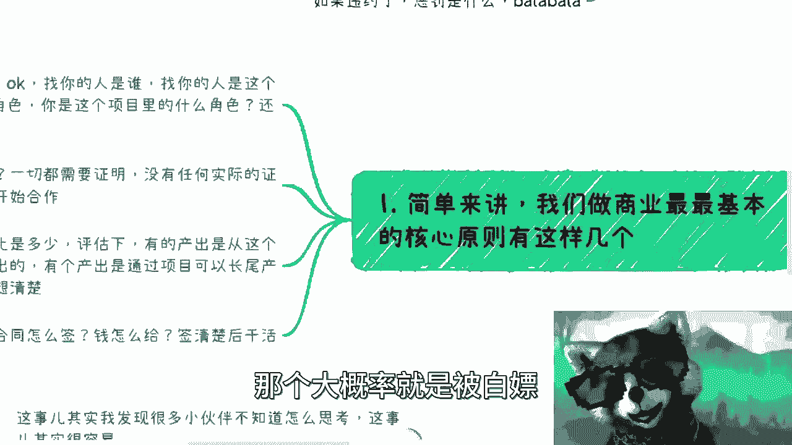
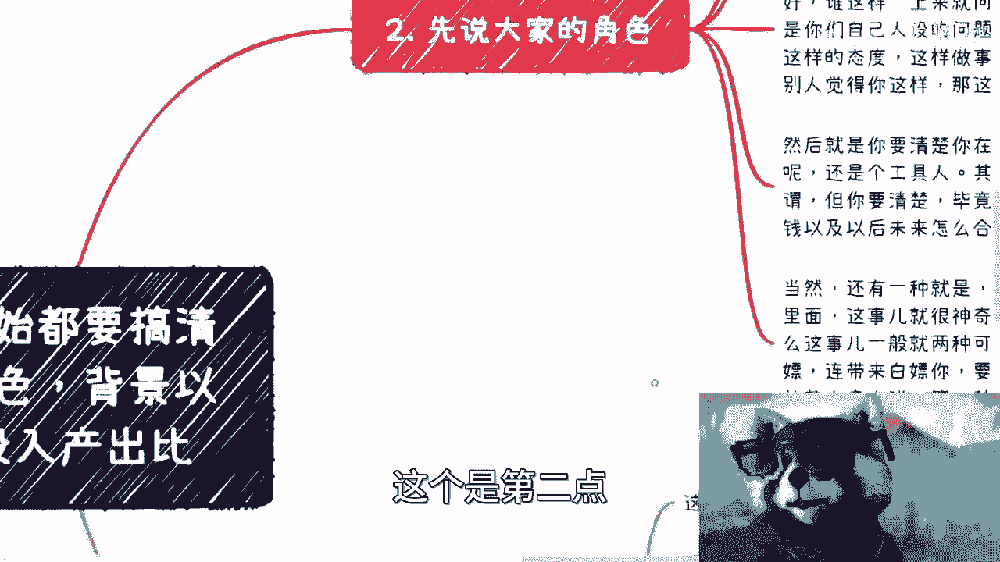
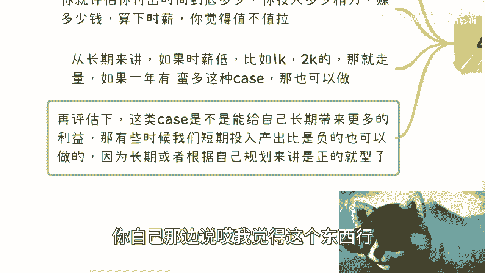
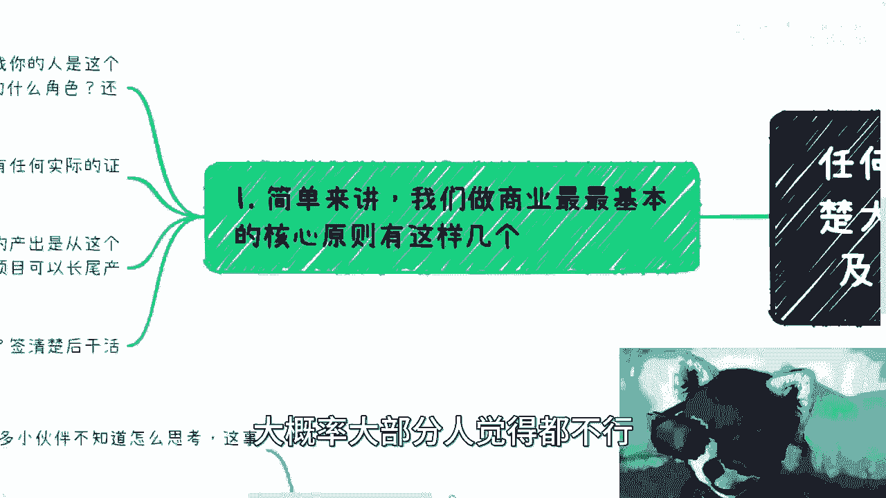
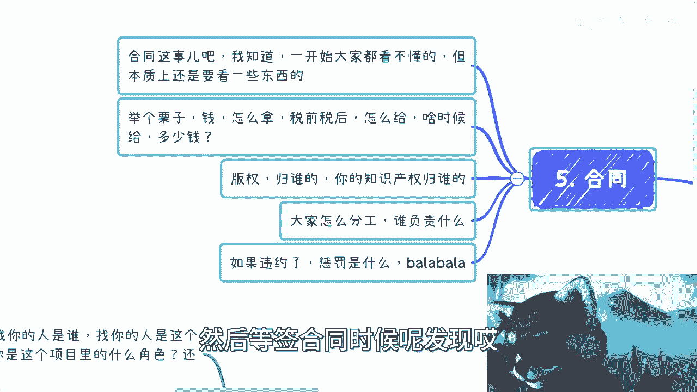
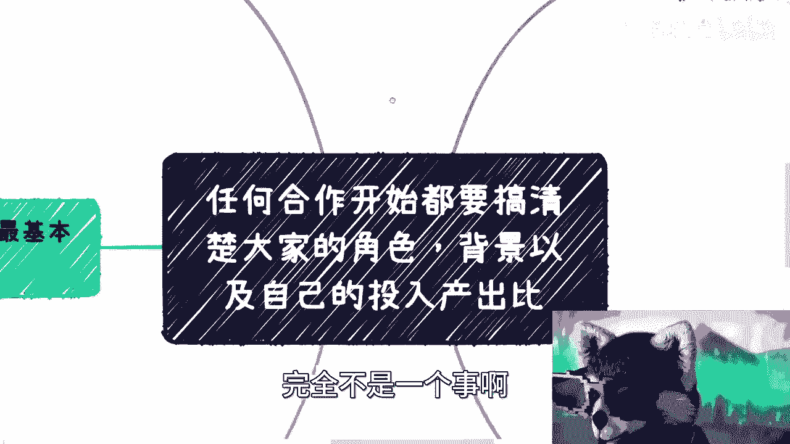
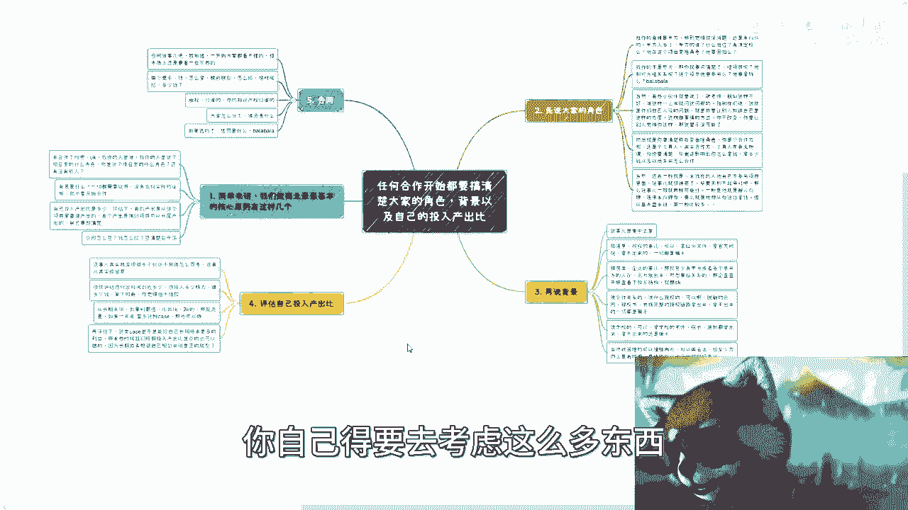
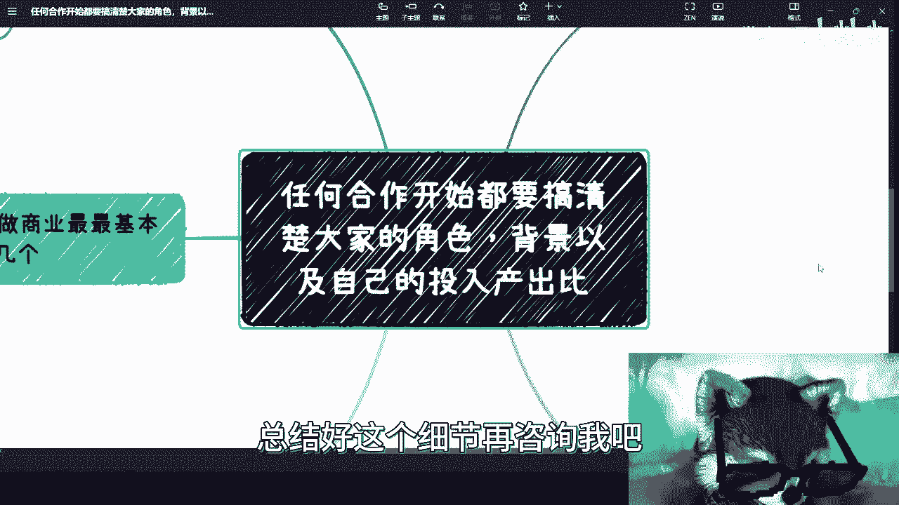

# 商业合作-你开干之前必须要搞清楚的事情---P1---赏味不足---BV1N14y1X7Ng_not


在本节课中，我们将学习启动任何商业合作前必须厘清的四个核心要素。明确这些要点是保障合作顺利进行、避免风险的基础。

上一节我们介绍了课程主题，本节中我们来看看商业合作最核心的原则。

## 商业合作的核心原则

商业合作最基本的原则是：在开始前，必须明确各方的**角色**、项目的**背景**、自身的**投入产出比**，并最终以**合同**形式固定下来。忽略任何一点，合作都可能出现问题。



---

## 一、 明确各方角色 👥

在合作中，首先要搞清楚“谁是谁”。这不仅指联系你的人，也包括你自己在项目中的定位。

以下是需要问清楚的关键问题：

1.  **发起方是谁？** 找你合作的人是谁？他/她在项目中扮演什么角色（例如：直接甲方、中间人、工具人）？
2.  **你的角色是什么？** 你在这个项目中是核心合作方、供应链一环，还是执行工具人？角色定位决定了你的权责和收益方式。
3.  **是否有其他参与方？** 项目是否涉及第三方（如高校、协会、其他公司）？他们与发起方是什么关系？

**核心公式：**
`你的收益方式 = f(你的角色定位)`

如果你是**核心合作方**，通常应以企业对企业（B2B）的形式平等签约。如果你是**工具人**，则需要清楚自己能获得的直接报酬有限，并应思考如何利用项目经验为未来创造更多价值。

---

## 二、 核实项目背景 📋




一切口头承诺都需要实质证明。在商业领域，缺乏证据的陈述毫无价值。

以下是验证背景的关键步骤：

1.  **政府项目**：要求出示**红头文件**或政府官网的正式通知。拿不出文件，合作免谈。
2.  **企业项目**：要求与**甲方关键决策人**直接沟通，或查看其名片、在职证明。可通过“天眼查”等工具核实公司股权结构。
3.  **授权或合作关系**：要求查看脱敏后的**授权合同、授权书或完整的授权链路**证明。
4.  **政策与补贴**：方向性的政策可以存在模糊空间（例如“支持数字经济”），但必须有官方文件或网站作为依据。具体补贴金额可在合同阶段详谈。

**核心原则：**
`无证明，不合作`

---

## 三、 评估投入产出比 ⚖️

你需要理性计算参与这个项目是否值得，包括短期收益和长期价值。

评估时请考虑以下两点：

1.  **计算时薪**：估算你为此项目投入的时间和精力，计算你能获得的报酬，得出**时薪**。在商业合作中，时薪一两千可能只是“苦力活”的价位。
2.  **评估长期价值**：如果短期收益低甚至为负，需判断项目能否带来长期利益（例如：积累名望、拓展关键人脉）。关键在于**清晰规划变现链路**，而非自我安慰。



**评估逻辑：**
```
总价值 = 短期直接收益 + 长期潜在收益
决策依据：总价值 > 你的时间与机会成本
```



---

## 四、 签订严谨合同 📝

合同是合作的最终保障。即使初次看不懂所有条款，也必须关注几个核心要点。

合同审查要点列表：





*   **付款条款**：金额、支付方式（税前/税后）、支付时间节点必须白纸黑字写清楚。与大型企业或政府机构合作时，明确这些条款本身就可能是一场博弈。
*   **知识产权**：明确合作产出的**版权、专利权**等归谁所有，避免为人作嫁衣。
*   **权责与分工**：在合同中写明各方的具体职责和工作范围。
*   **违约责任**：明确何种行为构成违约，以及相应的**违约金**等惩罚措施。
*   **签约主体一致性**：警惕“挂羊头卖狗肉”。最终在合同上盖章的主体，必须与之前洽谈时声称的权威主体一致，否则可能存在风险。




---



本节课中我们一起学习了商业合作启动前的四个关键检查点：**明确角色**、**核实背景**、**评估投入产出比**以及**签订严谨合同**。掌握这些基础思维，能帮助你在合作开始前扫清大量潜在风险，为成功的商业协作打下坚实基础。