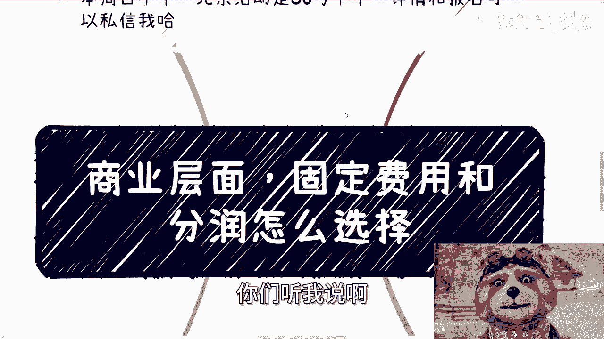
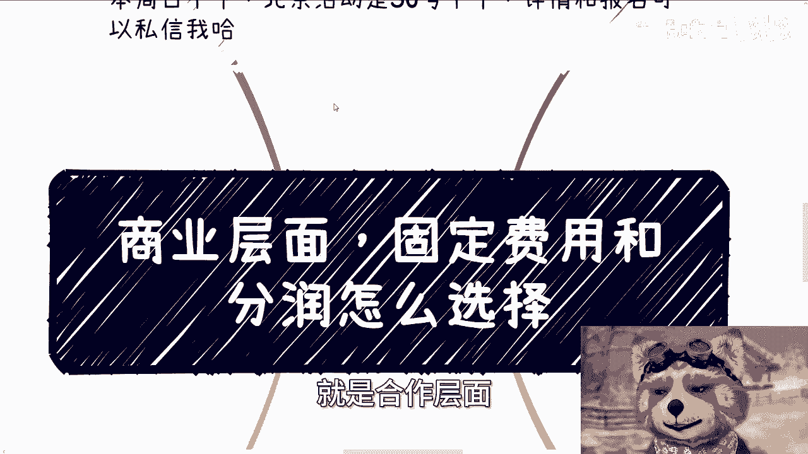
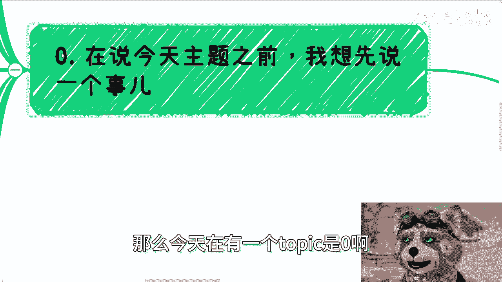
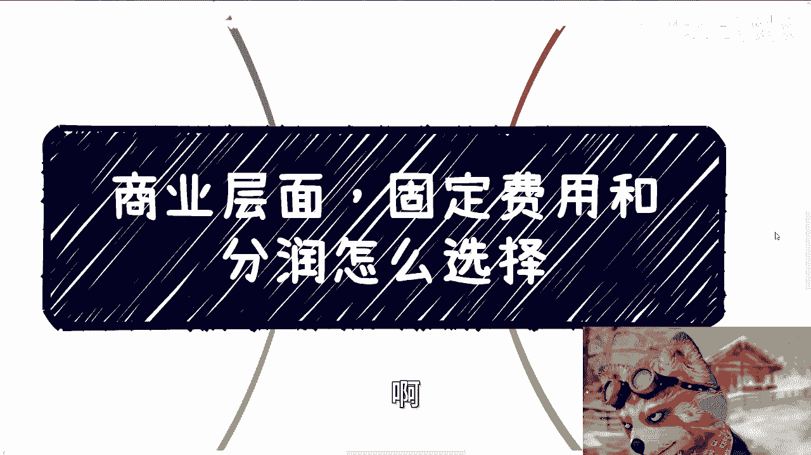
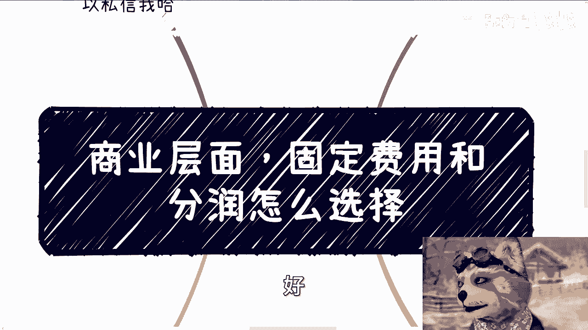

# 商业层面，固定费用和分润怎么选择 - P1 - 赏味不足 - BV11D421j7at

好大家好啊，这个今天啊这个内容跟以前可能不太一样啊，你们听我说啊。

首先呢上海活动跟北京混动继续报名好吧，上海活动是24号啊，本周日下午北京混动是30号，应该是周六下午啊，详情跟报名可以私信我啊。

那么今天这个主题呢是昨天有个小伙伴，前天昨天有小伙伴提的，叫做让我再进一步说一下，就是合作层面固定费用跟分润到底怎么选择啊。

那么今天在有一个topic是零啊。

在今天说这个主题之前，我想先说一个事啊，呃大家也看到了，这次这个序号是零啊，这个事我想单独拿出来说一下啊，以以以以以让大家共勉啊，呃然后今天我微信删了几个人啊，我来说一下我的态度，第一第一个呢就是说啊。

这个这位同学呢是之前咨询过的啊，说实话啊，一般咨询过的人我都不会删的啊，我都不会删的啊，啊虽然大家就是一手交钱一手交咨询啊，但是我还是不会删的啊，那么今天呢主要是多个DEBUFF加起来啊。

首先首先是这样子的啊，他说他首先先问了我若干个问题啊，然后我也回答了，随后问我上海活动的事儿啊，说的是如果问我能啊，如果到时候不来的话，能不能退款啊，我跟你这么说，以前也有人问过我这个问题啊。

然后我基本上要么不回答，我要么就删了啊，我这么说吧，看过我截图的都知道，我微信八千八千个人群，730个，另外我所有的评论，包括活动的对接也都是我自己来的哦，活动我也都是让大家先付钱，为什么。

因为场地要问我确认名单，最终要刷身份证，你说你一会来，一会不来你，你让我去，就是说啊，放在我这，你要单独跟我讲，我无所谓对吧，你要不来，我退给你完全没问题，但问题是我怎么跟场地方交代啊，那你想想。

如果每个人都这么拖，我到时候我还怎么弄对吧，今天已经礼拜二了，我怎么弄场地方，今天已经来问我要过了，我怎么搞的是吧，当然这我觉得不是重点啊，以上那些回不回复也好，对不对，这也好，这是我自己的选择对吧。

我不会把这些东西强加在你们身上，第二个DEBUFF是什么，就是他跟我说，陈老师啊啊，我是不是做错了什么，如果做错了什么，你告诉我，我跟你们这么说，从他把钱把活动的费用打过来到发这句话。

我连一顿饭都还没吃完，什么意思，意思就是说我没有任何的义务实实的来看手机，我就一顿饭的功夫，你想这么多干嘛，另外我也不想告诉你哦，你每个人都这么来问我，怎么地我每个人都告诉一遍。

说我欠你们的还是怎么滴了啊，那当然了，最后钱我肯定也不能收嘛对吧，其实就这么简单一件事，而且我跟你们说啊，我也可以告诉你们，还有另外一点，大部分自己戏多的啊，自己就是说在那边胡思乱想的。

没有一些时间上的意识的，成不了事儿的啊，成不了事的，我也告诉你们，你们未来能不合作，尽量不要合作，这种人都是坑啊，我明确跟你们讲啊，好然后最后我阐述一下啊，我没有说谁对谁不对啊，我只是阐述一下我的态度。

你们可以有你们的态度，我要有我的态度，没有啥对不对的，好吧啊行，那么我们继续来说啊，言归正传啊，这个固定费用跟分润这事啊，我觉得得看合作方的熟悉程度，以及双方的这个地位，宏观来讲啊，一般都是刚开始合作。

都是从固定费用开始啊，然后再到分润，一般来讲啊，固定费用都是相对陌生，或者来说比较初级或者比较浅层次的合作，那么分润呢是相对深入合作，那当然这个是宏观来讲啊，啊如果有些细节当然肯定有些不一样啊。

那么我们来举个例子，比如说你给产业园招商引资，大家都是第一次合作，除非对方主动提出按照分润来，那么其实你可以提一个比如说固定费用，或者说对方提一个固定费用啊，那么都没问题，那么等了熟悉之后呢。

你再按照分润来，那因为很简单嘛，就是说双方都得拿出诚意嘛对吧，那对方说比如说分润或者怎么样的，那可能对方跟你客气一下呢，对不对，那当然了，你要这么想，你提出一个固定费用，你也可以记一下嘛对吧。

那双方都是一个试探，如果对方客气了，他觉得你跟他其实是不对的，因为你是个人，或者你是一个民企，他是个产业园对吧，或者是个是个协会对吧，他可能跟你觉得不对的，那么你要是不客气呢，可能印象也不太好。

那么同样的你要是提出个固定费用，那对方一口答应下来对吧，你提了一个，你客气一下，对方卧槽，甚至官甚至是阶梯往下爬，往往下走了，那说明什么，说明他对你看也不是那么看重，反正就大家心里面明白就好了。

但其实是这么回事啊，那么再比如说你作为嘉宾或者专家，参加某个活动，那么你拿的其实就是固定费用啊，我跟你们说，你们在外面合作，但凡是那种个人参与的，或者说你们在这里面只是出一个人对吧，站站台啊。

这个这个做什么事情啊，一般都是固定费用，不太可能出现一个分润的啊，所以未来你参与活动的策划啊，或者专题的出品，或者你在活动里面负责了一个独立的模块对吧，比如说今天有一个大会对吧。

你在这个大会里面独立分分负责了一个峰会啊，分润坛对吧，那么你可以跟他谈分润，那我觉得没毛病好，那么我跟你们说啊，线下的社交跟合作也是一个意思，就是你需要去寻找到做各种业务的人。

然后你们尽可能贴上去去合作，哪怕很小的切入点，然后费用的话呢谈一个固定的对吧，那么这样的话就是说接受度会高一点，你不要一上来谈分润，谈分润，这个你们自己想想，换位想想吧对吧，这个这这这这可能性也不大嘛。

对吧哦，那么第三个就是呃第三啊，第第二个这个判断点啊，就是这个双方地位，那么双方地位如果对等呢，其实你都可以谈，我觉得无所谓，就大家case by case自己看的对吧，那么上面我说的呢。

就是我我刚刚上面这个这个上面这一这一块，我说的其实只不过是个建议啊，你说我什么业务都要分润行不行也行啊对吧，这个看你自己啊，这又没有标准答案对吧，你想怎么滴怎么滴啊，呃但是啊当双方地位不对的时候呢。

往往分润了啊，或者这么说吧，当双方地位不对等的时候，你分润也好，不分润也好，本质上没什么太大差别，你知道吧，本质上是没有差别的，我们打个比方啊，比如说今天你跟高校政府企业合作。

你可能更多的是提供某个服务啊，提供某服务好，那么这个时候无论是固定的金额的单子，还是说可能是根据最终人数不同而浮动的，这种单子，你大概率拿的还是个固定费用，什么意思呢，就是说你如果双方不平等对吧。

那么你跟他聊，你随便怎么聊啊，你说我提既提了固定的这个方案，也提了分润方案，甚至说你拒绝了分润方啊，你拒绝了这个固定方案好，那他最后其实也只会给你一个固定的选项，反正你你你爱选不选嘛。

因为你们地位不对等嘛，对不对好，那当然啊，这种情况下面你要分润有没有可能当然有，但其实我就像我一开始说的，你分不分润，结果是一样的，为什么啊，你仔细我们仔细看啊，如果比如说今天一个业务，你做了90%啊。

对方可能只出了一个人，或者只来站个台，然后对方跟你说，五五开或者六四开，虽然是分润，但是你会觉得公平吗，不公平平等吗，不平等就是也许他跟你是分润又怎么样呢，对吧，这是第一种可能性，第二种可能性是什么。

就是你们的这个业务可能是根据，就是这个业务本身会做得越来越大，比如说你们今天是一个培训，客单价1000块钱对吧，比如说第一期就十个人来，那就是1万块钱，第二期30个人来，那就是3万块钱对吧，好。

那么这个时候你就会发现诶，你跟他谈，当你只有十个人1万块钱的时候，你跟他说我有个固定费用，你说5000你爽不爽，你说5000相当于50%，但是如果后面30个人呢，60个人呢，100个人呢你还是5000。

对不对啊。

所以说就是说你就我我我想表达的是什么呢，就是对方如果跟你地位不对不对的，他的经验一定是比你丰富的哦，就是说你不要就是说感觉眼前好像占着便宜，或者怎么样，我跟你说，还是那句话。

真正的那些商人或者真正的资本家，人家不可能做亏本买卖的，而且咱退1万步来讲，人家就算会做亏本买卖，人家也不会，再，就就是大部分这种就是说啊，比较经验不足的人身上吃亏的不现实的，该吃的亏人家早就吃完了啊。

那么还有一点就是什么。

就是你想好你到底是从对方身上获取什么，以及这个项目的发展周期是怎么样的，什么意思呢，就是你要记住，如果想从对方的合作单子上获取钱，那么你就尽可能去争取，你不要脸，怎么样怎么样，但是你要想清楚啊。

如果你是想从对方身上获取些名，或者一些背书的，那么你别在乎钱，哪怕你倒贴都可以，但是你得保证，对方是把这个名或者背书给你的哦，而且我跟你讲，你这件事情你不要什么什么哎，我今天想要钱，我的。

我合作两期之后，我变了，我想要明了，你别啊别啊，我跟你讲，你心里面打什么小九九，什么小算盘，对方清楚的很啊，真的就是属于如果你你你就是拼了命也要压价，或者拼了命也要分润的，那么你相当于是已经占了便宜了。

你不要占了便宜还卖乖，我跟你讲不现实的啊，你越是这样子，你只会把这个合作合作方丢了啊，你只会失去这个合作方，那么另外就是项目的发展周期，你想啊，如果一个项目发展是长期发展。

那么开始人少一点或者总量少一点，你分润少一点就少一点了，对就像我刚刚说的，你比如说1000块钱，客单价十个人，你说哎呀，我就分20%，你妈他妈的这个东西搞了半天，我他妈分2000块钱对吧。

但是你有没有想过这个项目，如果未来能够长期发展，他未来多了，那你20%不少了，而且这是一个长尾效应啊，对不对，你自己想想看哦，你不要去看眼前的利益，选择固定费用，你以后换是很难的，我告诉你啊。

一个项目当中合作的费用模式一般啊，我就说一般很难改啊，不是你不能提，你可以提，你比如说大家喝茶喝咖啡，你也可以提，但是你提完之后，你会发现对方大概率是打太极拳的，为什么，因为合同也好，合作也好。

他他妈的地球不是围着你转的，你说改就算比如说你今天跟我合作，就算我有心要改，那他妈这项目怎么地啊，就我们两个人啊，没别人啊，我们不得看别人脸色，我们不得去问别人的想法，那你一旦要改。

我还得帮你去问别人的想法，我他妈吃饱了撑的，我有什么好处啊，对不对啊，所以说就是说你你要明白，你如果合同都签了，或者项目都已经跑了一段时间了，你怎么改。

也就是说你一开始要想好，否则你永远会处于被动状态，你知道吗，就是你不要在很多合作里面，你你就在那想，哎我突然之间发现卧槽他妈的我亏了啊，或者说有人今天给你耳耳边风吹一吹，说哎你这样合作你你不划算对吧。

你性价比低，那不好意思，你自己选的呀，你怪谁呀，对不对，真的就很多时候就是这样子的，你不要想一出是一出啊，你该吃的亏，最后还自己吃，啊好吧行。

那这个主题反正我就是扩展一下，给大家说一下啊，呃然后那个活动的事情我也再三提一下啊，我没有收太贵的钱，对不对，我到今天为止活动我都没有涨过一分钱，对吧，不要再去纠结说啊，我参加不参加，你要参加就参加。

不参加就不要参加，不要来跟我纠结哦，也不要来问我说哎我钱交了，我到时候不来，我退不退，那你就别交，明白吗，就咱是300，咱不是3万好吗，就是我说直白一点，我不缺你这300块钱，我也不会浪费时间。

再去再跟就就这样的人沟通上面，你觉得你们觉得你换位思考一下，你要是我我吃饱了撑的吗，我是是不是我唉真的我有时候想想你们。

我告诉你们，你们一定要明白啊，所有的事情都是有一个悖论的，什么意思，就是如果我对你们是非常宽容的啊，然后你们说什么我都OK的，那我是不可能能够跟高校，跟政府跟子弹去合作的啊，我我我只会他妈被他们白嫖哈。

合作个屁啊好吗。

行了啊，就这么着吧，那个好吧，然后其他的呃职业规划商业规划啊，你们手上有什么牌，不知道怎么打的啊，然后还有一些小伙伴呢，就属于那种就是说啊好像对社会有所认知，但感觉认知又不多的啊。

然后想从我这边得到更多认知的等等等等等，好吧，你们有任何想法的，整理好，整理好背景，整理好问题好吧，我们再走咨询。

