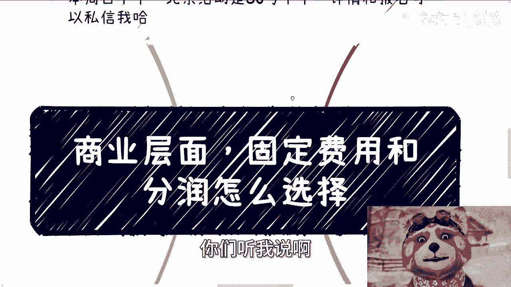
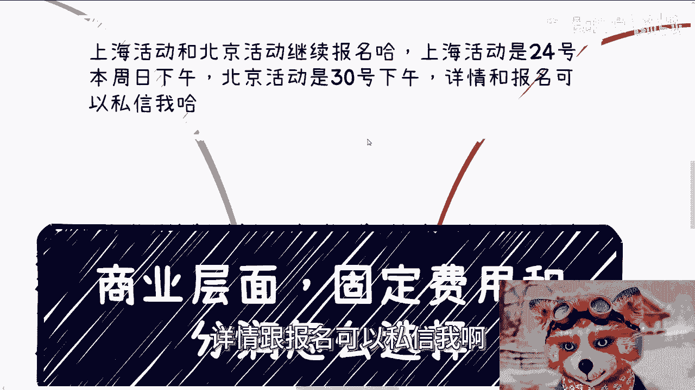
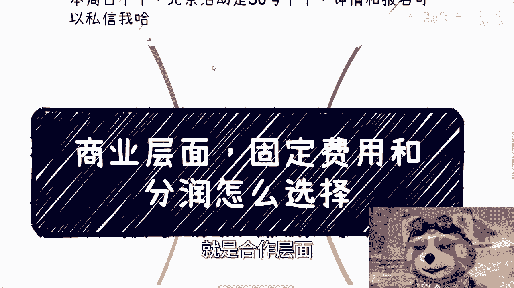
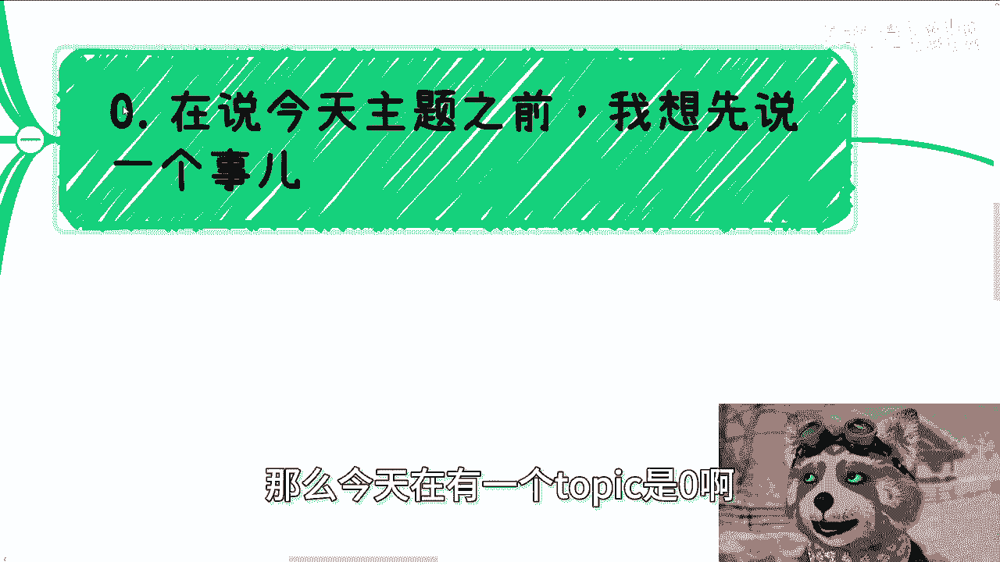
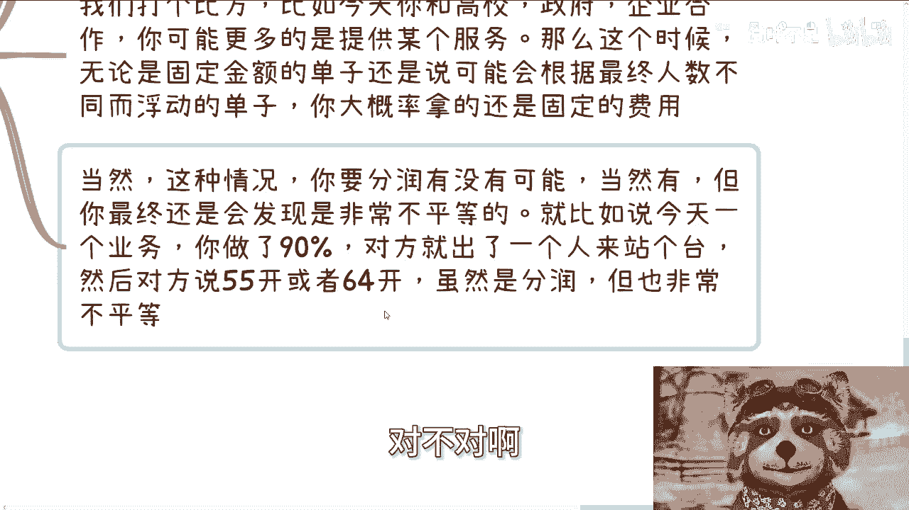
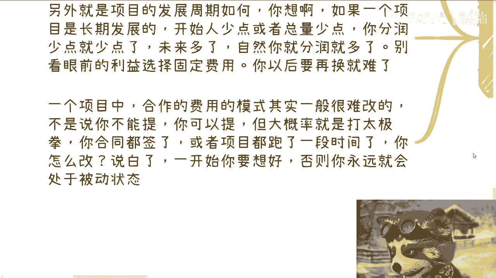
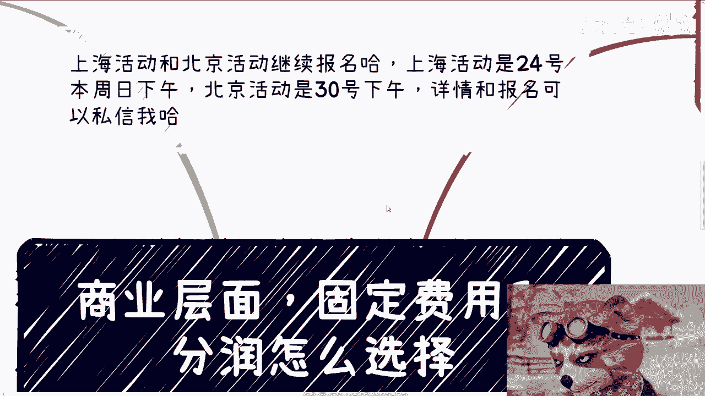
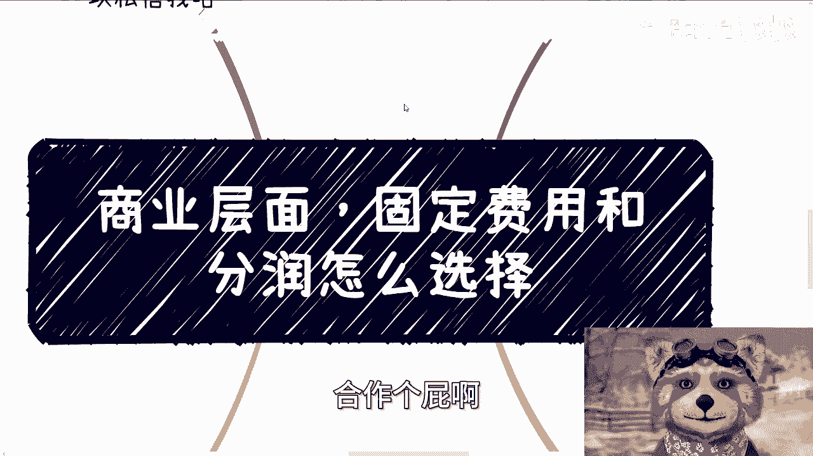

# 商业层面-固定费用和分润怎么选择---P1---赏味不足---BV11D421j7at

在本节课中，我们将探讨商业合作中一个常见的决策点：如何选择固定费用与分润模式。我们将从合作熟悉度、双方地位、项目目标等多个维度进行分析，帮助你建立清晰的决策框架。

---

## 前言：关于合作态度与沟通效率

在进入主题之前，我想分享一个关于合作沟通的观察。高效的商业合作建立在清晰的规则和相互尊重的基础上。例如，在活动报名这类事务中，明确的参与意向和付款承诺是保障双方效率的基础。反复犹豫或提出临时变更，会增加不必要的沟通成本，影响与其他合作方（如场地提供方）的信任关系。因此，在合作初期就建立清晰、高效的沟通习惯至关重要。

上一节我们提到了合作的基本态度，本节中我们来看看合作模式的具体选择。

---

## 核心概念：固定费用 vs. 分润

在商业合作中，支付模式主要分为两种：
*   **固定费用**：合作方支付一笔预先商定好的固定金额。公式可表示为：`报酬 = 固定金额`
*   **分润（分成）**：合作方的报酬与项目最终产生的利润或收入挂钩，按约定比例分配。公式可表示为：`报酬 = 总收入 × 分成比例`

---

## 决策维度一：合作熟悉程度

宏观来看，合作模式的选择与双方的熟悉程度密切相关。

*   **初期合作**：通常从**固定费用**开始。这是一种风险较低、权责清晰的模式，适用于建立初步信任。
*   **深入合作**：随着信任加深，可转向**分润**模式。这能将双方利益深度绑定，共同推动项目增长。

以下是基于熟悉程度的具体场景分析：

*   **场景一：招商引资**
    *   首次与产业园或协会合作时，提出或接受一个固定费用是稳妥的选择。这可以视为双方的诚意试探。若对方主动提出分润，可能是一种客气，需谨慎评估双方资源的对等性。

*   **场景二：活动参与**
    *   若你仅作为嘉宾或专家个人站台，通常获取的是**固定费用**。
    *   若你负责了活动的独立模块策划、专题出品或承担了更多责任，则可以尝试洽谈**分润**。

*   **场景三：线下业务合作**
    *   寻找业务伙伴时，从小切入点开始，提出一个**固定费用**方案，对方接受度会更高。一上来就谈分润，成功概率通常较低。

---

## 决策维度二：双方合作地位

双方在合作中的相对地位，是影响模式选择及实际效果的关键因素。

当双方地位对等时，固定费用或分润都可以协商，没有绝对标准。

然而，当双方地位不对等时，情况会变得复杂：

1.  **选择权可能受限**：强势方可能只提供固定费用选项，无论你提出何种方案。
2.  **分润未必公平**：即使采用分润，分成比例可能无法真实反映双方的贡献度。例如，你承担了90%的工作，却只分得40%的利润。
3.  **警惕短期利益陷阱**：不对等合作中，经验丰富的一方更擅长设计长期博弈。一个初期看起来划算的固定费用（如：总收入1万元，固定报酬5000元），在项目规模扩大后（总收入10万元，报酬仍为5000元），可能会让你感到吃亏。

> **核心提示**：真正的商人很少做亏本买卖。在地位不对等的合作中，不要因眼前小利而沾沾自喜，需通盘考虑项目周期。

---

## 决策维度三：核心目标与项目周期

在选择合作模式前，必须想清楚两个根本问题。

**第一，你想从这次合作中获得什么？**

*   **如果目标是“利”**：应尽力为自己争取经济利益，在费用或分成比例上据理力争。
*   **如果目标是“名”**：例如获得品牌背书、行业声誉，那么可以不过分计较金钱，甚至适当让利，但需确保对方能兑现给你“名”的承诺。
    > **重要原则**：目标要清晰且一贯。不要前期争利，后期又想要名，这种摇摆会让合作方看清你的算计，可能导致合作破裂。

**第二，项目的预期发展周期是多久？**

*   **长期项目**：如果看好项目的长期发展，初期即使分润比例较低或固定费用不高，也应接受。看重的是未来的**长尾收益**。公式 `总收益 = 各期收益之和` 中的期数 `n` 越大，总收益潜力越高。
*   **短期项目**：如果是一次性或短期项目，则应争取更高的当期回报。

> **关键警告**：合作模式一旦确定并开始执行，中途更改极为困难。合同、既有流程和其他合作方的态度都会成为阻力。因此，**务必在合作开始前深思熟虑**，避免事后陷入被动和懊悔。

---

## 总结与行动建议

本节课我们一起学习了如何选择固定费用与分润模式。我们来总结一下核心要点：

1.  **评估关系**：初期或浅层合作，优先考虑固定费用；深度信任后，可探讨分润。
2.  **认清地位**：地位对等，灵活协商；地位不对等，警惕条款背后的长期布局，明确自己的核心诉求。
3.  **锁定目标**：想清楚要“利”还是“名”，并坚持到底。
4.  **着眼周期**：长期项目看未来价值，短期项目重当下回报。
5.  **慎重初选**：合作模式确定后难更改，务必在开始时考虑周全。

希望这份指南能帮助你在未来的商业合作中做出更明智、更从容的决策。