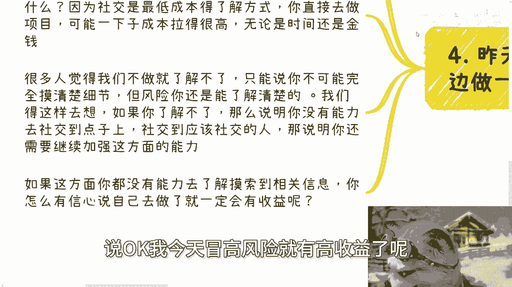

# 商业的风险不单单是钱，每个细节都是风险 - P1 - 赏味不足 - BV1u6421f7JM

好大家好啊，这个今天我们是来讲这个主题啊。

叫商业的风险不单单是钱啊，然后每的每个细节都是风险啊。

呃第一呢就是说昨天因为活动上呢，也正好聊到了这么一个话题。

诶，他怎么没把我投啊，好啊也聊到了这么一个话题啊。

其实很多事情呢就如我之前说的啊，我们听上去呢他妈很有道理啊，或者逻辑走得通走得通的，但事实落地的时候呢，就不是这个样子，而且一两句话呢就很难说清楚，那这就像昨天有小伙伴跟我聊到啊，他说我自己找份工作啊。

然后呢做点商业上的分支呃，你说叫副业也好，叫创业也好，这无所谓啊，咱叫啥都行啊，额但是呢问题是就是说这个他的核心出发点。

叫做高风险，高收益额，但其实我觉得大家不用太纠结定义，你管他叫什么创业，叫什么中介，叫什么皮条对吧，先赚到钱呃，你管他叫啥对吧，我我真的觉得大家这个读书啊，就不要太拘泥于这种细节上面啊。

呃但商业上的行为呢，很多时候风险啊，他并不是说只有钱上名啊，现在很多人啊，很多专家，很多教授提倡所谓的这个轻资产做事情啊，运营什么的，呃没毛病，而且呢很多人就觉得至少要做起呃，做那种钱投入少着。

或者还说不不投入的事情啊。

这也没毛病呃，但这个其中有一个误区啊，这个最大的一个误区呢。

就是因为为什么今天会有这个主题呢，就是因为昨天提到了那个高风险高收益呃，你首先啊你如果是完全自己去创业，就昨天那个小伙伴在纠结啊，说之后是不是自己组建团队，然后我就问我说钱哪里来，他说项目上可以来啊。

我说客户是谁啊，客户他说是企业端或政府端啊，而且呢这个企业端和政府端呢，往往是还是跟他有关系的啊，那这个事呢我就跟他说了，我我说不管跟你啥关系啊，他妈爸妈也跟也也没用啊，我说大概率这个事不靠谱。

为什么呢，因为资金链分分钟就断裂，为什么，因为你逻辑上来讲啊，合同要签吗，要签的啊，最好是要预有预付款啊，然后做项目呢，用项目的钱来养团队对吧，这个没毛病啊，但就像我们刚刚说的，逻辑上走得通。

事实上不是这样子的啊，无论你签不签，也无论你客户是谁，尤其是企业端或政府端啊，他不付不付给你钱，那叫常态，尾款拖欠不付，那也叫常态，所以说最后我跟你讲啊，我说你还是别搞自己团队，另外合同的话呢。

按照361额预付款三啊，过程当中六对吧，然后尾款一，那另外这个六跟一加起来，就是你除了预付款三以外，另外这个七你就当没有，这个才是最符合常态的。

对吧啊，所以你说高风险高收益，这句话对不对对啊，但是前提是你得知道风险是什么，以及你得知道整个项目，或者这个事情的逻辑是什么，但问题在于你说说高风险高收益的这些人，99%他并不知道。

就到底这个里面风险在什么地方，收益在什么地方对吧，他不晓得啊。

然后呢他进去只剩下高风险了，那收益是别人的啊，那么第三说白了啊。

你需要对每个环节都有了解啊，包括就是说你需要有备选方案，那你说啊陈老师，我要做一些高风险高收益的事情，没有风险，有没有可能有啊，是哪种可能性，就是你可以不把每个环节都打通。

但是呢就是你需要把你对接的上下游，都要有备选方案。

我们举个例子啊，比如说你做项目，你对接资源啊，你做项目，那么就是上对接需求，下对接执行方，所谓对接外包，当然你也可以自己做对吧，你就是真正的乙方也行啊，啊但是对上来讲，无论啊你这次赚钱也好，不赚钱也好。

当然不能亏钱啊，无论你这次赚也好，不赚也好，你做出来的东西需要通用化，也就是我们以前说的标准化产品啊，你不要说啊，我今天做个服务，做个产品，卧槽，他妈的为这个甲方做了很多定制化的东西啊，你尽量避免这种。

就是一般来讲你可以不赚钱，但是呢你尽量做一个通用的标品啊，那么也就是说说白了卖给A也是卖，卖给B也是卖，卖给C也是卖，卖给谁都是卖啊，那么这样的话你的风险性是最低的，然后另外一方面对下来讲。

你需要多个执行方，也就多个外包，这个我之前也说的也说过很多次了，一方面你适合你去比价啊，你能够找到一个成本最低的，另外一方面就是为了应付各种突发情况对吧，比如说你今天这个执行方做的真的不行啊对吧。

吹过啦对吧，落地不行啊，那么你就可以去换啊，那么在这个地方我们就说了，无论发生任何情况，执行方中途跑路了也好，不做了也好也好，或者说需求方不停的改需求也好，不付钱的也好，我们都不会亏对吧。

因为需求方不付钱，你至少有个产品你还能卖给别人呃，那个执行方如果跑路了，你有多个执行方可以来顶包对吧，其实就是我之前说的一个靠谱的，或者说有个基本常识的人，他不会去做自己不了解的东西啊，但凡去做了。

如果你不了解，吃亏了就活该啊。

所以说到最最后一点啊，就我们说的就是说一边做一边摸索这个事情，很多人卡在就是我得去做了才知道啊，就如我们这边说的高风险高收益，是不是说一定要冒着高风险才有高收益呢，当然不是啊，其实我一直跟你们讲的。

我们要去社交，要去了解为什么，因为社交才是最低成本的了解方式，社交才是最低成本的试错方式，你直接去做项目，可能一下子成本拉得很高很高啊，无论时间成本还是金钱成本啊，那么很多人就会觉得这里面有个悖论。

就是觉得我们不做，那就不了解啊，我跟你讲啊，你做不做，只能说你不可能完全摸清楚里面的细节，但是风险你是可以了解的对吧，就我们就这样去说，互联网发展到今天，我不管你是花点小钱去咨询，还是说是社交上面。

你是个社牛对吧，你是个呃艺人对吧，你说你出去啊，各种了解过程怎么样子，就是你总有一千一千种，1万种方式去了解里面的风险，你不见得说能了解细那个细节，但是你能你能了解风险对吧，那我们画说回来啊。

如果你了解不了，那么说明你没有能力，就是你你社交上可能没有这个能力，你跟别人去聊，你可能也没有聊的这个能力，也就是说你社交本身的这个能力还没有达标，你明白吗，那么也就是说你社你没有办法社交到点子上。

你没有办法社交到该社交的人上面，那就说明你还需要继续继续加强这方面的能力，而不是说你说OK因为我社交不了，所以这条路走不通，不是这个逻辑啊，所以你要想一个问题，就是如果在社交这方面再去了解风险。

这方面你都没有去有能力去摸索到对应的信息，你怎么会有信信心啊，说OK我今天冒高风险就有高收益了呢。

对不对，你想想看是不是这个道理对吧，就有很多人他他就是这样子，他就是我为什么说眼高手低，就是他觉得哎社交好像是个非常浅层次的东西，而这个东西我看不上对吧，我也不想去社交，你不是你不想去，不是你看不上。

是你没有这个能力去去一些，就是说更high level的地方去社交，你也没有能力，再这个各种沟通当中去获取有用的信息，这个是你能力的问题，这个是你经验的问题对吧，当然你你在这方面没有经验，没有能力。

你就要去提升的方面，而不是说你在这方面没有能力，没有经验，然后OK我否定这条路，然后说我直接去干，那那就像我刚刚说的，你连这条路都走不好，你怎么能有信心说你在那个上面就走得好呢。

对不对啊，所以说就是说昨天其实沟通那个高风险，高收益的时候啊，我其实是想说的是是什么呢，就是你得先去了解，通过各种方式了解，而不是说哦我今天啊这个在工作以外，我做了一件事情啊，然后我就用啊。

我我为什么要做呢，因为高收益高额高风险高收益，你你是大部分来讲，你就像我刚刚说的，你只有高风险，那高收益跟你没半毛钱关系，你能明白这个点吗，啊好吧行啊，那我们今天就说这么多呃，反正你们再想想。

然后就是呃剩下的就是说职业规划，商业规划啊，股权期权呃，叫什么商业计划书白皮书啊，分红分润啊，包括你们手上有什么牌，你们没有什么牌呃，你们希望通过跟我更多更多的沟通啊。

通过我对于当下经济或者当下市场的一些了解，能够给你们一些更接地气的，这个啊规划或者建议的话，那么你们可以整理好个人的问题跟详细的背景，我们再来组咨询，好吧啊行啊。

