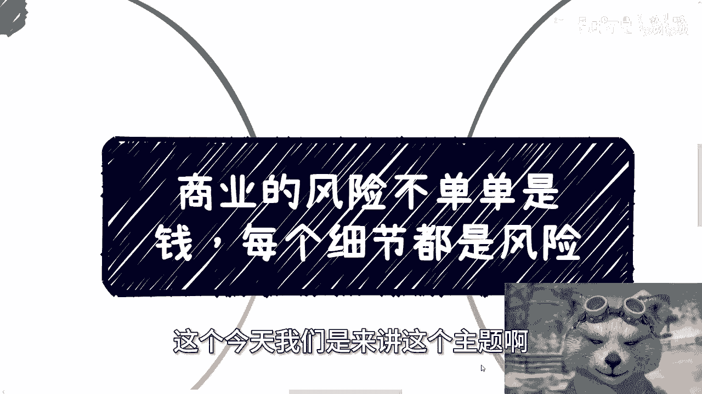
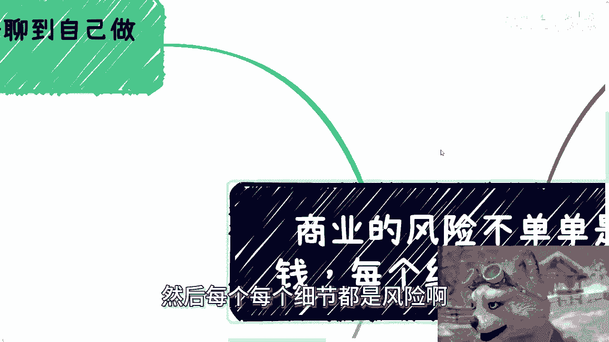
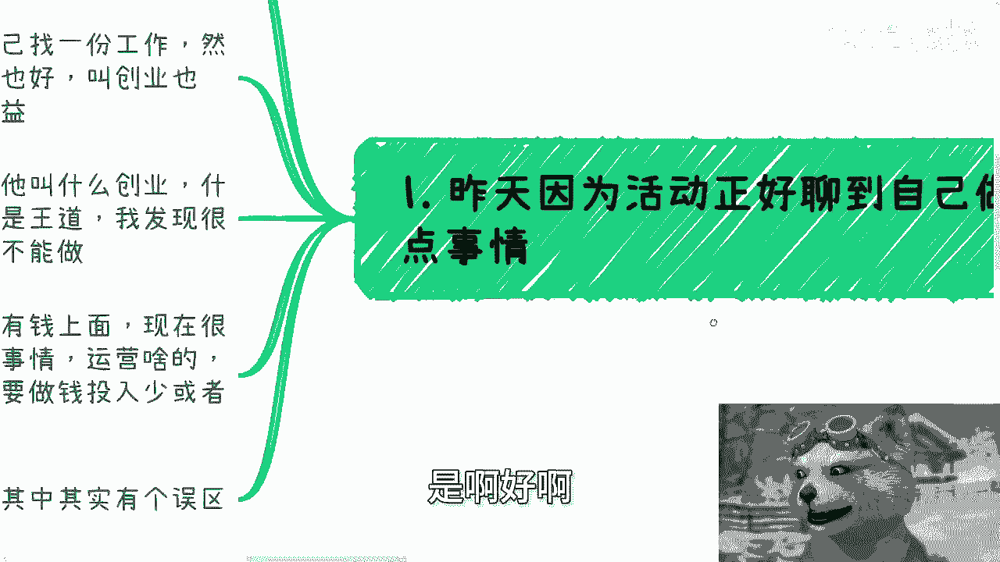
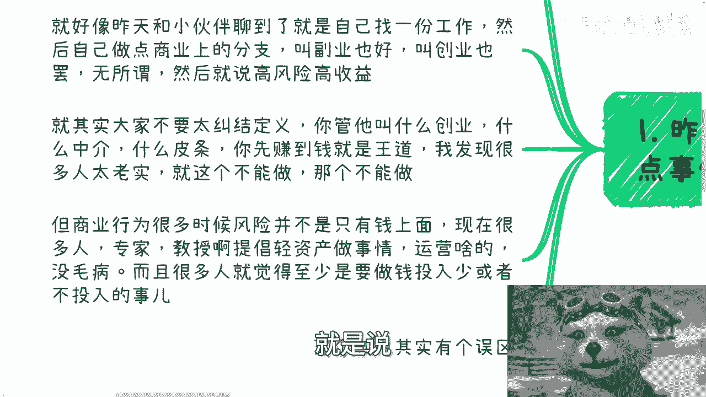
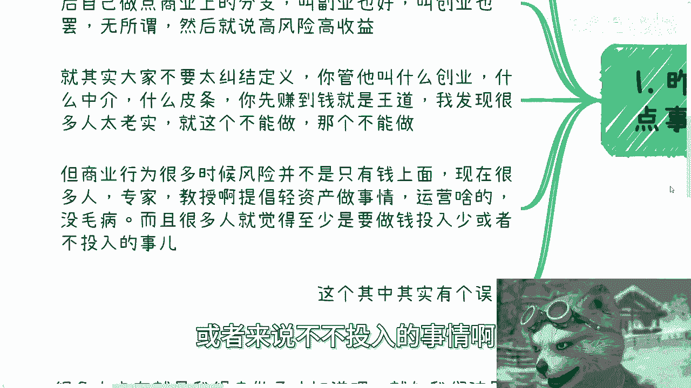
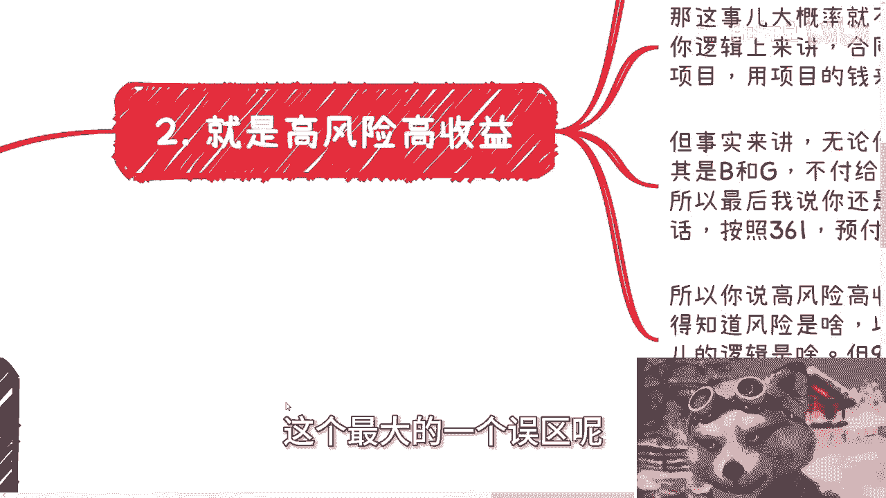
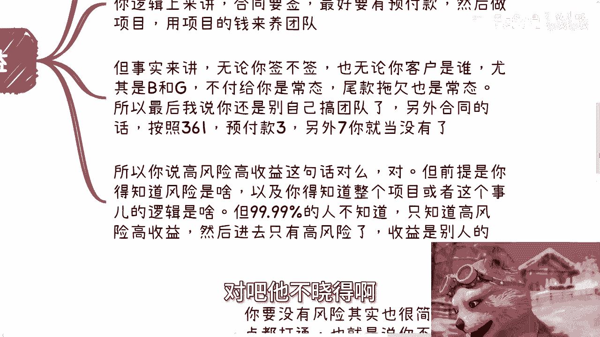
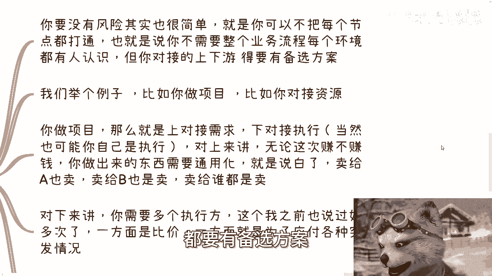
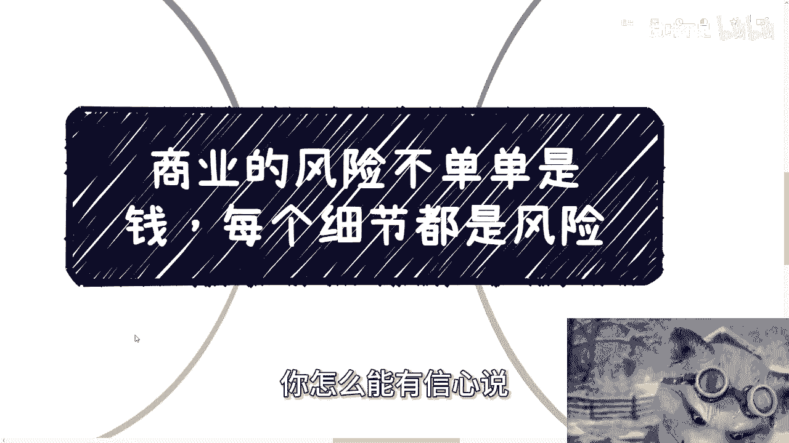
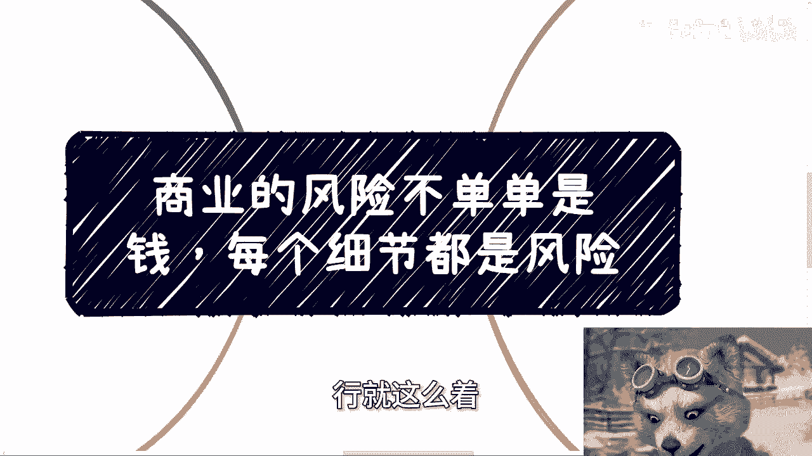

# 商业的风险不单单是钱-每个细节都是风险---P1---赏味不足---BV1u6421f7JM_not

在本节课中，我们将要学习如何正确理解商业中的“风险”。很多人认为风险只关乎金钱投入，但实际上，商业中的每一个环节都可能潜藏风险。我们将通过一个具体的案例，分析“高风险高收益”这一常见说法的误区，并探讨如何在实践中有效识别和管理风险。

---

## 逻辑通顺不等于实践可行

上一节我们介绍了课程主题，本节中我们来看看一个常见的认知误区。

很多事情听上去很有道理，逻辑也走得通，但事实落地时就不是这个样子。一两句话很难说清楚。

昨天有小伙伴聊到，他想找份工作，同时做点商业上的分支，可以叫副业或创业。他的核心出发点是“高风险，高收益”。

但我觉得大家不用太纠结定义。你管它叫创业、中介还是皮条，先赚到钱。读书不要太拘泥于这种细节。

---

## “轻资产”模式下的风险盲区

上一节我们提到了逻辑与现实的差距，本节中我们来看看一种流行的商业观点。

商业上的行为，很多时候风险并不是只有金钱。现在很多人提倡所谓的“轻资产”做事情，这没毛病。很多人也觉得至少要做钱投入少，或者不投入的事情。

这也没毛病。但这其中有一个最大的误区。

---

## 案例分析：为何“高风险高收益”不靠谱

上一节我们指出了“轻资产”的误区，本节中我们通过一个具体案例来深入分析。

为什么今天会有这个主题？就是因为昨天提到了“高风险高收益”。如果你完全自己去创业，就像昨天那个小伙伴在纠结之后是否自己组建团队。

我问钱哪里来。他说项目上可以来。我问客户是谁。他说是企业端或政府端，而且往往还是跟他有关系的。

我跟他说了，不管跟你啥关系，爸妈也没用。大概率这个事不靠谱。因为资金链分分钟就断裂。

逻辑上来讲，合同要签，最好有预付款，然后用项目的钱来养团队。这个没毛病。但就像我们刚刚说的，逻辑上走得通，事实上不是这样子的。

无论你签不签，也无论客户是谁，尤其是企业端或政府端，不付给你钱是常态，尾款拖欠不付也是常态。

所以最后我讲，你还是别搞自己团队。另外，合同按照 **361** 的方式：
*   预付款：**30%**
*   过程中付款：**60%**
*   尾款：**10%**

除了预付款的30%以外，另外的70%你就当没有，这才是最符合常态的。

所以你说“高风险高收益”对不对？对。但是前提是你得知道风险是什么，以及你得知道整个项目或事情的逻辑是什么。问题在于，说“高风险高收益”的这些人，99%并不知道到底风险在什么地方，收益在什么地方。他不晓得。

他进去就只剩下高风险了，那收益是别人的。

---

## 如何构建你的风险防御体系

上一节我们分析了案例中的具体风险，本节中我们来看看如何系统地管理这些风险。

说白了你需要对每个环节都有了解，包括你需要有备选方案。

你说要做一些高风险高收益的事情，有没有可能没有风险？有哪种可能性？就是你可以不把每个环节都打通，但是你需要把你对接的上下游，都要有备选方案。

以下是构建风险防御体系的两个核心策略：

**1. 对上（需求方）：将产出通用化、标准化**

无论你这次赚钱也好，不赚钱也好，你做出来的东西需要通用化，也就是标准化产品。你不要说为这个甲方做了很多定制化的东西，你尽量避免这种。一般来讲你可以不赚钱，但是尽量做一个通用的标品。也就是说白了卖给A也是卖，卖给B也是卖，卖给谁都是卖。这样的话你的风险性是最低的。

**2. 对下（执行方）：准备多个备选**

你需要多个执行方，也就是多个外包。一方面适合你去比价，能够找到一个成本最低的；另一方面就是为了应付各种突发情况。比如今天这个执行方做的真的不行，落地不行，那么你就可以去换。

在这个地方我们就说了，无论发生任何情况，执行方中途跑路了也好，需求方不停的改需求也好，不付钱的也好，我们都不会亏。因为需求方不付钱，你至少有个产品你还能卖给别人；执行方如果跑路了，你有多个执行方可以来顶包。

其实就是我之前说的，一个靠谱的，或者说有个基本常识的人，他不会去做自己不了解的东西。但凡去做了，如果你不了解，吃亏了就活该。

---

## 最低成本的试错：社交与信息获取

上一节我们介绍了具体的风险防御策略，本节中我们来看看如何在实际行动前，以最低成本了解风险。

最后一点，我们说的就是一边做一边摸索这个事情。很多人卡在“我得去做了才知道”。就如我们这边说的高风险高收益，是不是说一定要冒着高风险才有高收益呢？当然不是。

其实我一直跟你们讲的，我们要去社交，要去了解。为什么？因为社交才是最低成本的了解方式，社交才是最低成本的试错方式。你直接去做项目，可能一下子成本拉得很高很高，无论时间成本还是金钱成本。

很多人就会觉得这里面有个悖论，就是觉得我们不做，那就不了解。我跟你讲，你做不做，只能说你不可能完全摸清楚里面的细节，但是风险你是可以了解的。

互联网发展到今天，不管你是花点小钱去咨询，还是在社交上，你是个社牛，你出去各种了解过程怎么样子，你总有一千种、一万种方式去了解里面的风险。你不见得能了解细节，但是你能了解风险。

话说回来，如果你了解不了，那么说明你没有能力。你社交上可能没有这个能力，你跟别人去聊，可能也没有聊的这个能力。也就是说你社交本身的能力还没有达标。

你没有办法社交到点子上，没有办法社交到该社交的人上面，那就说明你还需要继续加强这方面的能力。而不是说因为我社交不了，所以这条路走不通，不是这个逻辑。

所以你要想一个问题，就是如果在社交这方面，再去了解风险这方面，你都没有能力去摸索到对应的信息，你怎么会有信心说，我今天冒高风险就有高收益了呢？

对不对？你想想看是不是这个道理。有很多人他就是这样子，我为什么说眼高手低？就是他觉得社交好像是个非常浅层次的东西，这个东西我看不上。你不是你不想去，不是你看不上，是你没有这个能力去一些更high level的地方去社交，你也没有能力在各种沟通当中去获取有用的信息。这个是你能力的问题，是你经验的问题。

你在这方面没有经验，没有能力，你就要去提升这方面，而不是说你在这方面没有能力，没有经验，然后否定这条路，说我直接去干。那就像我刚刚说的，你连这条路都走不好，你怎么能有信心说你在那个上面就走得好呢？

所以说，昨天沟通“高风险高收益”的时候，我其实想说的是，你得先去了解，通过各种方式了解，而不是说我在工作以外做了一件事情，我为什么要做呢？因为高风险高收益。大部分来讲，就像我刚刚说的，你只有高风险，那高收益跟你没半毛钱关系。

---

## 总结与行动建议

本节课中我们一起学习了如何全面理解商业风险。

我们首先指出，一个在逻辑上通顺的商业计划，在实践中可能完全不可行。接着，我们剖析了“轻资产”和“高风险高收益”观念中常见的风险盲区，并通过一个具体的创业案例，说明了现金流断裂是初创团队面临的巨大风险，常见的付款模式（如361）中，尾款部分应被视为不确定收入。

为了管理风险，我们提出了构建风险防御体系的两大策略：**对上将产出标准化以扩大潜在客户群，对下准备多个执行方以备不时之需**。最后，我们强调了**社交是成本最低的试错和风险了解方式**，在投身一个高风险项目前，应优先通过社交等手段摸清风险轮廓。如果无法通过社交获取有效信息，恰恰说明相关能力有待提升，此时贸然行动风险极高。

剩下的关于职业规划、商业规划、股权期权、商业计划书、分红分润，包括你们手上有什么牌，没有什么牌，你们希望通过更多沟通，获得对当下经济或市场的一些更接地气的规划或建议的话，可以整理好个人的问题跟详细的背景，再来咨询。

---

