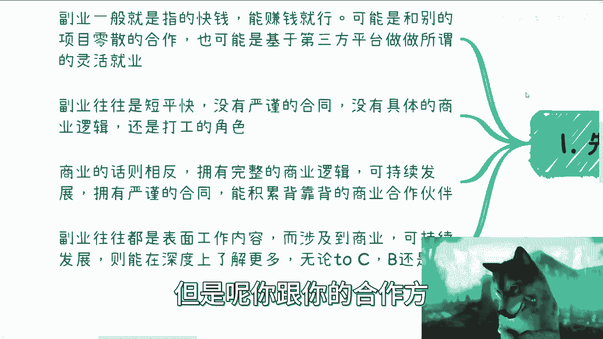
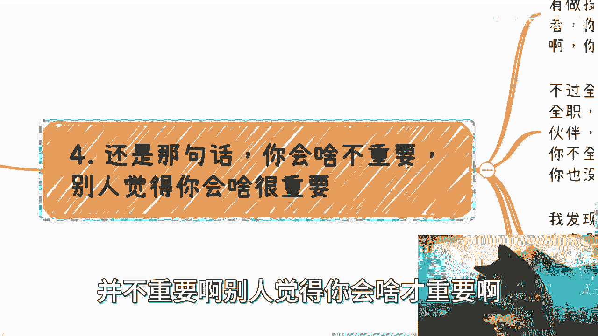

# 商业／副业是否要与主业有关联度，是否需要全职 - P1 - 赏味不足 - BV1ak4y1w79g

啊大家好，今天礼拜天啊，我最近啊这个聊下来呢，就把这个问题再总结一下啊，就是我们非常多的小伙伴呢问这么一个问题，他说啊自己做商业啊，跟他的主业是否要有关联度啊，以及是否需要全职，我们来看啊。

首先我们先来看这个商业副业的这个区别啊。

就在我看来呢，就说副业啊，他一般就说肯定他不是全职的对吧，他全职呢当然也行啊，但是就是说副业呢在商业层面啊，一般指的是一个快钱，也就是说商业是副业的一个，就副业是商业的一个子集啊，那么它指的是快钱。

能赚钱就行，他和别的项目呢就是或者说你跟你的合作方，你跟你的上下游往往是一个零散的合作，就它不是一个非常紧密的合作啊，而且也并不是一个可持续发展的一个合作。

也就是说我们case by case做一笔算一笔，那么同样的这个副业呢，也有可能是基于第三方平台的做的，就比如说抖音啊，B站啊，微博啊对吧这些啊。

那我觉得这是第一个，第二个呢就是说副业往往是短平快的啊，他一般啊，我只能说一般啊，你们不要走极端啊，就一般他没有一个严谨的合同啊，也没有一个具体的商业逻辑啊，或者说你在你在商业层面。

其实呃如果仅仅仅从副业角度来讲，你在商业层面，你其实可能还是资本家，或者说真正的我们称之为呃全职者，或者说真正做商业的那些人，的打工的这个角色啊，那么我觉得这个是副业上面，那么商业的话呢，它其实相反。

就如果你真的做商业，那么你需要的是拥有一个完整的商业逻辑，同时呢虽然你也是kiss by kiss去做的，但是呢你跟你的合作方。

跟你的上下游，你们是可持续发展的，也就是说这个东西它是可复制性，可就是说大家是一个商业的一个合作啊，并不是一个简单的，比如说啊就是你给我打个零工对吧，你给我打个散工这样子啊。

那么同时拥有严谨的一个合同啊，能够去积累背靠背的这个商业的合作伙伴啊，那么副业呢往往是呃，很多都是表面的一个工作内容，就是如果我们说啊把这个赚钱的性价比啊对吧，把这个呃就是每一个业务。

它的纵向横向拓海的话呢，它副业它更像一个点啊，他没有涉及它涉及到商业呢，包括就是说可持续发展呢，包括就是说横向纵向的内容它比较有限啊，但是商业本身啊，你就会发现他是一个就是说呃无论是面向C端。

面向这个企业还是面向政府的，它的横向纵向的扩展度很强啊，呃不见得说你一定要去做加工，呃，不见得说你一定要去融资，或者你一定要有团队啊，但是更多的就是说你融入了一个原本的啊，就是在这个世界上原本就存在的。

一个是一个完整的商业链路当中，你成为这个链路的一部分啊，而不是说成为这个链路生态里面的一个一个，一个一个一个一个，比如说一个散户啊，当然这个散户也可以在里面赚钱啊，嗯可能说的在怎么说呢。

虽然不是很贴切啊，就是我觉得再直白点说呢，就是你做商业的意思就是更像你去做庄家哦，也就是说你是这个项目的主导者，你是在整个链路里面呢，虽然你呃不是整个链路的一个创始人，但是你在这个链路里面呢。

你是能分到一杯羹的，但散户不一样对吧，散户就是相当于是整个生态里面的，这个就就就散户嘛对吧，那你能不能赚到钱，会不会骗啊，会不会被骗，或者是不是会不会自己呃，就是就是欠更多的钱或者投入更多的钱。

那就不知道了对吧，你们就拿庄家跟散户来做，来做这么一个这个类比吧。

啊那么第二点呢，是否需要自己跟这个主页相关啊。

或者挂钩啊，这个东西是这样子的，首先在这件事情上面啊，没有什么很直接的标准，你说一定挂钩，一定不挂钩，没有啊，但是呢根据不同的行业，不同的岗位啊，我跟你讲它还是有一定判断标准，就说你看啊你行业很大。

路很宽对吧，那无所谓，那你就随便走对吧，而且就是说呃如果不涉及到，就是说太直白的这种机密上的东西，那么你只要做好一定的脱敏和保密工作，其实也就好了对吧，就说白了你可以做，你别让你自己的公司。

你别别让你的同事知道你在做对吧，那没问题，但同样的如果你所在行业小对吧，他路又窄对吧，你说可能放眼望去真正的这个头部企业，你你所在的企业就头部之一对吧，或者说上下游里面就那么几家公司对吧。

大家抬头不见低头见的，那我跟你讲这个东西就不太好了对吧，那你最好最最好啊，就关系不要太大，你容易被举报对吧，那么很多时候呢，其实你会发现你发挥的是什么呢，你发挥的是你在这个岗位上。

或者发挥你在你当下这个所在行业里面的，一个通用能力，而不是说一定要去跟你的主页去强绑定啊，什么意思呢，我们比如说啊，比如说你是做开发的对吧，那你说我逻辑性很强对吧，或者我我可能数学很好对吧。

或者怎么样子，那没问题啊，那比如说你做开发，你可能做的是农农业的开发，那么你自己做的话，你完全是可以就是跟你的主页没关系吧，你说哎我可能做一个独立的app，你运用的是你的开发能力对吧。

你说我可以去教教教什么K12的数学对吧，那那你运用的是你的数学能力对吧，那你说我可以去做外包对吧，那么你你相当于做的，就是整个这个商业链路里面，就是就是开发外包的这个链路对吧，那你说你可以做技术咨询。

那没问题，那你发挥的是你的技术能力，包括你的一些总结能力，表达能力啊对吧，那呃包括你也可以去做一些这种中小型项目的，这种技术顾问，因为有很多项目他是想做的，但是并不代表呃他技术很牛逼对吧。

但是他也花不起很大的钱数，去找一些很很很牛逼的人对吧，那么他可能找一些哎大家技术不错的啊，但收费也不贵的都可以啊对吧，虽然你会发现你会发现这些都跟你做开发有关，或者跟你做农业开发。

但是跟你做主业没有关系啊对吧，你在主页，在主页里面可能做的就是一个网站，可能做的就是某个功能，那它跟你的农业跟你的金融八竿子打不着边了，那你就做呗对吧，保护好自己就好了，你把你把该透明的信息透明好对吧。

该嗯不要泄露信息，那个泄露就好了对吧，这是第一点，第二点，比如你做销售，那就更简单了，我跟你讲，你销售需要积累的是什么，是客户对吧，小客户大客户对吧，大客户经理对吧，那么你就看客户还需要什么对吧。

或者客户的客户，那么客户有没有，比如说二者关系，三度关系，你去拓展了对吧，就相当于你今天面前有一张地图，你就去拓啊对吧，那么你可以寻找更多的供应商，那虽然啊你说你做的都是销售，对不对。

但是你做的别的销售东西，你只要不要跟你自己所在的行业，或者你本来自己所在家公司的产品，产生竞争关系，也没什么问题啊对吧，你说我本来是卖保险的好，我们这个客户有一个这个叫什么呃，英语教育对吧。

或者说私教的，或者说高尔夫这个需求，我给他对接一个客户，在当时拿笔钱怎么了呢，不能拿吗对吧，就是你作为销售，其实你要发挥是你销售能力，而不是说一定要绑死在你所在的这个行业领域，或者公司对吧。

那再比如说你做金融对吧，你可能善于口才，你可能呃善于交流，口才不错，那么你想啊，你可以在任何一个行业去构建自己的关系网，你也可以去作为任何一个项目的发起人，你也可以作为任何一个那个那个项目的组织者。

对吧，你做金融，你可能相比其他的行业的人，你更来的对商业有一定的认知，或者说对钱上面对很多的这种法人啊，合同上面你有更大的认知，那么你自然而然就能够去，就是说相比相对别人来讲。

你去承承担更多的这个离钱近的，这个商业的职责对吧，那至于你说做什么没有关系啊，你看他家里有什么牌吗，对吧，我跟你们讲啊，我们以前专门做一些活动，就我们时不时的就晚上出来喝酒，我们一般怎么做的。

我们一般是比如说啊哎对哎，我今天这个这个这个叫什么，这个烟不够大放大一点，对吧啊，你比如说诶不对啊，为什么我不在当中啊，啊算了算了，无所谓。

你比如说我们以前专门做个活动，就比如说晚上十个人对吧，出来喝口酒，然后大家就会汇报一下对吧，相互交流一下最近做了什么对吧，大家可能擅长是什么，然后现场就头脑风暴，就现场其实就开始那个那个拼团队了。

你知道吧，就是A和B拼或者ABC一起拼对吧，或者三四个人一起拼，两两去拼都可以，就大家看看怎么做，而且你想嘛现场去拼，其实你们的想法可能不一定完整，完全对或者全面，那么剩下的人还能给你们建议对吧。

然后你说大家去拼团队，然后大家去执行，然后过个一两个月大家再回来再去看看。

哎这个钱有没有赚到啊，或者说当中有什么困难啊对吧，或者说或者说需要大家做什么，这不是很好嘛对吧，而且这件事情本身就可以成为一个商业逻辑，就看你怎么做了对吧。

诶三呢啊三嗯，关于是否全职啊，这个事啊其实要从几个方面来看，首先全职不全职本身并没有太直接的关系哦，就是说全职不全职，本身跟你能不能赚到很大的钱或者怎么样，这当中并没有直接的因果关系。

因为能不能赚到钱是天时地利人和啊，你有可能你今天全职运气不好，你赚不到钱，也有可能你兼职你的运气很好，赚到钱，那谁知道呢，对不对，当然只不过一般来讲啊，兼职你给别人的感觉，就是说这个是你的一根业务线。

也就是说是你的所有的业务线里面的之一啊，你可能不会太上心，也就是说别人至少会这么觉得，你跟别人说啊，我很上心，那别人不一定信啊，对吧好，那么你的合作方可能会觉得，相对业务的靠谱程度，或者相对去合作来讲。

他更愿意去找那些全职的人，因为他认为全职人是更上心的，或者比你更上心的对吧，那这第一点第二点，很多时候我们做业务啊，沟通他本来就是要快的对吧，呃你但凡兼职，你想想看啊，我们现在说啊。

这个明后天我们要去沟通了，那你要跟我说他哎我要上班，我没空对吧，那你总不可能任何的一个商业的合作，都拖到双休日去吧，而且更何况很多的客户，你是不可能双输出把他拉出来的，唉你不好意思，你没这个本事。

你以为这个面子对吧，那这个也是个很大的问题，那么另外一方面，全职兼兼职本身呢，它会决定你在不在一个行业里面啊，什么意思啊，就是说行业里靠的是关系，靠的是大家的相互介绍，靠的是别人对你的印象，你知道吗。

你今天但凡是全职打工，那么别人对你的印象就是打工，你兼职做业务，那么别人对你的印象就是你不是一个核心的人，对吧，你只有全职的去做你自己的业务，别人也不见得啊，我只能说。

别人才有可能会认为你在某个领域是生根的，或者你在某个领域是值得去合作的对吧，所以我就跟你们这么说，就像疫情的时候对吧，我朋友跟我说，他说他说哎呀，他说你可以到让我，他说让我到一些公司去打工对吧。

或者怎么样先度过两年，我说不是我不想去打，我说我去打了，你知道吗，我说我去打了，就意味着我要脱离这个行业了，我跟这行业很多的关系，很多的那个合作就会断掉，为什么，因为人家不会找你啊。

人家会觉得哎你是你已经开始全职打工了，那么你要知道别人其实看你有很多种想法，你是不知道的对吧，因为你怎么知道你去这个公司，跟对方有没有竞争关系呢，你怎么知道你去的这个公司，跟对方有没有一些过节呢对吧。

那么同样的你怎么知道，就是说呃就是对方会不会觉得叫你出来之后，你公司会不会对他有什么看法呢，对吧，就是商业层面，很多东西大家都是多一事不如少一事的，你知道吗，就是为什么愿意找全职的。

就是因为有风险有问题，大家自己控得住啊，哦你当然跟我说哦，你是个兼职的哦，你现在哪里上班，不好意思啊，我可能不会跟你明说，但是我会觉得OK我有事可以找你帮忙，但是你要说合作，不好意思，不可能啊，没戏啊。

好那所以说本质上我觉得看大家要什么，简而言之就是说打工这件事情在行业里面，你是产生不了自己的任何价值的，你产生的价值都是给公司产出的，你知道吗，所以说就是说很多人会觉得哎我现在做计算机。

我是不是在这个行业里面的，真不是哦，你更像计算机行业里的散户，你懂吗啊。

那么第四点啊，还是那句话，你会啥呢并不重要啊。

别人觉得你会啥才重要啊，包括全职兼职，包括就是说啊你说这个叫什么，就是嗯上面说的什么啊，就是是否跟自己这个领域挂钩对吧。

这个其实都不重要，因为如果你说你是一个呃，这个这个画饼的高手对吧，包括包装的高手，那无所谓啊对吧，你说我今天就算兼职，我靠我他妈人格魅力很牛逼啊，我找了几个几个人可以全职帮我跑，那也没问题啊。

你只要牛逼没关系的，你知道吗，但是从一般来讲啊，可能你做不了对吧，比如啊你说你认识了一圈有着解决方案的，有着咨询的，有做投行的啊，那么你下次出去就可以说你自己是创业的对吧，你说哎我可以提供解决方案。

我可以提供咨询，我可以提供投行服务也行啊对吧，你只要自己语言的过来对吧，你只要说完之后，别人如果问你两个问题，你别被问懵了就可以，对不对，第二你全职不全职，很多时候其实不是那么重要，就像我说的。

你可以不全职，你可以决胜于千里之外，但是你肯定是需要一个全职的小伙伴，或者说全职的那个，知道吗，打工人嘛，电池嘛对吧，那么问题是你一般找不到，为什么，因为你想啊，你不全职，你让人家全职。

那这人要么冤大头对吧，要么这个人就是说啊，人家把资源跟这个利益的大头都拿掉了，跟你也没关系，你说是不是啊，哪里有多有多少事情是哦，你说你不全职啊，你说你不全职，你让别人全职啊，然后你还拿大头，可能我懒。

对不啦，我发现大家真的呃我我聊下来啊，我发现其实大家真的很不喜欢拉皮条，但是我真的不明白啊，一般来讲你要不拉可以。

你要么就是自己有自己的竞争力，你有自己的护城河，你有自己的资源对吧，你的确不拉啊，但是如果现在来讲，大部分的情况下就是没有这个基础对吧，那你肯定只有拉来做起家嘛，你只能做做撮合资源嘛对吧。

而且本身在商业当中，就有很多的这种撮合资源的方式，它是可以赚到钱的啊，只不过就是说他赚的渠道费，比如说10%啊，15%，20%啊对吧，而且你本身做这个撮合资源的过程当中，你可以CTRLCCTRLV对吧。

你可以做很多的复制，也不是不能做对吧，但是同样的就有很多人觉得哎呀，我可能就自己没有什么护城河，或者我可能不懂什么东西对吧，那别人是不是不愿意跟我合作或者怎么样子，那这个也没有关系啊。

你要去找的就是愿意跟你合作的嘛对吧，那不愿意跟你合作的，你就别去管他嘛，是吧啊，你你你一直去看他是不愿意跟你合作的啊，然后你就说好那个我不愿意跟我合作啊，然后呢我就感觉我没什么东西好。

然后就是陷入这个死循环。

那你还怎么往下走啊对吧，所以说你从赚钱角度来讲，你肯定是怎么简单怎么来。

对吧，所以啊我们回到这个地方，你说你要去做这个副业或者做这个商业对吧，你是不是跟你这个主页挂钩啊，或者是否需要全职啊，我跟你讲，还是那句话没定论的啊，你能力强，你可以决胜于千里之外，你能力差对吧。

那你只能慢慢慢慢积累之后，从兼职到全职做一个过渡啊，那么我觉得最合理的状态呢，当然啊，虽然现在我说啊，整个这个社会整个未来的发展啊，呃给不了大家这么长时间，你们没有我当时这个过渡期啊。

你们现在所面临的时间已经很紧迫了啊，但是啊为了这个安全或者为了这个稳定性啊，那么一般来讲呢也是说你们肯定得有个全职，然后呢剩下的商业啊或者副业啊，你们可以慢慢摸啊，当然也慢不了吧，你们尽快摸对吧。

摸下来之后你要觉得靠谱的啊，那你就可以就是说把主页变成副业对吧，那你实在不行就不做也行对吧，你那边的这个钱啊或者业务业务啊，如果已经稳定了，那你就可以全职做对吧，但是不管怎么样，你的商业合作伙伴。

你的商业关系，你的商业行业里对你这个人的认知，对你的定位，这个才是伴随你一辈子的，这个才是你的价值啊，这个才有稳定性啊，剩下的就是说你打工啊，你做工具人啊，你考公啊，你做别的东西都不具有稳定性啊，好吧。

那至于为什么就不能再展开讲，展开讲又没了，对不对啊，行啊，那就这么着好吧，然后嗯同样的，反正大家在商业上啊，在赚钱上，在自己的职业规划上，或者在自己的人生规划上，当然包括情感规划上，对吧好。

那你们反正有什么问题呢，你们可以呃总结好啊，总结好question list，然后再加自己的介绍，自己背景介绍好吧，然后你们可以私信我，我们加个微信，然后来约这个咨询的时间。

