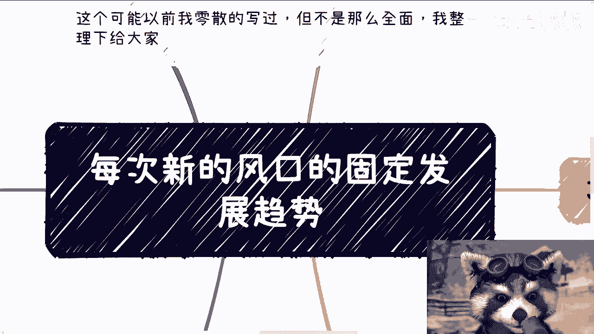
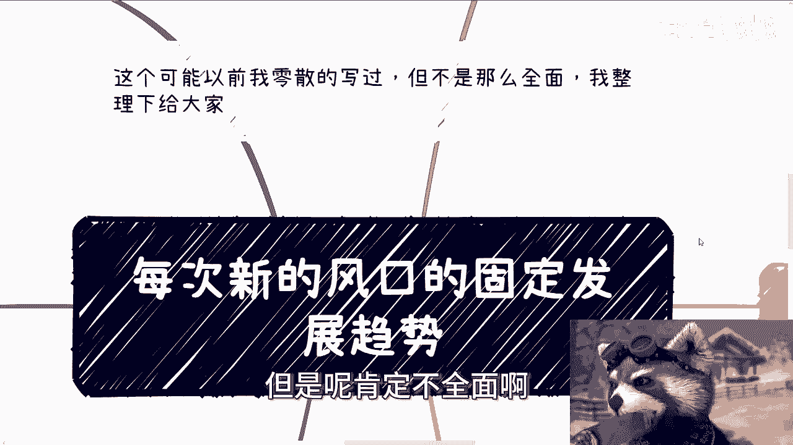
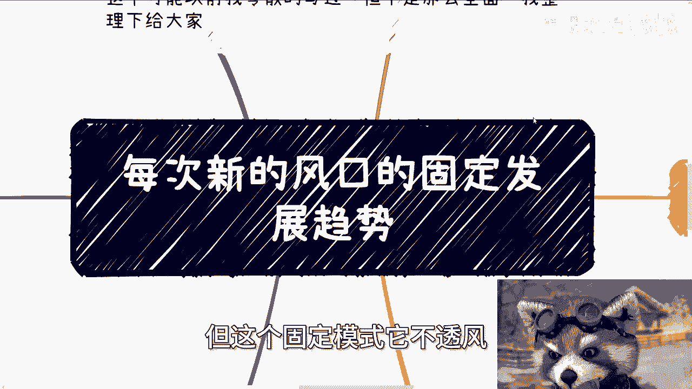
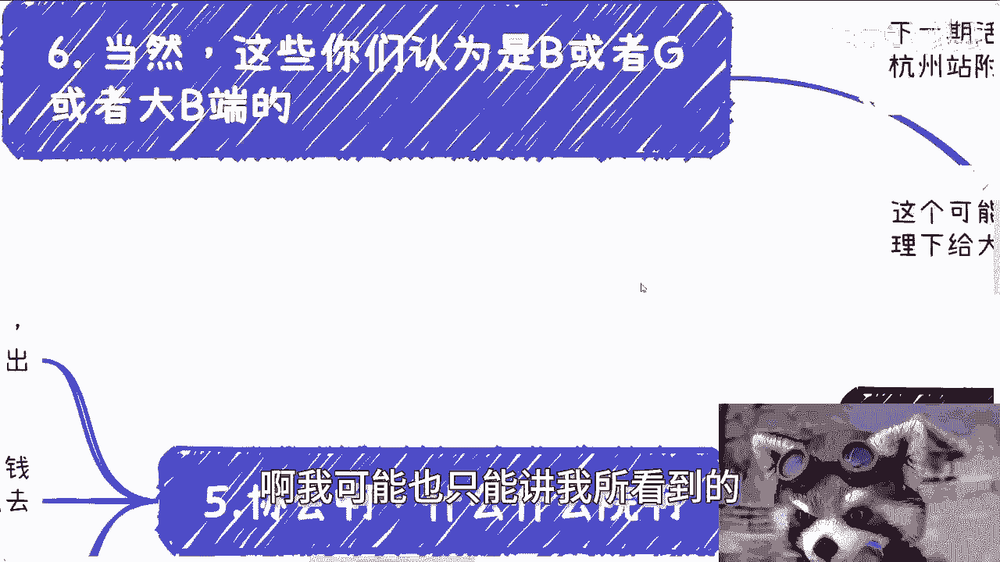
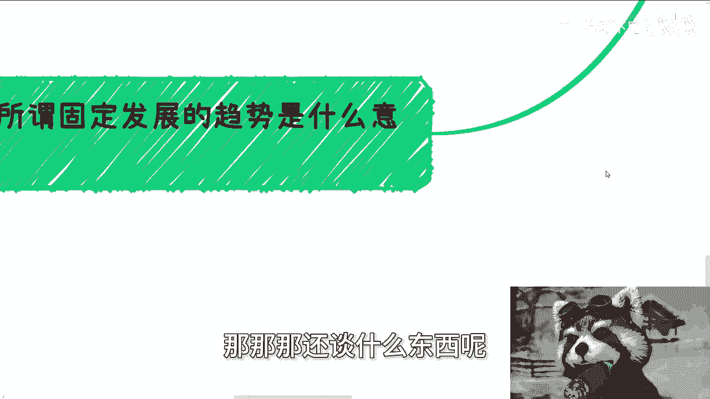
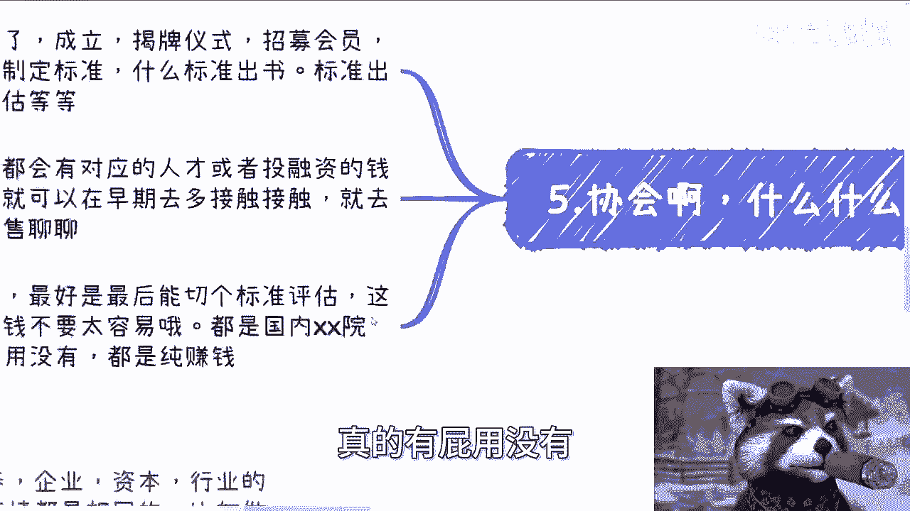
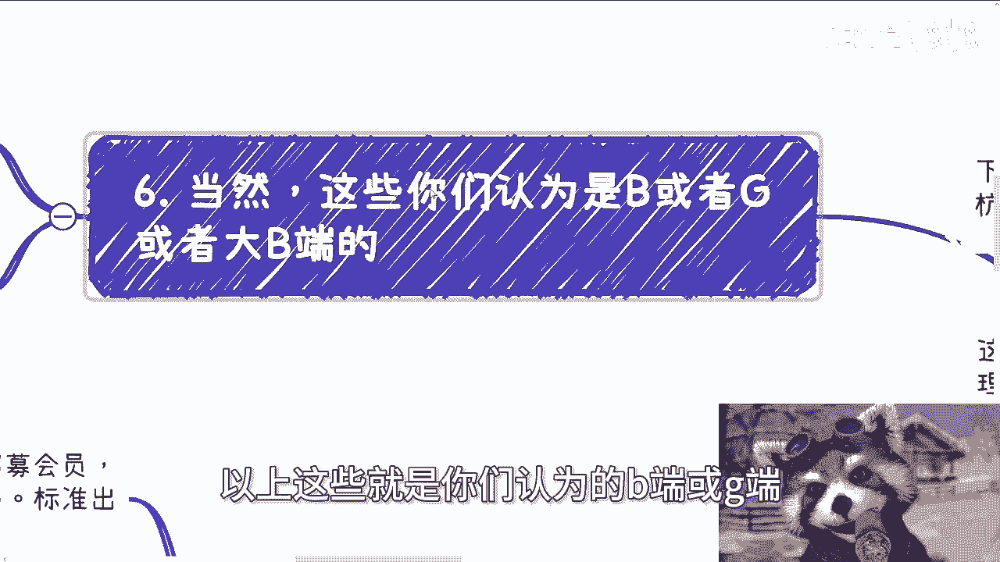
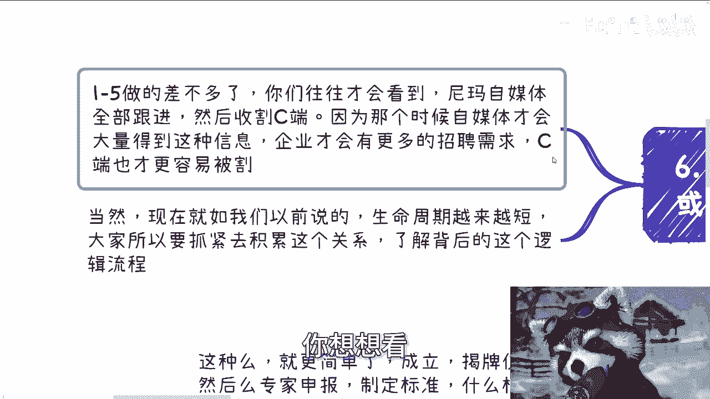
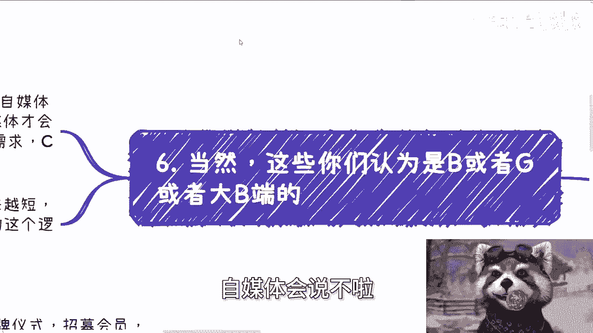
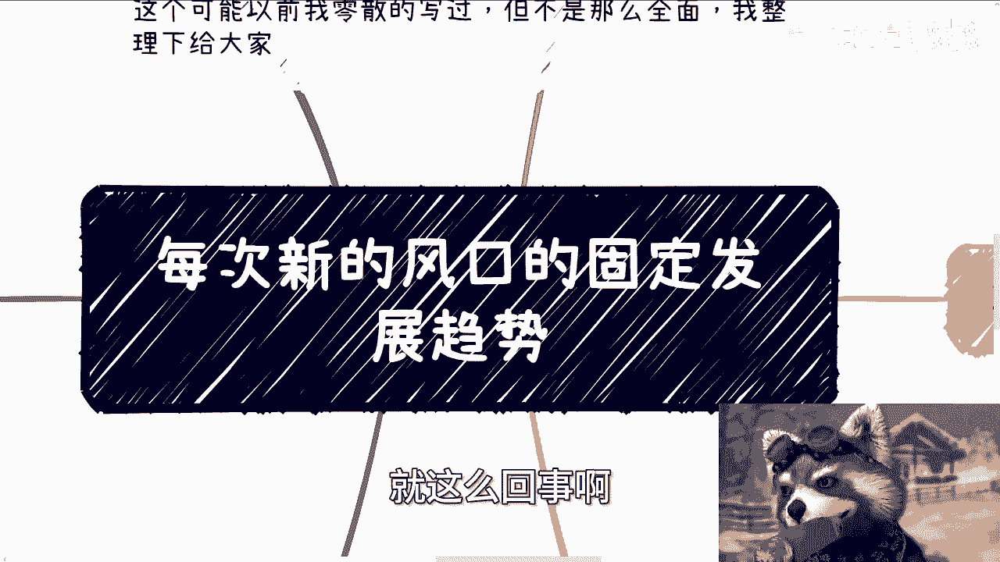

# 国内每次新风口的固定发展趋势 - P1 - 赏味不足 - BV1sb421z7hG

好，大家好啊，这个。今天又比较晚啊，下一期活动已经定了，就本周六下午在杭州，好吧，在杭州站附近啊，详细内容跟报名可以私信我啊。

那么今天这个主题呢，也许我以前零散的写过，我也不再记不太清了，但是呢肯定不全面。啊，我今天就根据我的这个想法，我再给大家整理一下。就今天这个主题呢叫做每次新的风口的一个固定的发展趋势。

什么意思啊？意思就是说每次啊国内啊海外我不管啊，国内的任何一个热点，任何一个风口说不好听点，它其实是有固定模式的。但这个固定模式它不透风，你们明白吧？啊，我可能也只能讲我所看到的和我所经历的啊。

你们能明白多少，就看你们悟性了啊，我我我也不是很清楚，就是说怎么样子。因为我我我能给你们做的，就是说我单方面的输出嘛，对吧？你们有什么问题，你们可以评论去问我啊，但是就是在你们问我之前。

我也不知道你们到底就能能理解哪些东西啊。

第一个点就是所谓固定发展的这个趋势的意思啊，就是说。

高校协会啊，人才培养、企业资本啊、行业等等等啊，产业啊面对一个风口的时候，会去做的事情其实都是相同的。比如说做一些项目申报，做一些投融资，做一些人才培养，每年都会做，只不过申报里面的变量不一样。

你们明白吧？😊，啊，当当然我我也觉得你们可能有些人不明白啊，但anyway就是说每个每一个变量就是每年的风口，就是说前两年比如说变量是原宇宙，可能是呃叫什么大数据啊，这两年比如说人工智能对吧？

怎么样怎么样啊，就只不过是这些内容不一样，但是整个流程。😊，它是一样的，你们明白吧？就底层逻辑是一样的啊，那么同样的发展的模式也是大差小大同小异。比如说各个媒体的舆论啊，企业的一些从0到1的发展啊。

国内企业的落地方式啊等等等，流程也差不多啊。其实很多时候啊大家容易被表面信息所迷惑。我举个例子啊，比如说呃加我的有些人啊，他看到比如说媒体铺天盖地说啊，就好像是热点啊。

然后他就问我他说陈老师这个东西能不能做，就从我们角度来讲，这他妈一看就知道不能做。你知道吗？包括就是说。😊，他看到一些国企、央企啊，然后做了一些什么某某行业的标杆啊，然后就跟我说哎，陈老师。

这个这个几个企业你知不知道啊？他说这几个企业我能不能去切？😊，我跟你讲啊，你但凡去找到这些企业去切，你方向也就错了。你懂吗？就是很多时候呢表面信息你看到对吗？对的，但是你得有经验去判断下一步做什么。

而不是说看到什么东西就去跟没有用的啊。然而了解到固定的发展趋势。😡，其实是个非常难的事情，就是说。😊，你想从表面了解一些信息，但是问题你没法判断这些表面信息到底真还是假。所以说除非你有比较多的经验。

否则就很难看到。就这个事儿我跟你讲，就他妈变成了一个悖论。😡，你知道吗？就变成了一个一个一个总归先有就是要有鸡，必须先有蛋，要有蛋，必须先有鸡，这个事情就无解。所以说明呀这个事情就像我一开始说的。

这事情它不透风。😊，而且他没法透风，怎么偷呢？对不对？我给你们讲，最好玩的什么，就是很多人咨询我的时候，他就说哎，陈老师，那有没有什么什么什么什么媒体信息对吧，或者什么书？我说大哥，你有什么媒体什么书。

😊，我说这种东西出来，第一个就要被摁死，哪里会有啊啊是不是啊？那么第二，比如说媒体宣传啊，我们就拿以前移动互联网来讲啊，我做移动互联网的时候，根本他妈就没有媒体宣传，什么都没有大家他妈有没有宣传。

有的都在宣传塞班宣传诺基亚，哪他妈有移动互联网的宣传不存在了啊，最多就是说一些软件对吧？海内外做了一些成就，他会宣传，但是就凤魔麟角啊，那媒体大面局宣传的时候，其实就是舆论导向。

但你们想啊一个行业到了舆论导向的时候，基本上就是末契或者末契的默契了啊，还有些监管啊，我跟你讲就他妈很离谱。我印象很清楚，可能是去年最多就是前年啊，我看到工信部还有网信办监发了一个什么通告啊。

就是说什么监管了多少APP对吧？什么监什么APP监听啊，什么隐私泄露啊，对吧？谈广告啊。😊，我跟你讲，你知道吗？就你们看到这信息什么感觉，我不知道啊，但我看到这信时候，我就在想那他妈的什么什么软玩意儿。

对吧？就是我他妈我做移动互联网时候，APP是2011年的时候啊，你他妈202122年23年的时候给我说，他妈现在要监管，你妈在搞笑吗？你不是对吧？就是就是这种新闻或者这种行为就让我感觉什么？

就是妈的这行业该该捞钱的，该赚辛苦钱的，该跪着站着赚钱的，该跪着赚钱的，该乞讨的，该怎么样的，人家都已经一个轮回都轮完了，你他妈现在来跟我谈监管，你妈搞笑吗？你不是讲。😊，对不对？所以说啊。

我说这个事情什么意思？你们就得明白，你们看到网络上的信息意味着什么，对吧？所以说我得告诉你们，基本上如果来说有有大面积媒体去宣发的或者这种舆论的你就没啥好好好看的，就是你看到这种东西，你就记住。

就是我们已经没啥机会了。而不是说我操好像你很牛逼，牛逼啥呀，对吧？就是你不要说上层了，就整个三从上到下从里到外的蛋糕都被封的7788了，对吧？你你你就仔细想看啊，我就告诉你们。

现在啊去年习大大又讲了个新的词叫新智生产力，我就这么问你们，你们几个人听到过，我敢打赌。他妈的1000个人里面有他妈一个人听到我就不错了，啊，再说了，你就算听到心智生产力，你懂吗？你不懂，那就对了。

你懂吗。😡，这他妈才叫风口，这才叫方向啊，等到你们都看到了，这他妈叫什么风口啊？😡，对不对啊？第三，企业的一个固定流程。就我们看到地方啊看了什么大会。比如说有些人跟我说，哎，陈老师，我看到什么沈阳啊。

什么什么一些小呃佛山啊，对吧？看到什么什么大会啊，政府站台了，对吧？也会看到一些国企央企做标杆啊，然后。😊，这个媒体大肆宣扬，当然记住啊，这个地方说的媒体。😊，大肆巡扬。啊。

指的就是说一些官媒啊或者公众号大肆宣扬。当然这个地方只不过是部分媒体，远远没有到舆论导向啊，那么这个时候你们就要记住，就是做标杆呢，意味着往往是上层的。比如说呃比如说市级对吧？省级区级啊。

这些地方可能哎大家蛋糕已经开始分了啊，我我不能说它分完了啊，就已经开始分了。那么你看到这种信息时候呢，你就不要再去想着跟他们掺和的，你掺和不进去的，你明白吧？你看到这些信息时候，你要想的就是ok啊。

这个方向呢，你目标就是就这个方向你已经知道了。但是呢你的目标是中小微企业。因为中小微企业相对这种国企央企它一定是有滞后性的。那么你要。😊，及早的去准备中小微企业的服务。那么在你看到这种国企央企出舆论啊。

出啊不是舆论出媒体宣传宣发的时候，就是舆论做媒体PR的时候，你去做服务来得及的啊，那么其实后续呢就是中小微企业的培训啊，然后咨询啊，最后是采购啊，其实采购里面就是包含采购服务采购这个产品啊。

那么当然啊你们要记住，其实培训咨询都会有，只不过大众不知道为什么因为他没必法中会知道啊，你说那他妈的我们水下做企业做咨询培训，为什么大众会知道呢啊，我们做个培训啊，每个企业做个培训呢怎么的。

还他妈的通过媒体宣发嘛，那么能有病嘛，对不对？那么企业既然是商业和呃，既然是商业行为，那么很少会出现直接采购软件或者落地，因为他不了解，你知道吗？他一定会去了解，所以说他几乎一定会走这个流程。

那必然的事情啊，这是第三点。第四啊。😊，高效的固定，那高效的固定，我跟你讲，妈的高效就他妈更死板了。当然啊，我说的是商业合作商，别嗯什么你们说什么什么教授啊，呃什么申报项目啊。

或者人家说写这种paper啊，这这种就不在我们的这个考虑范围内了。😊，啊，那么我们继续来讲啊这个。啊，那么首先啊每年的竞赛对吧？师资培呃师资培训、专业共建、实验室搭建啊，学校的校外课程辅导等等等啊。

校外课程培训等等等啊。无非就这些东西，我比如说我下个月又要给一个学校，我不现在不方便说啊，给一个学校去上课，就是数字经济一样的套路呀呃不就不无非就是肯，然后con C vVV下去嘛，对不对？

只不过你们要记住中国的各个地方的学校，他们的这个。😊，切入点跟切入时间都是不同的。就就是这种业务啊，就是我跟你讲这种学校的业务，你必须全国去做，你必须广撒网去碰，否否则你很难赚到钱。

你说你说你就在一个城市，对吧？就就就就就那个一个城市里面的学校你去碰要命了。然后跟我说，哎，创老师，我我们这个呃城市啊，这个学校可能没这个需求。那他妈的没这个需求，你往外扩啊，对不对哦，你没这个需求。

你跟我说，哎，因为没这个需求，所以我赚不到钱，那他妈你还赚个屁钱。😡，对不对啊，但是这种东西呢我跟你们这么说，你们一旦碰到了啊，你们就是一旦如果有机会去做，那么这个东西啊。呃，就可以一直吃下去。

你每一年都能吃，只不过每一年你的变量，你多变便。那我跟你讲，这种单子你还是蛮开心的，真的你你而且稳定真的稳定，这这才叫真的稳定，你懂吗？啊，因为为什么？因为你核心是高效啊，你核心是企业。

你核心是比如说有什么协会。😊，你要说这种东西不稳定，那他妈高校倒闭了，那那那还谈什么东西呢，对不对啊，那么第五点就是协会啊，包括什么什么院啊。😡。

这种什么什么院啊，我就不想说名字，妈说了回头又有人又有人他妈举报我啊，反正懂得都懂啊，这种我们就更简单了啊，比如说成立啊对吧？接牌医师啊，招募会员啊，然后什么啊专家评审啊，标准制定啊什么标准再出个书啊。

每一年的什么蓝皮书，白皮书啊，反正就他妈的这种毛玩意儿啊，然后标准出来之后呢，然后收费收费评估啊，其实收费评估的意思就是说给剩下的这些企业呢去做那个收费的测试啊。

那么说白了各个地方呢都会有对应的人才培养，或者说投融资的钱去花。那么我们现在就可以在早期去多接触接触去多约约商务或者销售聊聊对吧？你在早期时候，比如说你能切专家切专家，最好是最后能切个评估标准，吧？

跟这些什么院什么院什么院的同流合物啊，然后去这个玩我跟你讲这玩意在他们行业里面不要太容易来看我的看我的看我的拼音看到吧看到吧没有啊，我就不说了，不要太容易啊，吧？反正我跟你讲，真你要真的跟我谈落地价值。

我跟你讲屁用没有啊，真的就屁用没有。😊。

没有办法啊，每一年都这样子啊，你能说什么呢？对吧？当然啊以上这些就是你们认为的弊端或G端或者大B端的啊，那么1到5当做的差不多的时候啊。

你们往往才会看到我操尼玛他妈的全网自媒体开始跟进了啊开始做什么知识变现啊，知识星球啊开始说个C端。那么这个时候其实自媒体才会大量的得到这种信息，企业才会有更多的招聘需求，C端才会有更多的这个岗位。

想让他们会认为有更多岗位想让给自己得到offer，所以才更容易被割为什么？因为他必须是1到5做的差不多的时候，或者说1到5已经成型的情况下这这个就是规律啊，就无论是哪个风口，哪个东西，他就是这个规律。

你想想看我们刚刚说的这个1到5他但凡没有一些发展，没有一个往前推进自媒体会说来不会的呀。因为企业没有需求，有啥好说的呢？你割的东西端割不动的呀。😊。

对吧当然啊现在就如我以前说的就是说生命周期呢越来越短，大家要抓住这个积累这个就就抓紧去积累这个关系，了解背后的这个逻逻辑。因为你生命周期越来越短，也就意味着你想了解到里面的详情其实就越来越困难，对吧？

同时就是说你想让里面的已有的这些人想要去接纳你也就越来越困难。因为大家都在抓紧赚钱啊，大家都在都在抓紧，就是说自自己搞东西，谁还愿意往外面跑。😊。

对吧小也愿意接受外面东西，但是就像我昨天还是前天讲的那个视频，就是说现在再难，总比未来经济好的时候容易。我告诉你们，一旦经济好了，一旦就是说整个趋势只要往上走了，我操。你们看好了，满地都是牛鬼蛇神。

满地都是就是说啊说啊满地都是金子。但是就会你会发现你们再想去合作一些东西啊，就真的比登天还难。😊，因为真因因为是这样子的，愿意你们能接触得到的人，往往他赚不到钱，真的赚得到钱的。

我操等的一一秒钟都没空屌你们，我跟你们讲，真的。😡，啊，所以说呢就是说呃我我不知道啊，因为这个视频在充电视频里面，这个视频能有多少人看到，我也不知道。但是这个视频的核心就两点。

第一点是方向和专业和技术没有用。对于大部分人来讲，这些东西都是变量，每隔一年每隔两年每隔三年都会变，你不要去谈这些东西。第二点就是说你要学的东西有吗？有很多什么东西。

就是我在这个地方给你们列的123456，这些背后的固定的发展逻辑。你一定要去了解，你哪怕只了解那么10%，20%，其实也够你吃了。😊。

你懂吗？这个就是核心的东西。但这些东西哎。不透风，我相信我敢打赌你们除了从我这边大概率，无论是网上还呃就是无论是线上还是线下，你们听不到的，就这么回事啊，好吧，然后那个杭州好吧，报名继续报名。

5月25号啊，然后剩下的话就直接规划商业规划啊，然后融资啊，股权啊，对吧？这个分红啊呃，商业计划书啊，对吧？😊。

分润啊等等等啊，包括你们碰到的一些这个合作上的问题啊，包括就是说你们手上有什么牌，或者你们一点牌都没有。你们希望通过跟我的沟通，希望通过我的视角能够给你们更好的一些呃未来的发展方向或者规划的话。

那么你们可以整理好对应的问题啊。然后我再私信我，我们再走咨询，好吧。😊。

