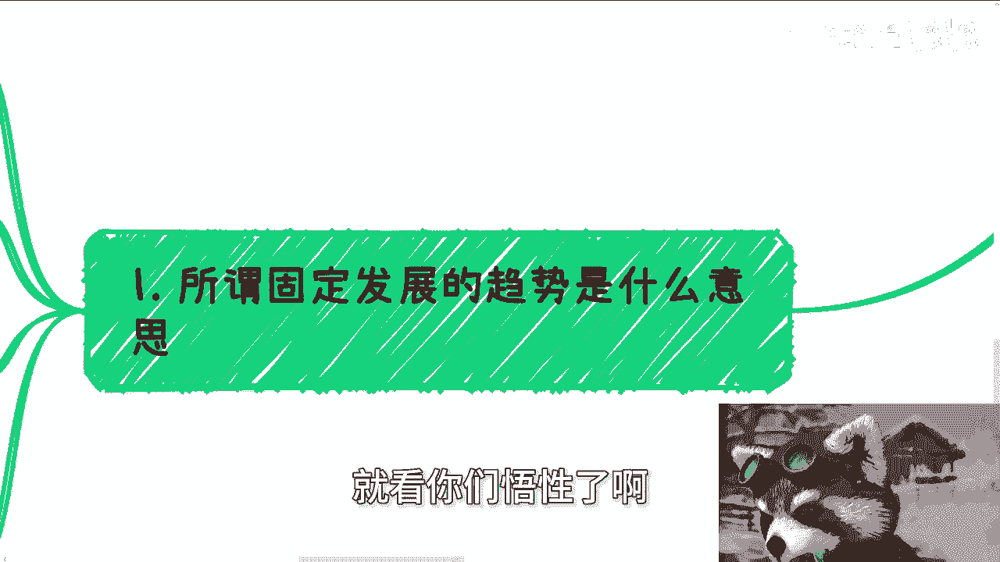
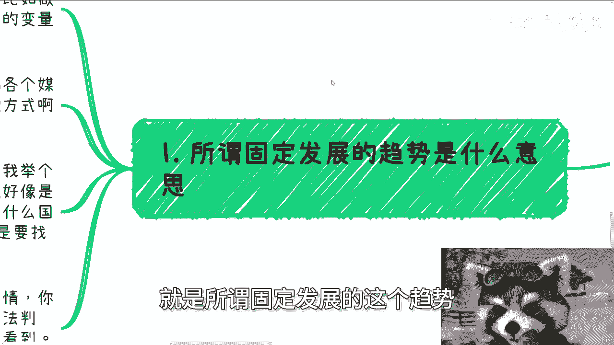
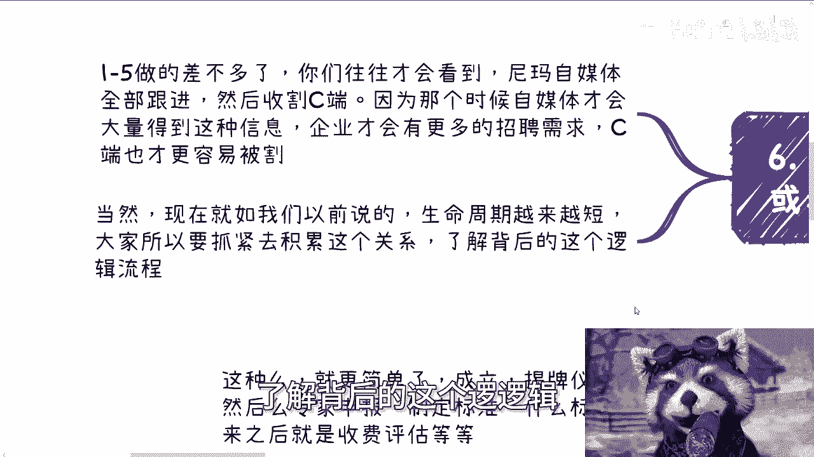
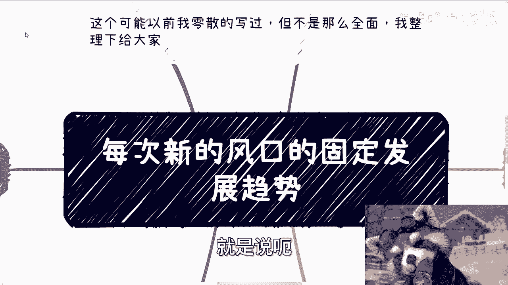
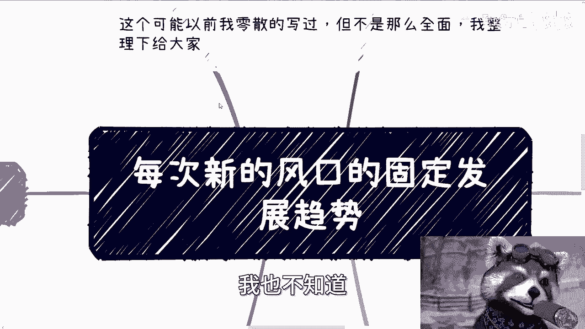
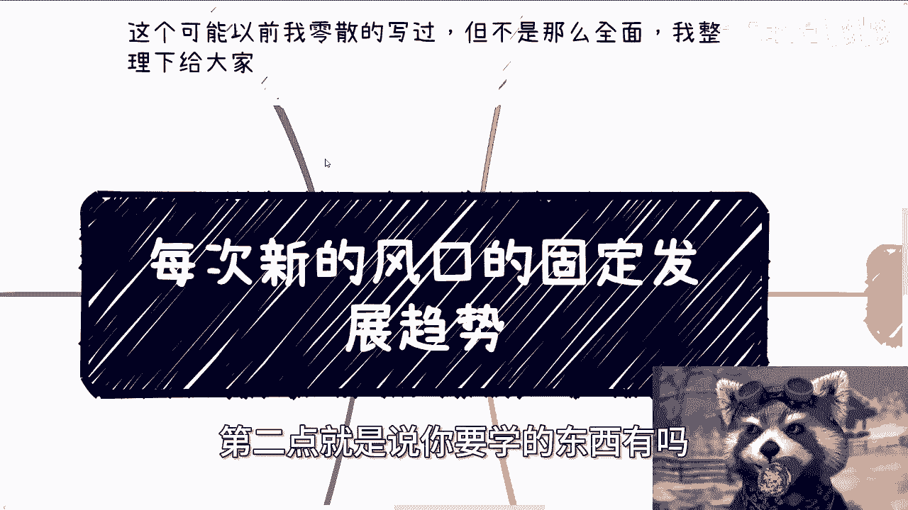
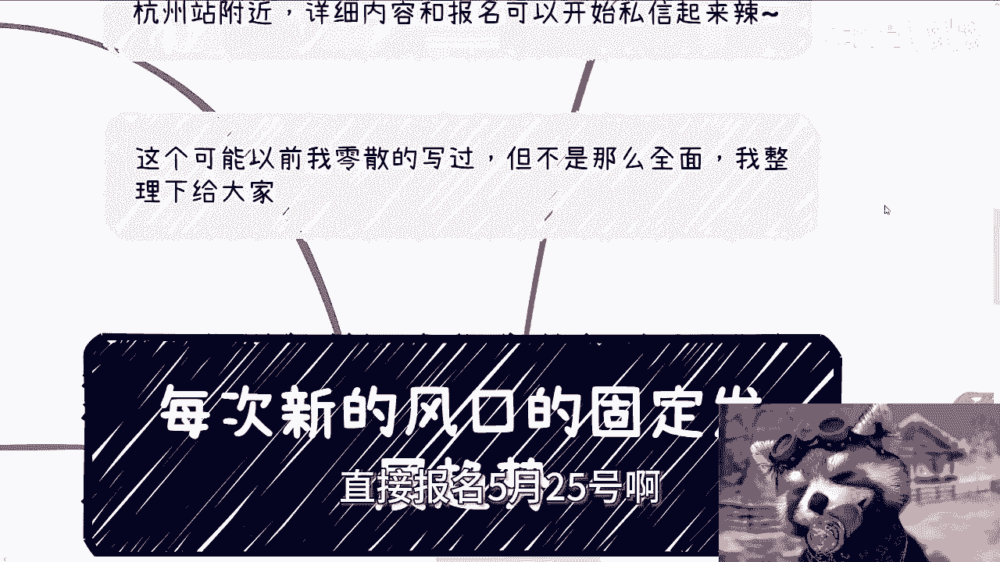
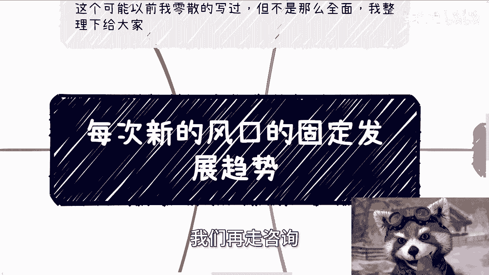

# 课程一：国内新风口固定发展趋势解析 🚀


在本节课中，我们将要学习国内新风口（热点）背后固定的发展模式与逻辑。理解这些模式，能帮助你穿透表面信息，更早地识别真正的机会与陷阱。

## 概述：什么是固定发展趋势




所谓固定发展趋势，是指国内任何一个热点或风口出现时，高校、协会、企业、资本、产业等各方参与者所采取的行动和遵循的流程，其底层逻辑是高度相似的。变化的只是每年的具体主题（变量），例如从“元宇宙”到“人工智能”，但运作的**固定模式**不变。



上一节我们介绍了固定模式的概念，本节中我们来看看这个模式为何难以被大众察觉。

## 第一点：模式的隐蔽性与经验悖论

了解到固定的发展趋势是非常困难的事情。表面信息真伪难辨，除非拥有较多行业经验，否则很难做出准确判断。这形成了一个经验悖论：**你需要经验来判断信息，但获取经验又需要你先能判断信息**。因此，这个模式本身是“不透风”的，相关知识和洞察很少通过公开渠道（如媒体、书籍）大规模传播。

## 第二点：媒体舆论的信号意义

媒体的大规模宣传和舆论导向，往往不是一个行业兴起的信号，而是其进入末期或末期末端的标志。

以移动互联网为例，在其早期爆发阶段（如2011年），几乎没有媒体宣传。当工信部、网信办等开始大规模监管和宣传相关话题（如APP隐私）时，行业早已完成了一个完整的商业周期。

**核心判断公式：**
```
大规模媒体舆论出现 ≈ 行业机会窗口期接近关闭
```

这意味着，当你看到网络信息铺天盖地讨论某个风口时，通常意味着主流机会已经所剩无几。

## 第三点：企业端的固定流程

当看到地方政府举办大会、国企央企树立行业标杆，并有部分官媒进行宣传时（注意，这还未达到“舆论导向”的级别），这表明该方向在**上层（如省市级）的蛋糕已经开始分配**。

以下是面对此信号时的行动思路：

1.  **调整目标**：你的机会不在与这些巨头直接竞争，而在于服务有滞后性的中小微企业。
2.  **把握时机**：在国企标杆进行媒体公关时，正是你为中小微企业布局服务的好时机。
3.  **遵循路径**：中小微企业的采纳通常遵循固定路径：`培训 -> 咨询 -> 采购（服务/产品）`。企业很少会直接采购，必然会经历了解和评估的过程。

## 第四点：高校合作的固定模式

在商业合作层面，高校面对新风口的反应模式也非常固定。

以下是高校常见的合作形式列表：

*   举办年度竞赛
*   开展师资培训
*   进行专业共建
*   搭建实验室
*   提供校外课程/培训辅导

这类业务需要“广撒网”，在全国范围内寻找合作机会，因为不同地区高校的切入时间和需求点不同。一旦建立合作，往往可以形成**长期稳定的收入来源**，每年只需根据新的风口（变量）调整合作内容即可。

## 第五点：协会与研究院的运作

各类协会、研究院的运作模式更为标准化。


以下是其典型行动列表：

*   成立相关分支机构或接牌仪式
*   招募会员
*   组织专家评审
*   制定行业标准、发布蓝皮书/白皮书
*   进行收费的“标准符合性评估”

在行业早期，积极接触这些机构，争取参与标准制定或成为评估体系的一部分，是切入风口上游的有效方式。尽管其实际落地价值可能有限，但却是特定生态内的重要环节。


## 第六点：C端与自媒体的滞后性

当上述第1至第5点（即G端、大B端、高校、协会的布局）发展到一定阶段后，市场才会出现显著变化。


此时，你会观察到：
*   全网自媒体开始大规模跟进该话题。
*   “知识变现”、“知识星球”等面向C端消费者的产品涌现。
*   企业招聘需求明显增加，公众开始感知到相关岗位机会。


**核心逻辑链：**
```
G端/B端/高校/协会完成初步布局 -> 产生市场需求与话题 -> 自媒体与C端产品跟进 -> 公众普遍感知到“风口”
```



因此，当你在自媒体上频繁刷到某个风口信息时，往往已处于整个发展链条的**中后端**。对普通人而言，此时的“机会”更多是培训、课程等消费市场，而非早期的商业红利。

## 总结与核心要点

本节课中我们一起学习了国内新风口固定的发展逻辑与各环节的节奏。





**本节课的核心要点总结如下：**



1.  **方向与技术是变量**：对于大多数人，追逐具体的技术或方向（变量）价值有限，因为它们变化太快。
2.  **模式与逻辑是常量**：真正需要学习的是**高校、企业、协会、媒体**在风口下的固定行为模式与发展逻辑（即本节课的1-6点）。理解这些，哪怕只有10%-20%，也足以让你发现别人看不到的机会。
3.  **行动建议**：在行业早期（静默期）积极积累与**G端、B端、高校、协会**的关系网络，理解其运作逻辑。因为风口生命周期越来越短，早期切入的窗口期也在缩短。




**最终公式：**
```
成功切入风口 ≈ 掌握固定发展模式 + 在舆论爆发前的静默期行动
```



希望本教程能帮助你建立起分析热点的新框架。