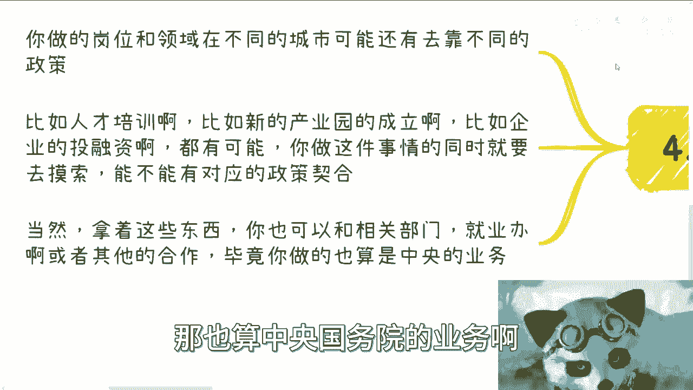

# 国家职业技能等级4-落地赚钱指南---P1---赏味不足---BV1364y1E7uS

在本节课中，我们将学习如何将国家职业技能等级认证项目转化为实际的商业机会。课程将聚焦于核心的商业逻辑、切入点选择以及如何通过合作实现盈利。

---

## 大局认知：抓住本质而非表象

上一节我们介绍了课程背景，本节中我们来看看如何建立正确的商业认知。

首先，需要建立大局认知。大局认知是指，你需要摸清楚的是整个业务流程以及积累上下游关系。你不应该过度关注具体要做什么岗位、考什么证书或进入什么行业。这些属于应用层。

流程与积累上下游关系是本质，而具体行业、证书更像是应用层的东西。将精力过度放在应用层，是一种自我局限，没有意义。

---

## 落地实施：寻找合作与关注增量

理解了本质后，下一步是落地实施。落地需要在某些地区找到合适的合作方，共同实施整个流程。你需要了解过程是如何运作的。

至于具体岗位或领域，无需过度关心。你只需要关心什么是“新”的即可。因为只有新的领域才有增量市场。现在去搞电工、钳工等传统项目是不明智的。

合作都是从小开始的。无论你能做什么，能帮到对方什么，就先做。你需要先与现有的培训机构、鉴定中心等机构合作，获得“上牌桌”的资格。不要一开始就幻想做大额业务。

---

## 核心切入点：四大关键要素

明确了方向，我们来看看具体的切入点。以下是切入这个领域的几个关键要素：

*   **课程**：提供或开发符合国家标准的培训课程。
*   **老师**：拥有或能联系到合格的讲师与专家。
*   **渠道**：掌握生源渠道或合作机构资源。
*   **国标**：深刻理解并紧跟国家职业技能标准。

你的身份或包装并不重要，重要的是你能提供什么价值。你需要向合作方清晰地说明，你能帮助他们承担哪些业务、落地哪些环节。只要大家能一起赚钱，合作就能达成。

你可以从任意一个切入点开始，先去积累资源或拓展人脉。例如，针对2024年的新岗位，你可以先去寻找课程、老师、渠道或专家。多参加行业活动，多与人交流，资源自然就会聚集。

用你积累的关系和资源，去与鉴定中心等关键方洽谈合作。

在中国，做事的原则是：能“躺着赚”（外包），就绝不自己“干活”。当你能将业务外包时，没人会选择亲力亲为。你现在不这么认为，只是因为你还不具备“躺”的条件。

---

## 价值核心：赚钱是唯一痛点

在商业合作中，很多事情无需讨论抽象的价值。所谓的价值就是：你拥有别人需要的东西，并且大家能一起赚钱。

你能开发软件或能讲课，这不直接等于价值。真正的价值是，你的能力或资源能否为对方带来利润。如果不能，其他都毫无意义。

---

## 发展路径：横向复制与纵向拓展

确定了价值，接下来看如何发展。发展主要有两个方向：

1.  **横向拓展**：将一个成功的业务模式，在不同的城市进行复制粘贴。一个岗位可以在全国多个城市开展，你的收入就能实现倍数增长。这个方法朴实无华但有效。
2.  **纵向拓展**：在以职业技能等级认证为核心业务的同时，扩展出相关业务，例如：
    *   技能竞赛
    *   人力资源外包
    *   其他衍生服务

这两条路可以同步进行。目标是在持续赚钱的过程中，不断积累自己的关系和资源。一边赚钱，一边通过项目案例积累人脉。

---

## 政策结合：实现一鱼多吃

最后，不能忽视政策的力量。你做的岗位和领域，在不同城市可能契合不同的地方政策。

例如：
*   人才培养补贴政策
*   新产业园的扶持政策
*   企业的投融资优惠政策

在做职业技能等级项目时，应该主动探索是否能与这些政策结合。做一件事，同时争取多份收益，这就是“一鱼多吃”。拿着这些符合政策的项目，你也可以与就业办等相关部门寻求合作。

因为你所做的职业技能等级认证是根正苗红、政治正确的事情。

---

## 总结与行动建议

本节课中我们一起学习了如何将职业技能等级认证商业化。

商业合作的核心很简单：抓住痛点。在商业上，核心痛点只有一个，就是**赚钱**。同时，在中国，政治正确与安全是前提。在满足这两个条件的基础上，确保对方能赚钱，合作就能达成。反之，如果你不能为对方创造利润，任何花哨的方案都无效。

**行动建议**：
1.  梳理自身在**课程、老师、渠道、国标**四个要素中的资源。
2.  寻找新兴领域的增量市场机会。
3.  从小型合作开始，与现有机构建立联系。
4.  明确并传递你能为合作伙伴带来的**具体利润点**。
5.  规划横向复制或纵向拓展的路径。
6.  研究并尝试对接地方相关政策，放大收益。

---
*（注：文中所提“深圳活动”及“商业咨询”为原视频内容，此处仅作忠实转述。）*