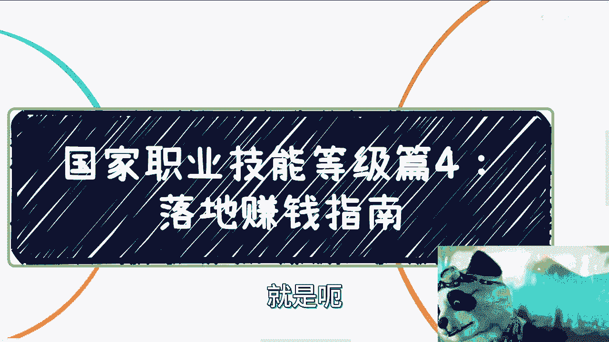
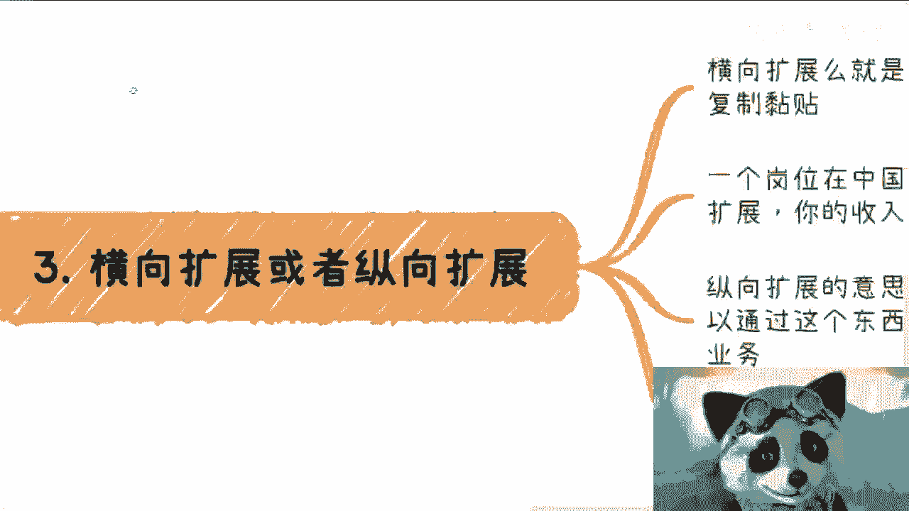

# 国家职业技能等级4：落地赚钱指南 - P1 - 赏味不足 - BV1364y1E7uS

啊大家好啊，今天这一期呢，就是呃这个国家职业技能等级最后一期了。

应该也是大家最关心的就是赚钱是吧，嗯首先呢是这样子的。

有个大局认知，什么叫大局认知呢，就是说从大局认知来讲，你需要摸清楚的是流程啊，以及积累的上下游关系，而不是说你说我到底要去做什么岗位，做什么证书，做什么行业不重要啊，你但凡就你要把它理解为什么。

就是流程跟积累上学有关系，它是它的本质，而你要去做什么行业，做什么样的叫什么，就是证书，这更像应用层的东西，你把你的精力，把你的这个关注点更多的放在应用层，这个叫做自我局限啊，没有任何意义啊。

好那么这是第一个，第二个你要落地的，哪是需要在某些地区找到合适的合作方去落地，实施整个流程，知道过程中是怎么样的啊，至于岗位什么领域不用关心，只要关心什么是新的就可以了，为什么。

因为只有新的才有增量市场，就这么简单，你不要现在去搞个什么电工钳工，他妈的脑子瓦特了对吧啊，第三不要一下子想着做太大啊，合作都是从小开始的，无论你能做什么，你能帮到对方什么，你就先做。

你需要的是先和之前做这些机构的啊，包括做鉴定中心的先合作，你要有资格线上牌桌，别的不重要啊，不要一下子说啊，我他妈做还没做呢啊，我他妈的老子我得先他妈的做50万做100万。

不可能的，别想了。

好第二个这个玩意儿切入点啊，无非是这么几个，一，我们综合之前的我讲的123的内容对吧，一个是课程，一个是老师，一个是渠道，一个是国标，没了就这么写，就这么简单，没了啊啊其实合作这些东西呢，包装也好。

你是谁也罢，这些东西并不重要，你知道吧，就重要的是你能提供什么，就是你比如说很多人跟我说啊，陈老师，我学历不好对吧，或者说我现在拿不出什么东西，这都不重要，你重要的是你跟对方去谈。

你到底能帮助对方承担哪些业务，你能帮助对方落地哪些东西，对方交给点东西，你是否能很好的完成，结束了呀，谁关心这么多，对不对，意味着大家能赚钱，大家能赚钱，我靠还谈什么，你说话谈了对不对，干了。

你随便找个切入点，先去积累，或者先去社交来笼络你的关系，然后你就方便切方便切了，比如说比如说2024年有个新的岗位，你找个切入点，你先去找课程啊，或者先去找老师啊，或者先去找渠道啊，或者找各种专家啊。

这几个东西本土在这片土地上面，你随便找啊，怎么不好找的呢，啊你多参加些活动，多找些人对吧，多请客吃几顿饭都在里面了对吧，其实就是你要用你笼络来的关系，然后用你笼络来的资源去跟鉴定中心谈。

那这个地方我又得说一嘴是什么呢，就是你们一定要记住，中国做事情能躺着赚的，绝对不会干活啊，什么意思，就是当你能外包的时候，谁他妈自己干活啊，你将来是不是你现在不这么觉得，是因为你不能躺，你怠慢两天。

能躺了，你会干活吗，我告诉你不会的，你别想了啊。

还是那句话，很多事情不要去讨论价值，没他妈的所谓的价值啊，你有东西，你有别人需要的东西，大家能赚钱，这就叫价值啊，哦你跟我说我能做个软件啊，我能我能帮你讲个课，不好意思，这不叫价值。

我就问你能不能给我赚钱，能使不能滚对啊，第三，第三就是我们说的横向拓展或纵向拓展，什么意思呢，就是说横向拓展就是你要做一个东西。

不停的做啊，然后在不同的城市去复制粘贴啊，一个岗位在中国各个城市都可以做，你就一个一个去扩，你的收入就是倍数增长的，就这么简单啊，没有这么花里胡哨的操作啊，都是朴实无华的，纵向拓展的意思是什么。

就是你除了做职业技能以外，你可以通过这个东西扩展出竞赛，人力外包啊，或者别的业务，其实这两条路你也可以同步都走啊，你要的就是在不停的赚钱的同时，积累自己的关系资源，就是就是你一边赚钱。

一边通过case积累关系就结束了，这就是你要做的事情啊，没这么多逼逼的事啊，当然我们最后不能忘记政策，什么意思呢，就是说你做的岗位跟领域在不同的城市，城市可能还要去靠不同的政策，比如说啊人才培养。

比如新的产业园的成立，比如说企业的投融资，你在做职业技能培那个技能等级的时候，你其实是可以一举多得的，你知道吧，我们叫做一鱼多吃对吧，也就是说你做都做了，你看看哎，能不能往人才培培养的这个政策上靠啊。

能不能往现在产业链上面靠啊，能不能往这个企业的投融资上面靠啊，都有可能你做的这件事情同时就是都要去摸索，能不能有对应的政策去契合，对不对，你能多赚份钱，为什么不赚呢，对啊，那么当然拿着这些东西呢。

你也可以跟相关部门啊，就是就业办或者其他的去合作，你知道吧，毕竟你要明白你做职业技能等级。

啊有什么不能做的，你根正苗红啊，对不对啊，好那么我觉得呢就那么简单的事儿，就是你们要一定要明白，就是商业上的合作啊，没有这么多奇奇怪怪的东西，就是你要就我们叫做什么叫做你要抓事情，你就得抓痛点。

是在商业上痛点有什么，只有一个东西叫做赚钱啊，而且就像我们说的，在中国政治大于一切，那么也就是说至少在政治正确，在安全的情况下，你要让对方能赚钱，OK了啊，你你要反过来想，当你不能为对方赚钱的时候。

你再去搞那些有的没的，花里胡哨都没卵用啊，然并卵啊，好吧好啊，就这么朴实无华啊，行就这么着了啊，那个这一张啊，我们就这么翻篇了，翻篇了啊，深圳活动啊，要报名的，你们继续报。

然后要呃有商业上或者有规划上要咨询的，你们也就是整理好做咨询啊。