# 国家职业技能等级篇1：我拼这个图花了一年多 🧩

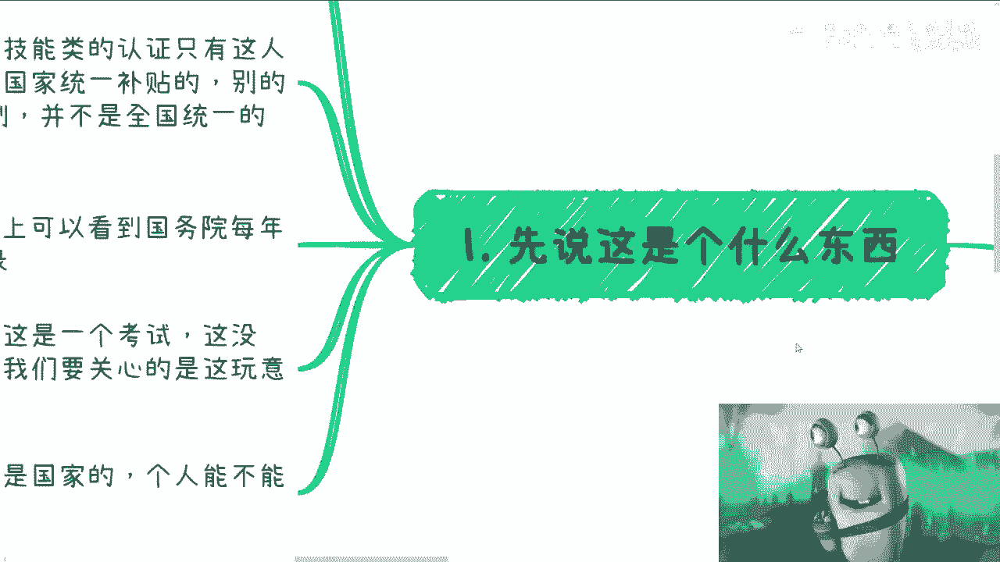

在本节课中，我们将要学习什么是“国家职业技能等级”认证。这是一个由官方机构颁发的、具有国家补贴的职业资格认证体系。我们将了解它的基本框架、官方背景、与普通认证的区别，以及个人如何参与其中。

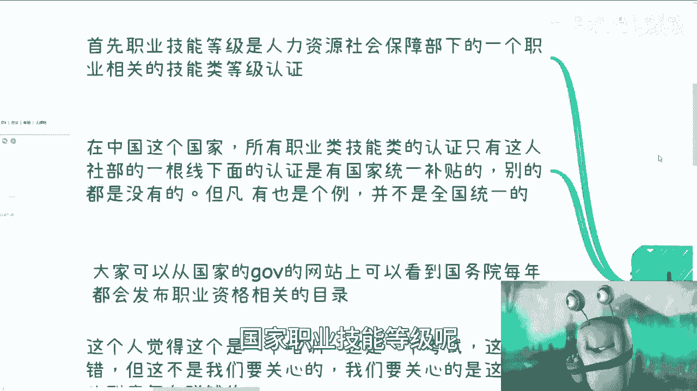

---

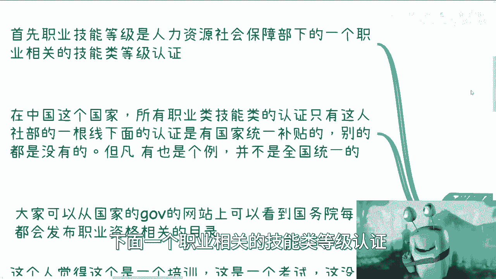

## 什么是国家职业技能等级？

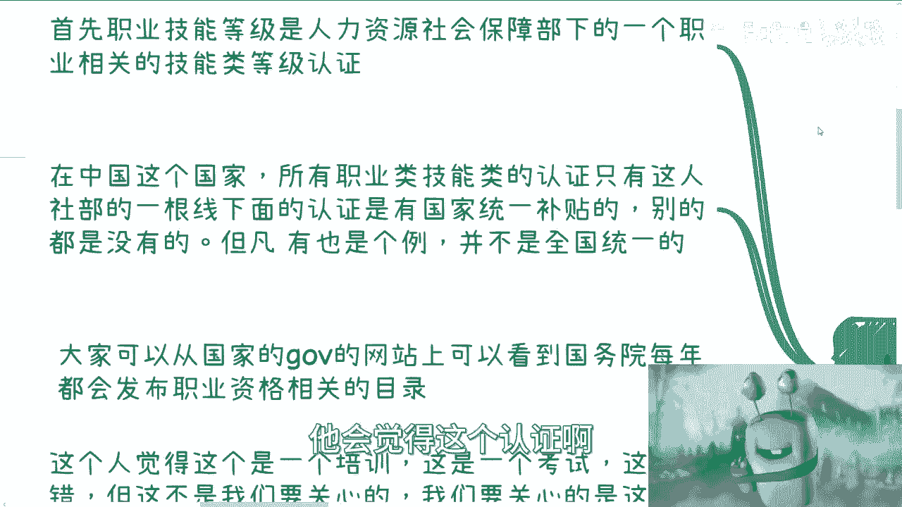

上一节我们提到了课程主题，本节中我们来看看它的具体定义。

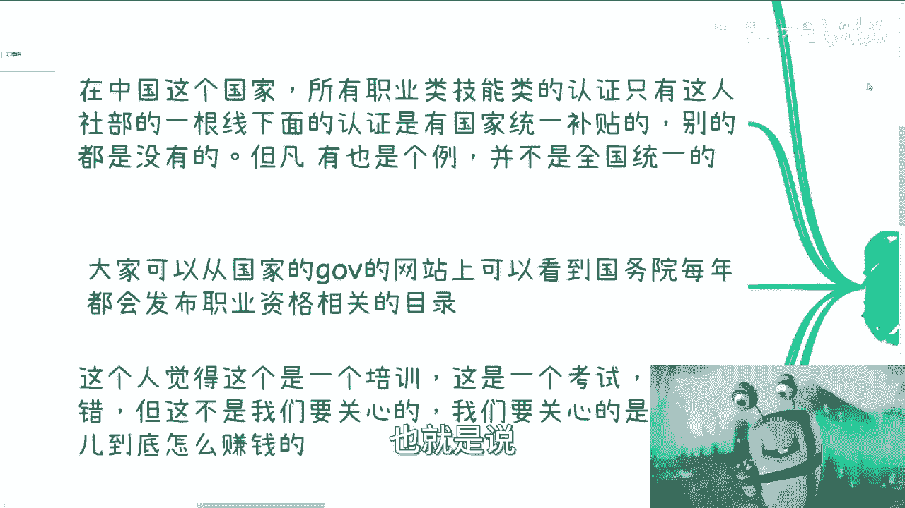

国家职业技能等级是一个由“人力资源社会保障部”（简称人社部）主管的职业相关技能类等级认证。

很多人对人社部不了解，也认为中国的认证体系繁多。我们需要先了解它与其他认证的区别。

在中国，所有职业类、技能类的认证中，只有人社部这条线下的认证是由国家统一提供补贴的。这个补贴是以中央为单位向下发放的全局政策，并非临时性或地方性的，已经持续了很多年。

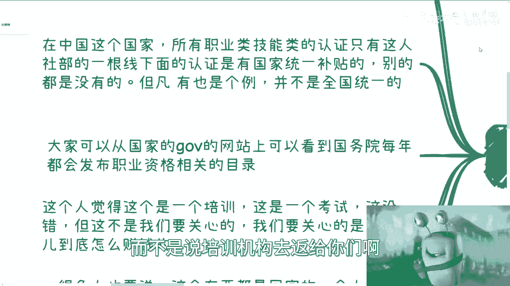

从官方认证角度讲，有补贴的只有人力资源社会保障部下面的认证。其他认证也可能声称有补贴，但那通常是个例。例如，可能是培训机构从培训费中返还，并声称是补贴。

人社部的补贴领取方式不同。领取者需要从官方的人社部APP上，通过一个名为“职业类技能等级”的专门入口进行申请。补贴并非由培训机构直接发放。

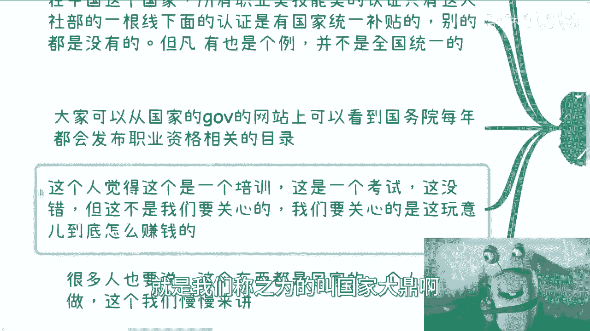

---

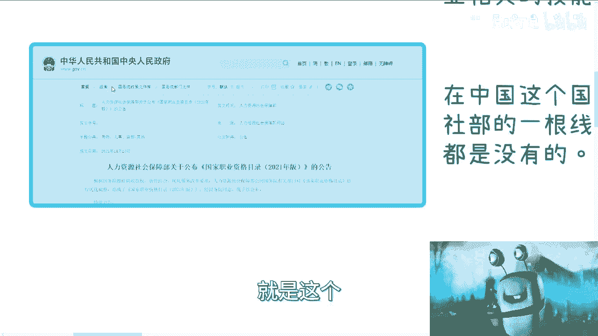

## 官方目录与“职业大典”

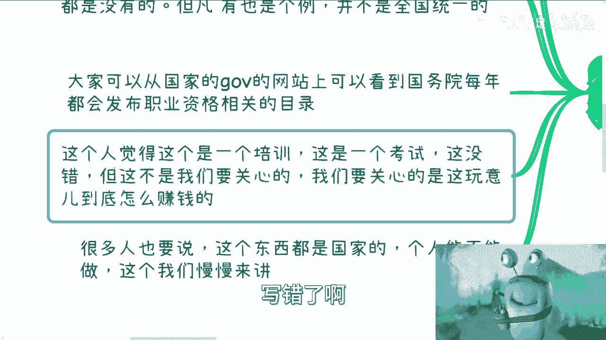

上一节我们区分了官方认证，本节中我们来看看其官方依据。

大家可以从国家版本的网站上查询相关目录。这个东西我们称之为“职业大典”。

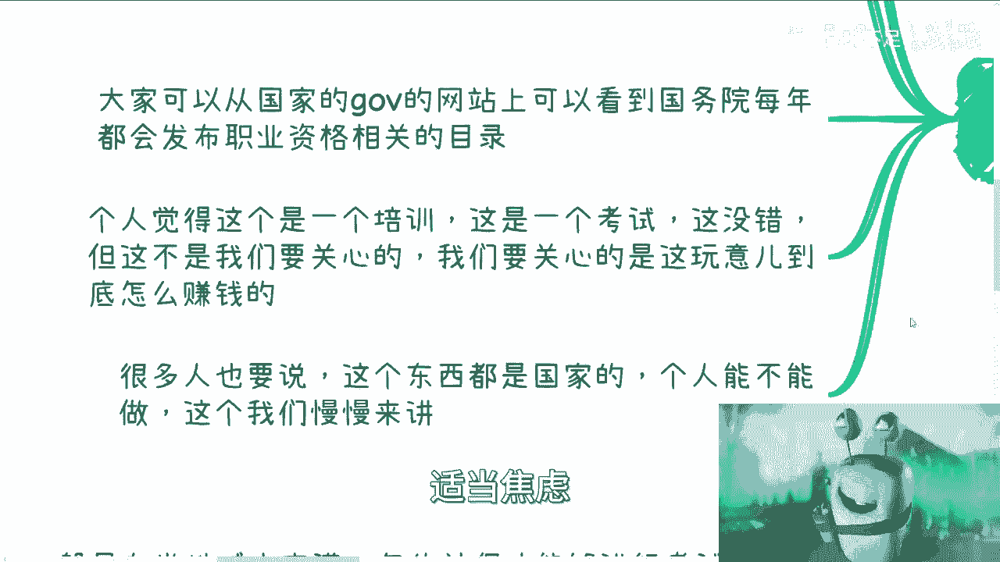

以下是人力资源社会保障部公布的《国家职业技能目录（2021年）》公告截图。

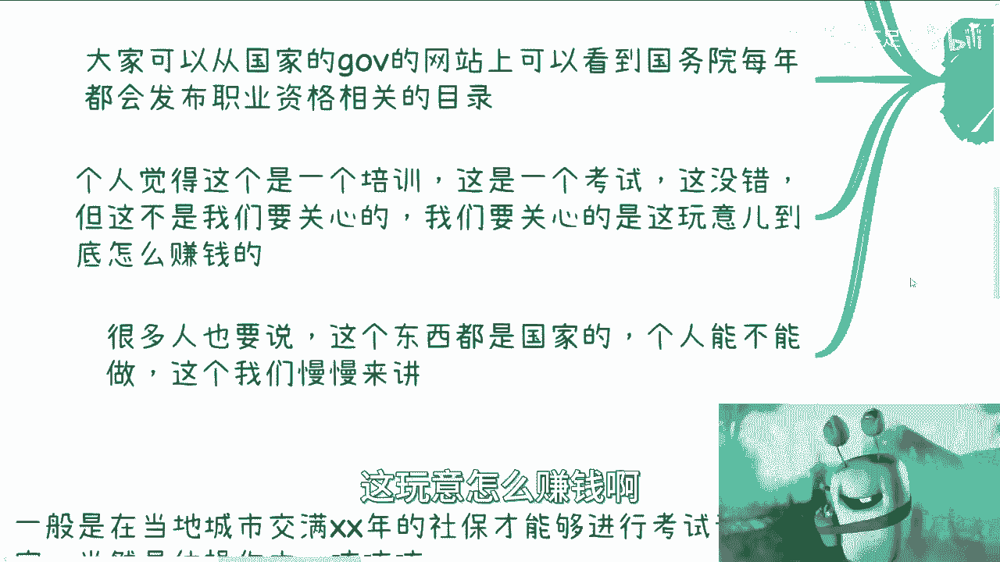

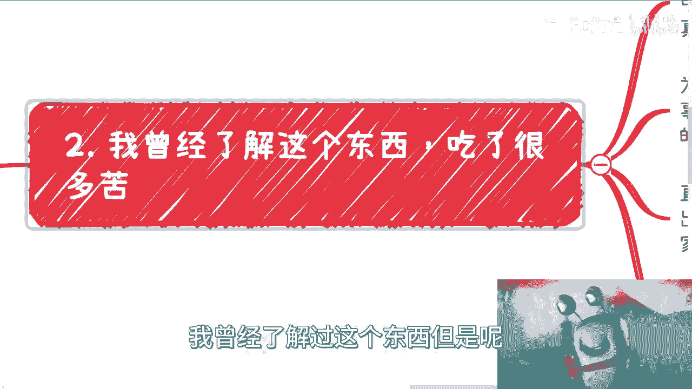

很多人认为这只是一个培训或考试。这没有错，但这不是我们需要关心的核心。就像很多人讨论应届生数量增加，这也不是我们需要主动焦虑的事情。

我们需要关心的是，这个东西如何能创造价值。

---

## 个人能否参与？一个常见的误解

很多人说这个东西都是国家的，个人不能做。这种说法是大错特错的。

我本人曾深入了解过这个东西，但过程非常曲折。我花了超过一年时间，跑了十几个城市，打了无数电话，联系了各种声称做人社部证书的机构。

我无法判断他们是否正规、是否有授权。更令人困惑的是，对于同一件事，不同城市给出的说法差异巨大。大约50%的内容是一致的，但剩下的50%说法五花八门。

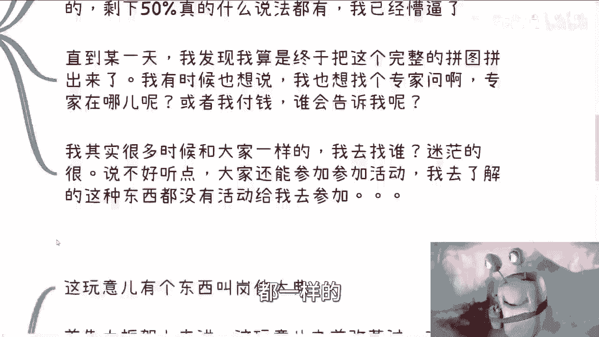

直到某一天，我才差不多把这张“拼图”拼完整。这个过程非常艰难，因为很难找到一个权威的专家或机构进行付费咨询。我和大家一样，在信息获取上处于同等地位。

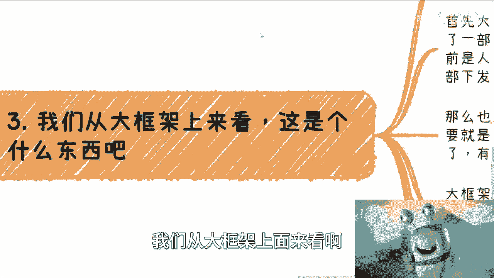

---

## 体系框架与核心规则

上一节我们了解了信息获取的困难，本节中我们从大框架上系统了解这个体系。

首先，这个体系建立在“职业大典”的基础上。该体系已经历过一次改革：一方面取缔了部分证书（如心理咨询师），另一方面将权力下放。

改革前，很多证书由人社部直接盖章。改革后，盖章权基本下放给了授权的协会和当地的职业院校。当然，中国地域差异巨大，一线到五线城市的执行情况可能天差地别，不排除仍有地方由人社部直接盖章。但从改革方向讲，权力已经下放。

获得人社部授权的机构，官方称为“职业技能鉴定机构”，其主要权力是掌握考试资质。至于培训资质，目前比较混乱，有的地方有所谓的合作培训资质，有的地方则没有明确规范。

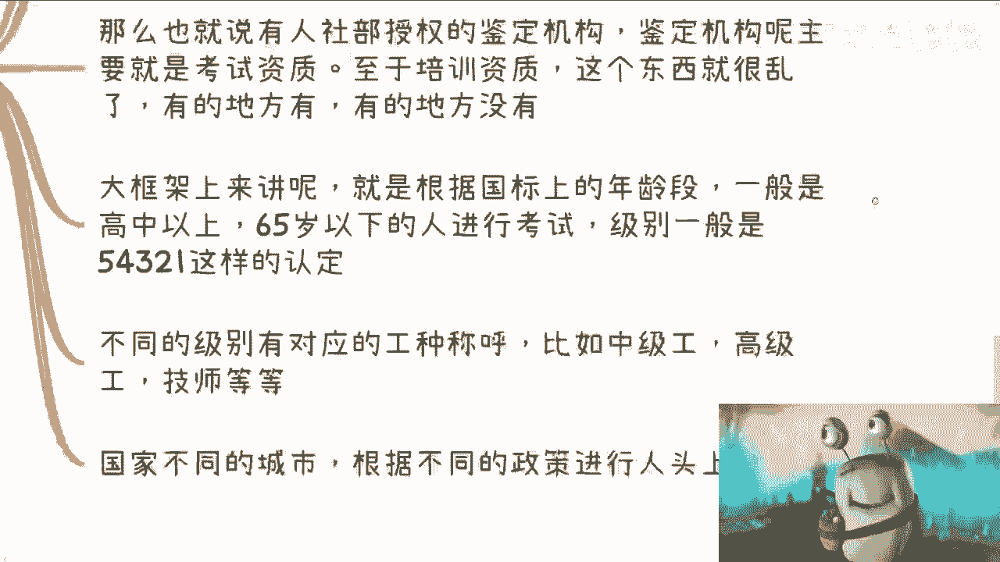

以下是该体系的核心运作框架：

根据“职业大典”，每个职业都有对应的国家标准（国标），这些国标可以在网上公开查到。根据国标，一般对高中以上学历、65岁以下的人群开放考试。

级别一般划分为五级、四级、三级、二级、一级，共五个等级。不同级别有对应的工种称呼，例如：
*   **四级**：中级工
*   **三级**：高级工
*   **二级**：技师
*   **一级**：高级技师

国家会根据不同城市的政策，对通过考试的人员进行补贴。一般来说（因城市而异）：
*   **四级**补贴约为1500-2000元。
*   **三级**补贴在此基础上增加500-1000元。
*   最高级别的补贴可能达到6000元。

关于报名考试，一般要求在当地城市缴纳一定年限的社保，才能进行相关考试认定。当然，在实际操作中可能存在灵活空间。

同时，考试补贴次数有限制。同一个人一年可能只有三次领取补贴的机会（具体次数因城市而异）。正常认定中，不同级别之间通常有工作年限的限制。例如，考完四级后，可能需要间隔两三年才能考三级。具体年限依据不同岗位的国标而定。

每个岗位都可能设有对应的职业技能竞赛。竞赛的好处很多，通常可以直接考取三级证书（正常途径需从四级或五级开始）。部分竞赛的前几名还可能获得奖金或落户政策优惠，这同样因城市而异。

---

## 细节与挑战

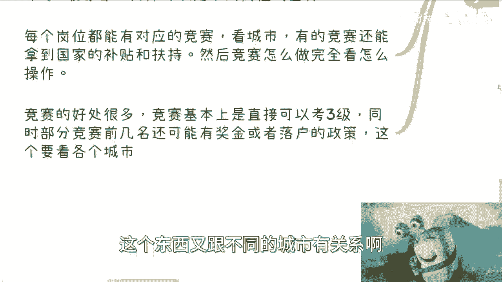

整个大框架涉及众多细节：考试如何组织、国标如何制定、培训如何开展、如何申请鉴定资质等等。这里的门道非常多。

这也是为什么我当初询问很多人却得不到清晰答案的原因——大部分人都只是一知半解，能了解20%就不错了。

所以，能够系统地了解这些信息是很有价值的。大家可以尝试自己去拼凑完整信息，如果能在一年内搞清楚，已经算是很有本事了。

---

本节课中我们一起学习了国家职业技能等级认证的基本概念、官方背景、体系框架和核心规则。这是一个由国家背书、提供补贴的正规职业资格认证体系，个人完全可以参与。虽然其信息分散且存在地域差异，但理解其基本逻辑是第一步。后续课程我们将继续深入更多细节。