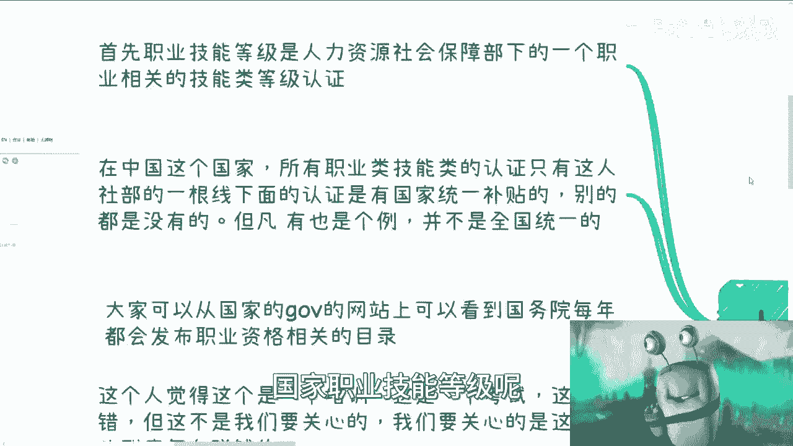
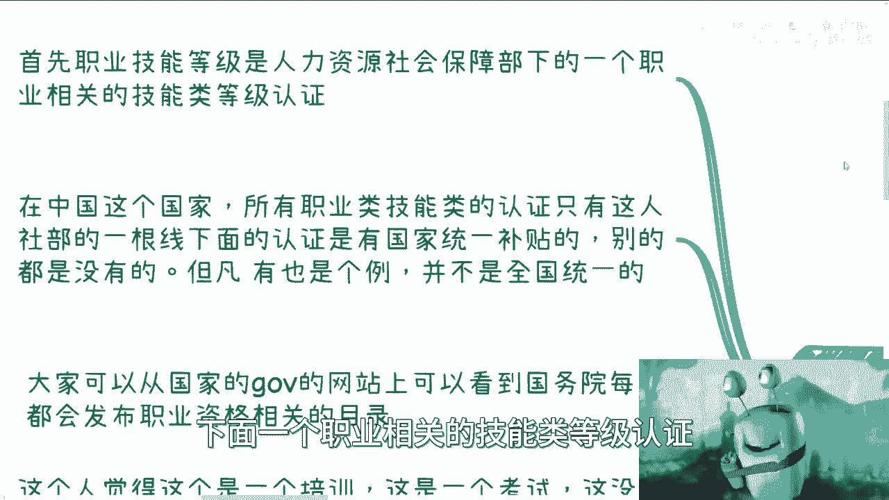
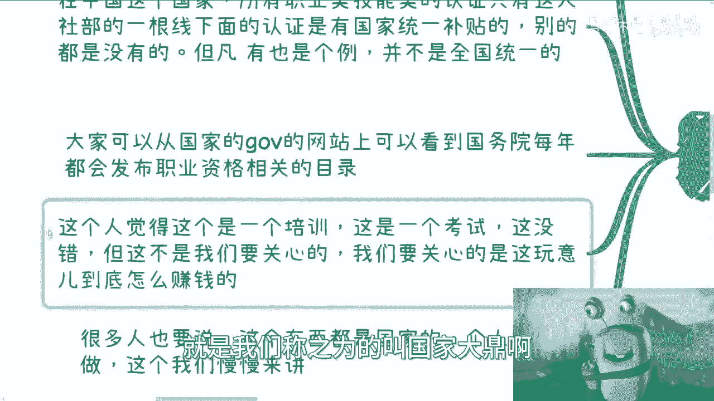
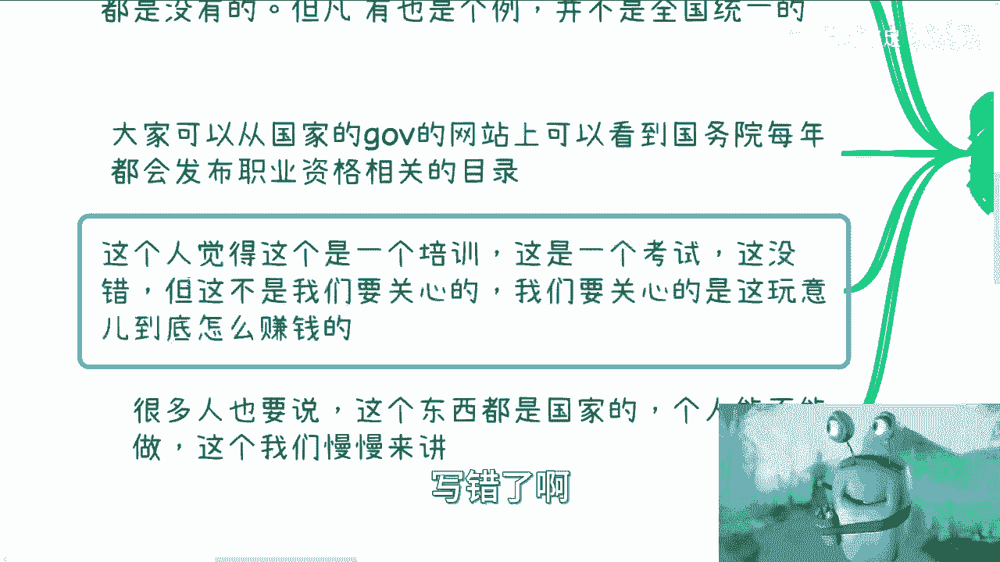
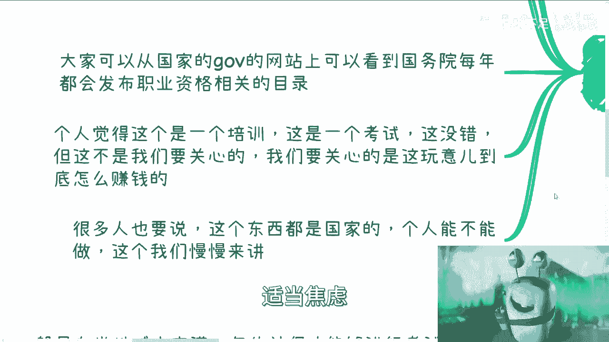
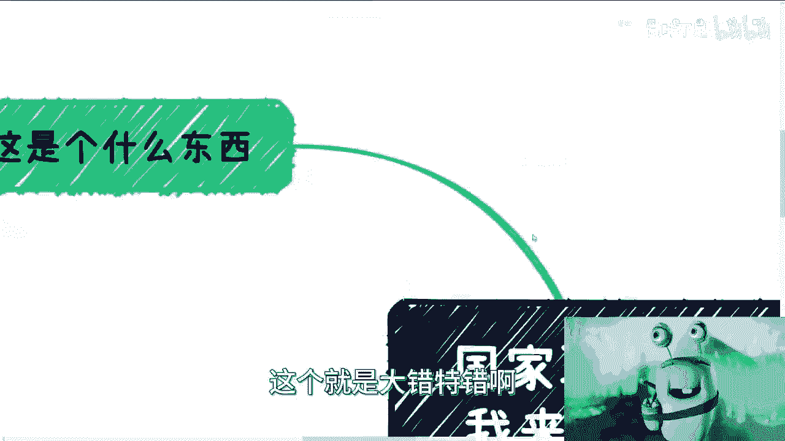
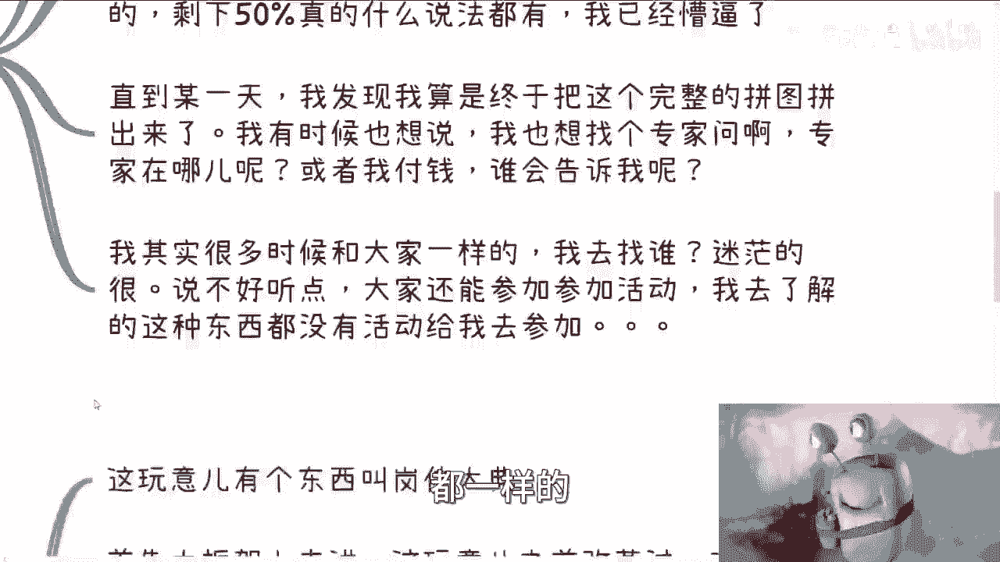
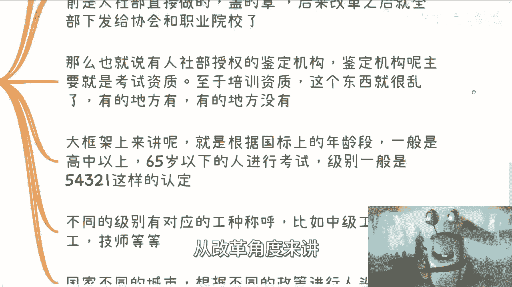
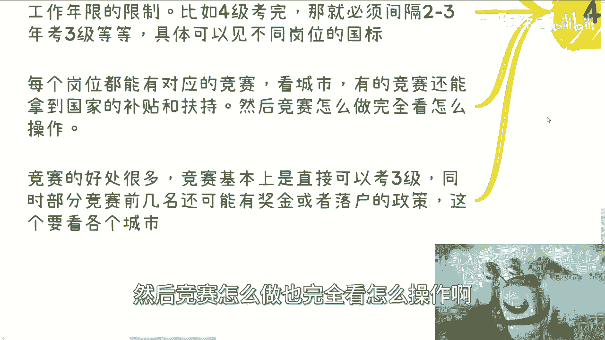

# 国家职业技能等级篇1：我拼这个图花了一年多 - P1 - 赏味不足 - BV1me411d7GJ

啊大家好啊，呃我们新开了一个篇章啊，叫国家职业技能等级片啊，虽然放在叫什么就是充电里面，但是也并不是说所有东西都能讲的啊，我会把能讲的东西先往里面放好吧，首先第一篇呢。

我觉得我来介绍一下这是个什么东西啊，因为很多人他不了解啊。

啊我们先来看啊，首先啊呃国家职业技能等级呢是一个东。

一个叫人力社，人力资源社会保障部啊，下面一个职业相关的技能类等级认证。

那么这个东西呢对于很多人来讲呢，它一方面他对人社会也不了解，第二方面呢他会觉得这个认证啊。

可能中国满满地都是认证，对吧好，那么我们先来看有什么区别啊，在中国这个国家呢，所有的职业类技能类的认证呃，它只有人社部这一根线，下面的认证是由国家统一补贴的，什么意思呢，也就是说这个补贴是以中央为单位。

往下发的一个全局政策啊，他不是说今年有这个东西，明年可能没有了，他他不会的，已经持续了很多很多年了啊，那么从官方的认证角度来讲，有补贴的，只有人力资源社会保障部下面的这么一个东西。

别的呢你说有没有有也有可能有啊，但是但凡有呢，它都是个例，什么意思呢，就比如说今天我帮助打个比方，你说有补贴，那种补贴怎么来呢，可能是我个人给的，也就是说我可能是在培训费里面返给大家，但是我声称有补贴。

但这种补贴跟这个人力社会资源保障部的啊，人社部的这个补贴的不一样，因为你们去领这个补贴的时候，是会从官方的人社部的app上面，有一个专门叫职业类技能等级的，这么一个路口去申请的。

而不是说培训机构就还给你们。

那么大家可以从国家的这个版本的，这个网站上呢，相关的目录，呀呀呀呀，我刚刚吃了很多薯片，妈的都掉地上了，呃相关的目录，那这个东西就是我们称之为叫国家大典啊。

啊不是国家大典，职业大典啊，那么这个我给大家截了个图，你们能够看到哎我不能再放大了，这么大了啊，那么你们能够看到这个东西呢，就是人力资源社会保障部，关于公公布国家职业技能目录，2021年公告对吧。

那么你们也可以看到啊。

那么哎，我写错了啊。

啊很多人呢他会觉得呢这是个培训啊，或者这是个考试啊，这没有错啊，但是呢就是说呃从我角度呢，我还是那句话，这不是我们要去关心的啊，就像很多人昨天看到什么什么应届生对吧，增加了多少多少万对吧。

那这个东西不是我们要关心的，还有人竟然问我，他说还有人经常问我说哎我是不是要适当焦虑，我焦虑还能主动的啊，适当焦虑。

吊也是吊的是吧啊，我们要关心的是这玩意怎么赚钱啊。

那么很多人说呢，这个东西都是国家的个人不能做啊，那我跟你讲这个就是大错特错啊。

慢慢来说啊，第二点啊，我曾经了解过这个东西，但是呢我吃了很多苦。

为什么我就这么跟你们讲啊，我曾经因为这个东西跑，那我跑了十几个城市打，那打了十几个城市的电话，真不夸张啊，真不夸张，然后呢就是各种做人社部的证书的这种机构，那你说正规不正规，我也不知道啊。

你说他们有没有授权，我也不知道啊，那他妈我怎么办呢，对吧啊，然后将近花了多少时间，花了一年多时间，为什么，因为我跟你讲，我发现这是个很神奇的事情，就是说同一个事情。

因为我问的都是人力资源社会保障部下面的，这个这个职业技能等级嘛，对不对啊，然后呢我一年多下来，不同的城市给我的说法啊，呃总结下来就是说把每一个人啊，讲的50%可能是一样的，剩下的50%真的什么说法都有。

就是我去问天津，问南京啊，问问黑龙江啊，问问什么啊，那个济南对吧，问各个地方，就是每个地方的说法都不一样，就我已经懵逼了啊，然后直到某一天呢，我发现啊，我算是差不多啊，我也不能说完整啊。

我差不多把这张拼图拼出来了啊，我有时候就想说啊，就是我也想去找一个专家去问对吧，我也想去找一个人去咨询，我也想去了解到更清楚的东西，那他妈的我去问谁呢，对不对啊，或者是你说我付钱我也可以付钱啊。

我我我找谁来付钱。

你明白吧，就是很多时候我跟你们是一样的，没有什么区别的，我去找谁呢啊，说不好听点，我觉得你们大部分人可能还能参加参加活动，我去了解这种东西，我他妈都就是要人没人要组织，没组织，要机构没机构。

就是我我打过去也不，我都一样的啊。

那么第三点，我们从大框架上面来看啊。

这是个什么东西啊，这玩意呢首先有个东西叫岗位大点叫职业大典，我写错了叫职业大典啊，直接带点呃，然后呢我们从框架上来讲啊，这玩意呢已经改革过一次啊，一方面是取缔了一部分证书。

例如你们很清楚的叫心理咨询师啊，它取代人力资源社会保障部取缔掉的同时呢，就是说呃把权力做了下发什么意思呢，就是说以前的很多证书，它的盖章是人社部直接盖的啊，那么改革之后呢。

全部已经下发给了协会跟当地的职业院校，那当然啊，你问我是不是完全这样子，我跟你讲，中国这个国家我们早就说了，一线到五线城市的区别对吧，一线二线二线三线三线四线，它们之间差别比他妈中国跟美国都要大对吧。

你说是不是完全不知道，那有些地方他就说我他妈还是人设。

不盖怎么了呢怎么了呢对吧，但是我们就说啊，从改革角度来讲。

他已经下发给协会跟职业院校了，那么也就是说有人社部授权的啊，我们官方称之为叫鉴定机构啊，叫职业技能鉴定机构，那么鉴定机构呢，主要的握拳是握的是考试资质啊，至于培训资质，我跟你讲这个东西乱的很啊。

就是说有的地方有所谓的合作培训资质，有的地方甚至就没有啊，反正大家随便搞。

那么大框架上面来讲呢，就是说根据国标啊，因为我们刚刚说啊，就是中国不是有个叫职业大典嘛，对吧，呃每个职业每个职业都有对应的国标，而且这个国标你们网上是搜得到的啊，每个地方都有的，那么根据这个国标呢。

一般来讲啊，他的这个年龄段是高中以下，65岁以下啊，这么一个人群进行考试呃，级别的话一般是划成五四，321这么五个等级啊，那么不同的级别有对应的工种称呼，你们可以在国标上能够找到，比如说啊四级叫中级工。

三级叫高级工啊，二级叫技师，一级叫高级技师等等等啊，那么国家呢呃根据不同的城市，根据不同的政策会进行人头上的补贴，就目前来讲一般啊，我就跟你们说，一般因为每个城市都不一样，就每个市都不一样。

就说呃一般来讲四级可能在1500到2000啊，然后三级的话就往上加，可能加个500，加个1000，有的呢最高那一级是可以达到6000的补贴啊。

就这么个情况，那么对于嗯那个报名考试来讲呢，就是说一般是在当地城市交满N年的社保，才能进行相关考试认定的，那么当然具体操作当中对吧，你们懂的啊，你们懂的啊，那么同时考试呢。

他同一个人呢一年应该只有三次补贴的机会啊，这个我的确没有具体了解过，但是肯定是有限制的，但是每个城市限制是不是三次，我不知道啊，那么同时呢如果正常的进行认定，一般呢是不同级别之间有一定工作年限的限制。

比如说啊四级考完，那就必须间隔两三年之后才去考三级啊，同样的三级考完，可能得得经过45年之后才能考二级啊，这个具体要看不同的岗位国标，因为所有东西是根据国标上来定的啊，那么每个岗位都能有对应的竞赛啊。

当然但是这个东西也看城市，有的竞赛呢，还能拿到这个对应的国家的补贴和扶持，然后竞赛怎么做也完全看怎么操作啊。

这个回头我可以再给你们再再再拓展，再说一下啊，那么竞赛的好处呢有很多，也就是说竞赛基本上都是可以直接考三级的啊，呃如果正常你只能从从四级或者五级开始考，那么同时呢部分的竞赛前几名呢。

还有可能能够拿到奖金或者所谓的落户政策，这个东西又跟不同的城市有关系啊，那么整个大框架啊。

我觉得先跟你们讲这些啊，那么在这里面细节很多很多，你想想看有考试对吧，国标到底怎么来的啊，考试到底怎么考啊，培训到底怎么培训的，这个当中到底在如果我要去申请资质，怎么申请对吧等等等等等。

这里面的道道很多，这也是为什么我说我当时就是问很多人问出来，根本就问不出所以然来，因为大部分人都是一知半解啊，你不是说一知半解了，它能吃他妈20%就不错了啊，好吧，唉所以啊我觉得啊就是我说啊。

你们还是比较幸福的，因为毕竟这个我还愿意说啊，你们可以出去问问看，真的，你们可以出去问问看，你们去拼拼看，我觉得如果你们在一年内，一年多能够把这东西完整的拼出来，我觉得已经算你们本事很大了啊。

行那么这个第一期就先这么着好吧，嗯回头我再慢慢给你们补啊，然后大家反正有什么要问的，要咨询的，或者商业上有什么不清楚的对吧，合同要审核的或者等等等好吧。

