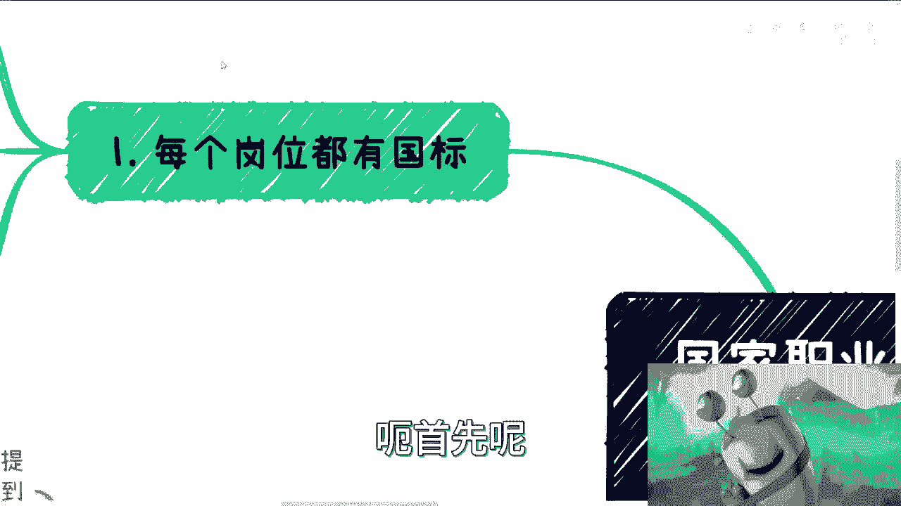
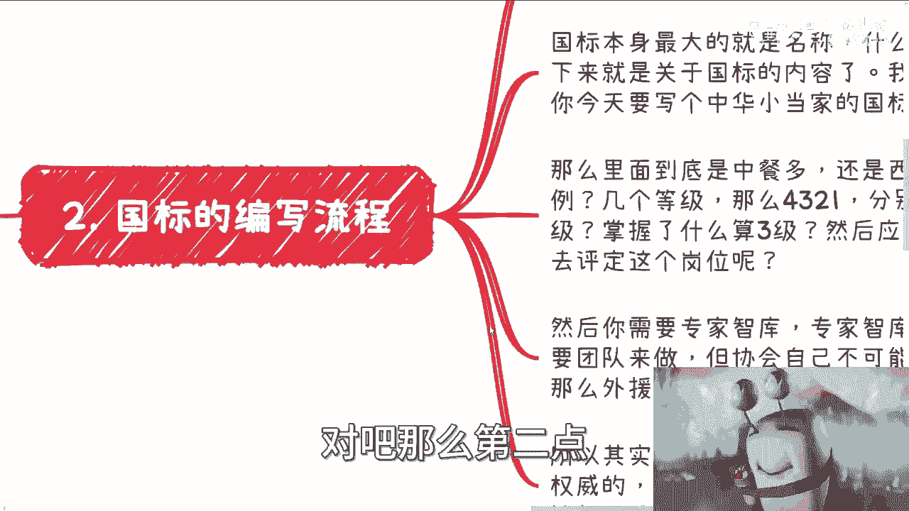
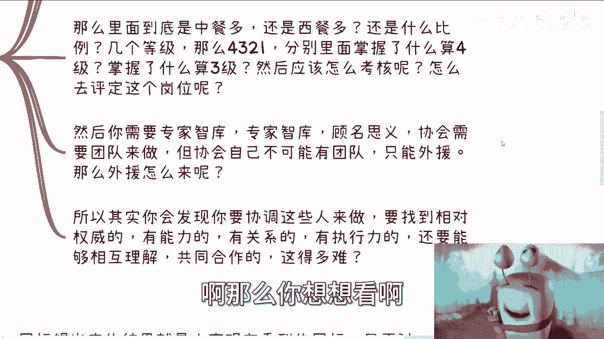
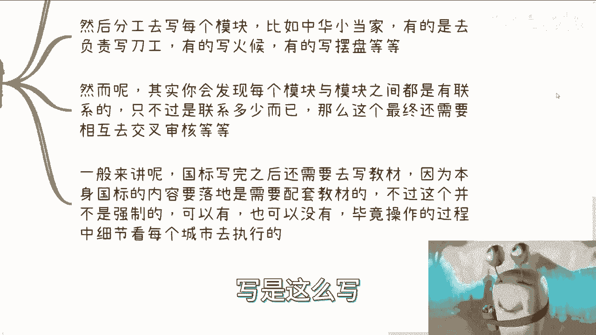
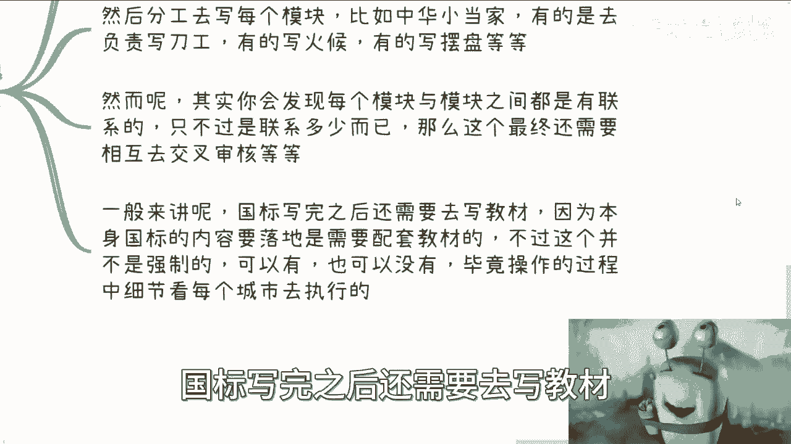
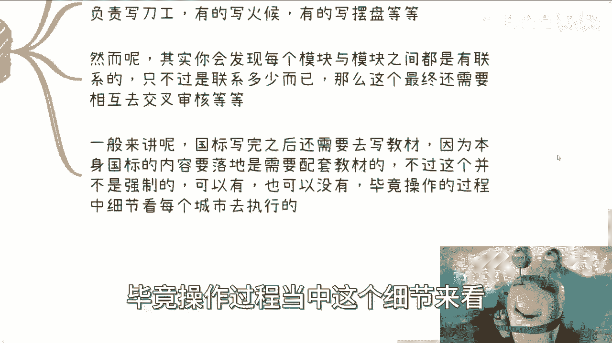
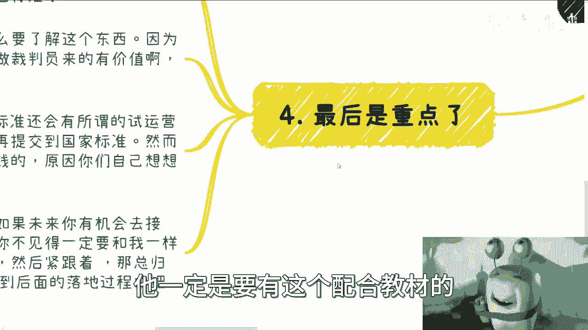

# 国家职业技能等级篇2：各个岗位的国家标准落地流程 - P1 - 赏味不足 - BV1sg4y1Z7zZ

啊大家好啊，这个来更新第二个啊，就我刚刚在动态上发了个图啊，因为我正好在写这一篇嘛，然后我就去翻照片了，就翻了一下我以前写国标时候的照片，哎呀也真的是想想时间过得很快啊，呃我们这一期来说的。

就是说各个岗位这个国家标准落地的一个流程，唉其实我其实也不是了解很多，毕竟我就参与了一个，而且还是在北京呢对吧，其他地方怎么操作，我也不知道啊，啊呃首先呢各个岗位呢他都有国国标啊。

就我们上次说的岗位大点啊，直接大点呃，所有的这个岗位都有国标，他都是配套的一对一的这么一个公开的一个PDF，你们都可以在国家呃，人这人力资源社会保障部，这么一个公开的一个政府网站上。

你肯定能搜到所有的这个国标的啊，你在上面呢也可以看到所有的这个国标的，这个岗位的这个等级划分，包括编写人员啊，这个造不了假啊，然后等级的要求呢，以及不同等级的考试要求等等等，反正都在里面啊。

呃国标呢就是其落地的根本啊，包括培训，包括考试就是规定啊，他呢并不是一个强行的东西，什么意思呢，就是说因为就像我们说的国标，国标，它只是一个标准嘛对吧，那你落地啊，各个方面其实是有可变通性的。

不是说啊今天中央出一个标准对吧，各地方落地，你说是完全百分之百符合，不不见得打，他可能有一些就是比如说什么年龄段啊对吧，或者说什么什么，比如说从业资格啊，从业要求啊，他可能这个东西它是可以完全的去呃。

叫什么就是遵守的啊，但是你说里面那些内容那不一定啊对吧，那个地方可以有些小的变动啊对吧，甚至有些大的变动都可以，你只要不要偏离主心骨就可以了啊，那么在不同城市呢，无论怎么落地，它都是离不开国标的。

但是它更多的就是一个呃参考参考价值，那么国标的申请呢都是以协会为单位的啊，基本上也都是省级协会或者市级协会，就直辖市啊，或者怎么样就会有啊，但具体这个可能会改变，这个怎么说呢，因为中国地方太大对吧。

每个地方不知道啊，真真不知道，反正玩法很多，我跟你讲啊，就像我上一期说的，就是这个拼图我拼了一年半，为什么会拼一年半，就是因为太杂哦，那么这个国标的申请呢没有办法个人操作啊，这是一个板上钉钉的事情啊。

你呃但是其实呢我要告诉你们，就是说协会本身也只不过只不呃，就只不过就是个容器，也就是说呃也就是说你其实是可以，就是你像我一样，因为我也是个人啊，对不对，你其实可以像我一样去参与进去。

但是呢你还是要绑在就是跟一个协会打好关系，就绑到这个协会里面去对吧。

那么第二点，你比如说国标的编写流程啊，国标这个东西申请本身并不难啊，没有难点，因为你要这么想，作为人力资源社会保障部啊，作为整个的原本的一个这个流程之一，你只要合法合规合理，你提交一个国标。

你说我要做申请，我要怎么样子，他没有理由一开始来拒绝你，除非是你这个东西写的太烂对吧。

所以说难点并不在于这个协会本身，去申请这个国标啊，你比如说嗯稍等啊，就是你比如说啊，你说我们现在去申请一个叫数字经济，什么什么什么什么东西，国标可不可以，当然可以对吧，因为这个东西很符合国家的发展。

也很符合未来的这个定位对吧，但是有一个问题啊，就是你的材料怎么写，你知道吗。

这个也是很大的问题，包括就是说呃今天是第二个嘛，对不对，我后面会跟你们说那个那个鉴定中心等等等，那鉴定中心也有材料，材料也很复杂哦，那么国有本身最大的就是名称啊，包括什么领域啊，什么名字啊对吧。

接下来就是国标的内容对吧，我给你们举个例子，比如说虽然我写的是区块链，但是我尽量就不先不说区块链了，因为可能比较比较很多人不是很了解你，就比如说我们今天写的是中华小当家对吧，这个国标啊。

那么你里面比如说哎，你这个国标到底是中餐多呢，西餐多呢，还是说是是是是哪哪哪个，哪个哪个地方的这种这种特色菜多呢，如何才多呢对吧，然后比如说这个还是说海纳百川对吧，但是如果海纳百川的话。

里面什么比例对吧，因为你写这个东西啊，你会发现它里面问题很多，因为如果你今天说中餐多或者只写中餐那么好，那么人家就说了，那他妈的中国排外对吧，那你在中国弄这个国标，你不能不融合，那你说那融合太多好。

那人家另外一个专家也不同意对吧，就是说你在这里面去定对吧，比如说几个等级啊对吧，然后里面每个等级到底怎么掌握啊对吧，掌握哪些技能啊，然后掌握了多少算三级，掌握多少算四级，怎么掌握多少算二级对吧。

然后后面应该怎么考核啊，怎么去评定这岗位啊啊你要达成一致很难啊，我跟你讲几乎不可能啊，啊然后你要需要专家智库，所谓专家智库，顾名思义就是协会需要有团队来做这个东西，但是往往协会不可能自己有团队啊对吧。

那么他只能找外援，那么外援怎么来呢。

你想想看啊，所以说其实你会发现啊，你要协调这些人来做，你要找到对应的权威的，有能力的，有关系的，有执行力的，还要找到明事理的，相互理解的，不会吵起来的哈，共同合作的，你想想这得多难啊。

你想想这得多难对吧，因为你要这么想啊，你写的一个东西一定是在职业大典里面没有的，而在职业大典里面没有的，一定也是一个新的东西，因为所有的整整个社会从头到尾，这整个世界它都是博弈论。

就是说你今天但凡写的不是一个新的东西，它就一定会有人在你之前去做，你不可能是第一个人对吧，而且你但凡去做了，也有你的竞争对手啊，你真的去做了，你就知道了哦，整个中国就他妈你一个协会在做，可能吗。

可能吗对吧，不可能我就告诉你啊，所以说就是说他所有都是博弈论，而如果来说你真的要去做一个全新的东西，那么你又要去找到有全局观，有大局观，有了解的这些人。

能够把这些东西写出来的，同时能够一直执行下去的。

而不会出大纰漏的这些人，而且还要拥有权威性，要有相互理解的，这什么概念，你们想想看，对不对啊。

那么第三要做的工作啊，国标所得出的产物就是你们看到的这个PDF呃，只不过就是说我们要去知道的，就说难是难在这个PDF的0~1，因为整个PDF从一开始就是没有框架的，如果今天比如说我们有个框架。

大家往里面填内容，那还好说他从一开始就没有框架，这个框架就是需要我们去讨论出来怎么划分，怎么定义，然后每个人去分工写每个模块，比如说中华小当家这个国标对吧，有的人去写啊，刀刀工，有的人写火候。

有的写摆盘，有的人写写，甚至写，比如说怎么去切菜对吧，呃不是切菜怎么去选菜，怎么去，比如说这个这个这个这个洗盘子对吧，怎么怎么去洗锅对吧等等等，你各种各样的东西都要都要有啊对吧，各种边角料你都要有啊。

然而呢你会发现每个模块与模块之间都有联系，甚至你不要说每个模块与每个模块之间有联系，甚至说你今天比如说做中华小当家对吧，好，你可能发现还有另外一个另外一个国标叫什么，叫做什么什么切菜对吧。

什么面点师对吧，什么东西，卧槽这他妈也有关联对吧，你这个东西不能跟那个东西矛盾吧，对吧好，所以说你会发现很多东西呢，他说是这么说写是这么写。

但是它所涉及到的面很广，一般来讲啊，国标写完之后还是要去写教材。

因为本身国标内容是需要落地，并且配套教材的啊，不过这个呢就我后面了解的，它并不是强制的，也就是说呃，国标的执行协会跟最终编写那个教材的，这个主体单位可以不是一个啊，也就是说它可以有也可以没有啊。

毕竟操作过程当中这个细节来看。

每个城市去执执执行的，但是从本身国标本身来讲，它一定是要有个这个配合教材的。

那么最后呢就是重点啊，重点是什么呢，就是国标是分情况的，也就是说根据不同的岗位的定位，以及不同提交审核的协会等级不同，有些地方的标准，然后到了国标，有些直直接就是国标啊，也就是说它有一些是适应性啊。

对有些可以直接就是国标啊，这个东西是跟提交的这个岗位不同，和及其等级不同有关的，那么有的人要问了，他说那我们为什么要了解这个东西啊，很简单，因为如果未来有机会，你要这么想啊，你肯定是做裁判员有价值。

而不是做运动员有价值，你明白吧，当然我咱们不是鄙视运动员，不是歧视运动员，对不对，但是就这么个道理啊啊那么根据我了解到的啊，有些地方标准呢还会有所谓的试运营时间，可能会有一到两年甚至一到3年。

然后再提交给国家标准，当然啊，并不是说你试运营一到两年到3年，提交给国家标准就一定会通过啊，有可能他最终还是地方标准啊，但是根据我了解的情况啊，这个一到两年或一到3年可能是最赚钱的时候。

原因你们想想看啊。

你们想想看，我就不说了，我觉得聪明的小小小伙伴都想的出来啊。

国家标准这个事吧，我跟你讲看契机，因为你未来如果有机会去接触呢，呃其实我是觉得呢，你不见得一定要跟我一样去去写，诶，你可以顺口问一嘴，就是比如说你至少第一时间知道对吧，然后你紧跟着。

然后呢你跟着这个国标的生成啊对吧，落地呀对吧，怎么样子，那最终你你中终究有更多的机会参与到，那个背后的这个落地的那个项目当中去对吧。

因为你只有尽可能的去紧跟着你，才有赚钱的机会啊，你只有紧跟着你才有信息差异，有信息差距才能赚钱啊，对不对，没有别的方法的啊，所以说这个东西呢有很多人要说了啊，这个东西老百姓切入不了或者怎么样子。

有什么切入不了，谁不是老百姓啊，啊我真说不好听点，你你们去看看我动态上就发的这张图对吧，就是就是他除了有些讲解，是一些专门的这个指导单位对吧，就是人社部，包括这个这个叫什么出版社，那剩下的我就这么说啊。

就剩下的真的去干活的，落地的对吧，你们把国标拿出来看看哪个不是老百姓，啊啊哦哦哦哦还有还有政治地位的，没有的呀，对不啦，没有，就是很多东西不要自己PUA自己好吧，哎呀行，那这个二呢我觉得就讲这么多。

反正大家都有个概念哦，这个东西真的要去做呢，不是那么容易的，也得看你们资源到不到位，看谁会资源到不到位哦，也看来的人拎不拎得清，我就只能这么说，天时地利人和一个不能缺，好吧行，反正先这么说吧，好吧。

