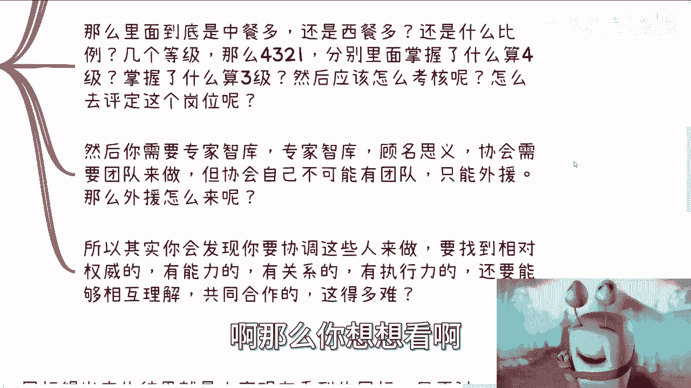
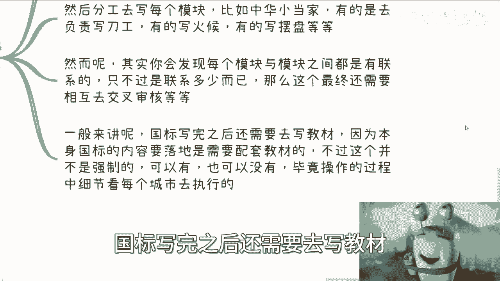
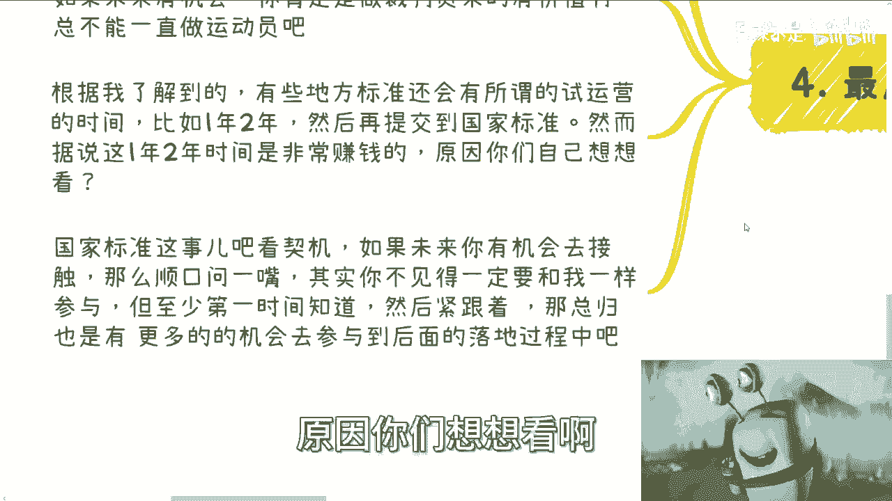
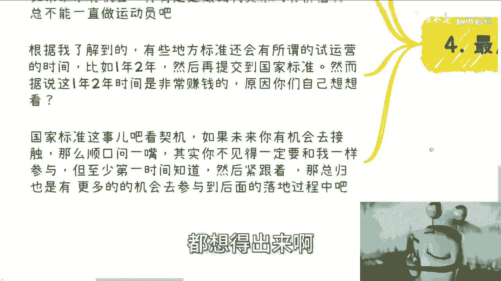
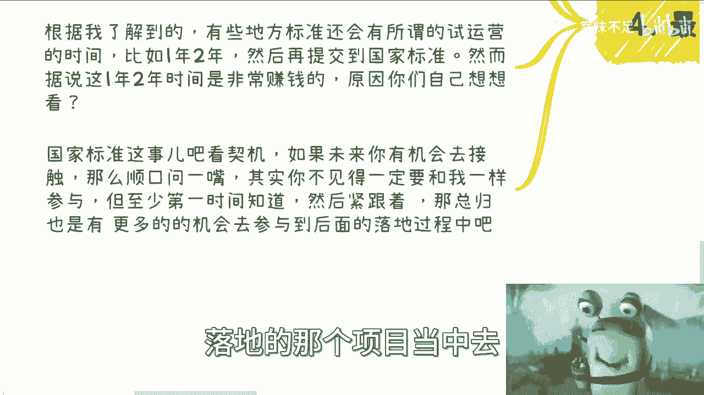

# 国家职业技能等级篇2：各个岗位的国家标准落地流程 📋

在本节课中，我们将学习国家职业技能标准（简称“国标”）从制定到落地的具体流程。我们将了解国标是什么、如何申请、编写过程中的挑战，以及它最终如何转化为可执行的培训和考核体系。

---

## 国标的存在与获取方式

上一节我们介绍了职业大典和岗位分类。本节中我们来看看每个具体岗位对应的国家标准。

所有岗位都有其对应的国家标准。这些标准是一对一配套的公开PDF文件。

你可以在**人力资源社会保障部**的官方网站上搜索并下载到所有国标文件。在这些文件中，你可以看到：
*   该岗位的等级划分。
*   标准的编写人员名单（具有权威性，无法造假）。
*   每个等级的具体要求。
*   不同等级的考试要求。

---

## 国标的性质与落地灵活性

国标是培训与考试的根本规定。但它并非一个强制性的、不可变通的指令。

因为国标本质上是一个“标准”。在各地实际落地时，可能存在一定的灵活性。例如，在年龄、从业资格等硬性要求上必须遵守，但在具体培训内容、考核细节上，地方可以根据实际情况进行适当调整，只要不偏离国标的核心主旨即可。

无论在哪个城市落地执行，都离不开国标作为基础，但它更多地是起到一个**参考**作用。

---

## 国标的申请主体与个人参与方式

国标的申请单位是**协会**，通常是省级或市级（包括直辖市）协会。具体规则可能因地域广阔而有所不同。

国标申请**无法由个人直接操作**，这是一个明确的规定。

但是，协会本身可以被视为一个“容器”。个人完全可以像我一样参与进去。关键在于你需要与一个协会建立良好关系，并作为其团队的一部分来开展工作。

---

## 国标编写的核心难点

国标申请本身并不困难。只要你的申请合法、合规、合理，主管部门没有理由一开始就拒绝。

真正的难点在于**国标内容的编写**。这涉及到大量复杂的材料准备。例如，以申请“数字经济分析师”国标为例，虽然方向符合国家发展，但具体材料如何撰写就是一大挑战。

以下是编写国标时面临的主要难题：

*   **标准名称与领域界定**：需要精确界定职业的边界和范畴。
*   **内容框架与比例划分**：例如，编写“中式烹调师”国标，需要确定中餐、西餐、地方菜系等内容的比例和侧重。比例划分需要取得广泛共识，非常困难。
*   **等级与技能定义**：需要明确划分几个等级，以及每个等级具体需要掌握哪些技能、掌握到什么程度。例如，掌握多少技能算三级，多少算四级。
*   **考核评定方式**：需要设计出公平、可操作的考核与评定方法。

要就以上所有问题达成一致**极其困难**，几乎不可能一次性完成。这需要依靠“专家智库”——即一个专业的编写团队。然而，协会自身往往没有这样的团队，需要寻找外援。

协调一个合格的专家团队异常艰难。你需要找到的人员需同时满足以下条件：
*   在领域内具有权威性和能力。
*   拥有良好的执行力和人际关系。
*   具备大局观，能够相互理解、共同合作，而不是争吵不休。

此外，编写一个全新的国标意味着你进入的是一个“博弈”场。你不太可能是唯一在做这件事的协会，必然存在竞争者。同时，你要编写的内容在《职业分类大典》中没有先例，这要求编写者不仅要有深刻的行业理解，还要有开创性的框架设计能力。

---

## 国标的产出与后续工作

国标编写工作的直接产物就是大家看到的那个PDF文件。从0到1创建这个没有现成框架的文档是整个过程最艰难的部分。

编写时，团队需要分工协作，每人负责不同模块。但各模块之间紧密关联，甚至还需要考虑与其他现有国标（如“面点师”、“切配工”）的兼容性，不能产生矛盾。

国标编写完成后，通常还需要配套编写**教材**，以便标准能够落地实施。不过，根据我后来的了解，编写教材并非强制要求。执行国标的协会和编写教材的主体单位可以是不同的机构。

因此，是否有配套教材，取决于各地在实际操作中的细节安排。但从国标本身完整性的角度出发，它理应配有相应的教材。

---

## 国标的类型与机遇

最后一点至关重要：国标是分情况的。

根据岗位的定位和提交申请的协会等级不同，有的标准会先成为**地方标准**，运行一段时间后再升级为国家标准；有的则可以直接申请成为**国家标准**。

那么，我们为什么要了解这些呢？原因很简单：成为“规则制定者”（裁判员）通常比单纯作为“技能执行者”（运动员）拥有更大的价值和影响力。这并非歧视，而是现实。

据我了解，一些地方标准会有**1到3年的试运营期**，之后才提交申请为国家标准。当然，试运营后也不保证一定能升级。

值得注意的是，这**1到3年的试运营期，可能是商业机会最大的时期**。原因大家可以思考一下：在标准尚未完全定型、普及度不高时，提前布局意味着拥有信息差和先发优势。

接触国家标准是一个看契机的事情。未来如果有机会，你不一定要亲自参与编写，但至少应该保持关注。紧跟国标生成、落地的全过程，你将有更多机会参与到背后相关的培训、认证等项目中。

只有尽可能紧跟着趋势，才能抓住赚钱的机会。**信息差是盈利的关键**。不要认为普通老百姓无法切入这个领域。看看国标编写人员名单就知道，除了少数指导单位的专家，大部分具体落地执行的人都是行业的从业者。不要自我设限。

---

## 总结

本节课中，我们一起学习了国家职业技能标准的落地流程。我们了解到：

1.  国标是公开可查的岗位执行标准。
2.  其落地执行存在一定的灵活性。
3.  申请主体是协会，但个人可以通过合作参与。
4.  编写的核心难点在于内容的共识达成与框架创建。
5.  国标通常需要配套教材，并分为地方标准与国家标准两种类型。
6.  关注和参与国标进程，能带来重要的信息优势和商业机遇。

总之，推动一个国标落地绝非易事，需要**天时、地利、人和**，以及充足的资源和清晰的团队协作。