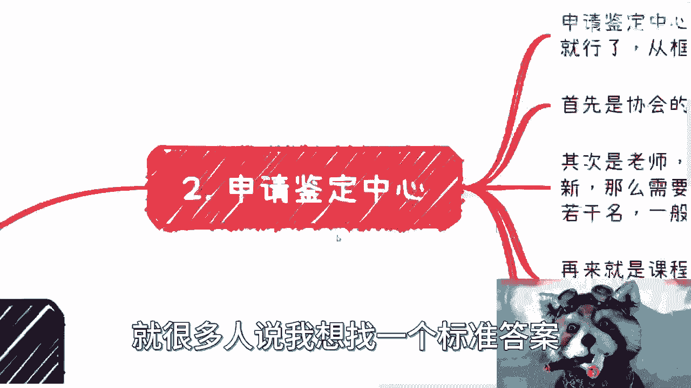
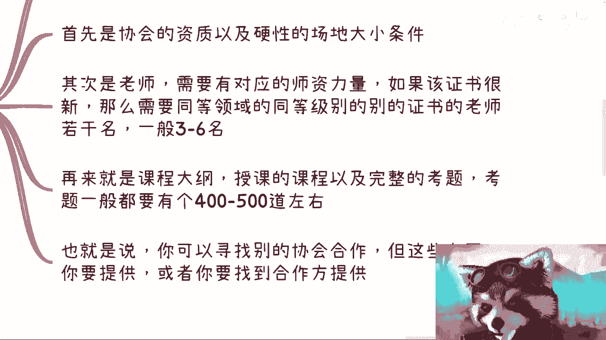
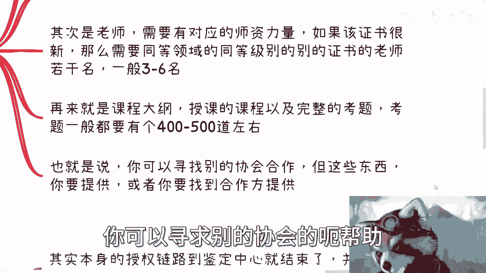
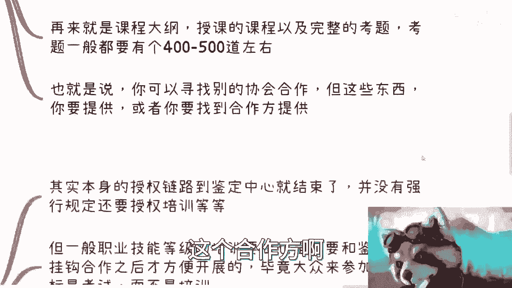
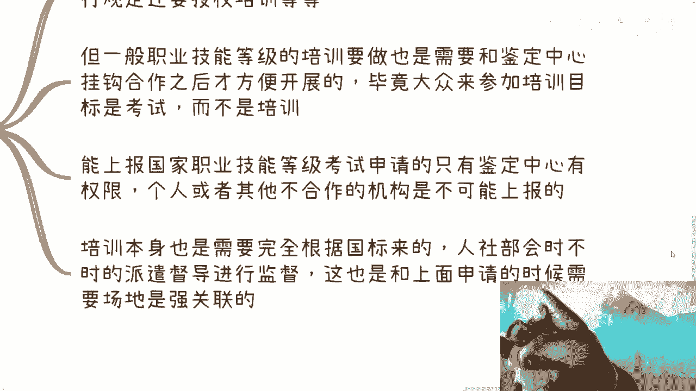
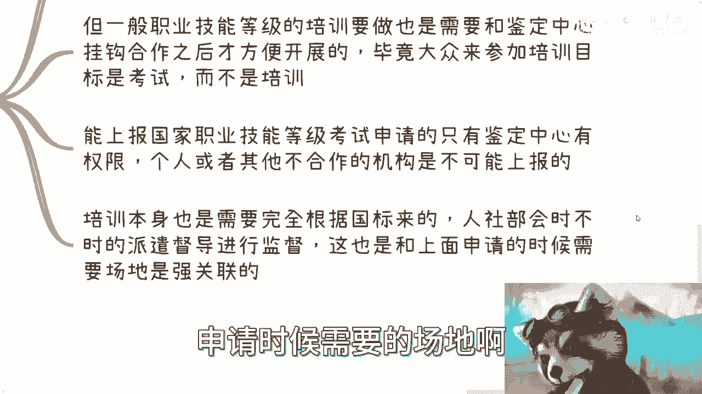
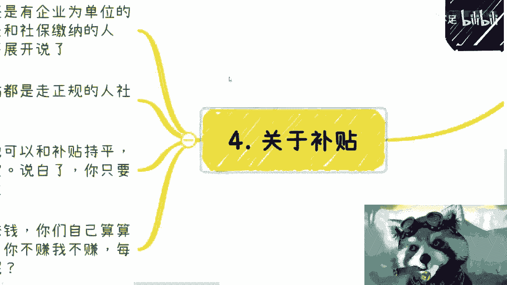
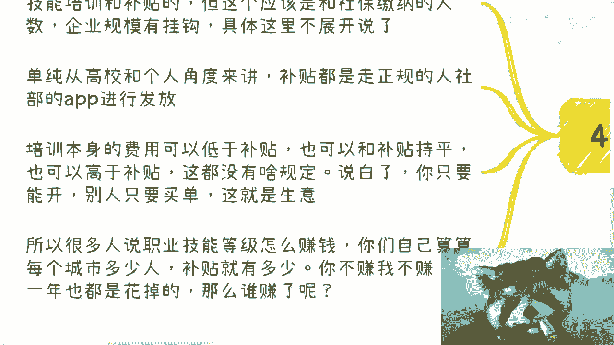

# 国家职业技能等级篇3：鉴定中心、培训以及补贴申请 - P1 - 赏味不足 - BV1rG411671V

大家好，我们继续来这个叫什么专辑啊，嗯嗯这一期是三啊，就鉴定中心跟培训以及补贴啊，那么首先鉴定中心啊，一般来讲职业技能等级当中的这个鉴定中心呢，在呃政府网站上面都是公示的啊，你们在中国各省市区啊。

网上能够搜得到的，这个职业技能等级的鉴定中心，基本上也都是在政府网站上面做，披露的啊，那么我们日常说啊，要去合作的这些合作方，也也都是在这些上面做这个公式的啊，才能去合作啊。

不要找这种什么各种各样的这种野鸡机构合作，那首先这是第一个啊，第二个呢很多小伙伴问两个问题，他说自己能不能成为这个鉴定中心啊，以及啊，你跟这个鉴定中心合作有没有什么门槛啊，呃其实本质上来讲呢。

在前两年人社部改革之后，所有的权利都做了下发，基本上呢就是说全部都给到了，这个行业或者产业协会啊，呃这也是为什么你们在这个国家的这个，网站上面看到很多披露的这些嗯，这个单位都是以协会为主的。

那么个人跟企业是不可能成为这个鉴定中心的，那么当然你说合作有没有门槛这个事情呢，我觉得本质上这是一门生意，那就看你怎么谈呃，目前跟鉴定中心的合作无非就三种，就是呃你要么帮鉴定中心招生。

你要么做鉴定中心的老师啊，或者你就是咳咳就负责所有的，那你说我既做培训啊，也做招生，那么鉴定中心呢呃给你个授权，那么你可以分鉴定中心，比如说15%到20%，甚至25%的收授权费啊，这个东西你看怎么谈啊。

没有一个定论啊，就很多人说我想找一个标准答案。

没有标准答案，那么第二就是关于申请这个鉴定中心。

申请鉴定中心呢一般会有整套的材料啊，跟着呃就是那个word啊，跟着他的材料要求走，你就可以从框架上来讲呢，呃这个材料上面呢还是会有一些硬性的要求，首先第一个就是这个协会的资质。

你不可能是你不可能是就是说啊。

这个阿猫阿狗都来申请啊，那么首先他协会会要求，就比如说你是一级啊，省一级啊对吧，或者说咳咳咳咳咳，协会本身要有一定的资质，那么包括就是硬件上面啊，场地的大小啊，要多少平啊对吧，能不能上课啊。

那么其次是老师需要有对应的师资力量，正常的啊，以前做鉴定中心的，他要求的都是那种教师资格证，那么现在呢有很多新的岗位呢，它是属于那种嗯，一方面除了教师资格证以外，你还需要这个该证书的。

比如说你现在有一个新的岗位，那么你需要该证书的，比如说呃二级的这个证书拥有老师两名啊，三级的证书用那个英语老师两名啊，那么他会有这种要求，那么如果来说这张证书很新啊，他还没有什么没有开放二级。

或者来说也没有开放三级，那么它就需要同等领域的，比如说你现在呃考的是区块链啊，那么你区块链还没有对吧，呃可能整个中国都还没有，那可以用什么呢，用互联网啊，或者用计算机用晚安啊，这边同领域的同等级的啊。

别的证书，比如说二级啊，三级啊，这个老师啊若干名啊。

来做这么一个这个这个申请，那么再来就是课程大纲授课，需要这个完整的这个课程啊，包括大纲以及完成的这个考题，一般来讲这个考题呢要有400~500刀左右啊，那么也就是说你可以寻求。

就是比如说你今天想做这件事情，你可以找别的协会来帮你套个壳啊，你可以寻求别的协会的帮助。

但是呢这些东西你要提供啊，或者你得找到能够提供的这个合作方啊。

那么第三个就是关于这个培训事项啊，呃在整个授权链路当中啊，鉴定中心是由啊这个人社部进行授权的，呃但是到了鉴定中心这一层就结束了啊，没有强行的规定说啊，这个授权还有所谓的培训，而是比较少的嗯。

但是一般呢职业技能等级的培训呢要做，也是需要，或者说一定是需要跟鉴定中心挂钩合作，才方便展开的，为什么呢，因为大众啊来考这个东西，大部分的这个，大部分的这个目标啊，他不是来培训的啊，他也不是来考试的啊。

他主要就是来拿补贴的对吧，那么拿补贴的前提是什么，拿补贴的前提是要考试考过啊，那么考试本身能上报国家职业技能等级呃。

OSTA这个系统的啊，有这个账号权限的，只有鉴定中心啊，别的都没有，那么也就是说，你个人或者其他的，那些与鉴定中心不合作的机构，他是不可能上报的，因为他连这个账号都没有，他怎么上报呢对吧。

那上报不了就不能考试，那不能考试，对于大众来讲，他报这个培训就没有意义对啊，那么培训本身呢，也是需要完全根据这个国标来的啊，这个比如说四级多少课时啊，三级多少课时啊，啊。

那么人社部呢也会时不时的派遣那种，这个叫什么啊，督导组啊，这种督导飞行调查员啊进行督导，那么这也跟上面申请的时候，就是我们刚刚在二这个地方所写的申请的时候，需要的场地啊。

需要的这个课时数啊，它是强关联的。

那么最后一点就关于补贴啊，除了一些企业为单位的，人社部呢，还是可以以企业为单位做技能补贴呃和培训的，但这个东西呢据我了解啊，他应该是跟企业的社保缴纳人数，企业的规模会有挂钩，比如说起码是200人以上啊。

具体这边就不做展开，这个东西，不在我们这个这次这个内容的讨论范围内，那么单纯从高校跟个人角度来讲，补贴都是走正规的人社部的app进行发放，那么培训本身的费用可以低于补贴啊，也可以跟补贴持平啊。

也可以高于补贴呃，也就是说培训本身的费用他没有什么规定啊，你要是低于补贴呢，那老百姓还能赚点钱啊，你要是持平补贴呢，就等于平均平出，你要是高于补贴呢。

那你就再多让老百姓贴点钱对吧，那说白了你只要能开啊，别人只要买单就可以了，这就是个生意啊，呃所以说呢很多职业技能等级你说怎么赚钱，你们自己算算每个城市多少人啊，补贴就有多少，你不赚我不赚啊。

每一年这点钱其实也是花掉的，那那我就请问嘛，那谁去赚了，对不对啊，所以说啊就是说回到这个地方，就是呃这个东西的信息差，我觉得主要在于说，第一是大部分人不知道职业技能等级，第二呢是他知道了。

他也觉得跟自己没关系，第三呢就是他觉得可能这个东西真的要去落地，要实施去做啊，需要什么，没有各种各样的门槛，什么东西，但其实都不需要，你需要的是什么，你需要的是商业上的合作。

你需要的是补齐你想你该有的东西，然后你去合作就这么简单没了对啊好吧，那么第三个第三期我们就讲这些吧，啊就还有人在下面评论问我说怎么赚钱呢，就我就觉得你如果来说听下来，就是你这些逻辑听下来。

你要是还领悟不了怎么赚钱，那我觉得你也别赚啊，不要强迫自己好吧。