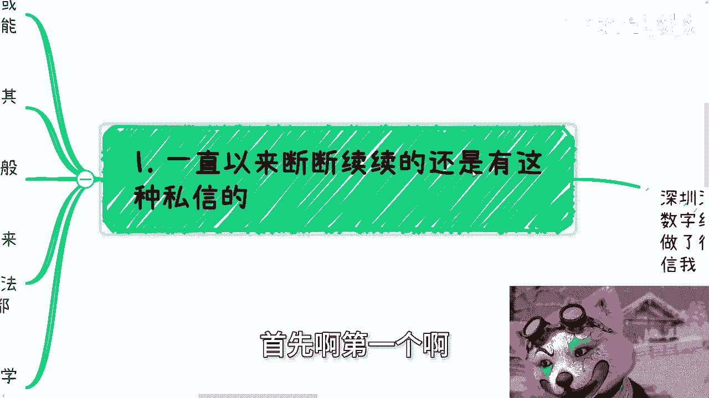
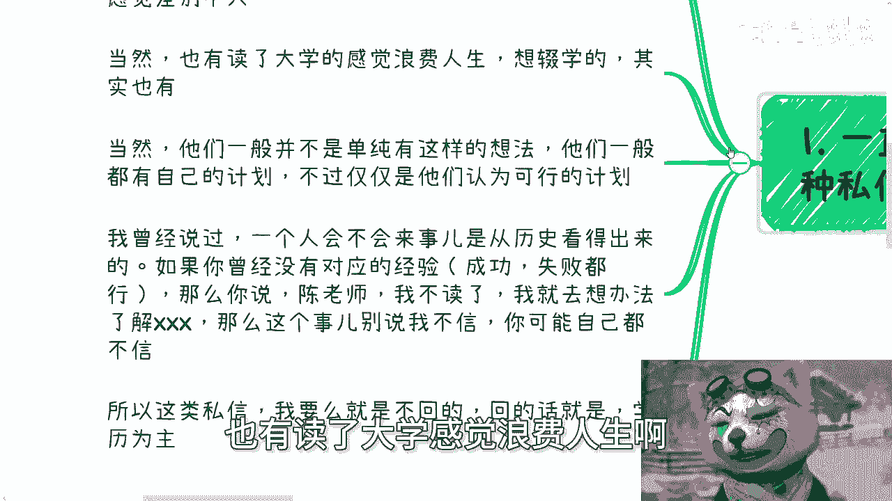
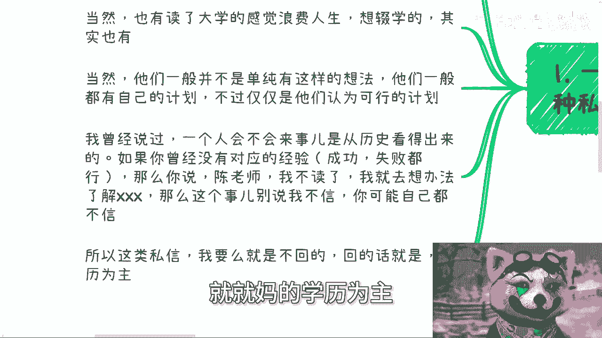
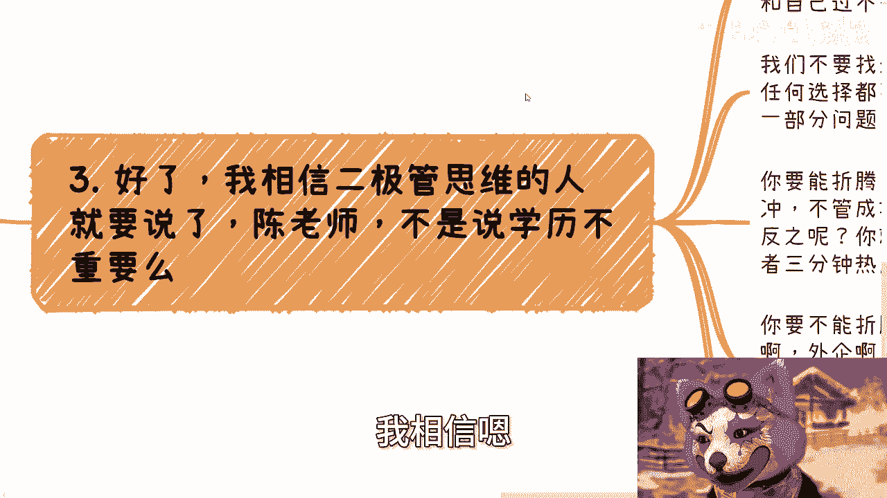
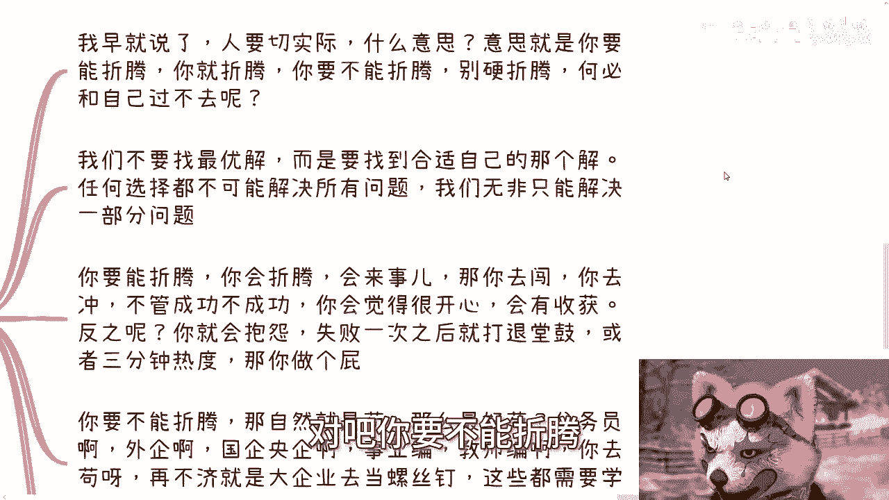
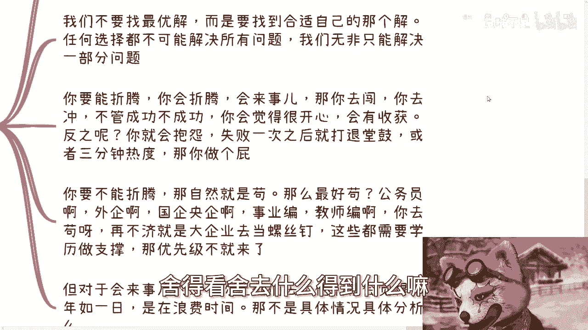
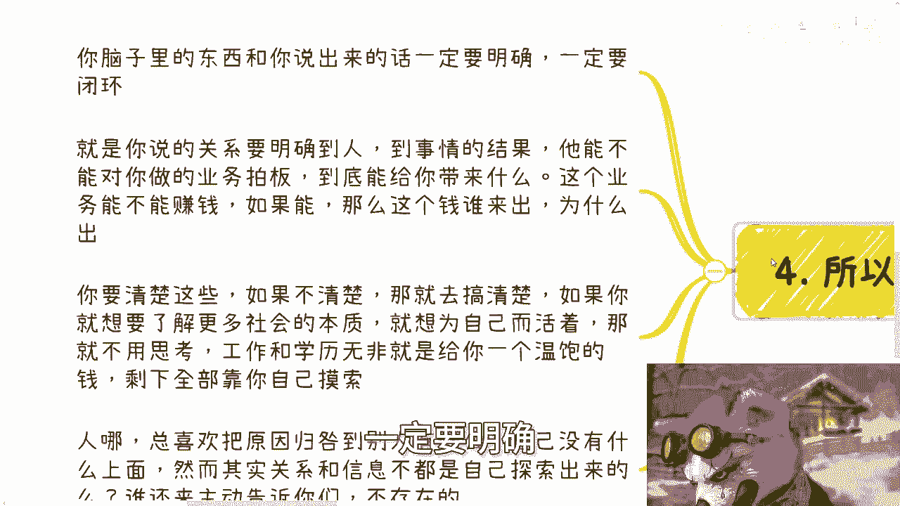
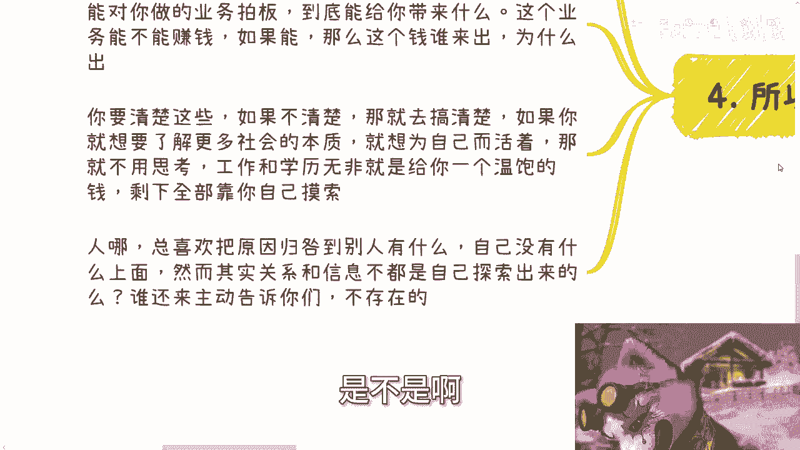

# 在摸清楚赚钱逻辑之前，优先级最高的还是苟着 - P1 - 赏味不足 - BV12y411z7VR

好大家好啊，今天我们来讲的这个主题啊，我本来啊你们看啊，你们看这个x man，到时候你们看这个斯曼的主题，你们就知道，我本来写的是在摸清楚赚钱逻辑之前啊，优先级最高的还是学历，但我后来想了一下。

其实学历并不是一个优先级高的东西，优先级高的还是苟着啊，学历只不过是为了苟着的一个一个工具啊，好那么额我们继续来说啊，深圳活动已经定了30号下午好吧，然后本次活动完全按照数字经济大会的规模，去做的啊。

邀请了很多嘉宾，额，也做了一些很多这这个接地气的主题啊，大家了解详情和报名可以私信我啊，好哦对，记得那个动态有抽奖啊，你们去抽奖啊，首先啊第一个啊。

一直以来呢断断续续，其实这种事情蛮多的，就是一相对来讲啊，我觉得他们的背景呢肯定都是这个考试，考的可能不太好啊，或者说自己读书可能就读的不太好，可能比如说中专啊，职校啊，或者高考考的不太理想的啊。

他们会来问我啊，就是说啊我需不需要一个大学，或者说我还需不需要一个大专的这个学历啊，呃因为读的不好嘛，对吧哎呀我觉得这个客观因素也很正常嘛对吧，有啥呢对吧，你按照上海来讲，高考分流他妈50%。

这有啥好说的呢是吧，他说有没有呃，他他自己他们自己觉得呢有没有，就是这种学历呢可能感觉差别不大啊，当然啊也有读了大学感觉浪费人生啊。

想辍学啊，其实也有啊，那当然他们一般呢并不是单纯有这样的想法，他们一般呢都是有自己的计划的啊，只不过这些计划在我看来就是非常扯淡，哈哈呃当然当然了，这个他们认为的可行的计划啊，我曾经这么说过。

我说一个人呢他会不会来事，从它的历史啊对吧，从他的这个简历啊，从他以前做过的事情当中是看得出来的啊，你就像就是说很多人，我们碰到的很多那种大一大二的，就已经在这种活动上面非常活跃了。

然后什么到这种基金啊，那种什么呃私募地方啊，然后去融资啊，怎么样，其实会来事的人，很多人就会来事，你包括我之前也一直说，我认识一个广州的一个大一的小姑娘呃，他应该是我认识到现在年纪最轻的。

同时格局最大的，也是呃能力最强的一个人，就是就是他虽然年纪很年轻，我认识他的时候他才19岁，然后他19岁做的很多的东西，可能跟我现在就已经一样了，就他的整个的内容啊，包括他的呃认知格局啊就很高。

那那那这种人就是会来事儿对吧，但是如果很多人，比如说你20多岁，你30多岁，你以前没有做过相关的东西，那我只能从你以前的经验上面来看，你是不能来事的人对吧，我当然我这地方也写了，你以前要有对应的经验。

成功或失败都可以，无所谓啊，那么你如果啊你说你曾经没有对应的经验，那么你说哎陈老师我不读了啊，我就想办法去了解什么什么东西，我跟你讲，你想想看，你以前都就是一个不会来事的人。

你在当下中国这么一个very very very hard的一个模式，下面，你说你要想办法去了解什么什么东西，我不管你这边是有任何的神仙还是天王，老子我跟你说，就这事你别说我不信啊。

你放到谁身上谁都不行，对不对，你但凡因为这种话啊，你但凡有那么点社会阅历，你就不会讲出来，你之所以会认为你能够去了解，就是因为一点社会社会阅历都没有对吧，所以说这类私信啊，我要么就是不回回的话呢。

我就会告诉他们，你们就他妈折腾对吧，别瞎搞啊，就就妈的学历为主。

啊好那么第二啊。

为什么啊，因为大部分人的这个逻辑本身啊，他就是不缺乏呃，就是这个这个呃这不是不缺乏依据，就是缺乏依据的啊，你就比如他他们跟我说，他说我去摸索自那个自媒体的方向啊，然后同时开拓一些这个跨境的这个业务啊。

你自己看看，他妈这话太空，我就我就问啊，探索自媒体怎么探索呃，怎么赚钱对吧，跨境你又怎么跨法啊，你跨境做什么东西，你又怎么赚钱，你知道吗，不知道你就拿这种空话啊，他们就拿这种空话去套套自己。

那他那何必呢对吧，包括还有那种啊，就跟我说什么啊，我家里叔叔啊，姑姑啊，有公司的，有业务的啊，去亲戚家做的，我跟你讲这事也不靠谱，为什么呢，因为如果你今天去做啊，我就问你啊，就我就问你。

我说你知道你你能做几年，知道吗，不知道，那我说你做了你能学到啥呢，不知道呃，然后我就问他，为什我说那你做了你能赚多少钱呢，不知道什么都不知道，然后呢，他就会一个劲的跟我说，哎呀这个人这个叔叔啊。

我很亲的，我认识很久了对吧，怎么样怎么样，却永远都是用感性的方式去做事情，你这种感性方式在商业上面是没有任何意义的，你只有被骗，只有被白嫖，你还能干嘛呢对吧，你你叔叔姑姑怎么了呢，啊啊他妈的做了半年。

如果不不不给你做了，怎么了呢，回来回来，你再再继续读大学吗，啊那么奇了怪了对吧。

那如果来说我问出来的问题什么都不知道，那就属于什么都就是完全就不了解，那自然而然你肯定读书重要啊对吧，因为别的你没这能力啊，你去折腾他干嘛呢啊，还有就是包括我说的啊，包包括还有跟我说什么，说要卖货对吧。

直播带货办活动的，我说你卖什么，我不关心你办什么活动，我也不关心，我只问我说受众群体在哪，对吧，你告诉我受众群体是谁，受众画像是谁，你怎么接触得到，然后你如果接触到到接触得到的话，大概转化率是多少。

你知道吗，你如果什么都不知道，你怎你做个屁，对不对，你做个屁，你我就问你怎么做，凭凭运气吗，啊卧槽，我他妈就每天在那边直播啊，凭凭凭凭感觉，凭运气啊，我做了一年好像有五个用户。

切不你有你这样做事情的不啦对吧。

我跟你们讲啊，很多人就卡在这个地方，就是感觉不知道，但其实你可以知道啊对吧，你要去找有流量的，找有社群的，有韭菜的机构去合作，你找不到，那就不做呀，你找不到，为什么要硬做呢，对不对，我就搞不明白了。

就很多人你问他问题啊，就是你问出去，所有跟这个事情成功节点有关的问题，他都不知道，然后呢他还非要跟你说，我叫做对吧好啊。

那么到今到现在啊，我相信嗯那个二极管思维的人就要说了。

他说陈老师啊，你不是说学历不重要嘛，对不对，我早就讲了，人呢要切实际，什么意思呢，意思就是说你要能折腾，你当然去折腾这种社会，你不去折腾，你还能干嘛呢对吧，但是你要不能折腾，你就是一个不能折腾的人对吧。

你人这茫茫人海，人总又五五开吧对吧。

你要不能折腾，你硬折腾干嘛啊，把你自己他妈逼死嘛，对不对啊。

我们不是要去找最优解，要去找到适合自己的那个解，对不对，所以说任何选择都是不可能解决所有问题的，你无非就是一个舍得舍得看，舍去什么。

得到什么嘛对吧，那无非我们只能解决一部分问题，那你想啊，你要能折腾，你会折腾会来事，那你就去闯，你去冲，因为什么，因为不管成不成功，我相信你这样的人一定会觉得很开心，会有收收获，但如果你不会折腾。

不会来事呢，我让你去冲，你去冲啊，你冲完一次你就会抱怨，失败一次就会打退堂鼓或者3分钟热热度，为什么，因为你就不会来事儿啊，那你做个屁啊，啊对吧，你要不能折腾，那怎么办呢，啊把把你逼死啊，对不啦。

不会的呀，那自然只能苟了，那那什么最好苟啊，公务员外企国企，央企事业编，教师编，你是狗啊对吧，你再不济就大大大企业当螺丝钉啊对吧，那那这些东西不是要学学历做支撑吗，那优先级不就来了吗，对不对。

但是你说这些东西能不能完全保证稳定，或者怎么样子，也没人能给你担保，对不对，那你怎么你说哪哪里会有，不管是你选择折腾不折腾，你会有最优解不了没有呀，你只对于你自己来讲，你内心想追求的是什么，对吧啊。

那对于会来事的来呃，会来事的人来讲，如果你让他去搞，那他们就会觉得10年如一日，这他妈浪费人生对吧，你还不如你，还不如他妈的这个这个这个这个棺材板盖，好对吧，那每一个不同的人，他做事情方式感觉不一样。

那不就是具体问题具体分析了吗，啊所以我我跟你讲啊，话又说回来，就是你脑子里的东西跟你讲出来的话，一定要明确。

一定要闭环，就是我可以说现在就是95以上的人，跟我对话，这话都是模棱两可的啊，就是你跟我说关系，你就明确到人对吧，什么职位对吧，然后他到底明确到事情的结果，他能不能对你对你做的业务拍板，如果不能。

那么那么你就放弃掉，就别把他他妈当成一个什么人去看对吧，或者当成一个什么关系去看，那如果他能的话，那么到底能给你带来什么，这个业务能不能赚钱，如果能赚钱，那这个钱来谁来出的对吧，而这个钱为什么出。

你把这因果逻辑都搞明白呀，搞不明白你去搞啊，对不对啊，你要清楚这些东西，如果不清楚，你就去搞清楚，如果你想了解更多的社会本质，你想为自己而活着，那么你就不要去思考那些有的没的对吧。

工作跟学历无无非就是给你个温饱的钱，那当然你得前提前呃，前提是你总归得要温饱，得活得下去嘛对吧，那么剩下的我觉得你就得都靠你自己摸索了啊，所以啊我跟你讲啊，人呐啊总喜欢是把那些怎么说呢。

有的没的原因归结在归咎到什么呢，别人有啊，自己都没有什么东西上面，就比如说这个人啊，他有关系，那其实问题是你要这么想啊，关系跟信息不都是自己探索出来的吗，谁除了那些二代，大部分人不都是0~1吗。

对吧都有0~1，你说谁还来主动告诉你们呢，不存在的呀，是不是啊。

所以说就是说我觉得就是说你是这样子的，就是呃如果啊真的是这个读书角度来讲，我觉得在这个怎么说，再不济再不济，你大专还是要读的，我个人觉得啊，你大专还是要读的啊，你你读出来。

当然啊我个人是想的是说你要是真的去读呢，你你你一开始得要想好几件事情，你要么就是读完大专，你就不读啦，你说我就是去做商业对吧，然后读大专这3年你就好好去了解社会，这是一条路，你要么就是说直接去在读之前。

你就去找好那些，比如说专升本啊，专升硕啊对吧，因为国内现在专升本专升硕的也很多，那你就是直接想好对吧，到底是有哪些渠道或者哪些专业对吧，甚至是比较能够时间最最短的，能够让你去专升本专升硕的。

那你就往这上面去靠对吧，也就是说你做这件事情之前，你一定是有一个目的性，是要让你去做的，而不是说你说啊我就觉得这东西没用啊，然然后你说我自己我我我想去做自媒体对吧，我想去做什么东西。

但问题是你想做什么东西，你大概率现在这个整个的这个逻辑，跟整个闭环都是不清楚的，那你把一个嗯，因为学历对你来讲是清楚的嘛对吧，就不管你是中专还是还是高职，还是还是还是大专还是什么东西。

就这个学历是明确的嘛对吧，你把一个明确的东西舍掉，然后你说好，我要做一个呃，我要去做一个，现在就完全自己呃一点经验都没有，一点这个认知都没有的东西，那我觉得我是我实在是没办法，这个支持支持对吧。

所以我一开始就写了，就是说我基本上只要碰到这种问题，私信我，该回的，我就都说你肯定以读书为主，为什么，因为我都不需要对他们有了解，就他们的年龄跟他们的这个这个这个认知，他肯定是对社会一无所知。

那想都不用想。

对不对，好行好吧，我就反正嗯今天就这么个点啊，大家可以可以真的可以自己想想啊，呃然后那个深圳活动好吧，30号下午的，然后就是呃报名的继续报名啊，然后剩下就是职业规划，商业规划啊，股权期权合同分红分润啊。

额什么白皮书啊，商业计划书啊，包括你们手上啊有什么牌，没有什么牌的，你们希望通过跟我的沟通啊，能够叫什么啊，就是希望从我这边得到一些，更接近于当下社会发展，或者当下经济发展的一些建议跟规划的话。

那么你们整理好个人的问题和个人背景好吧，然后我们再来走咨询啊。