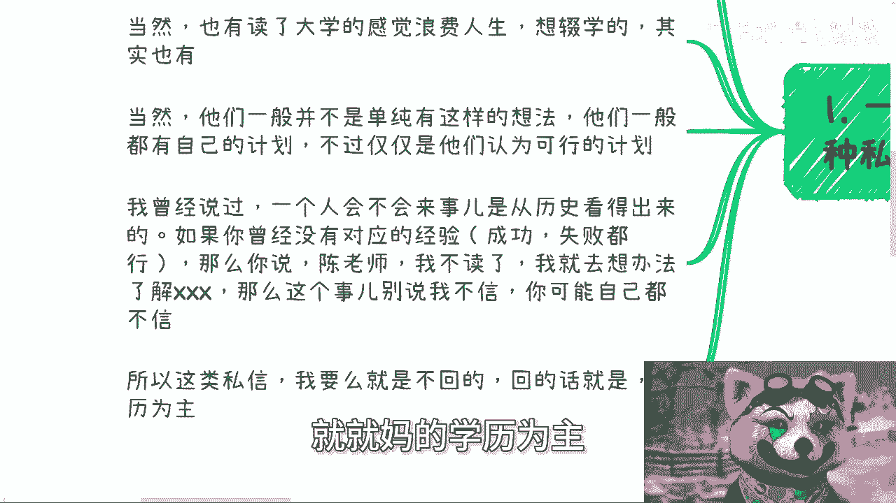
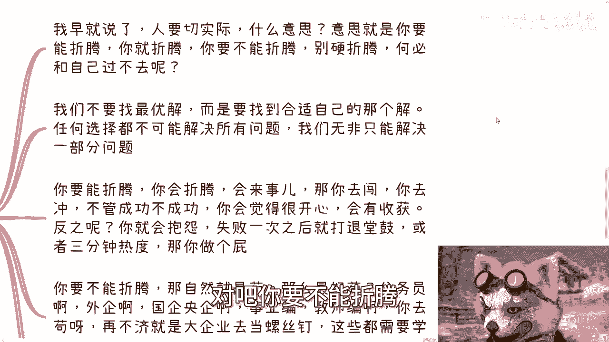
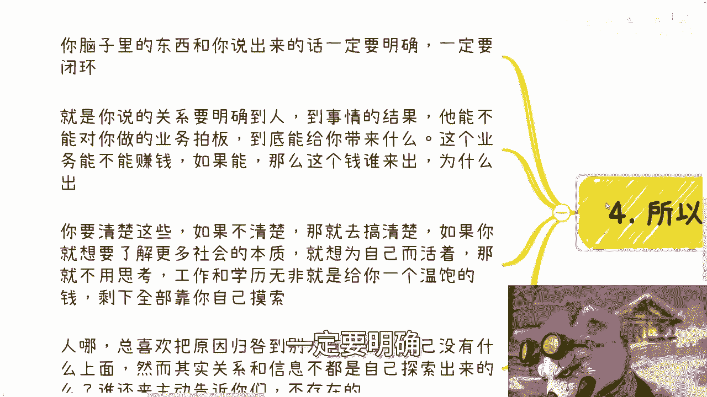
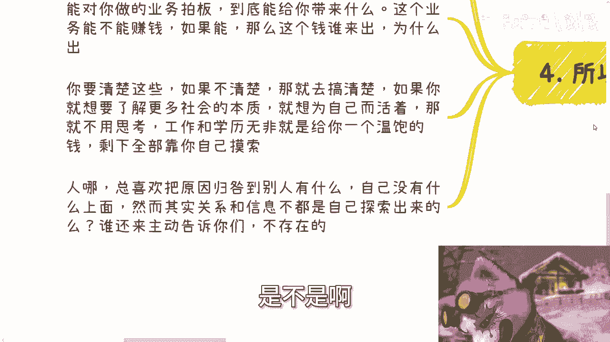

# 在摸清楚赚钱逻辑之前-优先级最高的还是苟着---P1---赏味不足---BV12y411z7VR_n

## 概述

在本节课中，我们将探讨一个核心问题：对于尚未明确自身赚钱逻辑的年轻人而言，什么是当前最优先的事项。课程将分析“学历”与“苟着”的关系，并通过具体案例，帮助你理解如何基于自身实际情况做出理性选择。

---

## 主题解析：学历是工具，“苟着”是目的

我原本拟定的主题是“在摸清楚赚钱逻辑之前，优先级最高的还是学历”。但经过思考，我认为学历本身并非最高优先级，它只是实现“苟着”（即求稳、生存）的一个工具。

深圳活动已定于30号下午举行。本次活动完全按照数字经济大会的规模筹备，邀请了许多嘉宾，并设置了许多接地气的主题。了解详情和报名请私信我。另外，记得关注动态参与抽奖。

---

## 第一节：关于学历的常见困惑

一直以来，断断续续有许多人来咨询我。他们的背景通常是考试或读书成绩不太理想，例如来自中专、职校，或高考失利。他们会询问是否还需要大学或大专学历。

当然，也有人读了大学却感觉浪费人生，想要辍学。通常，他们并非单纯有此想法，而是自认为有可行的计划。但在我看来，这些计划往往非常不切实际。

---

### 如何判断一个人是否“会来事”

一个人是否“会来事”，可以从其历史、简历和过往经历中看出来。例如，许多大一大二的学生就已经在各类活动中非常活跃，甚至参与基金、私募融资等事务。

会来事的人通常很早就能展现这种特质。我曾认识一位广州的大一女生，她是我见过最年轻但格局和能力最强的人之一。她19岁时所做的许多事情，其内容和认知格局就已经达到了很高的水平。

判断依据是：**你以前是否有对应的经验（成功或失败均可）**。如果一个人过往没有展现出“会来事”的特质和经验，那么在当下中国这个竞争非常激烈的环境中，他声称要去“了解”或“摸索”某个新领域，是缺乏依据的。这种想法通常源于缺乏社会阅历。

因此，对于这类私信，我的回复通常是：不要瞎折腾，现阶段应以获取学历为主。

---

## 第二节：为什么许多“计划”缺乏依据

大部分人所设想的计划本身缺乏依据。例如，有人会说：“我去摸索自媒体方向，同时开拓一些跨境业务。”

这种表述过于空泛。探索自媒体如何探索？如何赚钱？跨境业务具体怎么做？卖什么产品？如何赚钱？如果对这些核心问题一无所知，那就是在用空话套用自己，没有实际意义。

另一种常见情况是依赖亲戚关系，例如：“我家里叔叔/姑姑有公司或业务，我可以去帮忙。”

这同样不靠谱。你需要问自己几个关键问题：你能做几年？能学到什么？能赚多少钱？如果对这些问题的答案都是“不知道”，却仅凭“关系很亲”的感性认知去做决定，那么在商业上是没有意义的，结果很可能只是被利用或白嫖。如果做了半年无法继续，难道再回来读大学吗？

---

### 商业计划需要具体闭环

如果有人计划卖货、直播带货或办活动，我不关心你卖什么或办什么活动。我只关心几个核心问题：
*   **受众群体是谁？**（用户画像）
*   **你如何接触到他们？**
*   **接触后的预估转化率是多少？**

如果你对这些决定成败的关键节点一无所知，那么所谓的“做”就只是凭感觉和运气。这样做一年可能只有零星几个用户，毫无意义。

关键在于，你需要找到**有流量、有社群、有潜在客户的机构去合作**。如果找不到，就不应该硬做。很多人卡在“感觉不知道”这一步，但其实可以通过寻找合作方来获取这些信息。

---

## 第三节：具体问题具体分析，找到适合自己的路

现在，可能会有思维简单化的人提出质疑：“陈老师，你不是说学历不重要吗？”

我早就说过，人要切合实际。意思是，**如果你是一个“能折腾”、“会来事”的人，你当然应该去社会上闯荡**。不去折腾，你还能做什么呢？

但是，如果你本质上就是一个“不能折腾”、“不会来事”的人呢？茫茫人海，人的特质总有不同。如果你不能折腾却硬要去折腾，只会把自己逼入绝境。

---

### 寻找“适合自己的解”，而非“最优解”

我们的目标不是寻找一个放之四海而皆准的“最优解”，而是要找到**适合自己的那个解**。任何选择都无法解决所有问题，本质是“舍得”——**舍去什么，得到什么**。

*   **对于“会折腾”的人**：去闯、去冲。无论成功与否，这个过程本身会让你有收获、感到开心。
*   **对于“不会折腾”的人**：如果硬要去冲，很可能遭遇一次失败就抱怨、打退堂鼓，只有三分钟热度。因为你不具备相应的特质。

那么，不能折腾的人该怎么办？答案就是“苟着”。什么方式最利于“苟着”？答案是：**公务员、外企、国企、央企、事业编、教师编**。再不济，去大企业当一颗螺丝钉。而这些路径，大多需要**学历作为支撑**。因此，优先级就显现出来了。

当然，这些选择也不能百分之百保证稳定。无论是选择折腾还是苟着，都没有绝对的“最优解”。关键在于你内心真正追求的是什么。对于会来事的人，让他按部就班地“苟着”可能如同浪费生命；而对于不会来事的人，强行折腾则是痛苦的煎熬。这需要具体问题具体分析。

---

## 第四节：思维需要明确与闭环

话又说回来，你脑子里的想法和你表达出来的话，必须**明确、形成闭环**。据我观察，95%以上的人与我对话时，表述都是模棱两可的。

例如，谈到“关系”，你必须明确到具体的人、职位，以及他能否对你所做的业务拍板。如果不能，就不要将其视为有效资源。如果能，那么要明确：能带来什么？业务能否赚钱？钱由谁出？为什么出？要把这其中的因果逻辑都搞清楚。

如果搞不清楚，就去搞清楚。如果你想了解更多的社会本质，为自己而活，就不要去思考那些虚无缥缈的东西。

工作和学历首先是为了解决温饱，让你活下去。在此之后，更多的探索和成就，就得靠你自己去摸索了。

---

### 关系与信息需要主动探索

人们总喜欢将自己没有而别人有的东西，归咎为成功的原因，例如“他有关系”。但你要明白，除了少数“二代”，大部分人的关系和信息都是自己从0到1探索出来的。没有人会主动把这些告诉你。

---

## 总结与建议

本节课我们一起探讨了在明确赚钱逻辑前，如何根据自身特质做出选择。核心在于区分自己是“能折腾”还是“不能折腾”的类型，并据此决定是“闯荡”还是“苟着”。

**总结建议如下：**

1.  **最低学历保障**：无论如何，大专学历建议要读。这是一个明确的、可获得的保障。
2.  **带着目的读书**：读书时就要想清楚目的。
    *   **路径A**：读完大专就不读了，利用这三年时间好好了解社会，为经商做准备。
    *   **路径B**：入学前就找好专升本、专升硕的渠道和专业，以最短时间提升学历，为进入体制或大企业铺路。
3.  **切忌用模糊替代明确**：不要舍弃“学历”这个明确的目标，去追求一个自己“毫无经验、认知和清晰闭环”的模糊计划。对于大多数前来咨询的、对社会一无所知的年轻人，我的建议始终是：以读书为主。

---

**附加信息**：
深圳活动在30号下午，报名持续进行。此外，关于职业规划、商业规划、股权期权合同、商业计划书等问题，或者你手上有哪些资源、没有哪些资源，希望获得更贴近当下社会与经济发展建议的，请整理好你的个人问题和背景，然后我们可以进行咨询。