# 在粉丝数过10w这个里程碑时间-说点啥吧---P1---赏味不足---BV1Nk4y1P7H1_no

## 概述

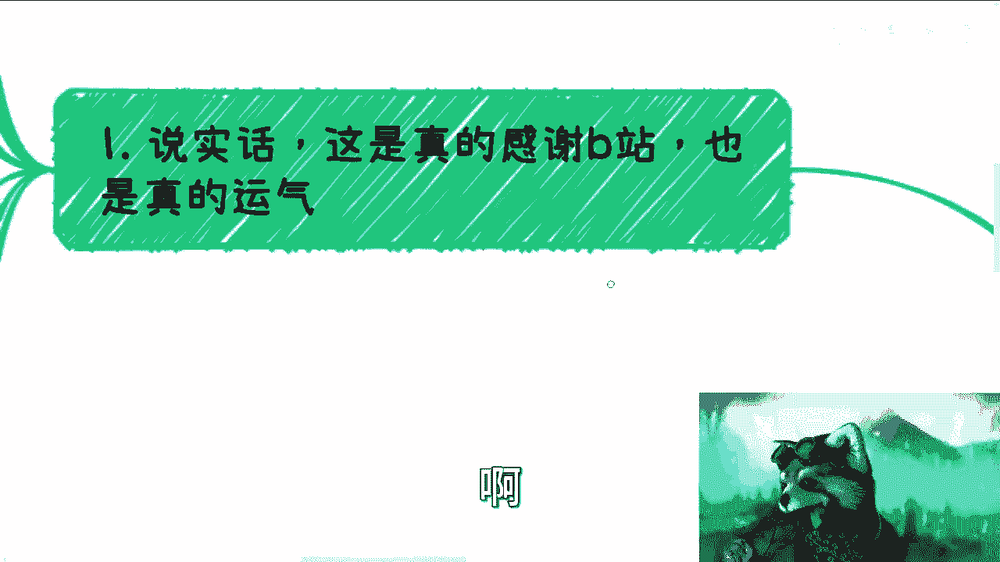

在本节课中，我们将一起回顾一位内容创作者在粉丝数突破10万时的分享。他将阐述自己内容创作的初衷、风格特点、内容定位的独特性，以及对未来发展的看法。通过他的讲述，我们可以了解小众、深度内容在平台上的生存逻辑，以及创作者与观众之间的特殊关系。

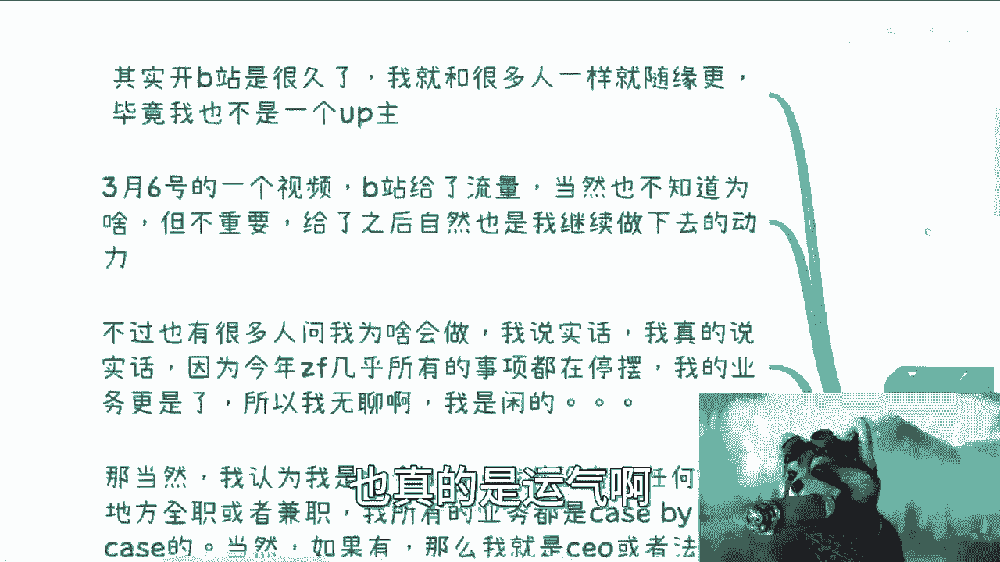

---

## 一、 里程碑的达成与感慨

我的账号粉丝数终于超过了10万。这个结果令我有些惊讶。

首先，我必须感谢B站平台。

其次，这也确实有运气的成分。

我注册B站已经很久了。我和许多新人UP主一样，更新视频很随性。但有一点不同：我并非全职UP主。因此，你们会看到我的视频制作非常粗糙。

我一直强调，我的视频**毫无音效、毫无特效、毫无动画**。我清楚，大部分观众可能只是后台播放。这一点我完全理解。

---

## 二、 创作的契机与风格形成

上一节我们提到了内容风格的粗糙，本节中我们来看看这种风格是如何形成的。

我的第一个视频发布于3月6日。B站当时给予了流量扶持，原因我并不清楚，但这给了我继续创作的动力。

很多人问我为何开始做视频。真实原因是，今年我的主要业务几乎停摆。具体原因在上次直播中提过，也导致我被封禁，因此不便再谈。我的业务本身也非核心，因此更加空闲。闲来无事，便开始了创作。

关于为何使用XMind制作视频：
1.  我过去就习惯使用XMind，这并非广告。
2.  我确实不擅长制作动画和特效。我早期的视频最多只有简单的片头片尾。
3.  从商业逻辑看，做UP主投入产出比为负，不符合我的原则。

因此，你们看到了以**XMind为核心、毫无包装**的视频形式。同时，我本人也是一个“特殊案例”：我没有全职或兼职工作，所有业务都是项目制，关系全靠自己积累，没有任何家庭背景或资源。

我的业务贯穿了**政府、高校、企业和用户端**，这使我对事物的看法相对全面，也让我了解了各方的行事逻辑。

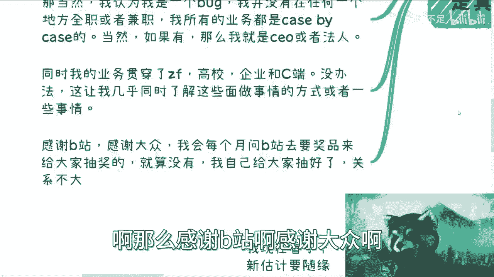

---

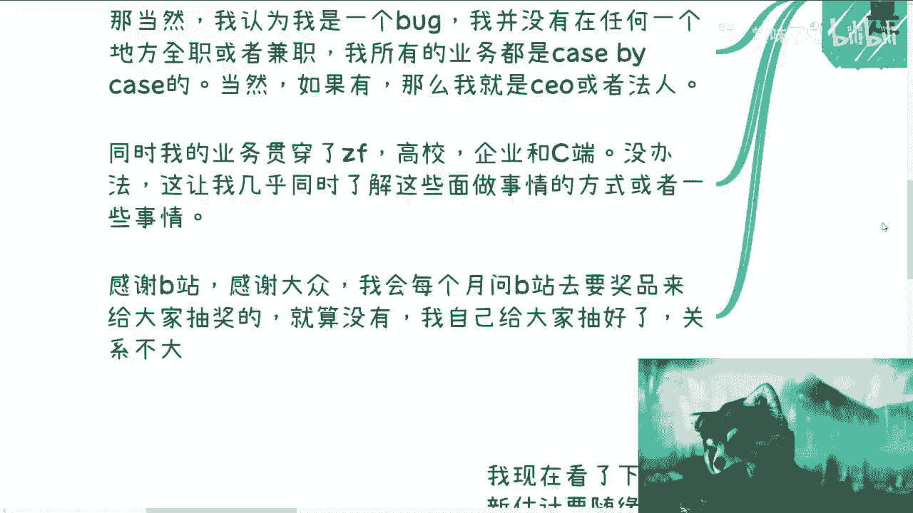

## 三、 对观众的回馈与内容定位

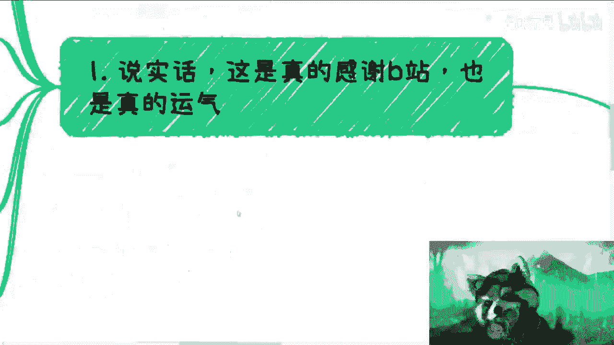

感谢B站平台。

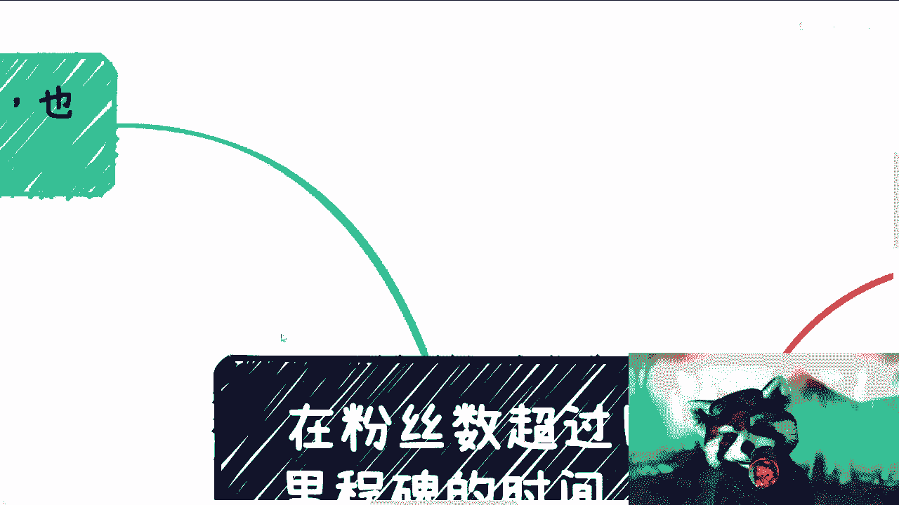

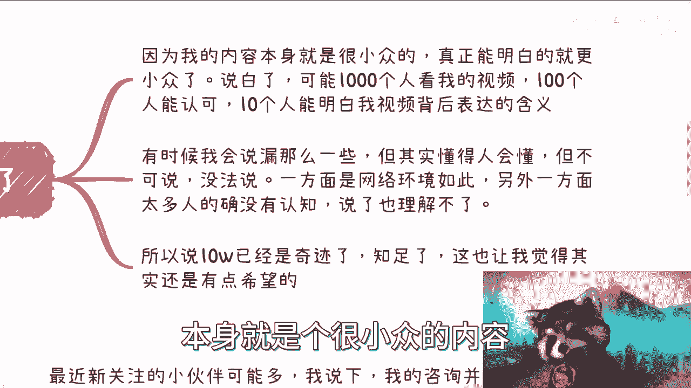

感谢各位观众。我会每月向B站申请奖品用于抽奖。

如果B站没有提供奖品，我会自己准备抽奖，这没有问题。

（注：是指我自己出资准备奖品，并非指我自己参与抽奖。）

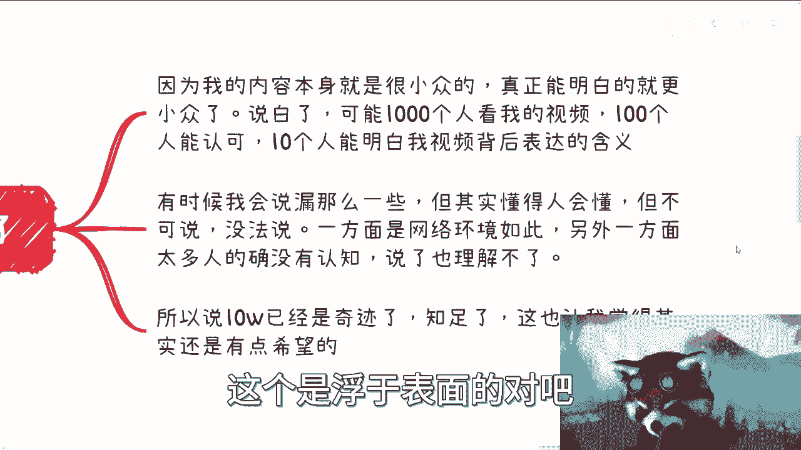

其次，10万粉丝对我而言是个奇迹，因为我的内容本身非常小众。

具体来说：

我敢断言，无论看了我多少视频，真正能看懂的人寥寥无几。因为很多话题，如果满分是100分，我只能讲到20分。再深入就可能面临风险。这可能是因为网络环境，也可能是因为很多人的认知尚未达到理解深层含义的水平。

这与观看舞蹈等浮于表面的内容不同。

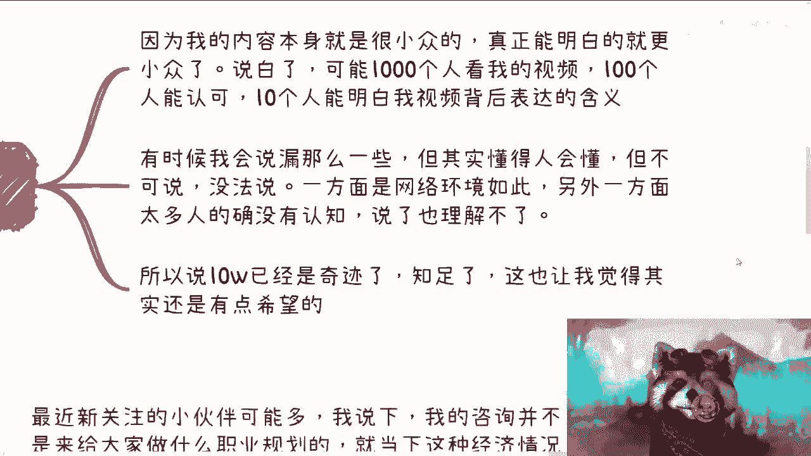

我的内容定位和想表达的初衷，决定了其DNA就是如此。有时我会无意中透露一些信息，懂的人自然懂，但很多话“不可说”。一方面源于环境，另一方面，说多了可能他人也无法理解。

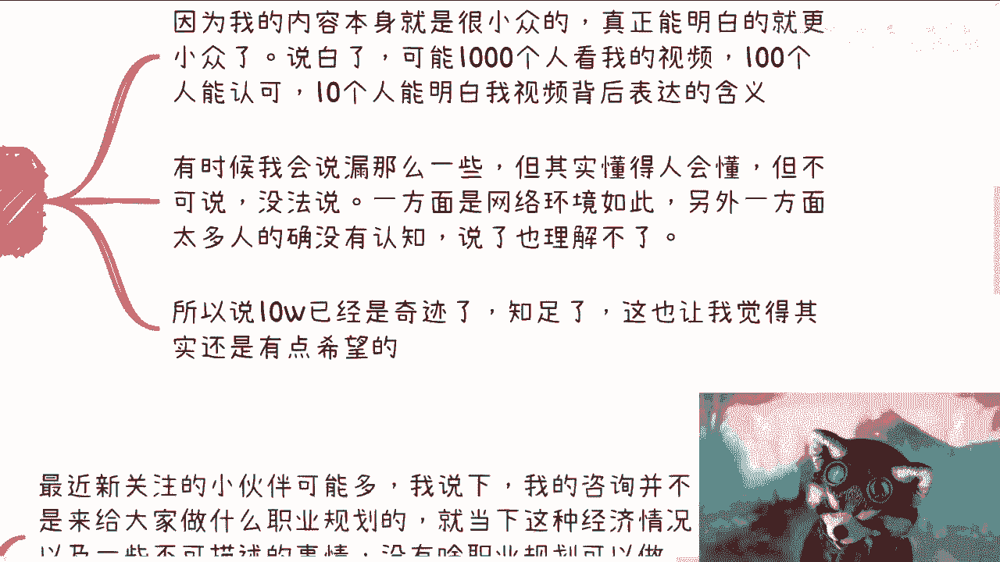

曾有观众建议我提供付费下载内容。这行不通。一旦有人举报，后果可能非常严重。如果这类信息能够自由流通，今天也就不需要我在这里讲述了。

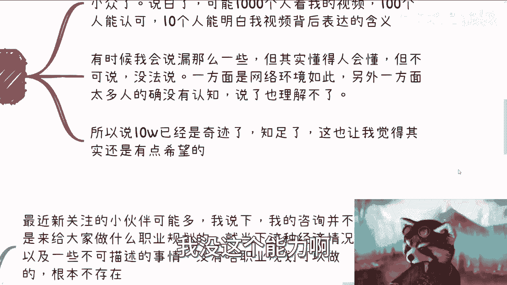

事实上，几乎每个月都会有相关方面联系我。我曾在2017年公开讲解技术时，三次被警方带走。疫情期间也有警察上门。因此，我非常清楚边界在哪里。

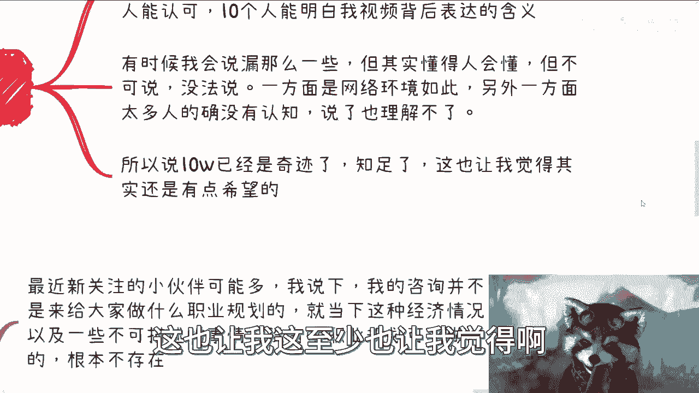

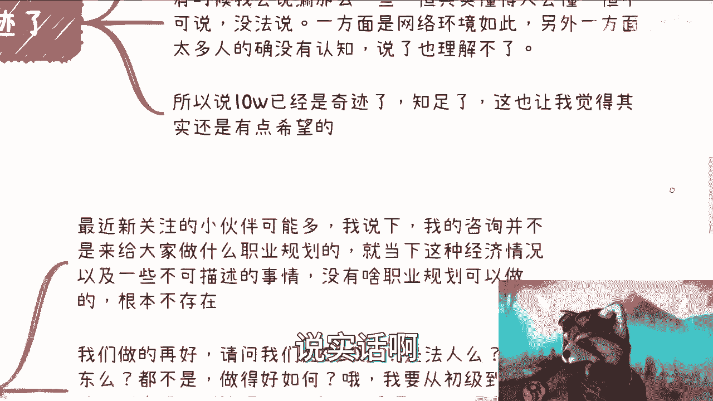

不要要求我做能力范围之外的事情，这并非意愿问题，而是能力问题。

所以，10万粉丝已是奇迹，我对此感到知足。这也让我觉得，事情或许还有那么一点希望。

说实话，确实如此。

---

## 四、 关于咨询服务的说明

上一节我们探讨了内容的边界，本节中我们来明确一下我提供的咨询服务范围。

最近新关注的朋友可能较多，我在此说明：我的咨询**并非提供职业规划**。

在当前的经济形势和综合环境下，加之一些不可言明的因素，未来几乎无法进行有效的职业规划。我们并非CEO、法人或股东，无法控制职业路径的走向。为你规划从初级职员到高管的路径没有意义，因为变数太多。

> **核心逻辑**：`个人职业发展 ≠ 可完全规划的线性路径`。外部环境与组织变数占比过高。

因此，请不要再与我讨论如何“打工”或“内卷”。网络上擅长此道的人很多，不缺我一个。

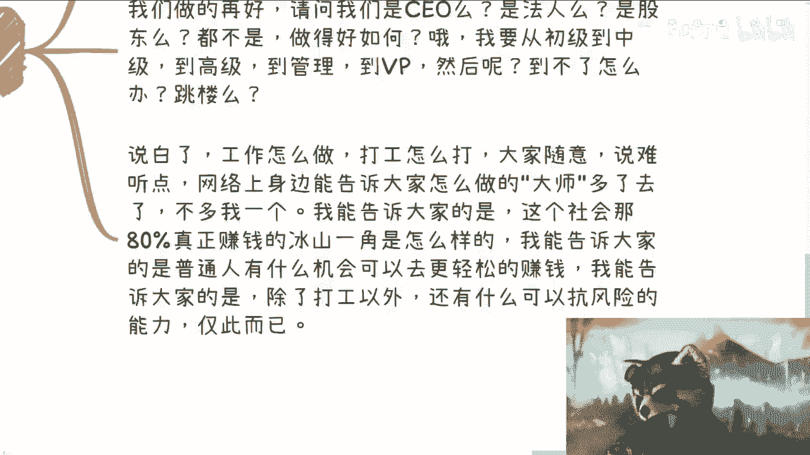

我能提供的是：
*   揭示社会上那**80%** 不为人知、高投入产出比的赚钱方式。
*   以普通人的视角，指出可能更轻松赚钱的机会。
*   告诉大家，除了打工，还有哪些方法可以**增加抗风险能力**。

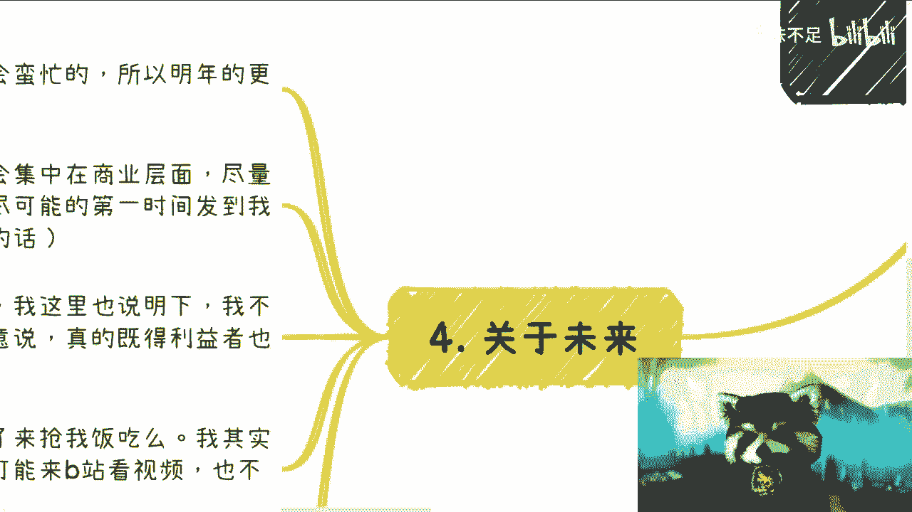

简而言之，我旨在弥补大家在**9年义务教育及高等教育中缺失的那部分关于社会真实运行逻辑的知识**。

---

## 五、 未来计划与创作理念

关于未来：

我预计明年会很忙碌，更新可能随缘，经常需要出差。

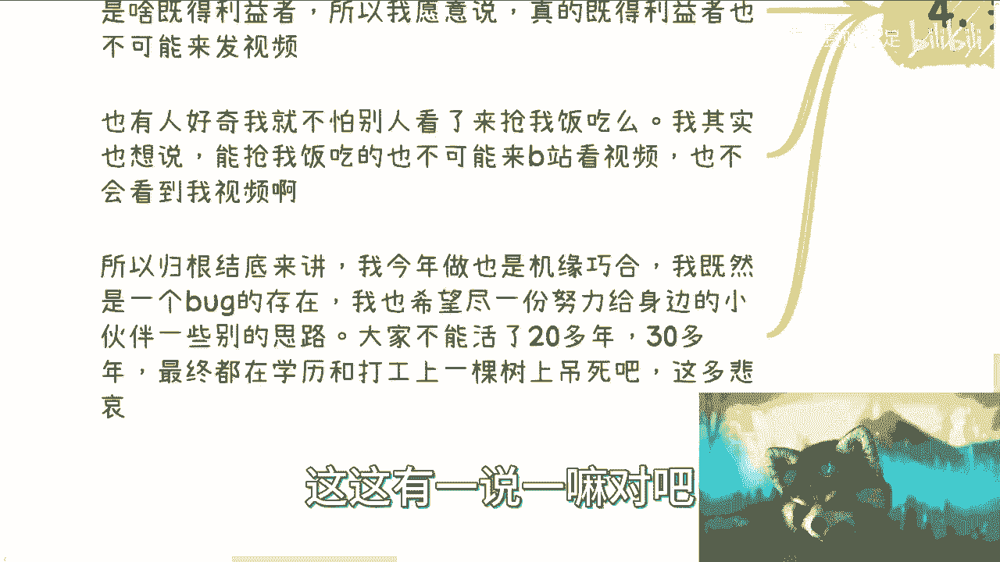

未来内容没有具体规划，因为我并非全职创作者。但我会继续聚焦商业层面，并**尽可能将我获取到的一手信息第一时间分享到账号中**（如果账号还在的话）。

请不要因为某天我不更新了就来添加我的微信。我的微信已有800个群和7600个联系人，实在无法应付。

有人好奇我为何愿意分享这些：
1.  我**并非既得利益者**。如果是，我会忙于赚钱，而非做视频。
2.  我不担心被抢饭碗。客观地说，有能力抢我饭碗的人，大概率不会在B站看我的视频。

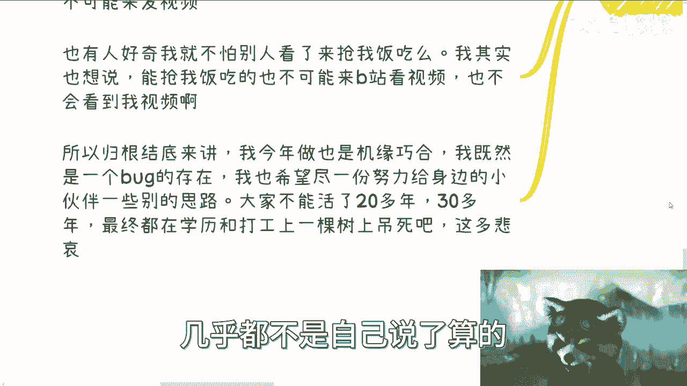

归根结底，我今年开始创作是机缘巧合。我的业务贯穿高校、政府、企业、C端四方，我希望尽一份力，为同处一个阶层的伙伴们提供不同的思路。

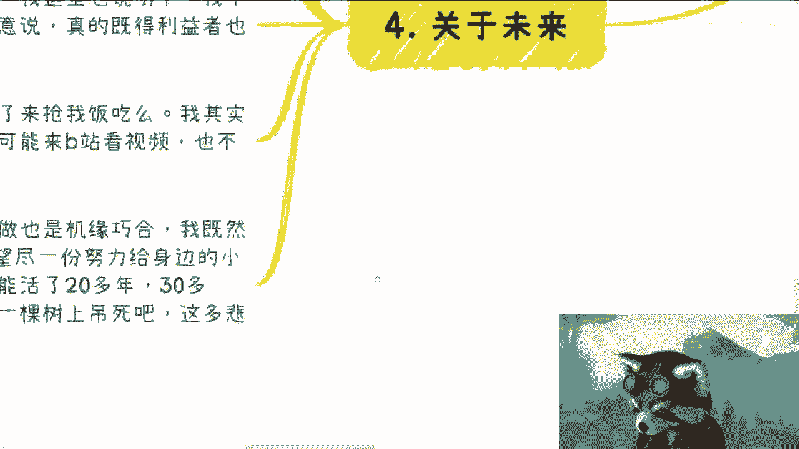

我不希望看到大家活了二三十年，最终只在“学历”和“打工”这两棵树上吊死，且生死不由己。那太悲哀了。

---

## 总结

本节课中我们一起学习了这位创作者在达成10万粉丝里程碑时的完整分享。

他回顾了其**“三无”（无音效、无特效、无动画）** 的独特创作风格源于个人习惯、能力限制和商业理性选择。他强调其内容的**小众与深度**，以及因话题敏感性而存在的表达边界。他明确区分了自己的咨询服务与职业规划，定位为**补充传统教育缺失的社会与商业认知**。最后，他表达了未来随缘更新、持续分享一手信息的意愿，其根本初衷是希望为同一阶层的观众**打破“唯打工论”的思维枷锁**，探索更自主的生存与发展路径。

无论认可与否，他感谢所有观众，并希望B站能提供更好功能，也祝愿更多小伙伴能找到属于自己的出路。