# 在经历过的事情里，我认为最困难的事情有哪些 - P1 - 赏味不足 - BV19w4m1U7at

好大家好，那最近就比较忙啊。

所以就是给大家这录的时间越来越晚，现在他妈已经凌晨12：15了啊，呃有时候我呃首先今天先说这个主题啊，今天说的主题是前两天呢有人问我啊，就问我说我比如说做走到现在对吧，就是最困难的事情是什么。

呃首先是这样子啊，有时候咨询蛮好玩的，就是我觉得我也是蛮支持的，就是因为咨询本身跟面试是一样的，它就是一个双向的嘛对吧，不是说就是说啊一定是我来解答问题，那而且呢问题也并不是说仅仅仅限于是啊。

就是来问我的这些人自己啊，也有不少的人呢，他其实蛮好玩的啊，他问我问题呢，就更像我在做一种叫什么心心理问答，或者说有点有点像嘛，新就就就就那种评评测吧，这种东西反正就是反正就是蛮蛮也蛮好玩的。

问我一些问题啊，然后我觉得先说宏观的啊。

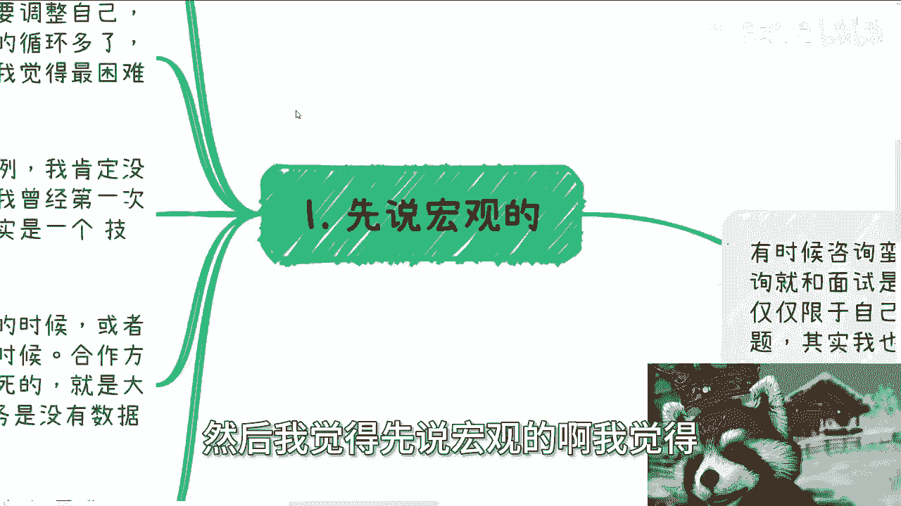

我觉得我跟他们回答是这么说的，我说我说实话，我说我并不认为说有任何一件单独的事情，你说比较呃呃困难或者怎么样，我觉得更多的是呃每一件事情都很困难，但是呢最困难的其实是这个过程，就是说这个过程是什么呢。

是打破三观，然后不停的重塑的一个过程，因为你每次三观受到冲击的时候，你都需要调整自己，然后你还要保证能重塑起来，然后这样的循环多了呢，你还得保证自己还是个正常人，这这个事情。

我觉得才是一个可能是最最难的一个事情，那么我随便举个例子啊，因为都涉及到具体案例，我肯定没有办法去说，就说是什么学校，什么政府单位或者什么企业对吧，但是脱敏的我还是可以讲嗯。

你比如说我曾经啊第一次接触过一些高校，也算是to b的单子啊，我其实是当时的角色，应该是一个技术咨询，或者来说解决方案的这么一个角色，我当时呢就还是就我当时还是个对吧。

我当时还在认真思考这个方案哪哪有问题啊，或者说有什么功能啊，或者需求啊，可以加进去的啊，怎么样子，那么合作方跟我说，他说这个软件呢很多功能其实都是写死的啊，就是其实是没有什么服务端，没有什么后端的。

也就是说大家可以理解为，他只有一个网页或者一个app，后端服务是没有数据的，它都是死数据啊，那么怎么说呢对吧，就是说你从需求角度来讲，从学校角度来讲，一方面是学校是，学校也不知道他背后是不是死数据啊。

然后另外一方面，你从学校需求和功能点角度来讲呢，他死不死也无所谓，因为反正你死数学也好，不死数据就好，学校能用就行了，这也没有错对吧，但是你从我的角度来讲呢，我当时的认知啊，我觉得我的三观接受不了。

因为什么呢。

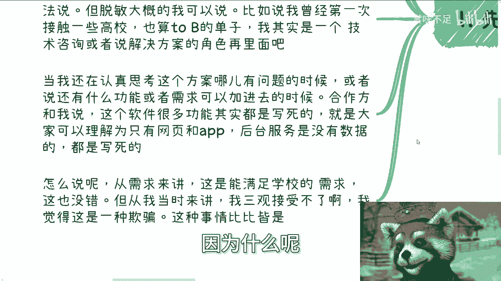

因为我觉得这是一种欺骗啊，但是我后来发现哼哼就这种事满地都是啊。

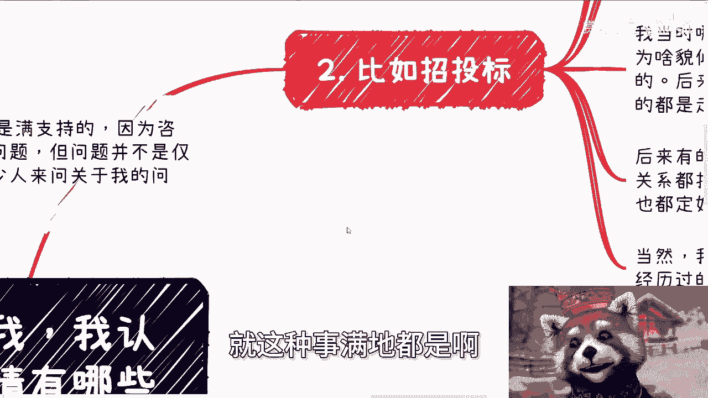

就我还是那句话，你们如果未来有机会能突破象牙塔，或者突破低层下压塔。

你们就会明白我说的任何一件任何一件事情啊，满地都是啊。

然后第二个你就比如说招投标啊，我要招投标就跟他妈更他妈似的。

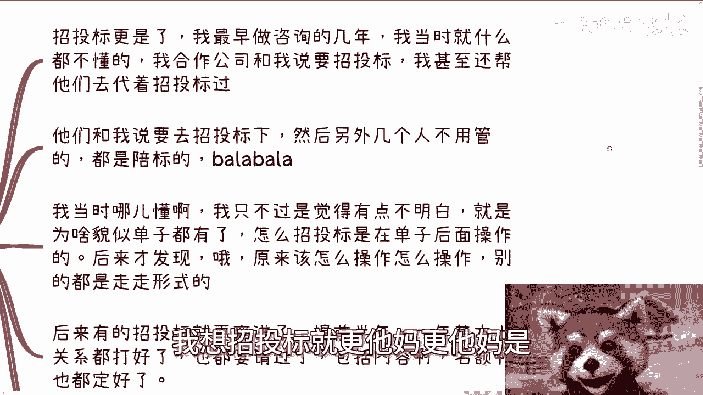

我最早做咨询了几年啊，我当时因为什么都不懂嘛，我合作公司跟我说要招投标啊。

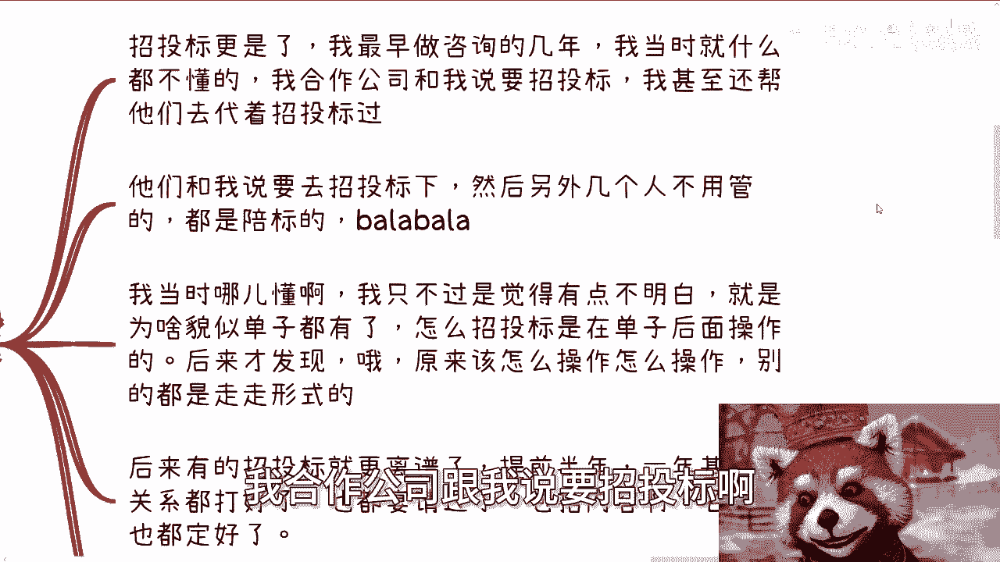

我甚至还帮着他们去带着刀招投标股啊，然后呢我最最不理解的你知道是什么吗，就是他们跟我说要去招投标，然后什么什么另外几个人呢。

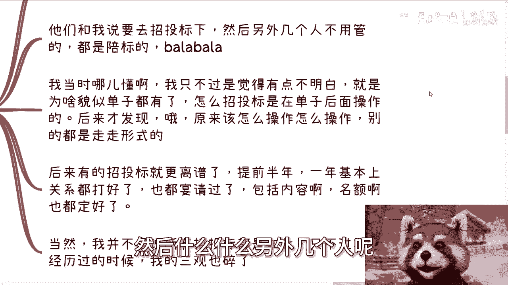

他说也都认识的，你别管，反正都是陪标的，巴拉巴拉巴拉说半天，我当时又不懂啊，我但是我有点不明白，就是就是为什么好像他们都跟我说，单子已经定了哎，定了之后然招招投标，我因为我当时是是什么都不懂嘛对吧。

我只知道招投标可能是有种那种什么什么，像竞拍啊，拍卖啊这种感觉对吧，那我就在想了，那为什么招投标是在单子确定后面来做的，我就不明白了。

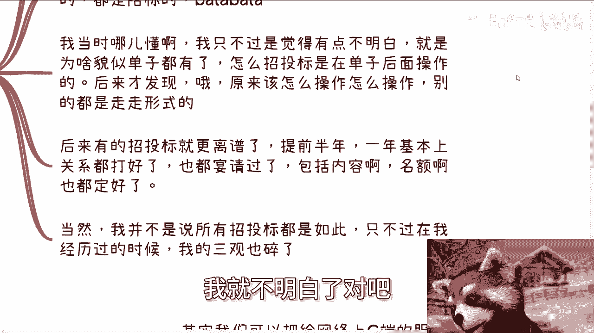

对吧啊，我后来才发现哦，原来呢其实就是说很多东西都内定的对吧。

该怎么操作怎么操作，该怎么走怎么走，那么无非就是走个形式啊，那后来有的招投标那就更离谱了对吧，提前半年提前一年，基本上比如说关系都打点好了，也都宴请过了对吧，包括内容啊，名额啊，什么方向啊都定好了。

当然啊我并没有说过，中国所有的招投标都是如此，但是只不过在我的经历的这个过程当中，我看到的大部分都是如此，那我也只能说我三观碎一地。

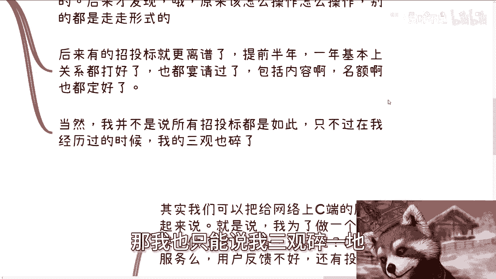

对不对啊，那么第三再比如说以前的企业内训啊，我给你们讲的嘛就有多离谱就有多离谱，就是呃我其实我们可以把网络上就是给散户的，C端的服务和企业内训一起来讲，就是说我呢在10年前大概一三左右，13年左右。

我就是做过很多服务啊，然后我也做了给C端的服务，给企业内训，因为我差不多是12年左右，我就开始做政政企咨询了嘛，然后做了很多功课啊，做了很多准备，最后呢我跟你讲啊，就是我觉得我是个，为什么呢。

因为最后呢就是C端C端招不到人，企业内训吧，用户反馈还不好，然后还有的那个企业呢，投诉到我的合作公司那边去，说你们这个老师对吧，这个没能力对吧，怎么样怎么样啊，我跟你讲，其实这种这个事情啊。

我三观不止睡了一次，为什么，因为我在不停的得到差评啊对吧。

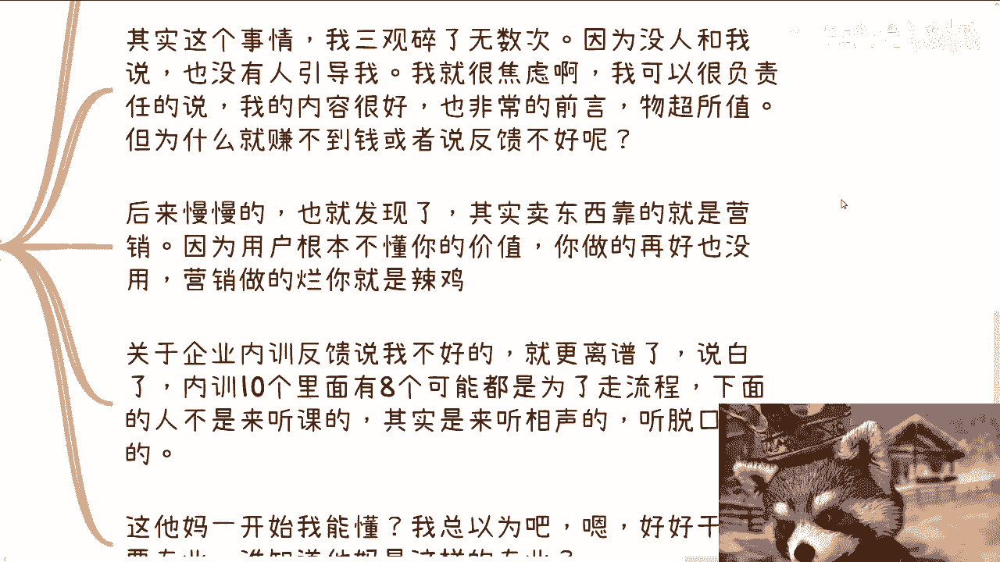

那你让我怎么会好起来呢，我好不起来啊，啊而且最主要是在那个年代也没人跟我说，也没有像我现在这种角色存在啊对吧，而且就算有像我这种角色存在，大部分也都是骗子对吧，然后我就很焦虑啊，因为我可以很负责任的说。

我的内容很好，我也非常就是有前瞻性啊，而且物超所值，那我为什么我赚不到钱或者反馈不好，我就真的不明白，我说实话我是真的不明白，然后嗯慢慢慢慢慢慢慢，那那我我也发现了，为什么呢，因为我我明白了。

就中国这个地方卖东西靠的是营销，因为用户根本不懂你的价值，你做的东西再好，营销做的烂，你就是垃圾对吧，那那那我反正只能得出这个结论，而且关于企业内训反馈，说我不好的，我跟你讲就更离谱了，说白了啊。

企业内训这个东西啊，十个里面八个可能都是为了走流程，为了把企业内训这笔钱用掉，我跟你们这么说，说直白点，下面的人根本不是来听课的，他们其实就是来听相声，就是来听脱口秀的，他们就是来浪费时间的。

你但凡去讲的，就是让他们觉得没有兴趣对吧，或者讲的就一点都不生动有趣，他们就会给你打差评，那我就问嘛，这他妈一开始我能懂吗啊，谁能懂啊，那我总以为哎好好干活要专业性要怎么样子，谁他妈知道是这个吊样子的。

对不对啊，那么第四个最最困难的永远是自己跟自己调和。

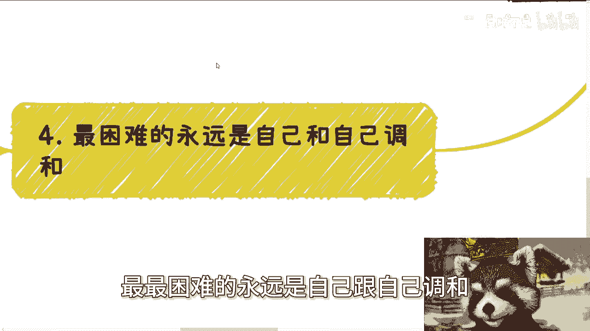

为什么，因为说白了你看看啊，你如果跟我一样能经历这么多事情，你要明白，或者你要去思考，你怎么才能让自己不在乎别人的眼光，才能让自己完全，完完全全的集中在自己的事情上面。

你怎么才能让自己知道，很多事情越来越烂的情况下面，不消极对待，还能积极的往前走，你怎么才能让自己在参与到越来越多的东西，项目里面去之后，你还不迷失自己，还要让自己保持初心，你还要不停的去学习。

怎么判断真假，怎么判断对错，还要不停的去学习，各种社会上面我不知道的规则和流程，然后包括怎么宴请啊，怎么给红包啊对吧，怎么跟异性相处啊，怎么怎么签合同啊，怎么开发票啊等等等，包括怎么察言观色。

领各个级级别的领导怎么做事情的，各种学校的人又怎么做事情呢，对吧，就是而且更何况很多时候啊，你的确在学习，但可能你学习到的都是灰色的手段，而然而你也不知道等等等，那以所有所有这些东西你都得去。

就是就怎么说呢，就是说让自己能够学习到的情况下面，你还能让自己能够去判，有判断能力，而不是说111，就是有的人学会了，但被带歪了对吧，但有的人可能就是三观非常的正对吧，他他学不会。

然后他就拘泥拘泥于自己的三观对吧，那有的人就说是碎了之后就很难重塑对吧，就等等等各种各样的人，然后其实你们现在很多人也是如此对吧，有的人如果仅仅只能做到我其中的一部分，那么他很难去了解很多东西对吧。

就就很多时候我说实话，我觉得我的经验和我的一些认知，更像很多人的一个综合体，就是你们相相对来讲可能拿出某某一个点，你们都比我强，但是你们没有，你们至少到今天为止，还没有办法把我很多的综合性的东西。

转移到你们自己身上，这个我觉得是很多人欠缺的，但这种东西不是我们想学就学得来的，我们需要天时地利人和对吧，那你说最困难的事情是什么呢，啊那包括我就跟你们这么讲，你们想要去了解这个社会的规则。

想要突破象牙塔，你们早晚都会经历这些事情，只不过你们经历的细节可能跟我不一样，但是你们早晚会跟我得出同样的结论，只要你们还是站在老百姓这一边，只要你们还认为自己是老百姓，你们就会得出这么个结论。

这没有办法的，因为这是必经之路对吧，就这么简单啊，行好吧，就这么着啊，嗯然后最近也比较忙，所以我也没办法多给你们更新好吧，就是能想到哪算哪啊，嗯然后就是职业规划，商业规划啊，然后呃那个分红啊，分润啊。

股权啊，商业计划书啊，合同啊等等等各种各样的东西啊，嗯包括你们手上有什么牌，没有什么牌啊，你们希望呃经过跟我的沟通啊，也或者还说希望通过我的视角，通过我的视野能够给你们制定出一些，更贴合当下国家。

或者贴合整个这片土地上，经济形势的这么一个呃方案的话，那么你们可以整理好相关的问题。

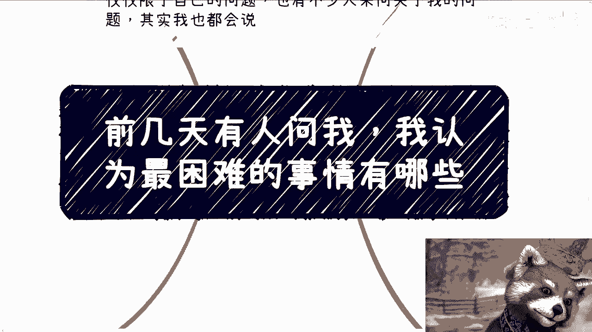