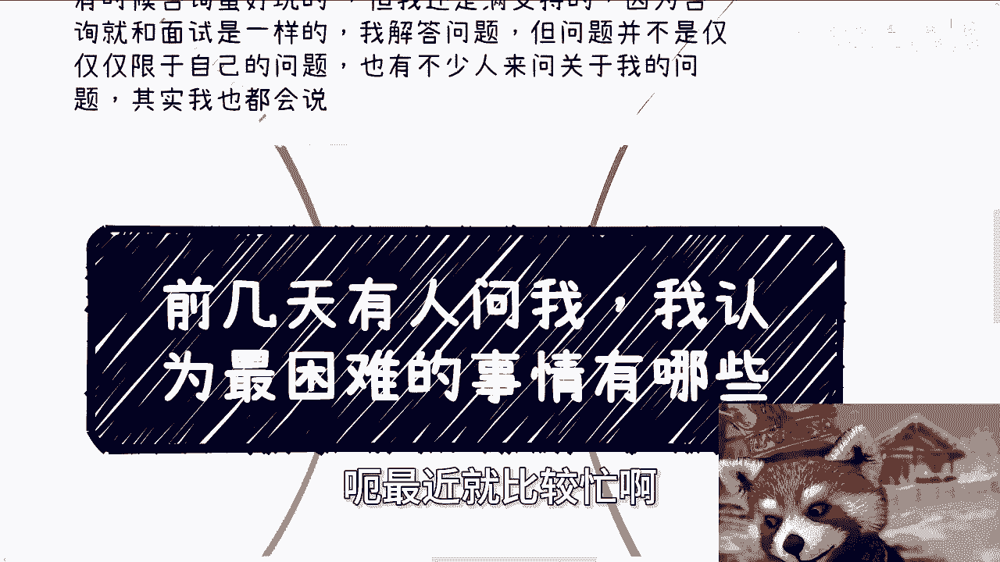
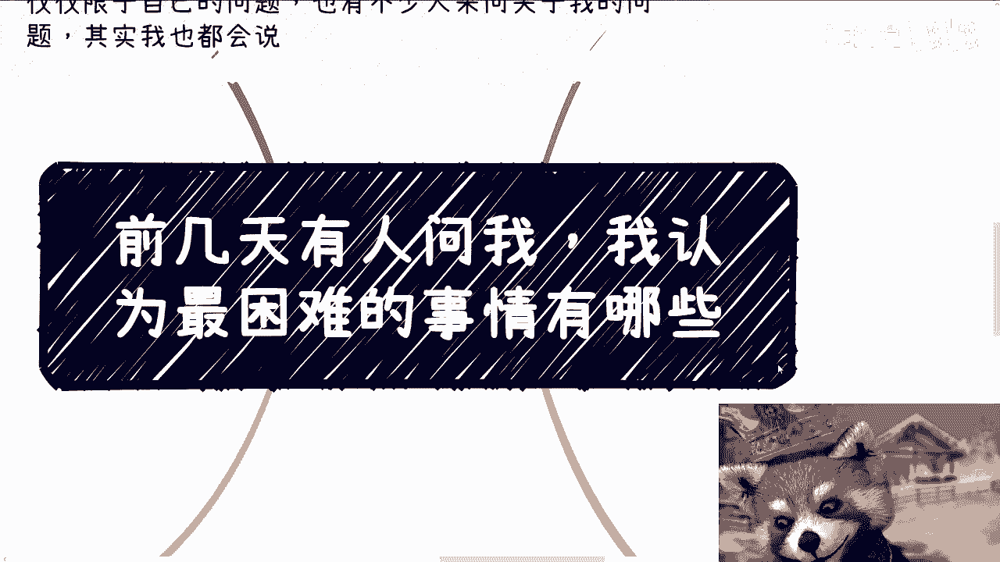
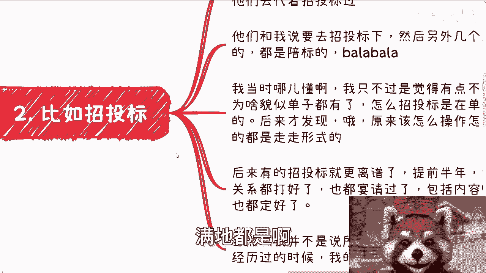
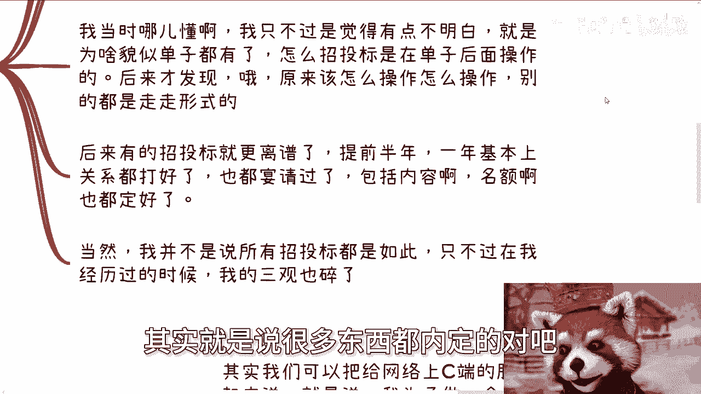
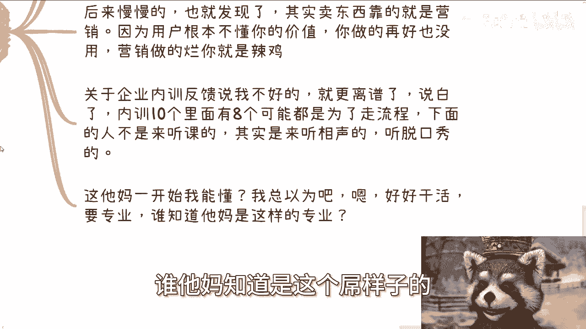
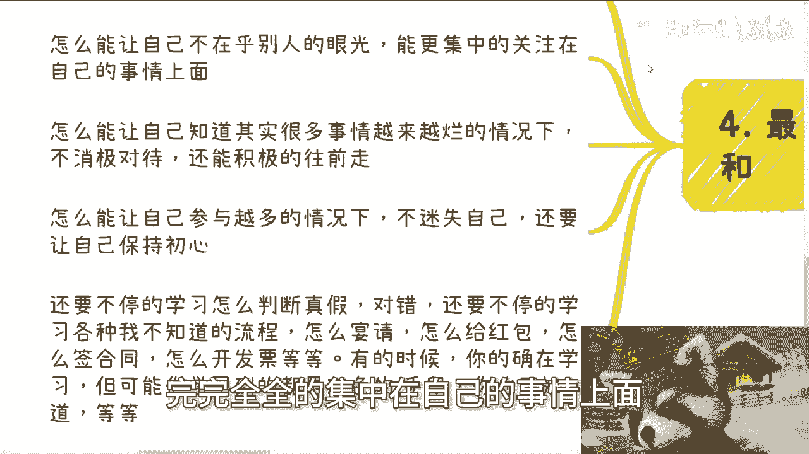
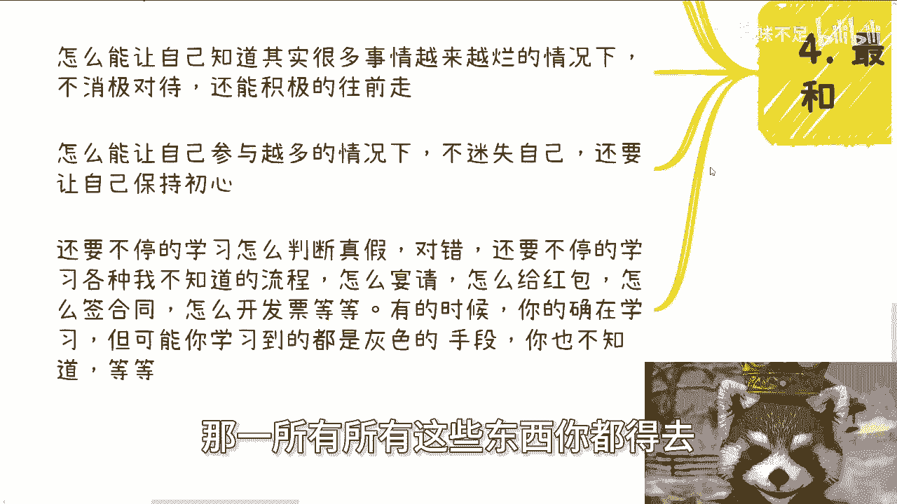

# 课程一：职业生涯中最困难的事是什么？🤔

在本节课中，我们将探讨一个常见问题：在职业生涯中，最困难的事情究竟是什么？我们将通过分享者的亲身经历，剖析那些挑战个人认知、重塑三观的真实案例，并总结出应对这些挑战的核心思路。

---

## 宏观视角：最困难的是过程本身

上一节我们介绍了课程主题，本节中我们来看看分享者对“最困难的事”的宏观看法。

分享者认为，最困难的并非任何一件具体的事情，而是**一个持续的过程**。这个过程是：**打破三观 -> 重塑三观 -> 再次打破 -> 再次重塑**的循环。在这个过程中，个体需要不断调整自己，并在多次冲击后，依然能保持正常的心态和判断力。这才是最具挑战性的部分。

为了具体说明这个抽象的过程，接下来我们将通过几个脱敏的案例来展开。

---

## 案例一：技术方案中的“死数据”📱

以下是分享者早期作为技术咨询时遇到的一个案例。

*   **事件背景**：分享者曾为某高校提供技术解决方案。他最初的角色是认真思考方案的功能与需求。
*   **认知冲击**：合作方告知，该软件许多功能是“写死的”，即没有真正的后端服务和动态数据，所有数据都是预设的“死数据”。
*   **内心矛盾**：从学校（用户）角度看，软件能用即可，数据是否“活”并不重要。但从分享者当时的专业认知和道德观来看，这**构成了一种欺骗**。
*   **后续认知**：后来发现，类似情况在实践中**非常普遍**。这第一次冲击了他的职业三观。

这个案例揭示了理想技术实践与复杂现实需求之间的落差。接下来，我们看看在更正式的商业流程中，会遇到何种挑战。

---

## 案例二：招投标流程的“形式化”🏛️

上一节我们看到了技术层面的认知冲击，本节中我们来看看商业规则层面的例子。

以下是分享者早期参与招投标项目的经历。

*   **初始认知**：最初认为招投标是类似“拍卖”的公平竞争过程。
*   **现实经历**：合作公司告知要去“走招投标流程”，并透露其他投标方是“陪标的”，且项目**早已内定**。
*   **核心困惑**：为何在结果已定的情况下，还要进行招投标？
*   **最终理解**：招投标很多时候只是一种**必要的形式**。关系打点、名额方向等可能早在流程开始前就已确定。分享者强调，这仅是其个人经历中的常见现象，但足以让当时的他“三观碎一地”。

从商业规则到企业内部培训，认知挑战以不同的形式出现。下面我们进入第三个案例。

---

## 案例三：企业内训与C端服务的反馈困境🎤

上一节我们探讨了外部商业规则，本节中我们来看看面向用户和企业的服务所面临的挑战。

以下是分享者约十年前提供培训服务时的经历。

*   **遭遇困境**：精心准备的C端课程招不到学员，而企业内训则收到负面反馈，甚至被投诉“老师没能力”。
*   **内心挣扎**：自认为内容优质、有前瞻性且物超所值，却得不到市场认可，这使其感到极度困惑和焦虑。
*   **反思与发现**：
    1.  **营销重于产品**：在当时的市场环境下，**优秀的营销**比产品本身的实际价值更能决定成败。用户往往无法自行判断专业价值。
    2.  **企业内训的本质**：许多企业内训是为了**消耗预算**或**走流程**。参训员工更像是来“听相声”放松，而非学习。课程是否“生动有趣”成为评价的关键，而非专业性。

经历了外部规则和市场的多重打击后，最大的挑战转向了内部。我们接下来看看最核心的困难。

---

## 核心困难：与自我的持续调和⚖️

前面我们列举了外部世界的种种挑战，本节中我们将探讨所有挑战的归宿——如何与自我相处。

这是分享者认为最困难的部分，即如何在经历一切后，保持内在的平衡与成长。

以下是需要持续调和的关键点：

*   **专注自我**：如何在不在乎他人眼光的情况下，完全专注于自己的目标。
*   **保持积极**：如何在环境变糟时，不消极对待，仍能积极前行。
*   **不忘初心**：如何在参与众多复杂项目后，不迷失自我，保持初心。
*   **持续学习与判断**：需要不断学习社会规则、商务流程（如宴请、签合同）、察言观色等。关键在于，**在学习灰色手段的同时，保持独立的判断力**，避免被带偏或固步自封。

分享者指出，许多人的困境在于只能掌握其经验的某一部分，难以形成综合性的认知与适应能力。这种综合能力需要天时地利人和，难以快速习得。

---

## 总结与启示✨

本节课中我们一起学习了职业生涯中“最困难的事”的多维度解读。

1.  **最困难的本质**：是一个**不断打破与重塑三观**的持续过程，而非单一事件。
2.  **具体挑战**：我们通过案例看到了**技术理想与现实妥协的冲突**、**商业规则的形式化运作**以及**市场反馈与自我价值的错位**。
3.  **终极挑战**：所有外部挑战最终都归结为**与自我的调和**——如何在复杂环境中保持专注、积极、初心和清醒的判断力。

分享者总结道，只要希望深入了解社会规则、突破“象牙塔”，类似经历几乎是必经之路。只要站在普通人的立场，最终很可能会得出相似的结论。这个过程虽然艰难，但也是认知升级和职业成长的深层动力。

---
**（注：文末关于咨询服务的推广内容，按您的要求已省略，仅保留教程主体部分。）**