# 在金字塔不同层面的人-社交认可和需求点都是不同的---P1---赏味不足---BV1QL4neqE4

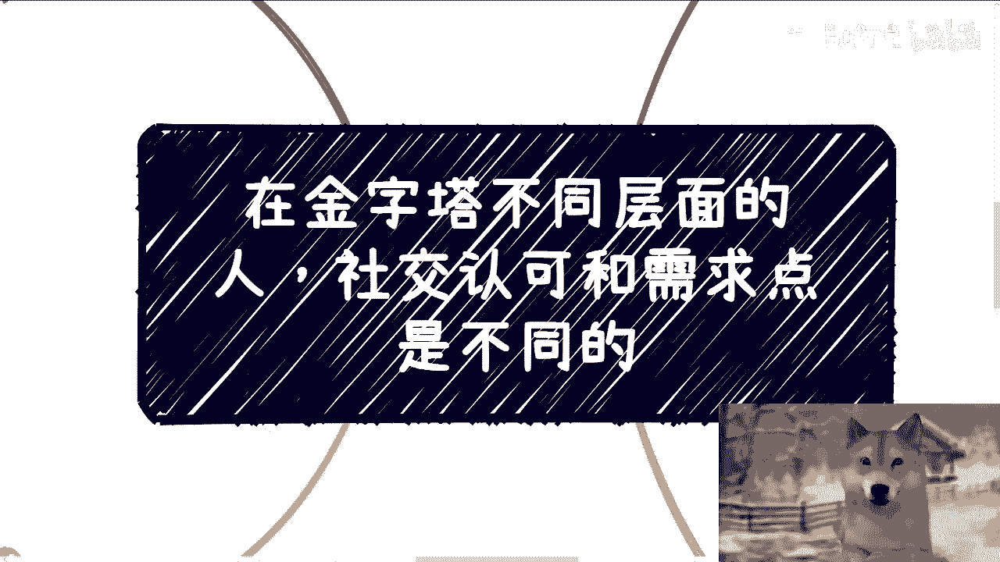

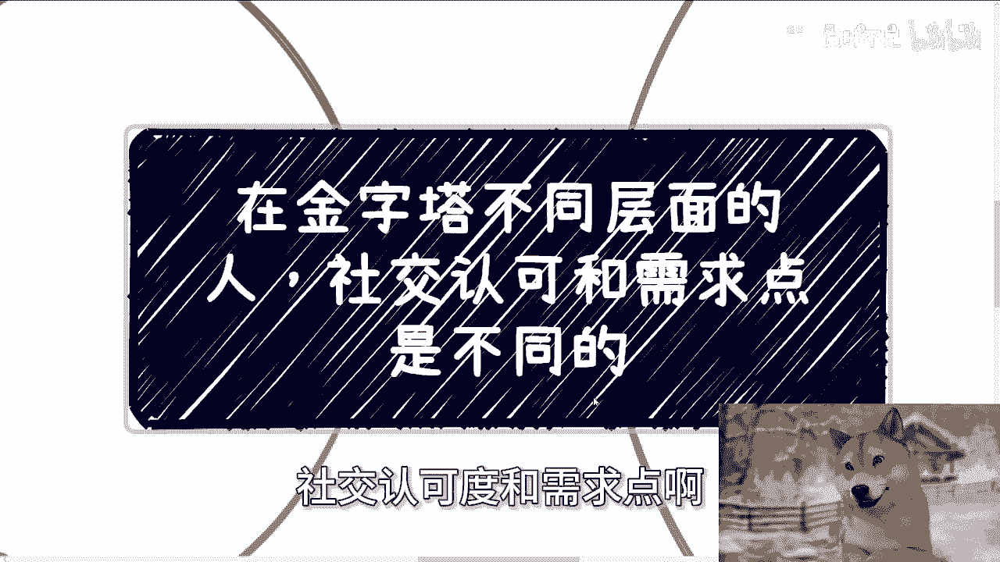

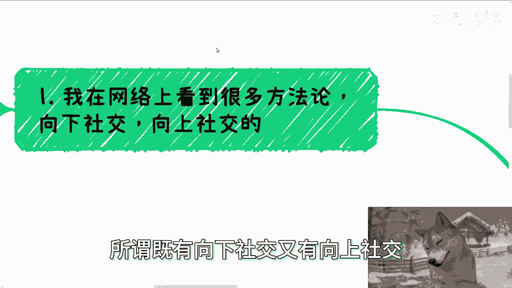

在本节课中，我们将探讨一个核心社交概念：社会结构如同一个金字塔，处于不同层面的人，其社交认可度和需求点是截然不同的。理解这一点，是摆脱单一化社交方法论、进行有效社交的关键。

## 1. 为何社交模式不能单一化？🤔

上一节我们提到了课程的核心主题。本节中我们来看看，为什么网络上流行的“向上社交”或“向下社交”的单一技巧往往无效。

社会是多元化的，由无数个层面或无数个小金字塔组成。你在朋友、学校、职场、商业、政府等不同圈子里，所谓的“上”和“下”是相对的，社交模式也必然不同。

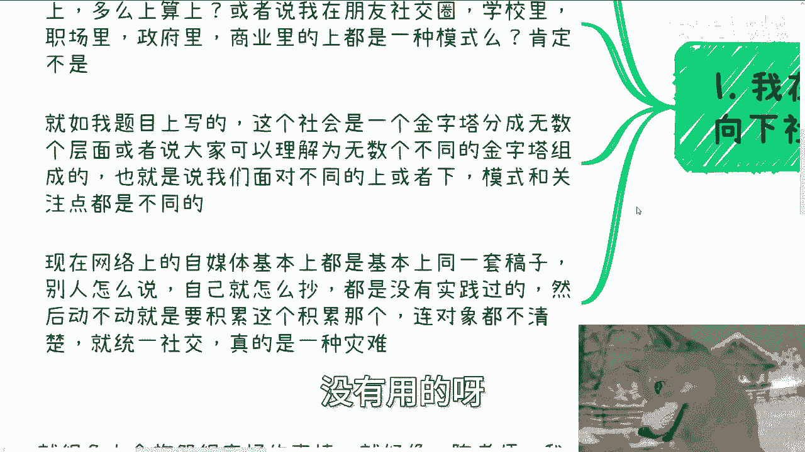

以下是网络上单一化社交方法论的主要问题：
*   **缺乏上下文**：脱离具体的社会层面和对象空谈技巧，如同讨论没有背景的问题。
*   **盲目抄袭**：许多内容是基于一套固定稿子互相抄袭，缺乏对不同场景的深入思考。
*   **混淆对象**：在没有明确社交对象和所处层级的情况下，套用统一的“社交”方法，结果往往是无效的。

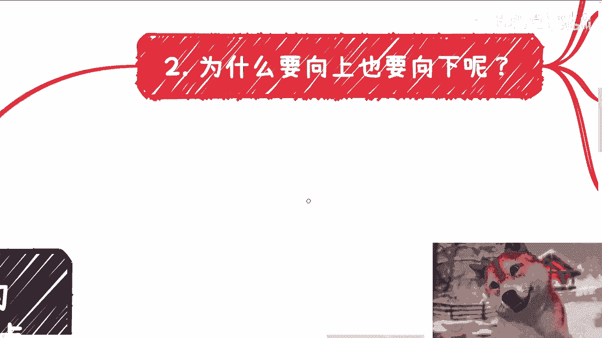

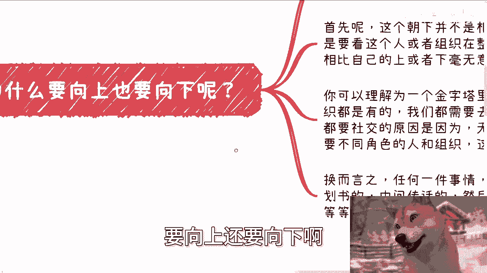

因此，面对不同层面中的“上”或“下”，我们的社交模式和注意点都应该是动态变化的。

## 2. “向上”与“向下”社交的真正含义 🔄

既然社交模式需因人因境而异，那么“向上”和“向下”社交本身意味着什么？本节我们来澄清这个概念。

“向上”或“向下”并非基于个人主观的优越感比较（例如“谁比我强”），而是要看对方在**组织或社会结构中的位置**。

我们之所以需要与不同层面的人社交，是因为完成任何一件事都需要不同角色、不同专长的人和组织的协作。社会分工天然存在，就像**代码**世界里有架构师、后端工程师、前端工程师和测试工程师一样，各自擅长不同领域。

用公式可以简单表示为：
**成功完成项目 = Σ(不同层面角色的价值贡献)**

任何试图用单一标准（如财富、职位）去评判所有人“高低”并套用同一社交模式的想法，都是不切实际的。

## 3. 不同场景的社交认可与需求核心 🎯

理解了社交的层次性后，本节我们具体分析两个典型场景：职场，以及资本/政治圈子。它们的社交认可逻辑和需求点有天壤之别。

### 职场场景：工具属性与关系混圈

在职场中，纯粹的“向上”或“向下”社交意义有限。因为职场中大多数人缺乏真正的“商业紧迫感”——项目成败通常不直接决定个人当月薪资或生死。

因此，职场社交的核心往往是：
*   **认可度来源**：关系、感情、默契，甚至是“拍马屁”的能力。工作能力强主要代表你是一个合格的工具人。
*   **需求点**：稳定、和谐、避免冲突。价值更多体现在执行层面，而非战略或资源整合。

### 资本与政治场景：价值多元与生死攸关

在商业合作或政治交往中，情况则完全不同。这里的核心是**价值交换**与**风险控制**。

*   **认可度来源**：你能提供的**独特、可验证、能创造利润或降低风险的价值**。
*   **需求点**：直接、明确且往往与重大利益相关。

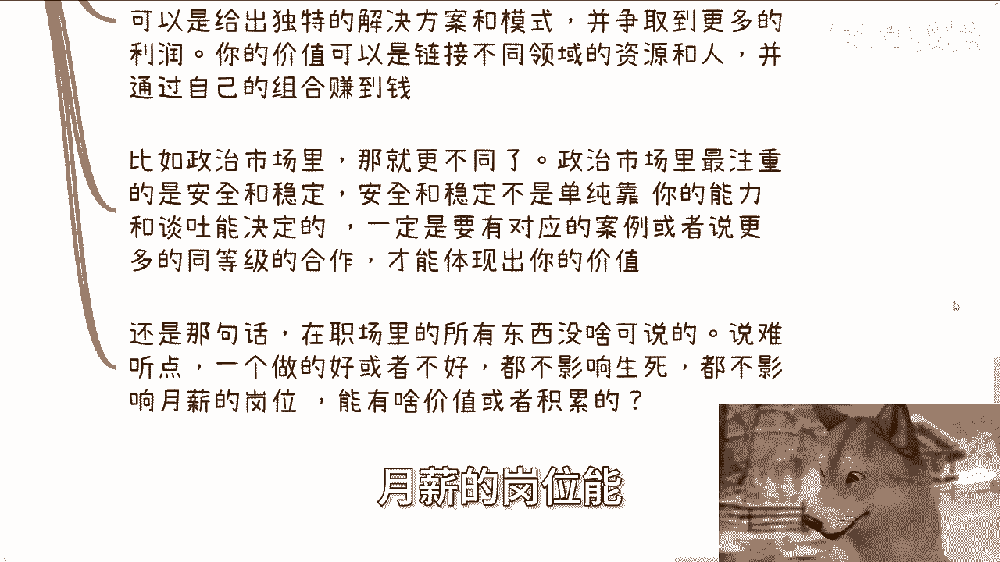

以下是几种核心价值点的例子：
*   **资源连接价值**：拥有并能量合多个关键供应商或渠道的长期关系。
*   **解决方案价值**：能提供独特的商业模式或解决方案，为对方争取超额利润。
    *   例如，通过一个创新的**商业计划书（BP）** 打动资本。
*   **安全稳定价值（尤其在政治领域）**：这不仅仅靠能力，更靠**过往成功案例**和**同级别背书**。
    *   例如，想与某省工信厅合作，最好已有与其他省市同级部门合作的成功案例。
    *   邀请一位领导困难，但同时邀请多位同级别领导，则会因为“安全”和“共识”而变得顺利。

## 4. 破除“资格即结果”的思维误区 💡

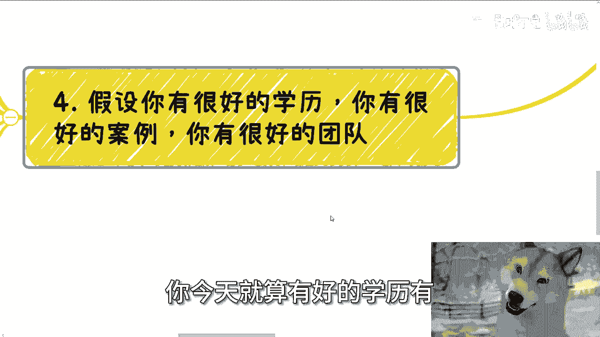

很多人拥有优秀的“硬条件”（如学历、案例、团队），却无法获得预期的社交成果或合作机会。本节我们剖析这一普遍误区。

拥有好的条件，并不构成别人必须与你合作的**充分条件**。这就像：
```
if (拥有高学历 && 拥有好案例) {
    // 这并不能直接推导出...
    return 获得合作; // 错误逻辑！
}
```

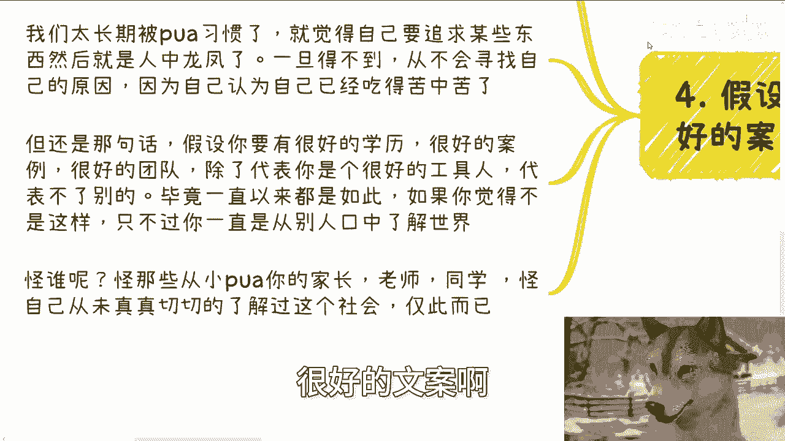

社会长期灌输的“吃得苦中苦，方为人上人”观念，容易让人陷入误区：
1.  **将过程资格化**：认为达到某些标准（如寒窗苦读）就自然应得某种结果。
2.  **忽视真实需求**：不了解对方在具体层面中的真实需求（如政治领域要的“安全”而非“技术最强”）。
3.  **活在他人的叙事里**：你的“苦”可能并未与真实社会的运行规则接轨，如同生活在“楚门的世界”。

优秀的学历和案例，在复杂的社会金字塔中，首先证明你是一个**优秀的工具人**。但要跨越层面进行有效社交与合作，你需要的是理解并满足该层面核心需求的**价值呈现能力**。

## 总结 📝

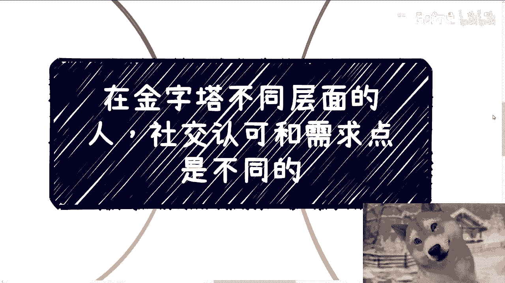

本节课我们一起学习了：
1.  **社交的层次性**：社会是多元的金字塔结构，不同层面的社交逻辑不同，切忌使用单一模式。
2.  **社交的方向性**：“向上/向下”是结构位置概念，而非个人优劣比较，目的是整合不同价值完成事情。
3.  **场景决定核心**：职场重关系与稳定，商业/政治重价值交换与风险控制。**安全**、**案例**和**背书**在高层级社交中尤为关键。
4.  **资格不等于结果**：硬性条件只是门票，真正的社交认可来源于你是否能精准满足对方在当前层面中的**核心需求**。

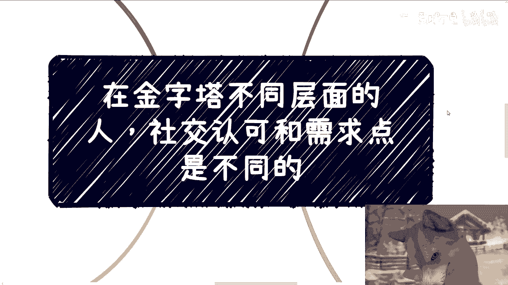

理解这些，是摆脱无效社交、建立有效人脉网络的第一步。