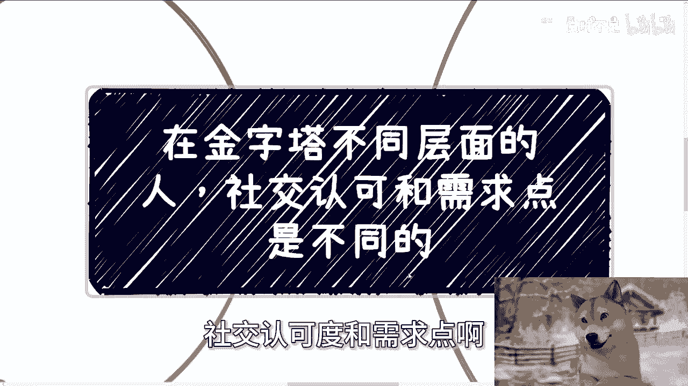
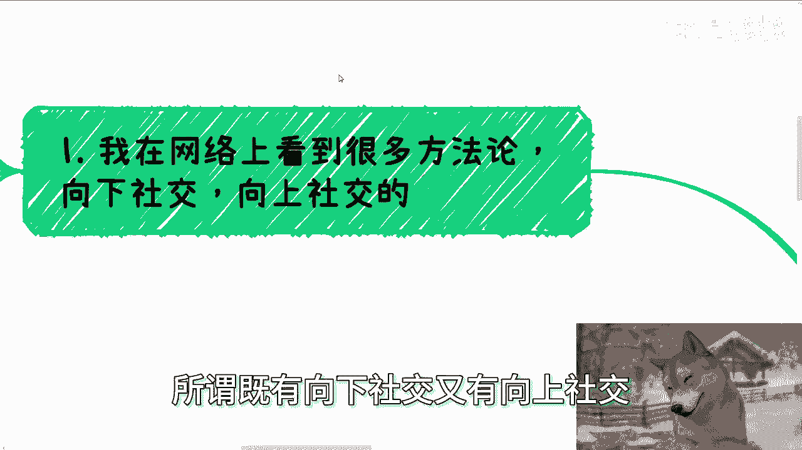
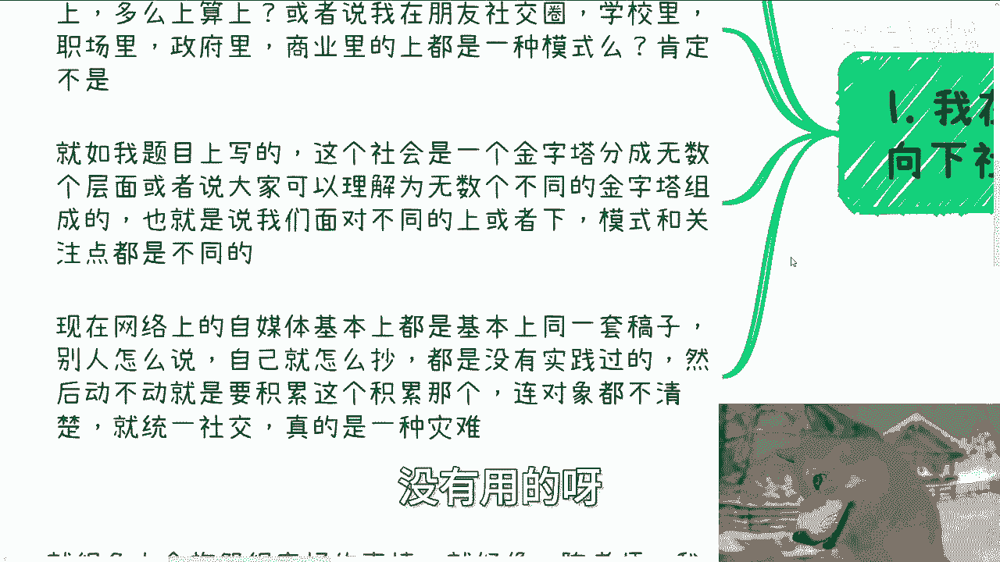
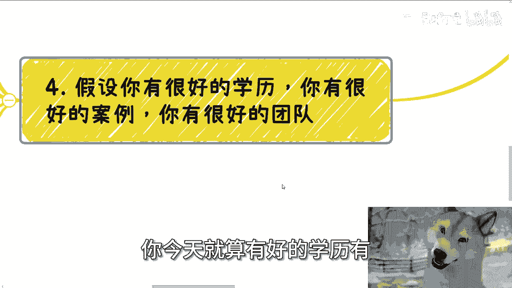

# 在金字塔不同层面的人，社交认可和需求点都是不同的 - P1 - 赏味不足 - BV1QL4neqE4q

啊大家好，这个今天我们来讲的这个主题啊，这个金字塔里面不同层面的人啊，社交认可度和需求点啊。

他是不一样的，呃为什么会说到这个点啊，因为我在网上看到了很多方法论啊，所谓既有向下社交，又有向上社交对吧。

嗯那就有很多方法论来说，向上社交啊，向向下社交很多技巧方法论啊，注意点，但是呢本身啊我听我我也看了一些呃，怎么说呢，就是说我也不能说别人说的没有用啊，但是呢他们说的东西都唉单一化啊。

嗯你要我真的说不好听点，就是没格局啊，为什么，因为我们活在世界上啊，这个社会是是和世界是多元化的，就我们一直说网上社交，网下社交，对吧好，那怎么上算上怎么下算下对吧，或者说我在我的朋友社交圈，学校里面。

职场里面和这个政府里面，商业里面上，难道我都是一种社交模式吗，对不对，那就算我们不知道，那这个问题答案肯定不是吧，是吧啊，那就如我题目上说的，这个社会是一个金字塔分成无数个层面，或者来说大家可以理解为。

就是由无数种金字塔组成的，就说白了你针对不同的人群，在某某一种不同的层面里面，你都有所谓的上跟下，它不是单一化的哦，你说今天有一套方法论啊，他啊可能在某一个人里面试用好这个人，就他妈的啊。

自媒体上面把他发出来，这么有卵用啊，啊对不对，这就好像我们讨论过问题，没有上下文，那那你怎么讨论啊，那么额，Ok，那么也就是说，我们面对不同的上或者下模式和注意点，他都是不一样的。

那现在网络上的自媒体呢，基本上都是基于一套稿子啊，别人怎么说自己怎么抄啊，反正也没时间过啊，然后动不动呢就说我的，我已经获益了对吧，我已经怎么样怎么样了啊，我有一套东西屡试不爽啊。

反正对我来讲他妈牛逼啊，没有用的呀。

啊你动不动积累这个积累，那个连对象都搞不清楚，就统一社交啊，这个叫什么，这个叫他妈灾难，这叫什么叫悲哀啊，第二啊。

那么我们就说为什么要向下啊，为什么啊要向上还要向下啊。

有的人可能会疑惑啊，他说人往高处走，啧朝上社交啊，他说我还能理解，那他妈的为什么要朝下社交啊，首先啊哎问这个问题呢，本身也是格局问题，首先啊这个朝下并不是相对，你也就是说不是相对我们个体来讲。

上或者下对吧，你非要从你个体觉得哦，哪些人比我牛逼啊，哪些人比我，哼那我告诉你，大家都是，你搞笑嘞，你凭什么觉得你比人家强呢，或者你又凭什么觉得别人比你强呢，对不对，他妈本身就是个行为啊。

而是要看这个人在组织，在整个金字塔或者在整个的社会当中，结构当中的位置啊，但你相比你自己来讲上或者下，那有什么意义呢，啊你可以理解为一个金字塔里面，每个不同的层级的人和组织都是有的，我们需要去社交。

而我们说的上跟下，他的这个社交的原因是为什么呢，是因为无论我们做什么，我们都需要不同的角色和人和组织对吧，你这样才能成功的去做一件事情，那当然不是说我们一定要去分369等。

而是说每个人的确有每个人擅长的地方，每个人也有每个人擅长经验的地方对吧，你不可能今天让一个你就像互联网里面，你非要让一个写了15年代码的人说，的，你必须给我去创业，你必须做一个牛逼的产品，你这叫什么。

你这叫强人所难对吧，你不把它放在它合适的位置上面干嘛呢，但是我们也没必要一定要去区分，你说啊这个创业的这个人就一定牛逼，写代码，这个人就一定，那这就是你，对吧啊，换而言之，任何一件事情总有专门打官司的。

总有专门写写东西的，也总有专门传话的，也总有做苦力ABC的对吧，为什么你不要问我为什么，因为社会就是这么样子的，你自己活到现在看看这个世界，看看这个社会，难道不是吗，你又要问为什么干嘛呢，对不对啊。

第三不同的认可度跟不跟不同的需求点啊，你比如说职场里面朝上朝下，社交本质都是没有意义的，那当然我认为没有意义，为什么，因为职场里面大家是没有自我的，每个人都是来打工的啊，因为无论在职场里面。

你无论做什么，你每个月都有薪资拿，对不对，所以说对于大家来讲，大家是没有这种紧迫感，大家是没有这种从自我出发的商业sense，就所谓的所谓的商业理念，它是没有的，因为他不需要，对吧啊。

也就是说纯粹在职场里面，其实纯粹的是混圈子，混关系啊，那么说白了大家就是靠感情啊，靠拍马屁，为什么，因为项目好坏，大多数情况并不决定生死，你做的好跟坏，也不决定你这个月薪资拿都拿不到，你没有这种紧迫感。

那职场里面有什么好说的对吧，职场里你工作能力强，只能代表你是个合格的工具人啊，你永远记住这一点，但是你合格不合格，并不代表你能够朝上社交或者几经更刚的圈子，这两者是毫无关系的啊。

但是在资本跟政治圈子里面，那肯定就不一样了，为什么，因为资本跟政治里面最大的核心点，你只要不是打工人，无论你是从项目切入点啊，还是从项目细节点，还是从落地层面，你都需要自己去想象。

都是需要自己去怎么说呢，制定一切东西的，要自己去争取啊，自己制定计划，自己如何满足对方的需求，自己如何去做解决方案，这个时候你的价值点就会变得非常的多元化，也就是说无论你从哪个切切入点。

只要你能够在这里面做得满足对方的一丝半额，那个叫什么一丝一丝半点，那么你就肯定能够有你的商业价值点，但同样的啊，为什么这个价值点很大，因为这些价值点是能够直接赚到钱的，或者是能够直接的啊。

那个决定整个团队，甚至整个项目或者某一个政治领导的生死，对吧啊，那么比如说你在商业市场里面，你的价值是可以拥有多个供应商，比如说哎我与多个供应商达成长期的合作关系，我跟他们是非常好的。

或者说是有合同来绑定的这么一个长期关系，那么OK你是有商业价值的，那么你的同样的你的价值说哎，我可以给出独特的解决方案和模式，并争取到啊，通过我的这个这个方案，或者来说这个包装或者这个故事。

我能够更多地从企业，从政府，从高校，从资本争取到更多的利润，好那你也是牛逼的对吧，那你的价值可以连接不同的领域资源和人，并通过自己的组合排列组合去赚到钱，那你也是牛逼的对吧，这个就是你所谓的价值啊。

那么比如政治市场里面，那就更不一样了，你比如说政治市场更注重的是什么，更注重的是安全稳定，安全跟稳定不是单靠你的能力和谈吐来决定的，你说哎我他妈能写代码对吧，或者我有我在这个里面写了，我说我能力很强啊。

我我比如说拥有很呃呃很成熟的这个案例，没有用的，明白吗，因为安全跟稳定，它一定是要有对应的案例，或者说更多同级别的合作才会体现出你的价值，什么意思，我们举个例子来讲。

比如说你今天要跟某一个省市的工信厅合作，那么你以前必须要跟别的对应的，审视厅的工信厅，工信工信厅也好，科技部也好对吧，经信委也好，科委也好，你也得合作过对吧，你否则你怎么让别人觉得你是安全稳定的啊。

你跑到台上好，他妈的胡言胡言乱语两句，你对你来讲你是个人啊，卧槽，那对他妈领导来讲，那是灭顶之灾啊，对不对，那同样的更多同级别合作，什么意思，就是如果你经常要拉某一些省省。

比如说那个省市级的厅局领导对吧，这种领导来，那么OK你单纯请他来难，难上加难，为什么，因为他怕，但是什么情况下面他不怕呢，也不知道他不怕，或者说什么情况下，你能更好的消除他心中的顾虑呢。

哎你多拉一些同级别的领导来，比如说都是副厅对吧，比如说登真都是正停，都是副处，你多拉一下来，哎哎啧就很顺利，明白吗，这个叫什么，这个叫安全，这个叫稳定啊，不是说你在这里面说哎我能做什么，我很牛逼对吧。

我MIT清华北大毕业的，然并卵啊，还是那句话啊，在职场里面没有什么东西可说的，因为说难听点，一个做得好或者做的不好的，都是不影响生死的，都不影响月薪的岗位。

能你跟我谈什么价值，谈什么积累，怎么不笑话嘛，对不对啊，第四假设啊，我们假设你有很好的学历，你有很好的案例，以及你有很好的团队好，那这个时候呢有人就觉得卧槽牛逼了，他妈我他妈的啊，这个飞升成仙了啊对吧。

我他妈的手上牌牛逼啊啊，但是呢很多人会抱怨很奇怪的事情，这就好像他就问我啊，陈老师，我觉得我很帅或者我很漂亮，为什么他不跟我谈恋爱诶，那我他妈就奇了怪了，也许你的确很漂亮，的确很帅。

那他妈跟别人跟你谈不谈，有他妈什么因果关系，对不对，这就像这个地方一样的，你今天就算有好的学历。

有很多案例，有很好的团队又如何呢，如何呢，啊你能因为这些东西得出来，别人就跟我合作，能跟我得出来别人企业政府高校资本，省政厅领导跟你合作，诶，妈奇了怪了，谁他妈告诉你的，对吧啊，我们长期被PUA习惯了。

就他妈觉得自己追求的某些东西，追求只要追求到了啊，所谓寒窗苦读，只要追求到了，就是人中龙凤龙凤了，你是吗对吧，那同样的，一旦你得到了某些东西，但是你又得不到自己想要的，得不到别人口中的结果。

那你从不会寻找自己的原因，为什么，因为我明白了，因为这些人永远都已经认为自己，已经吃得苦中苦了，但是你吃的这个苦算什么，你吃的这种苦甚至都他妈不与这个社会接地气，甚至都不与这个世界接轨对吧。

就好像我说的，你完全就是在楚门的世界里面吃这个苦，还他妈自洋洋自得对吧，但是还是那句话，假设你今天要有很好的学历，很好的文案啊。

很好的案例，很好的团队，除了代表你是个很好的工具人，除了代表你是个很好的团队，工具人代表不了别的，毕竟一直以来都是如此，如果你不觉得是你，如果你觉得不是这样子的话。

那么只不过你了解的一直是从别人口中的世界，怪谁呢，怪那些从小PUA你的家长，PUA你的同事同学PUA你的老师，怪自己从来没有真真切切了解过这个社会，没了，你怪不了别人，你能怪谁啊对吧。

这就好像最近我在跟他们聊的时候一样的，就是整个社会，整个媒体，整个的网络环境都在给大家营造一个牛马的，怎么说呢，金字塔对吧，大家就好像哎我们的终点，我们的这个最牛逼的这个方向得到了，我还是个牛马。

那为什么呢，凭什么呢，额不思考的，不想的啊，反正就是牛逼对吧，所以我在一开始就说了，就是这个在我看来是什么，这就叫悲哀啊，有些人还跟我说什么啊，这个东西某某什么东西什么东西很残忍，但是那你不觉得。

我们原原本生活在这么一个象牙塔，或者来说楚门的世界里面，这不残忍嘛对吧，行吧啊就这么着吧。

哎呀好吧，然后工作上面啊，职业规划，包括跟别人合作啊，商业上面，副业上面啊，赚钱上面合同啊，股权啊，分红啊，分润啊，融资啊对吧，估值啊等等等啊，各方面你们希望啊通过跟我的沟通啊。

能给你们一些更直直接的啊这个建议或者规划，或者说让你们少走点弯路的话，那么你们可以整理好对应的问题跟个人背景。

