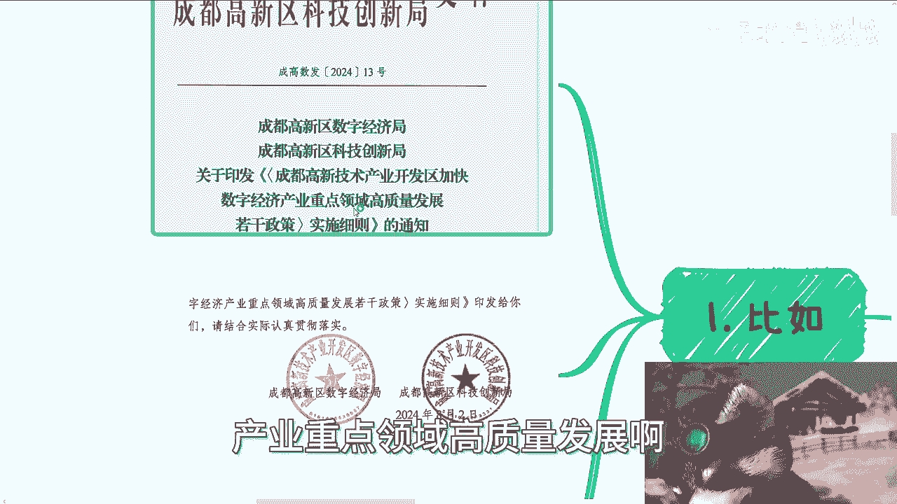

# 地方城市数字经济政策实例案例 - P1 - 赏味不足 - BV1Pm42137bh

啊大家好，这个今天今天这个呢本来是就是昨天要讲的。

但是昨天因为太晚了嘛，所以就放到今天了啊。

额这个呢就是跟昨天那个也相呼应的啊，就是地方城市政策的一些案例啊，那么我也列出来给你们正好看一下，啊这什么玩意儿，唉，好垃圾啊，字节跳动跳出来一个什么windows安全中心，然后现在把我卡住了。

哎好好啊，首先是这样子的啊。

我们先来说啊，就是下一期活动已经定了，在本周日啊，本周日呃。

呃那个8月11号在长沙好吧，大概主题的话一方面是围绕不同企业的offer，而另外一方面是围绕这个自媒，个人做自媒体和跨境电商的啊，最后也帮大家展望一下这个2024，2025或者2026啊。

这么一些有未来啊，那么报名或者了解详情的可以私信我，那么前两天呢，有个小伙伴给我提供了一个文件啊，是成都这边的啊，高新区的啊，超多超多。

这个地方政策我正好拿出来给你们举些例子啊，比如啊这个成都高新区经经济，这个数字经济局跟高新区科技创新局对吧。

给出来的8月2号发的文件叫做，关于印发成都高新技术产业呃，开发开发区。

那么这个是一个细则，很长啊。

你们自己到网上去查，我就不跟你们一个一个说了啊，那么很多人呢还跟我说，哎呀陈老师，我们在这个中央到地方到地到地方呢，我们也不知道找什么对吧，也不知道找什么部门啊，我跟你讲啊，地方文件都是有章的。

地方文件也都是有抬头的对吧，你怎么会不知道呢，有什么不知道呢，去找啊对吧，你要是觉得找了都不知道嗯，比如说找了谈什么或者怎么样的，但那你不是因为你不知道找谁，是就不知道你能提供什么，那你先去准备。

先去储备。

你能提供什么对吧，你要就是说啊，我手上什么都没有，我也不愿意出去积累。

那你想怎么地呢啊天上给你掉下来对吧啊，然后细则我们来看啊，首先支持对上呃，工商税收统计关系均在高那个成都高新区，且具有独立法人资格的人工智能，看到没有啊，人工智能，车载智能，高端软件产业互联网。

数字文创啊，拓展现实等高新区的叭叭叭叭发一大堆对吧，那么在这里面我们能看到啊，就是高端软件，它包含了人工智能，车载高端软件，反正这些基本上都包含了对吧好，那么申报时间每年集中申报时间，2024年8月。

首次申报，后续申报原则上于啊每年3月组织申报，对吧好，那么申报材料啊，这里面会有一些很明确的，我跟你们讲的很清楚嘛，就是说地方文件，它会就相当于是很明确的告诉你要做什么对吧，第一政策申报书啊。

第二企业营业执照，组织机机构代码证对吧，这个东西就企业固有的，三法人身份证，四企业无欠欠税的证明，五企业申报真实材料承诺书，那这些东西我就问嘛，有难度吗，没有难度啊对吧，就就是不要怕麻烦，就是去做啊。

跟着去做对吧，好第三你比如说申报部分内容啊，一共有大概50多项吧，那我给你们列了几个，我觉得可能呃相对来讲跟大家还有点关系的啊，你比如第一支持软件，支持基础软件产品评测对吧。

好支持操作系统数据库等信创产产品，首次通过中国信息安全评测评测中心，获国家保密科技评测中心的安全可靠评测对吧，给予100万的一次性奖励，申报条件，申报主体，产品上一年度通过中国信息安全评测中心。

或者国家保密可靠评测啊，第二申报主体在发布公告前，工商税税收的这个关系已经在高新区好，很清楚对吧，支持标准，对，上一年操作系统数据库信创产品，首次通过中国信息安全评测的软件，给予100万一次性支持对吧。

C申报流程，根据以上面就是我跟刚给你们截图的，根据这个叫做免申即享的这么一个啊申报流程，那不是很清楚吗，对不对，那你去搞呗，你要是想要去搞，你就去了解对吧，比如说这个国家保密呃，安全评测可靠呃。

可靠评测到底怎么测的对吧，然后中国信息安全评测又是怎么测的，对不对，你去了解嘛啊，然后第二你比如说支持游戏产品研发，上线及赛事转化对吧好，那么这个地方你看啊，对于国家新闻版权呃，版权那呃出版署啊。

审批呃，通过游戏版号，因为最近大家也看到游戏版号放开了嘛，对吧啊，那么游戏版号对吧，可以申请上年度首次正式上线游游戏运营，每款产品分别给予游戏研发企业，游戏运营企业各50万的EC奖金。

每家企业每年最高不超过500万啊，对吧好，那么申报条件不是吧，都一样的啊，那么申报材料也是一样的，那你说这个东西有又有什么难度吗，对吧，你要是没有没关系啊，那你可以在高新区这边去找一些别的。

做游戏相关的对吧，这种企业或者这种相关的，你去积累吗，有什么呢，对吧啊，然后第三个啊，那就是我说的那个职业竞争等级啊，鼓励电竞企业员工考取国家资格认证对吧好，对于高新区获得电子竞技运营师。

电子那个竞技员等国家资格认证的，根据取得证书级别就是54321嘛，给予每人最高5000块钱的一次性奖励对吧，那么申报单位的员工政策有效期内，获得国家，四川省或者成都市人社主管部门认证的叭叭叭。

这两个岗位啊，根据政策有效期获得所评定的等级，三级为额1000元，每人二级为3000元，每人一级为5000元，每人给予企业一次性奖励，对不对，这这他妈总没难度了吧，是不是啊，那你你们还要问啊。

这个东西怎么弄对吧，普通人能不能做，有什么不能做，我就不明白了，你你无非就是一个资源整合。

你无非就是一个操盘的人，你到处找呗，又没说一定要你要。

对不对，第四就跟我跟你们说的，其实说的很清楚，第一啊和企业做业务，和政府做业务是一个时时刻刻要准备的，是一个长期的战斗对吧，不是说就像我那天跟你们讲的，不是说你们看到一个东西啊，临时抱佛脚。

你抱不下来的啊，然后你看到吗，从认识人到知道相关信息到准备，一般都是上一年的一些积累或者储备，才能够在下一年申报下来，那政府那个项目都是这个样子的，但是你说难度嘛，本身没有难度。

无非就是说我们要时时刻刻在社会上去social，时时刻刻要去找我们要的牌对吧，你今天比如说看到这个视频，你说好，陈老师，我再去找他妈的找个屁，你现在可以找啊，那你就做25年的这种东西。

你别指望24年做了，对不对，然后最后一点我又要说了，跟我谈学历唉，我就这么问啊，整个文件你们自己到网上去下载，哪个地方有任何一个字提到学历吗，没有的，你不是在搞笑吗，对不对，我早就跟你们讲过了。

社会上的所有的这个规章，规则里面要用得到学历的，只有你还是成为一个打工人，成为一个就是说这个工具人的时候，你是要用的，但凡你要申报任何东西，不会有哪个地方卡，你这个东西的不存在的好吧。

哦反正就是说你们有兴趣的啊，就呃下载这个成都高新区的这个文件，你们自己看一下对吧，然后中我也跟你们跟你们讲，中央到各地方省市区文件都大差不差的啊，最多也就是说成都可能是呃，比如说呃扶持这几个方向。

别的城市可能扶持那那那几个方向，但是文件本身申报条件或者申报的文件，不会差到哪里去的，因为本身你都是在中国呀，他有和何必每个城市给你出一套新的东西呢，不可能的呀，对吧啊，行好吧，这个东西就先这么着吧。

然后那个活动好吧。

8月11号长沙啊，这活动继续报名，剩下的话就是说你们自己工作上面的职业规划，你们与别人合作，或者自己去做一些副业的这个商业规划啊，包括在这里面可分红，分润啊，股权啊，期权啊，商业计划书白皮书啊。

啊你们希望通过我的一些视角，通过我的一些啊，这个对于当下经济情况的一些认知，结合你们的个人情况跟个人背景，能够给你们一些更接地气的，或者说能够让你们少走点弯路的这个建议，或者规划的话。

那么你们可以整理好对应的问题和个人背景。

我们再来走咨询好。