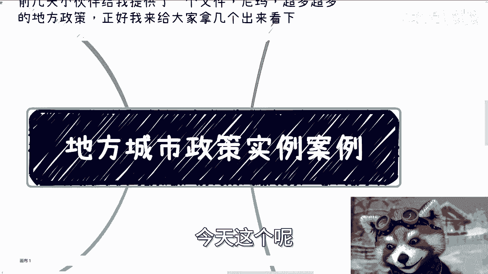
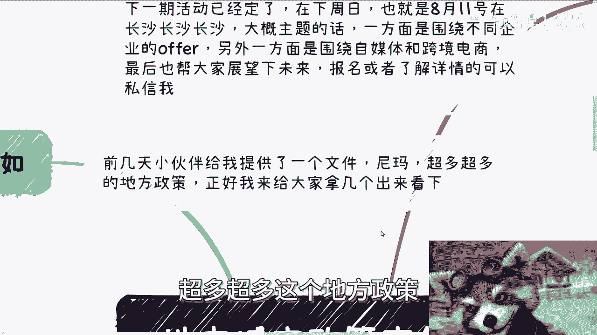
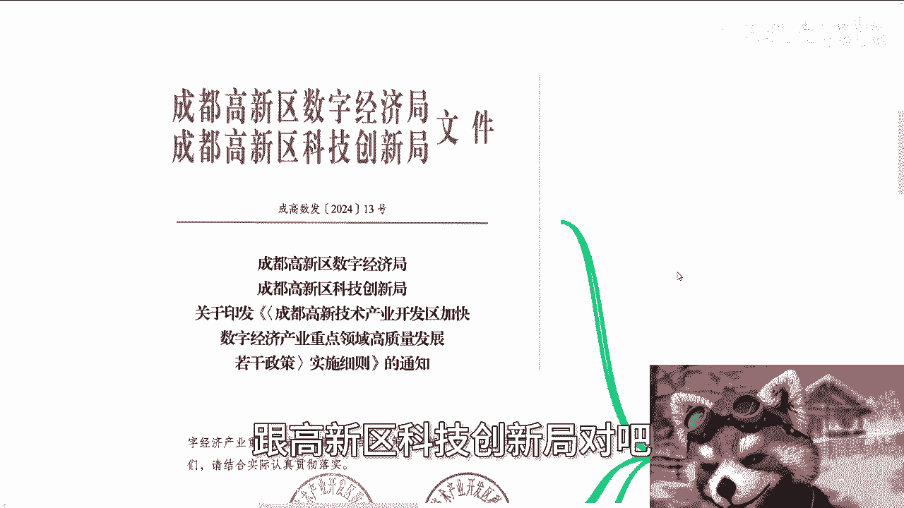
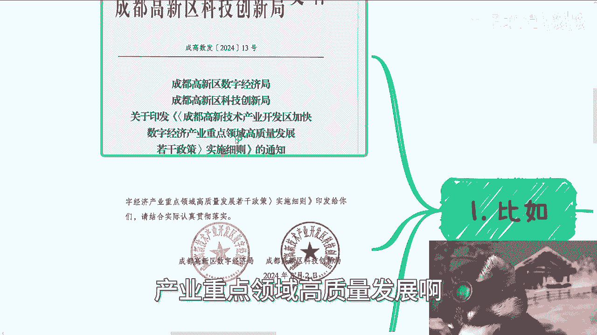
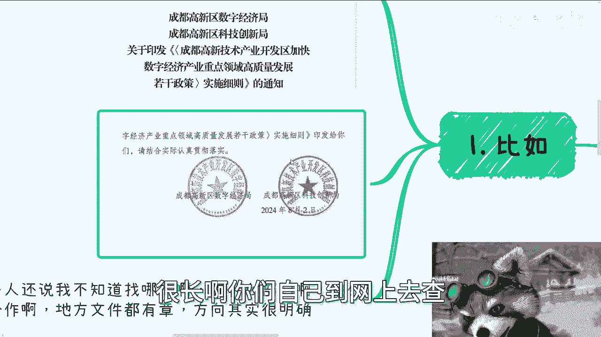
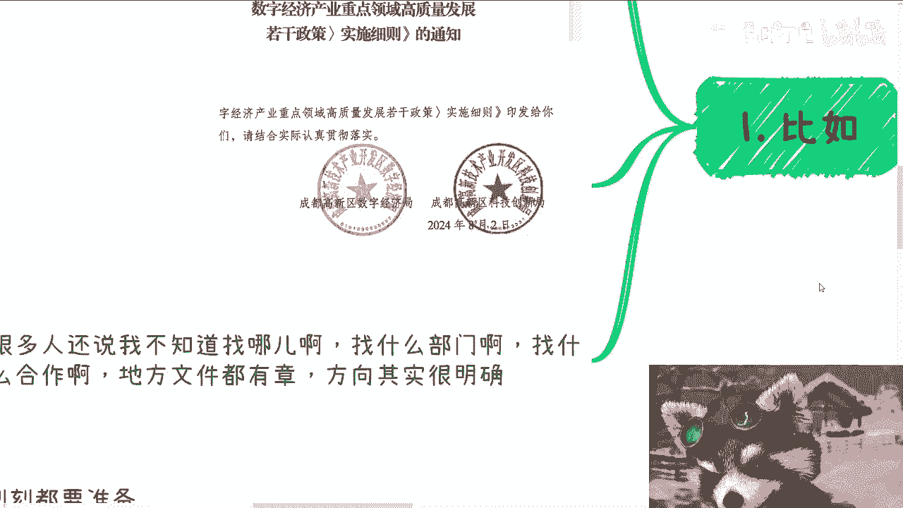
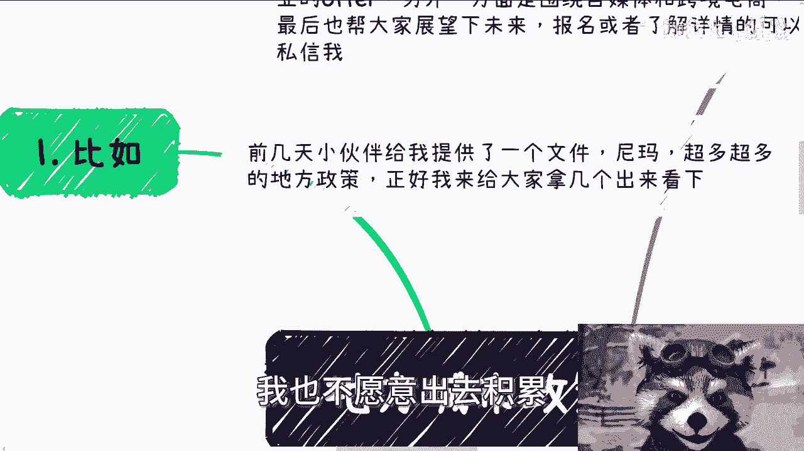
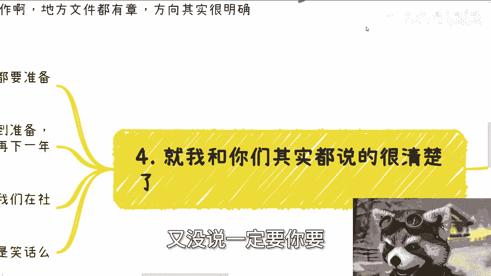
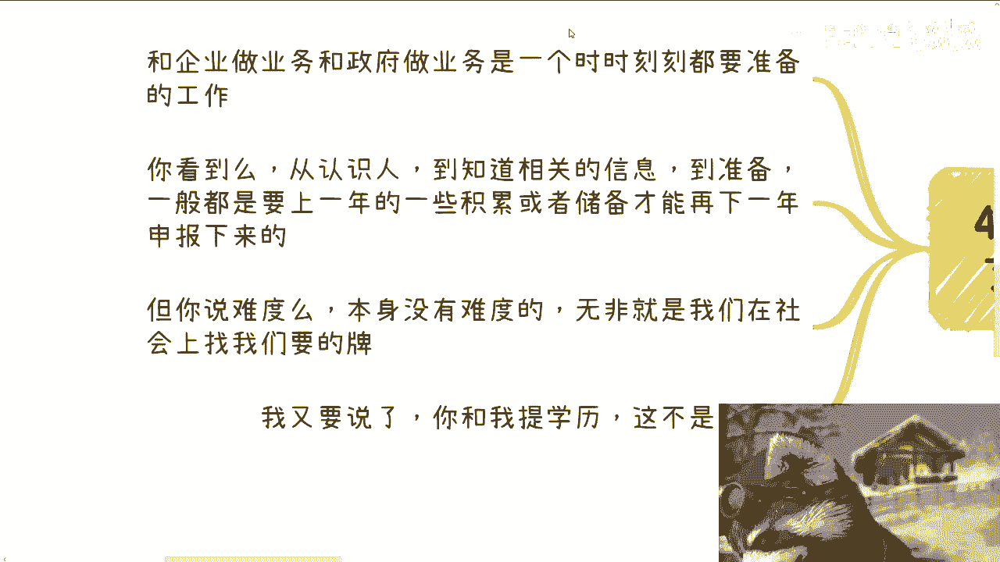

# 课程P1：地方城市数字经济政策实例解析 📄

在本节课中，我们将通过一个具体的地方政策文件案例，学习如何解读和利用政府发布的数字经济扶持政策。我们将以成都高新区的一份文件为例，拆解其核心内容、申报流程与条件，帮助你理解如何在实际中寻找并把握此类机会。

---

上一节我们介绍了关注地方政策的重要性，本节中我们来看看一份真实的政策文件包含哪些具体内容。

这份由成都高新区数字经济局与科技创新局于8月2日发布的文件，名为《成都高新技术产业开发区关于促进数字经济产业高质量发展的若干政策实施细则》。文件内容详尽，为相关企业提供了明确的扶持方向。

很多人不清楚该寻找哪个部门或如何对接。地方政策文件都有明确的发文单位和公章，寻找目标部门并不困难。真正的挑战在于明确自身能提供什么价值。因此，首要任务是进行能力与资源的储备。

以下是该政策细则中几个与大家关联度较高的支持方向示例：

**1. 支持基础软件产品评测**
*   **支持标准**：对首次通过国家指定安全可靠评测（如中国信息安全评测中心）的操作系统、数据库等信创产品，给予**100万元**一次性奖励。
*   **申报条件**：产品需在上一年度通过评测，且申报主体的工商、税收关系已在高新区。
*   **申报流程**：主要依据“免申即享”流程进行。

**2. 支持游戏产品研发与上线**
*   **支持标准**：对于获得国家新闻出版署版号并首次正式上线运营的游戏，给予研发企业和运营企业各**50万元**奖励。每家企业每年奖励总额不超过500万元。
*   **申报条件与材料**：与上述基础要求一致，需企业营业执照、法人身份证等基本材料。

**3. 鼓励电竞职业资格认证**
*   **支持标准**：对于高新区企业员工考取“电子竞技运营师”、“电子竞技员”等国家职业资格证书的，按等级给予企业一次性奖励。例如，一级证书奖励**5000元/人**。
*   **申报条件**：员工在政策有效期内获得相关认证即可。

从这些例子可以看出，政策申报本身流程清晰，门槛明确。其核心难点不在于流程，而在于前期的资源积累与整合。与政府或企业合作是一项需要长期准备的工作，通常需要上一年的业绩或资质作为下一年申报的基础。

此外，在这类面向企业的扶持政策中，**学历几乎从未被列为硬性门槛**。政策关注的是企业的实际贡献、创新能力和合规性，而非创始团队或员工的学历背景。

---

本节课中我们一起学习了如何解读一份地方数字经济政策文件。我们了解到：
1.  政策文件会明确支持领域、申报条件、流程与奖励标准。
2.  对接政府的关键是明确自身价值并提前进行资源储备。
3.  政策奖励覆盖从产品研发、资质认证到人才激励等多个环节。
4.  此类商业机会的把握重在长期规划和资源整合，而非临时行动。
5.  企业扶持政策的核心是实际贡献，而非个人学历。

各地省、市、区的政策框架大同小异，主要区别在于扶持的产业方向。有兴趣的学员可以自行搜索“成都高新区数字经济政策”查阅完整文件，并以此为例，探索你所在地区的相关机会。