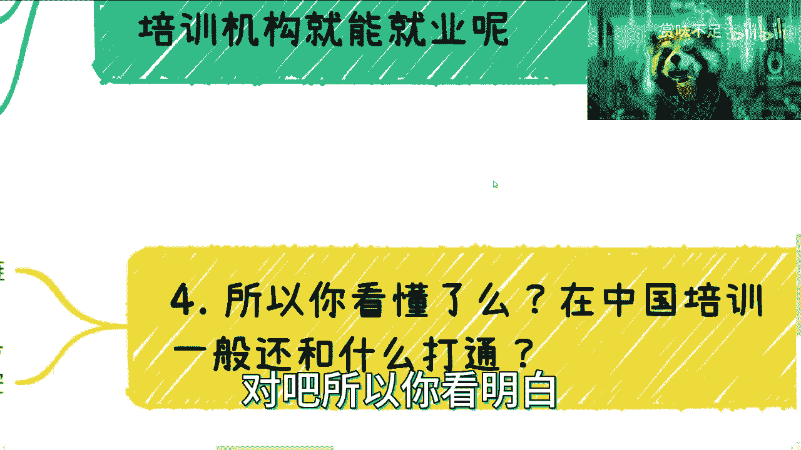

# 培训机构可以包就业的真相来了 - P1 - 赏味不足 - BV1ca4y1G7mJ

好啊，各位小伙伴大家好，我原本以为我叼了个烟斗是吧，但为什么它里面抽出来的是泡泡，我也表示不明白，那那那反正暂时也只能这样了啊。

关于这个培训机构包就业的这个事儿呢对吧。

我可以给你们详细说一下啊，你们也可以从这个当中理解对吧，什么叫商业逻辑啊，什么叫电池，什么叫打工，什么叫水上的20%，什么叫水下的这一部分的逻辑啊，你们可以看一下。

首先啊他说这样子的，他说有人问啊，他说驴老师，你说市场上找工作的人人数啊，比如说人数人的数量对吧啊是X对吧，岗位都是萎缩的对吧，数量是Y那为什么培训机构就能就业呢对吧，那理论上来讲。

两边可能是很难匹配的上的是吧，那么为什么说啊，这个培训机构说说就业就就业是吧哈，这个事情其实很简单啊，我觉得你们要是想不明白，就是因为你们知道的太少了，首先你们问我是不是真的就业。

我告诉你们是真的就业对吧，因为假的就业，我觉得这个大家就算是电池也不是是吧，你假的就业也假不到哪里去是吧，这是第一点，第二点呢就是说啊，本质上啊这件事情本身本身是不是真的，也是真的啊，也是真的，第三呢。

你说既然找不到人，为什么会多出来岗位呢，这个就是我们说的商业链条和商业逻辑了，这个后面我会讲的啊，第四个呢这个事儿到底怎么赚钱对吧，因为如果你说啊就是只挣培训费，我这么跟你讲吧，说不好听点对吧。

你们一个电池啊，一个人交3万块钱，就算我今天招到100个人，也就300万对吧，那很多人要说了啊，驴老师你真牛逼是吗，也就也就300万，同学们300万给你们，你们是觉得多难，但300万你要去做一个产业链。

这才多少钱对吧，我们一般说的是就是利润率对吧，毛利或者说是这个这个这个利润对吧，你跟我说300万就是个流水，哪有意义对吧，甚至到现在，可能很多人连利润和流水都还没分清楚对吧，那我就不去说了是吧。

然后最后呢啊这边呢还有人会说，他说是不是把学费给学生，你知道吗，因为之前有个段子一直说嘛，就说什么啊，收个10万块钱对吧，然后每个月返你1万是吧，就好像你赚钱了是吧，但是其实你要这么想的。

作为一个资本家啊，你说我要是收10万，我把钱还给你，那我跟你讲，我这不叫资本家，我这叫慈善家对吧，资本家是什么意思啊，资本家就是我但凡告诉你，你给我10万，我肯定从你身上赚到的不止10万，就这么简单。

否则叫什么资本家，你说是不是他妈垃圾，我跟你讲啊，那么还有就是呢就是我就说啊来啊，我也可以这么说，我说什么意思呢，就是说我给你们举个例子，我不知道你们能不能听懂啊，我说来我这边咨询的呢包一日三餐啊。

我就包啊，但是呢我也没说我包多久对吧，然后呢我就说我包我就算包，说包一辈子，我就请问嘛，你们有有些来跟踪这件事情吗，也没有吧，对吧好，那么这个时候呢久而久之啊，比如说过了10年20年。

那市场上流传一个传说对吧，就是说咨询驴老师呢能够包就包，不是包就业啊，包吃饭对吧好，那大家都来都来了是吧，但是问题是什么，问题是我就问你们，你们有谁知道我包三餐包了多久，有人知道吗，不知道吧对吧。

我包吃什么你们知道嘛，吃屎也是包三餐了对吧，吃什么你们知道吗，也不知道是吧啊，所以我跟你们讲包就业这件事情是什么概念呢，就是说真一定是真的，但是你要去关心的是你包多久对吧，包的是什么对吧啊。

然后就是说这件事情本身，到底对你自己有多大帮助，你明白吧，就是我觉得有非常多的电池啊，就是这个思想上面很神奇，就是那种什么呢，他说哎呀，我现在找不到工作对吧，说半天我找不到工作。

但是你让他这个读一个培训啊，包就业，他立马给你拿个35万出来啊，35万出来，然后呢他其实工作了，你比如说打个比方，工作过三个月，工作个一半年对吧，工作一年他35万也赚不回来，我也不知道他图什么。

你知道吗，他是图这些培训内容呢还是图什么，而且说白了这些培训内容跟跟给他的东西，他也也对他未来找工作找就就没有帮助，你知道吗，就可能就是35万买个心里安慰你，但是呢他们还得帮别人数钱的时候。

还得说谢谢啊是吧，那我就就我也就不明白了对吧，呃那这是第一个啊，我们来接下来网上说二对吧，二哈，那我们先来说岗位为什么会多出来这件事情啊，那么很多人可能也不明白是吧哈，首先呢很多人会觉得自己找不到工作。

其实找不到人啊，为什么会多穿呢，呃我跟你说，这些岗位大部分都是定制化的哦，就是说他是很可能，半年前或一年前给企业定制的，给外包公司定制的，或者给成员定制的，那我举个例子啊，比如说很简单啊，这个企业说啊。

我现在做个业务啊，我就需要打个比方，我就需要100个扫地的对吧，那我就问你嘛，你现在如果是一个承包方对吧，你我就跟你说了，我说我要他妈100个扫地的，你怎么着哦，我觉得你怎么着。

你知道boss视频上发呢还是怎么着呢对吧，当然了，最有效的方式是什么，就是你先去培训对吧，你说我就办个培训班啊，也不用多，比如说300块钱一个人对吧，我从这个300块钱一个人里面大概报名。

大概比如说500个人对吧，我从500个里面挑100个，给出个企业不就了了吗，对不对啊，外包公司也是一样的，产业园更是了，产业园跟你说，我别的不管对吧，比如说我现在做那个直播产业园啊，我别的不管。

我就要2000万岗位，我管你给我招过来谁啊，是个活人就可以了，对不对，那这岗位不就多出来了吗，对了就是说你们要明白一点，就是什么呢，就是这个世界是很大的，你们所看到的东西都是很小的一部分。

并不是所有东西都只会在智联招聘，0K的in或者五幺呃，或者那个boss直聘上单，你知道吗，很多东西都是有需求的，但这个需求不是需要一些，比如中等偏上，中等偏下，它就是要非常底层的量，而且很大。

而且就是这种岗位，他为的不是岗位，他为的是KPI啊，我我觉得就大家一定要明白这一些啊，不明白唉，就就真的我我也很很焦虑啊，然后这是第二点，第三点呢就是说因为电池岗位真的需要太多了，你明白吗。

四两拨千金的业务太多了，什么叫四两拨千金呢，就是说我可能啊一年我只要一个，比如说200个人的年薪，可能就5万块钱的岗位对吧，那你年薪5万块钱，200个人是多少钱，就10万100万是吧啊。

不不不1000万啊，我说错了，你你比如说这个200啊，200个人对吧，5万1000万对吧，好，但是问题是什么，问题是你想想看啊，就是说我1000万的这个就业对吧，1000万的就是薪资。

我可能申请的可能就是一个亿或者五个亿，也就是说我拿到的钱，远远是比你整个单子或者整个付出要高，五倍到十倍的对吧，那么我说不好听点，这个每个电池的岗位对我来讲很重要吗，根本就不重要，你来也好，不来也好。

我要的是什么，我要的是人数，我要的是这个业务对吧，不是说给你多少钱，你跟我什么讨价还价，哎呀，你好像听上去哎呀，我很牛逼对吧，我我年薪5万对吧，我我今天跟这个老板讨价还价，我讨到了年薪10万。

你你觉得你很牛逼，但有卵用的，没有卵用的，对不对啊，就是哎呀，就是我为什么一直跟你们讲，你们要去接触更多的人，看到更多的东西，你们了解商业逻辑，这就是原因，是，因为你们不能所有东西都认为。

你们看到的这个全部怎么可能呢，对吧，而且这种事情我就这么说，中国这么多城市，你你一二线城市跟345线城市操作一样吗，也完全不一样，但是你们不知道对吧，有人会跟你们讲吗，我不是我说什么。

你们就算去上那种三五十万的EMBA的课，有人会这么跟你们讲嘛，也不会，对不对，因为什么，因为现在像我这样的人就很少了，是吧啊，然后还有对吧，你比如说岗位就业也好，我跟你讲，很多时候是一个节点的绩效。

什么叫节点的绩效，就是比如说我只关心2024年，2023年中间，比如说年中到年末对吧，就业是多少，岗位是多少，我关心你知道岗位，他他妈的就业多少年嘛，对就像我刚跟你们说的，我只关心我给你们包包三餐对吧。

我关心我会关心包三餐，包几个月，包一年还是包一辈子，谁关心这事情，没有人关心商业市场单价，只关心赚钱，的跟我扯别的，你知道吗啊，然后呢，所以我就问你们，你们听到这，你们觉得问题在哪，你们想想看对吧。

我觉得有个正常智商的人都应该明白问题在哪，问题就在于这本来就是个商业行为，别就觉得你们去培训了或者怎么包就业的话，听上去很牛逼是吧，我就包就业了，包你妹啊，包对不了，那照你这么个说法行啊。

那我包你三餐饭，我包六个月也是包啊，六个月之后你给我滚，我管你这么多，我难道包你一辈子有本事，我你有本事让这些培训机，培训机构包你一辈子就业去啊，你看看他们敢不敢签这合同是啊，而且我说不好听的。

大部分人根本就他妈的不看合同，看得懂吗，你们也看不懂对吧，看不懂为什么是因为无知，是不是对吧，第三对吧，说这个东西怎么赚钱啊，好首先就像我刚刚说的，资本家的逻辑是，我除了赚你培训费，如果我只赚你培训费。

这不叫资本家，这叫啊，这叫闪避，那你首先你看啊培训费对吧，这是肯定的啊，第二政府补贴具体看项目，比如说季度半年一年就业多少人对吧，包多少就业，提供了多少岗位，给多少补贴对吧，这个都是有所谓的梯度呃。

阶梯是这个补贴的，你知道吧，就比如说大约多少人5万，大约多少人，15万，大约多少人30万对吧，这种补JT是补贴啊，外包介绍费，什么叫外包介绍费呢，就是你可以跟外包签合同对吧，就是说培训机构一般跟外包钱。

跟外包签是什么呢，一年我就提供你100个岗位啊，100岗位你除了要给我那个服务费以外，因为我给你提供岗位，你肯定得得给我服务费吧对吧，你除了给我服务费以外，你还需要给我人头费对吧，每提供一个人头。

你需要给我个人头的年薪的15%，到20%，当然一般现在外包，因为效绩效也没那个业绩不好，所以说可能没这么高了，我估计10%到15%差不多了啊，然后还有一种是什么呢，就是你所就业的单位。

跟你的培训机构其实是一家单位，只不过你们不知道对吧，他可能是他跟他的朋友共同注册的，也可能他跟他的亲戚共同注册的，然后再外包出去，你知道吗，就是你去的可能就是一家外包公司，然后呢他再把你外包出去。

比如说外包给腾讯啊，或者阿里呀，或者华为啊啊，但是他不跟你说外包对吧，或者说或者说你去的就是一家成员对吧，里面比如说做设计啊，做什么东西，你看上去也蛮牛逼的，不是外包，但其实本质上就是外包，就从商业上。

其实你就是给产业园的外包，你知道吗，就都一样的啊，不管包装怎么样，其实都一样的，因为你反过来想嘛，你反过来想嘛，如果不是这样子啊，如果不是这样子啊，我今天来培训你们，我还要给你们注册一家公司。

给你们交社保，给你们去就业，我就问你们嘛，哪个老板会这么做，你们今天当老板，你们要这么做，你们也会亏呀，你们只会亏，整个资本家商业逻辑上面谁会做亏本实验，不会的呀对吧。

我觉得你们但凡用你你你们的脑子想想看，当然有很多人没有脑子是吧，就就做电池对吧，除了来除了那个帮别人数钱，还来帮别人骂我是吧，那我也没办法是吧啊，那么比如说这个地方，你会发现这里面我刚刚说的所有东西。

这里面有任何一个地方有门槛吗，我就问啊，这里面有任何地方，你们觉得有所谓的技术门槛或者什么门槛吗，没有你如果非要说他只有一个门槛，就是整合资源跟画饼的能力没有了，这事情过于简单，你们谁都可以做。

但是你们主要是不了解里面的商业逻辑，你们也不了解里面的很多的这种套路，这也是为什么我跟你们说，你们就要多接触点人，多去了解水下的世界，多去了解这个世界规则对吧，的每天在那边看短视频。

就就一天到晚这样看看，那样看着好像觉得自己什么都懂，其实你们什么都不懂是吧啊。

除了什么都不懂，还在那边嚷嚷着说要赚钱，我也是真的服气对吧。

所以你看明白，在中国培训一般还和什么队打通呢，白条贷款你们去看好了，这个东西是是一个自古以来，大概起码有个十几20年的，这个历史都一样的啊，前面所谓的上游跟白条打通，下游跟保险打通啊。

这产业链不要太牛逼啊对吧，你们只要去看做的牛逼的都这么做的啊，然后我跟你讲很简单，在资本市场别来跟我谈底线，有他妈什么底线啊，我只要不违法就是底线，你管我这么多，是不是方法多的是要赚钱，方法还不足嘛。

对不对，我跟你讲，无非就2。1，你不懂二你二你足够底线足够高，结束了就这么点B事，哪里这么多废话，是不是，我跟你讲，你们有空出去喷，你还不如有空多了解了解商业逻辑，你还不如有空多跟我扯扯淡，你说是吧。

你在那边每天喷过来，喷过去有什么用呢，没有用的呀，除了怨天尤人，除了抱怨你还会干嘛，没有没有办法，对不对，我我昨天那个视频都说的这么清楚了，主要是电池，别来跟我BB对吧，还他妈的有人过来过来。

自找无趣对吧，直接拉黑，我懒得屁话啊，然后那个诶怎么不动了对吧。

还有第五点，第五点就是什么呢，我我说这个最后总结一下，就是说培训机构我觉得是好的，而且一定是需要的对吧，也就是说毕竟整个金字塔底层的岗位，还是需要很多人去做的，但是呢我觉得培训机构得要告诉大家。

真实的情况，以及他也得教学有用的东西，因为现在的培训机构，我觉得你们去培训没有问题，但是他老师给你们画饼，老师在PUA，你们对吧，因为很多人私信，我就说哎平时跟跟他们说就业很广泛，市场很大，什么区块链。

到处都是就业的，供不应求，就他妈都他妈扯淡，市场上面他妈的创业的人都死光了啊，连他妈自己都活不下去了，他妈有岗位呀啊还他妈在那边骗啊，然后一个人说个什么四五千五六千的对，不然后出来根本找不到工作。

这不扯淡吗，在对了，这种评论机构暖他妈的良心啊，是不是，第二点，就是什么教学东西跟行业真正的东西没有用，他妈的都是什么落后于行业一两年两三年的，有什么好做的，有什么好培训的，对于你们来讲，你们不懂。

所以你们知道这些东西好像很先进，好像很怎么样，但你真正学完之后，你要去就业的，你到考行业里面就会发现，其实他妈的自己还是很落后啊，那就两三万，不是扔在水里吗，对了。

好了最后啊，我先讲到这儿，我相信所有人心里面还会有个问题，说什么呢，说啊驴老师啊，那你既然这么讲。

为什么这么多的就业的人没有人出来喷他们，哥哥们，我觉得是这样子的啊，从几点角度来讲，第一世界很大，网络又很大，就算喷他们又怎么样呢，你是一个几百万的大V还是几千万大V，你喷他们怎么了呢。

能有多少人知道你会看到吗，你看不到，因为你看到的整个世界的一角，对不对，这不是没有人喷啊，只是你们不知道啊，是不是，这是第一点，第二点是你花了两三万，然后去喷人家，你觉得有意义吗，你想想有没有意义。

我说的不好听点啊，第一你花了钱再去喷人家，我觉得你在承认自己对吧，第二是这些培训机构远远比我，你们就是远远比你们来给我做咨询，掌握你们的信息来的多吧，身份证各个东西。

你们就不怕这些信息回头他妈的卖给公司，把你们直接打入黑名单是吧，你们要明白资本家的手段是很多的是吧啊，所以呢很多时候呢我觉得还是那句话，就是嗯，我觉得大大部分的电池呢，看世界是一个二维的平面世界。

而且只看到自己的那部分人认为地球是平的，但是呢其实它是一个非常立体的，甚至是个多元化的世界啊，那么有一部分电池对吧，在了解了事实真相之后，他愿意积极的去探究真相，而有一部分的电池对吧，愿意永远做鸵鸟啊。

然后哪怕知道了，或者哪怕觉得自己知道的不是真的，也会继续催眠，自己觉得是真的就这么简单。

好吧行吧，反正你们有什么我也不强求大家来咨询，随便你们吧，反正有需求的私信我没有嘛，也不用三连。

