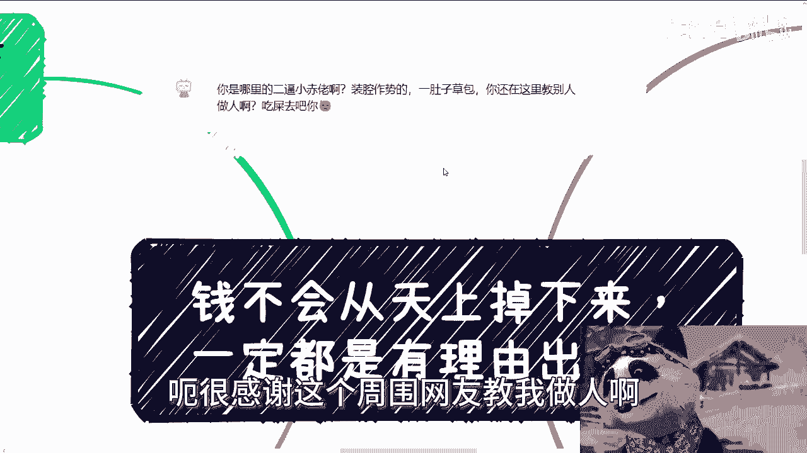
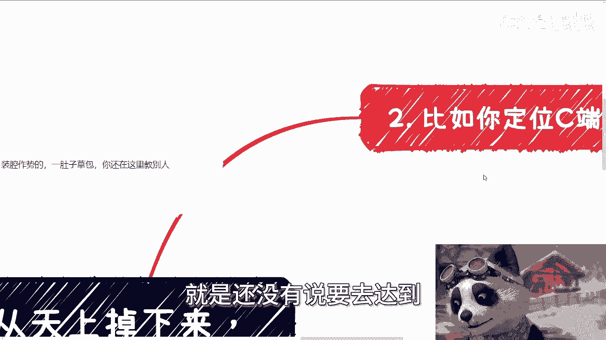
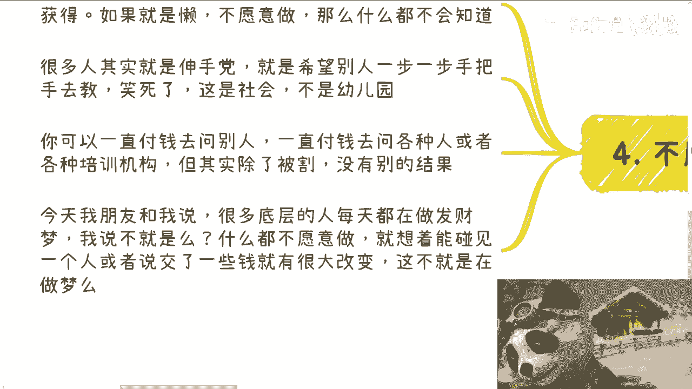

# 多问自己用户画像是谁？掏钱的理由是什么 - P1 - 赏味不足 - BV1dZ421W7XT

好大家好啊，现在12。1刻啊，这个最近睡比较晚啊，呃今天呢首先是这样子的啊，我给你们看一下网络现在多么的美好啊啊啊。

给我再给大家欣赏一下是吧啊，网络多么美好啊，呃很感谢这个这位网友教我做人啊。

真的我觉得我日常除了打游戏以外。

的确是需要受点鞭策啊，呵蛮好的啊。

那么今天呢我们这个主题啊，说的是钱不会从天上掉下来啊。

一定是有理由出来的，或者说一定是有某些名目的啊，那么第一呢就是说钱这个东西啊。

额我们首先先从宏观来讲，他不会从天上掉下来，更不会无止境的去应对吧，就说前者呢他是不现实的，后者呢但他也不现实对吧。

虽然就是说后者是人为可以发生，但是呢他不太可能发生啊，那我们一个个来讲啊，正常逻辑你要印钱啊，你要增你要增发没问题啊，但是不可能无止境对吧，那么也就是说你如果想赚钱，他一定是有一个让你赚钱的对象。

同时这个对象会有个理由，让这个对象把钱从口袋里掏出来啊，那么如果你找不到这个对象，同时你也找不到这个理由，那么嗯嗯嗯嗯，也就是说这个这个逻辑你走不通嘛对吧，如果你找不到，那这个逻辑走不通。

那么你所提出的赚钱的方案，很有可能就是其中天上掉下来啊，虽然你不是这么想的，但是你其实会得出这么个结论啊，也就是说这个理由跟所谓的由头呢，就是大家目前大概率都不知道的，因为你们从出生到教育到现在。

没有人会告诉你们啊，那么很多都在拼命说啊，要学历，要专业，那我就问啊，你脖子上挂着MIT，挂着哥大啊，挂着各种各样的google这种公司对吧，各种证明啊，那么同时你专业很牛逼。

当然我我说你这种专业很牛逼，就一般牛逼啊，不是说那种得诺贝尔奖对吧，就是那种天赋异禀的那种牛逼对吧，那然后呢你挂着这些东西站在马路中央，然后呢钱从你的脑门上掉下来会吗，不会，那就意味着什么。

意味着这件事情不能给你带来钱，不能直接给你带来钱，就这么简单，你要了解的是他到底怎么带来钱的对吧，所以你对象定义好，你就要清楚的了解这些对象的父亲，的逻辑是什么，理由是什么，否则你怎么赚钱。

就是我跟你们这么说，所有的人沟通下来，无论他是很优秀还是怎么样，还是说自己，比如说已经有一些成熟的想法了啊，你就自己问你自己，你比如说你跟我说，你说陈老师我要去做自媒体，我要去做叉叉叉怎么样子。

你就问你自己，你做这件事情有你的客户是谁，以及以及你切中客户到底哪个付钱的逻辑点，如果你想不明白，那就说明这件事情你还没有。

就是还没有说要去达到。

就是说啊你很自信或者怎么样子的，你可以通过试验去摸索啊。

但是你不可能说你说你就非常自信的，或者说啊就是就是那种纯走一步看一步的不行，你心里得要知道，你的目的，是为了摸索清楚这个对象的这个付钱逻辑啊。

那么比如说啊你定位C端对吧，C端的付钱逻辑一定是因为自己有诉求，一定是因为情绪价值，或者说他你能够解决他真正的问题啊，那么同样的大部分人，因为中国这个土地上面啊，大部分人他根本就不知道自己是谁啊。

就像我以前说过，他根本就不知道自己要什么，所以说你如果要去赚中国C端的这些钱，那么你更多的是要去明白他们真正的情绪价值，和他们真正的普遍性的这个内容在什么地方，对你你你你才有可能去让对方掏钱嘛。

但核心点是C端要什么，而不是你会什么，你会什么并不重要，因为地球不是围着你转的，你是围着别人转的，如果你要赚钱。

你一定要围着你的客户转，对不对，那这是核心啊，所以不要去想着你会啥，比如说你跟我说，你说你会钢琴对吧，会代码会写这个小说对吧，包括有很多人跟我说会做一些周边啊，我跟你们说都无所谓。

因为大部分你们会的东西都是，相当于在一开始就自己给自己定了一个，就是怎么说呢，是定了一个那个框框，定了一个束缚，定了一个约束，你这就好像什么呢，在一个鱼塘里面捕鱼，如果你的目的是为了得到更多的鱼。

那你是不是需要去一个基数比较大的鱼塘里，对不对好，那么你得真的去了解哪个鱼塘基数大，而这个鱼塘为什么基数大。

也就是我们说的这个客户，他到底要什么对吧，而不是说你会什么，你跟我说，你说哎陈老师，我会ABCDEFG对吧好，那么你会ABCDEFG，你把这个ABCDFG啪扔到了一个鱼塘里面。

很少有只有很少鱼的这么一个鱼塘，你再会ABCDEFG有什么用呢，没有用啊对吧，所以你要去想用户大面积基本盘的需求是什么，当然也许你可能不知道，但我们知道一点，至少你擅长的大概率不会是用户大面积需求。

对吧啊，那么第三我们称之为大企业，就是大弊端，大G端高效端啊。

就统称为大弊端啊，那么这种大弊端，或者说机构的钱，更加是每一笔都有一定的理由了，你比如说高校对吧，软硬件软硬件设施升级啊，课程采购，师资培训实验室啊，专业共建竞赛，一加X对吧，国际交换生等等等。

每一笔钱都是有理由的，那么也就是什么意思呢，也就是说如果你今天想要去赚高校的钱，那么你就问问自己，你今天的产品或服务切中对方的哪一个东西，而且你得去确定是能够切到那个东西的，那么你才能知道哦。

可能这条线上面大概是多少预算，以及怎么切你，你否则你说你不知道你，你就说啊我要切这个东西，这不是做梦吗对吧，比如说企业对企业花钱，要么就是比如说跟风对吧，大家怎么说呢，叫做人来疯啊。

跟风要么就是说他有真正的需求采购，要么就是政治命令对吧，红色红色任务啊，那么必须要做什么东西，要么就是日常的，比如说人才培养啊，办公用品啊，团建啊对吧，一个111样的道理。

我不管你们今天到底做软件还是做呃，传统的一些东西，你总归得切中一个点吧对吧，你比如说政府，政府就更别说了，政府大部分都是政政治命令对吧，那么我们就说活动沙龙大会，创新项目人才引进，招商引资。

前沿科技培训，还是各种各样别的，如果你想赚他的钱，那么我就问你切中了哪个比较前沿的政治命令，你不要跟我说，你什么政治命令都没切到，那赚个屁啊，对不对，就是你得明白不同的客户，他都有不同的这个钱的出口点。

这才是真正的赚钱的逻辑，那不是说你说啊，我今天这个产品做的多好，这这有啥用，对吧啊，那么第四点我跟你讲啊，不愿意做，你什么都得不到对吧，就这个事情真的我我今天不得不吐槽。

就是所以这些信息你们是获取不到的，但是你们如果想获取，他只有可能通过社交跟落地去获取，如果你懒，你不愿意做，那你什么都不会知道，我跟你们讲啊，很多人，中国的基本盘，95%以上的人都是伸手党。

他就是希望别人一把一一步一步手把手去教，但是他又不愿意出钱啊，你这叫你们他妈这叫人啊啊这配做人吗，对不对，但我告诉你不好意思，中国他妈很多老百姓基本盘就他妈这么啊，我跟你们讲啊，你可以一直付钱去问别人。

一直付钱去问各种人或者各种培训机构，但是你问不出个所以然来的，你其实除了被歌没有别的，结果很简单，就这么简单啊，今天包括我朋友下午再跟我说，他说啊，很多底层对吧，每每天额这个都在做发财梦。

我说不就是吗对吧，我说大部分中国的基本盘是什么，就是什么都不愿意做，也不愿意奋斗，也不愿意去实践，也不愿意也不愿意主动做什么对吧，就是想碰到一个人或者碰到一个机会啊，让自己就是买张彩票，这个中大奖。

这不是做梦是什么呢，是不是在搞笑吗。

对不对对吧，这些人每天除了在那边抱怨。

除了在网上抱怨，除了去嫉妒和眼红，别人还会干嘛呢对吗。

真的我跟你们讲啊，你们记住一点，你们大部分人对中国基本盘不了解，你们要记住，你们如果有一定的想法，或者有一定的主观主观能动性，你们已经是领，就是已经领先于，或者说已经强于中国，95%到98的人了。

你知道吗，那么你们一定要记住一点，就是你们与他们的区别，比你们与猪的区别都要大，你明白吧，就是我们就一常说嘛，人与人之区别比比人与猪的区别都要大，就是说你们如果想要去赚钱，你们要摸到对应的一个东西。

但是摸到对应的东西，这些逻辑没有，你们想的这么复杂，更多的是你们要去探索，要去挖，要去碰，他背后逻辑朴实无华，无非就是说你今天一个产品，一个服务是不是打中了这个点进去没了对吧，这个产品或这个服务细节。

你说重不重要，唉只能说就说你的饼画的怎么样，很重要，啊好吧，所以说你们如果但凡现在再做点副业，或者自己在创业，或者自己做点东西的，你们多多问问自己，就两个问题，一客户是谁。

二我切中的是客户的哪一个出钱的理由，的这么一个出口对吧，因为你明白一点，就是社会发展到今天，出钱的理由都是一样的，他的名目都是固定的，不会说啊，去年的名目没有，今年多多出来个名目，不会的，你知道吗。

就是不管你是元宇宙，不管你是什么数字经济，不管你是什么东西，你一定会切中一个固定的出钱的名目，如果你切不中，你想去赚钱，这个逻辑本身就不通，好吧啊行，那就这么着吧，啊嗯好吧，然后就是职业规划。

商业规划啊，然后呃你们比如说合同啊，商业计划书啊，白皮书啊啊然后分润分红啊，啊包括你们手上有什么牌，你们手上没有什么牌啊，然后你们也是希望通过跟我的沟通啊，得到一定的呃这个规划，或者说从我的这个视野。

给到你们更多的一些这个规划方向啊，那么你们可以再私信我找我咨询啊，那么我顺便提一点啊，我能给你们的就是事实真相啊，我不会手把手来教你们啊，也没有人会手把手教你们，你们但凡要想手把手的，你们就别来找我啊。

你们该去交那种45万10几万，你们该想交给谁。

交给谁。