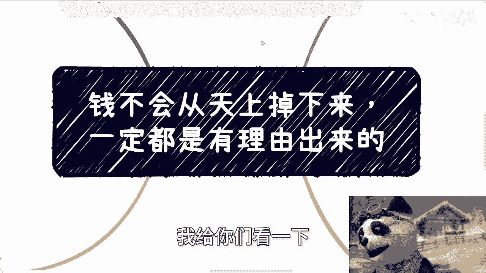
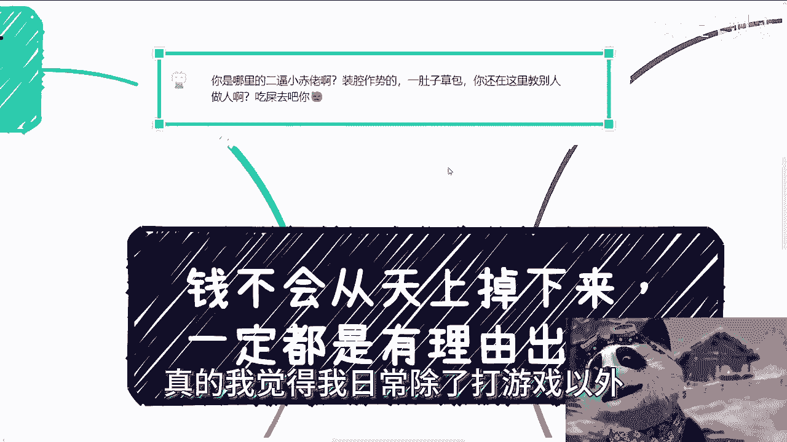
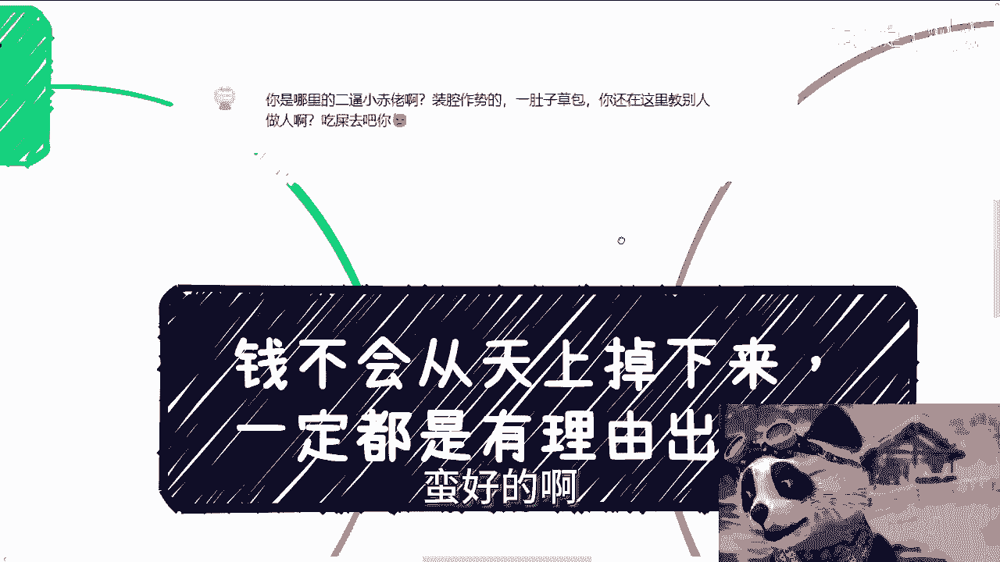
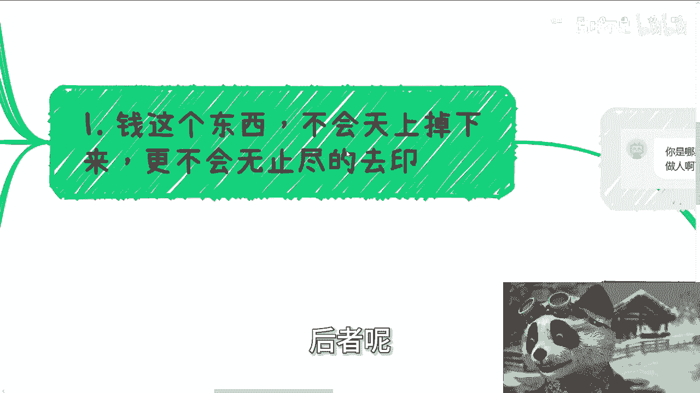
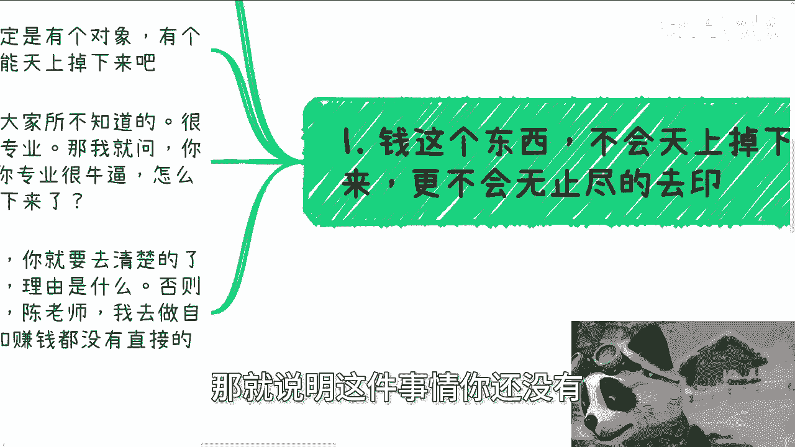
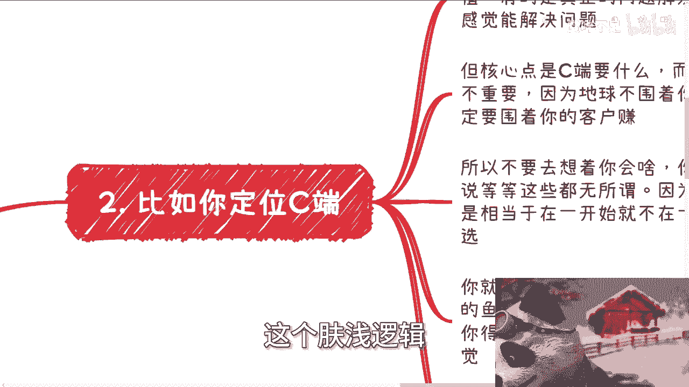
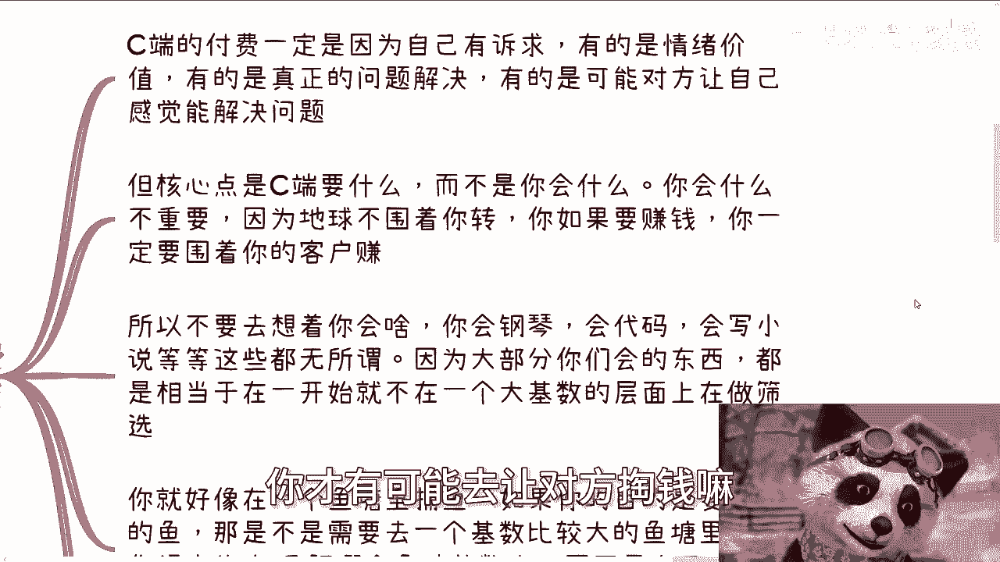

# 多问自己用户画像是谁-掏钱的理由是什么---P1---赏味不足---BV1dZ421W7XT_not

在本节课中，我们将探讨一个商业与赚钱的核心逻辑：钱不会凭空产生。我们将学习如何通过明确“客户是谁”以及“客户为何付钱”这两个关键问题，来构建一个可行的商业思路。

---

上一节我们提到了赚钱的基本前提，本节中我们来看看为什么钱不会从天上掉下来。

钱不会从天上掉下来，也不会被无止境地印出来。前者不现实，后者虽然人为可控，但也不可能无限发生。这意味着，如果你想赚钱，必须有一个明确的“付钱对象”，并且这个对象有一个“付钱的理由”。

如果你找不到这个对象和理由，那么你的赚钱逻辑就走不通。你所设想的方案，本质上就等同于期待“天上掉钱”。

---

很多人从出生到接受教育，从未被教导过这个逻辑。他们被告知要追求高学历和好专业。

但即使你脖子上挂着MIT、哥大的文凭，或者谷歌的工牌，站在马路中央，钱也不会从你的脑门上掉下来。这证明学历和专业本身不能直接带来金钱。你需要了解的是，它们“如何”带来金钱。

因此，你必须定义好你的客户，并清楚了解这些客户的“付钱逻辑”是什么。否则，你无法赚钱。

---

以下是检验任何商业想法时，必须问自己的两个核心问题：

1.  **客户是谁？**
2.  **你切中了客户的哪一个付钱理由？**

如果你想不明白这两个问题，说明你的想法还不成熟。你可以通过试验去摸索，但你的目的必须明确：**摸索清楚客户的付钱逻辑**。

---

上一节我们强调了两个核心问题，本节中我们来看看针对不同客户类型，他们的付钱逻辑有何不同。

**1. 针对个人消费者**

个人消费者的付钱逻辑，通常基于自身诉求、情绪价值，或者你能解决他的实际问题。

在中国，很多人并不清楚自己真正想要什么。因此，如果你想赚个人消费者的钱，你需要理解他们普遍的情绪价值和真实需求。

**核心是“客户要什么”，而不是“你会什么”**。地球不是围着你转的，如果你要赚钱，你必须围着你的客户转。

不要被自己“会什么”所束缚。这就像在一个鱼塘捕鱼：如果你的目标是获得更多鱼，你应该去鱼多的大鱼塘。你需要了解哪个“鱼塘”（市场）基数大，以及为什么大（客户需求是什么），而不是执着于自己“会捕鱼”的技巧。

**2. 针对大型机构**

大型机构（如大企业、政府、高校）的每一笔支出都有明确的理由和预算名目。

以下是大型机构常见的付钱理由：

*   **高校**：软硬件设施升级、课程采购、师资培训、实验室建设、专业共建、竞赛、1+X证书、国际交换生等。
*   **企业**：跟风采购、真实需求采购、政治命令（红色任务）、日常运营（人才培养、办公用品、团建）等。
*   **政府**：政治命令、活动沙龙大会、创新项目、人才引进、招商引资、前沿科技培训等。

如果你想赚机构的钱，就必须问自己：你的产品或服务，切中了对方的哪一个“预算出口”？你必须确定能切中这一点，才能估算预算和切入方式。

---

了解了不同客户的付钱逻辑后，我们来看看如何获取这些关键信息。

这些信息无法凭空想象或通过简单付费咨询获得。获取它们的唯一途径是**主动的社交与实践落地**。

如果你懒惰，不愿意行动，你将一无所知。很多人是“伸手党”，希望别人手把手教，却不愿付出相应代价，这注定无法成功。

持续付费给各种人或机构，很可能除了被“割韭菜”外没有结果。真正的认知来自于你自己的探索、挖掘和碰撞。

---

在中国，大部分人的基本盘是：不愿行动、不愿奋斗、只想靠运气“中大奖”，并习惯于抱怨、嫉妒和眼红。

如果你有想法并具备主观能动性，你已经领先于95%以上的人了。人与人的区别，可能比人与猪的区别还大。

赚钱的逻辑并不复杂，核心在于你的产品或服务是否精准“打中”了客户的付钱点。有时，“饼画得怎么样”（即如何呈现价值）甚至比细节更重要。

---

本节课中我们一起学习了商业赚钱的核心逻辑。

总结来说，无论你是在做副业、创业还是其他项目，请务必反复问自己那两个问题：
1.  客户是谁？
2.  我切中了客户的哪一个付钱理由？

社会发展到今天，各类机构“出钱的理由”和“预算名目”是相对固定的。无论你的概念多新（如元宇宙、数字经济），最终都必须切中一个固有的付钱名目。如果切不中，赚钱的逻辑本身就不成立。

记住：**你要围着你的客户转，而不是让客户为你的技能买单。**