# 社交破局第一课：如何给他人留下深刻印象？💼

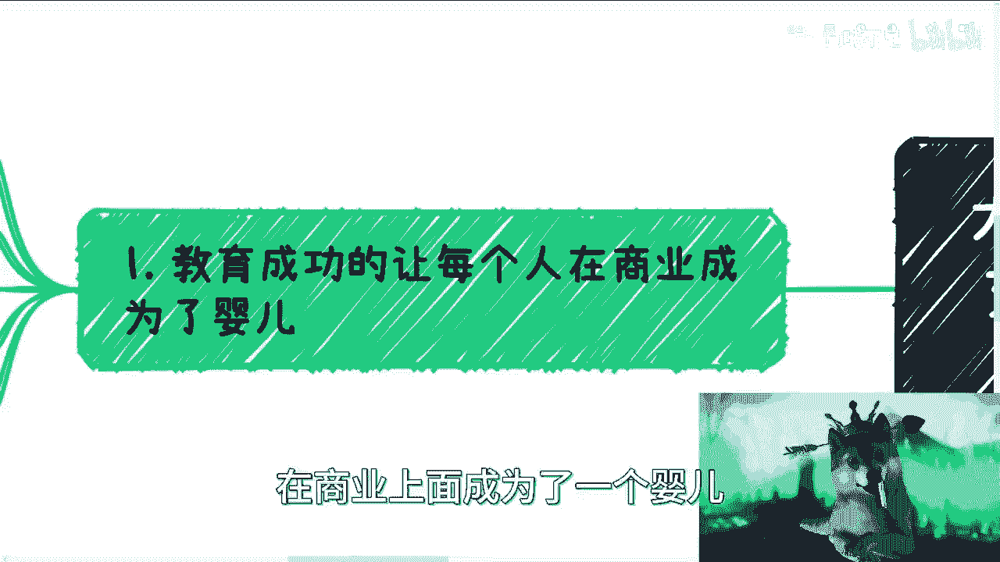

在本节课中，我们将探讨大学生或刚毕业的年轻人如何在社交场合中有效地展示自己，从而给他人留下深刻印象。课程将围绕三个核心要点展开：自信表达、资源展示与知识储备。

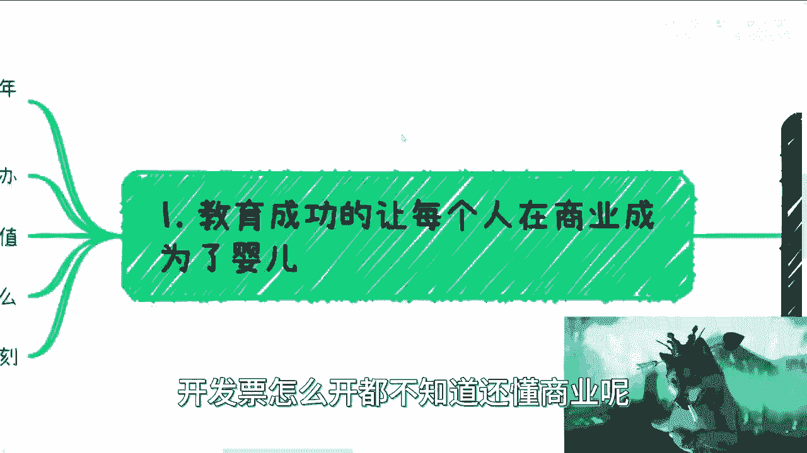

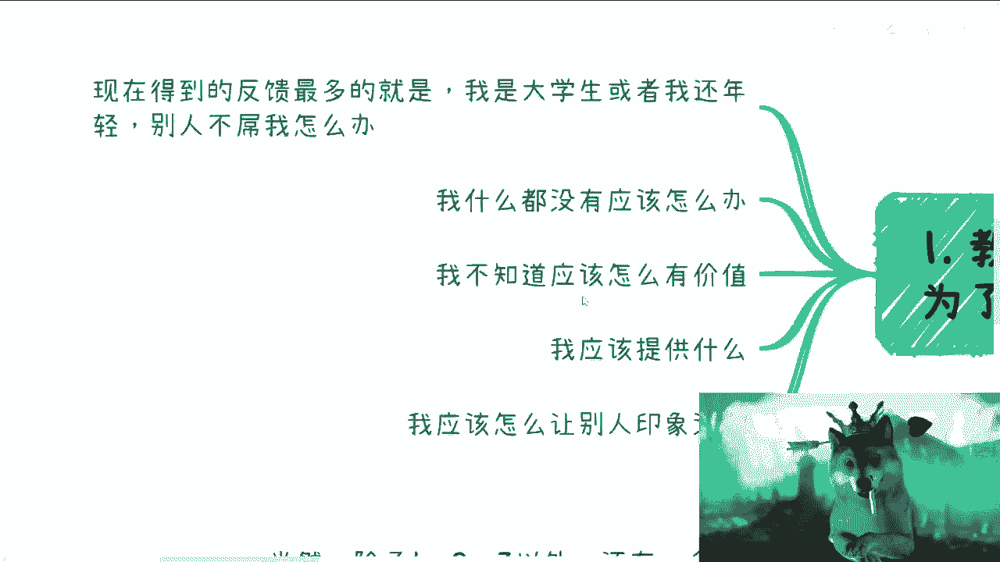

---

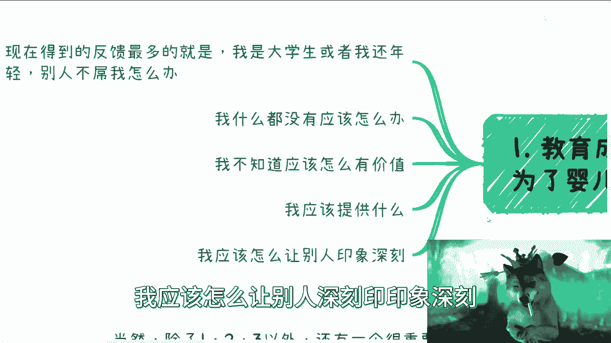

## 概述：为何你在商业世界中仍是“婴儿”？👶

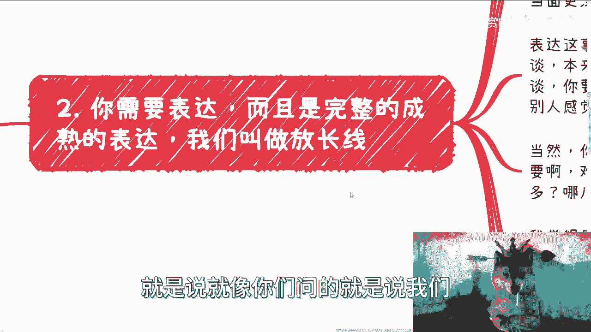

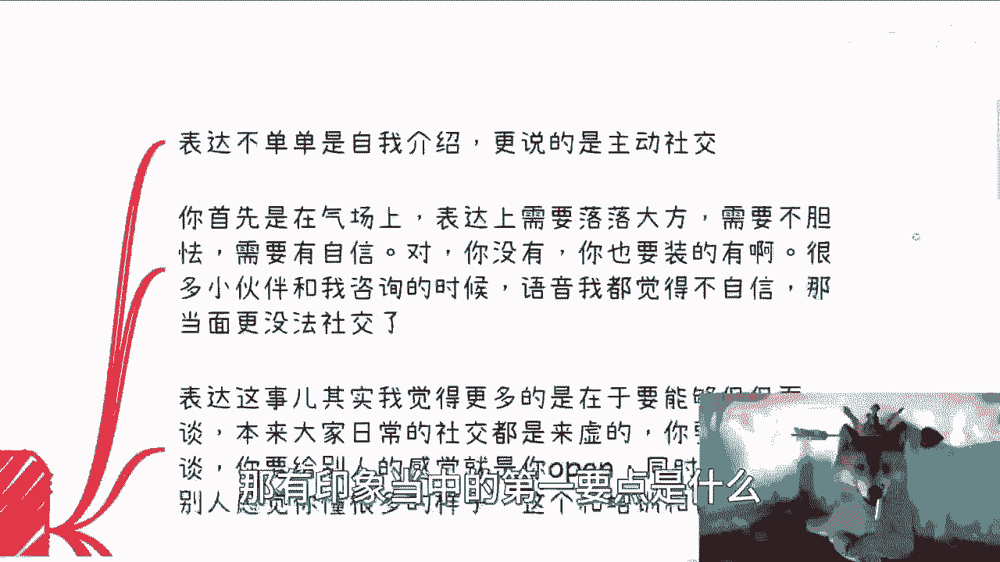

九年制义务教育加高等教育，可能让你在商业认知上仍处于初级阶段。无论工作多久或身处何种岗位，只要未亲身参与商业闭环运作，你对商业的理解就可能非常有限。这与你是否在大公司担任高级职位无关。

许多人反馈的困境是：因年轻或资历浅而被忽视，不知自身有何价值，也不知应提供什么以及如何让人印象深刻。

---

## 第一要点：自信且完整的表达🗣️

上一节我们指出了认知起点，本节中我们来看看如何通过表达建立第一印象。

在社交中给人留下印象的第一要点，是进行完整且成熟的自我介绍。你需要主动社交，但沟通时的**话术、语调、气场**至关重要。这与机械背诵完全不同。

你的表达需要落落大方、不胆怯、有自信。即使你自觉“不懂”或“什么都没有”，也需要在气场上“装”出来。如果无法做到，那么可能难以获得某些机会。

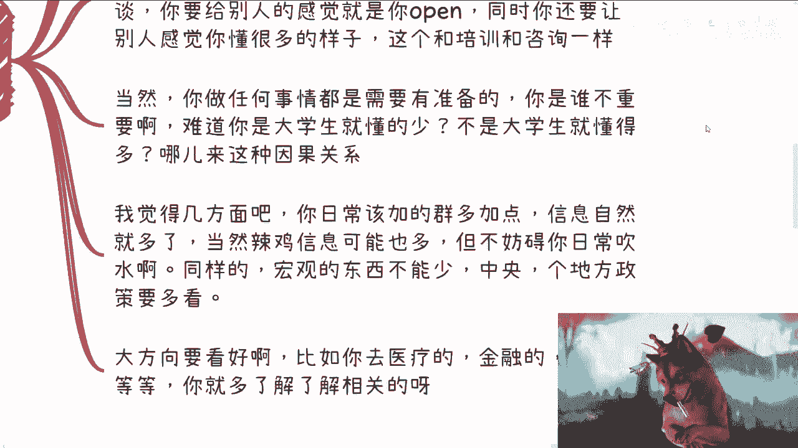

表达的关键在于能否“侃侃而谈”。日常社交多是“务虚”的，萍水相逢的交流通常只有几分钟。你很难进行深入的技术探讨，更多是展示自己，即所谓的“秀肌肉”或适度“吹嘘”。

你需要营造一种**开放、博学**的感觉。这类似于做咨询或培训：将多方信息汇总，结合自身理解形成一套逻辑自洽的论述，而不必保证其绝对正确。任何展示都需要准备。

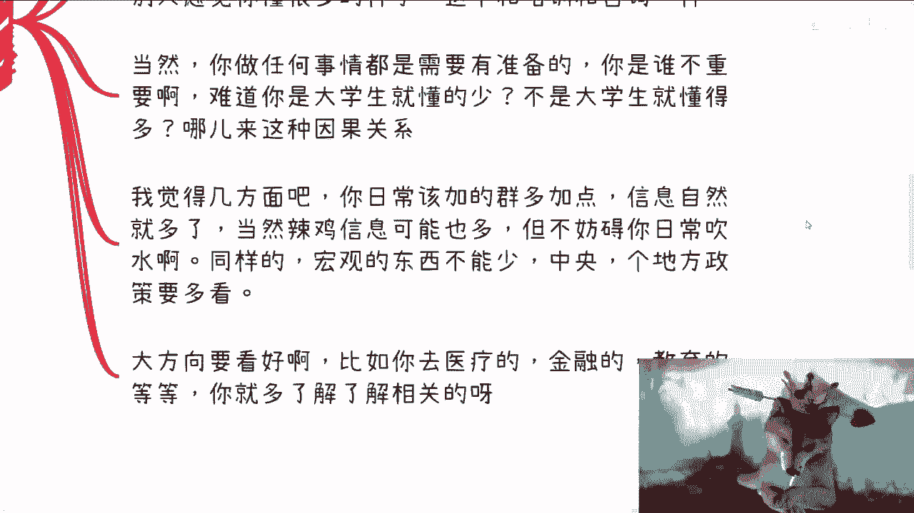

**你是谁并不重要**。不要陷入自我否定，认为“因为是大学生所以懂得少”或“因为工作多年所以懂得多”。这种因果关系并不成立。商业世界中，许多年轻人同样非常出色。

以下是提升表达能力的两个实用方向：

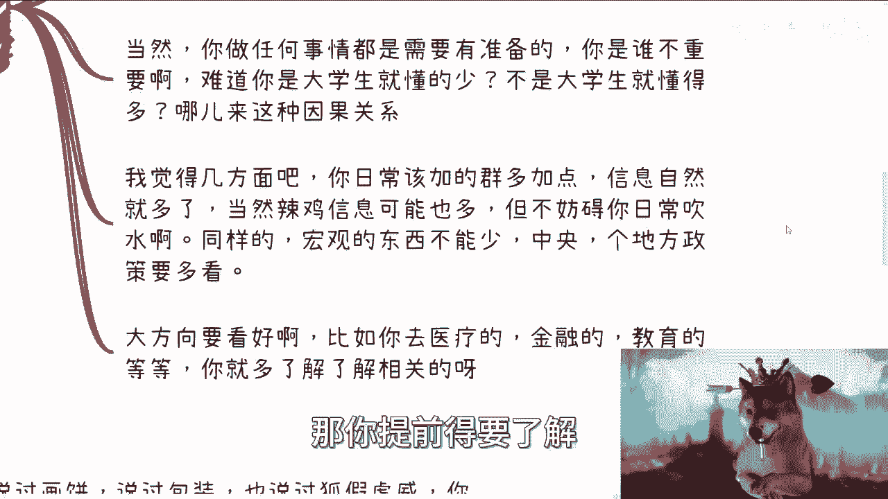

1.  **广泛获取信息**：加入相关社群，多与人交流。虽然信息繁杂，但足以支撑你在多数社交场合中“吹水”。在不同层级，你谈论的内容自然不同。
2.  **关注宏观趋势**：多看政策报告和行业文件。例如，当前从中央到地方都在谈论“数字经济”，了解这类大方向能让你言之有物。若想进入特定领域（如医疗、金融），则需提前了解相关背景。

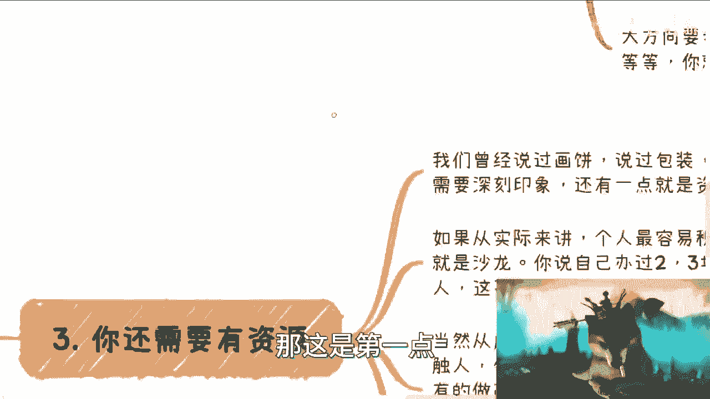

---

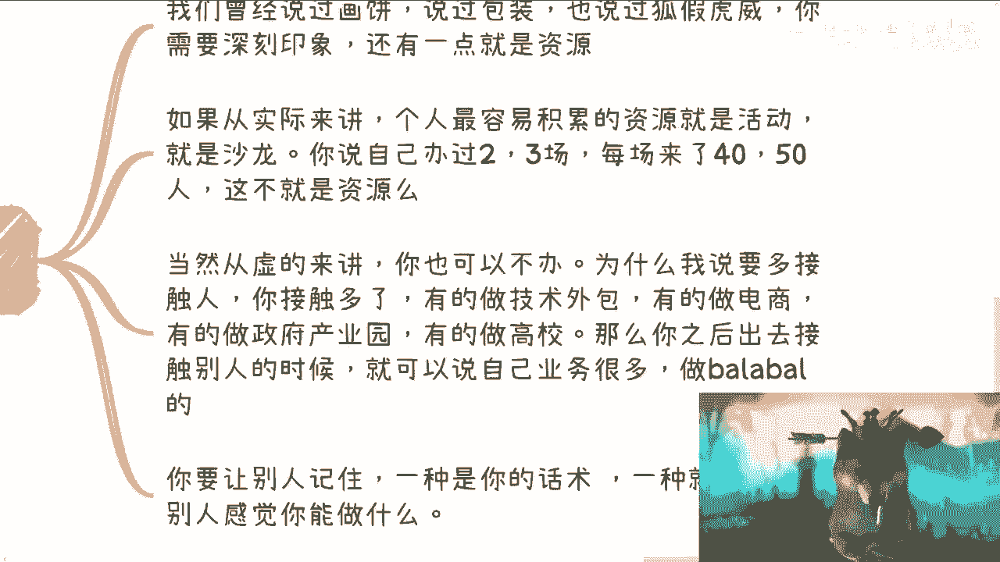

## 第二要点：展示你的“资源”🎯

上一节我们探讨了表达的重要性，本节我们聚焦于如何通过展示“资源”来加深印象。

除了话术，让他人记住你的另一种方式，是让对方感觉你“能做成事”。这通常意味着你需要展示“资源”。

从实际出发，多数个人并无雄厚资源。那么，个人最容易积累的资源是什么？答案是：**活动**。

*   **举办活动**：自己组织过几场沙龙，每场能召集几十人，这本身就是一种值得展示的资源。
*   **积累人脉**：多接触不同行业的人（如技术外包、电商、医疗、游戏、投行、政府园区等）。之后在社交中，你可以选择性地说“我这边认识做…的人”或“接触过…的业务”。这并非让你直接“拉皮条”，而是暗示你具备一定的连接能力，为后续潜在合作铺垫。

关键在于，不要思虑过度。在初始阶段，目标是留下印象和打开局面，具体合作模式可以后续再探讨。许多人困于“想得太多”而无法行动。

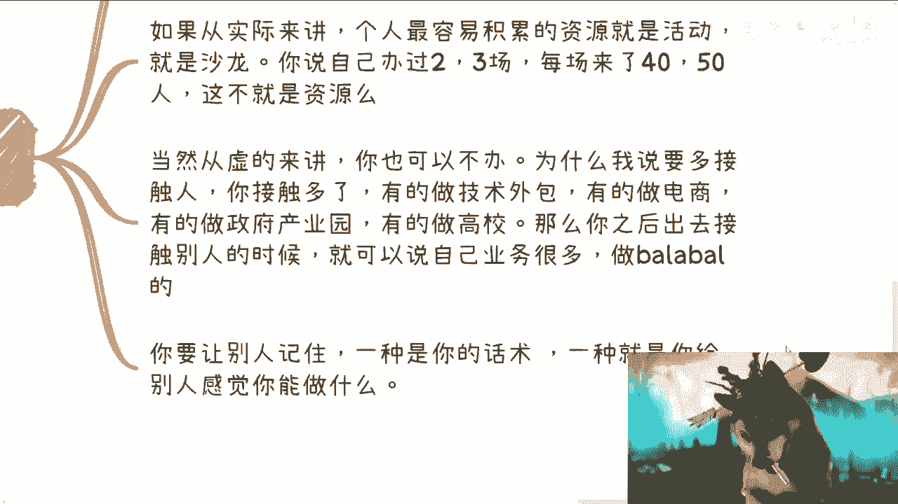

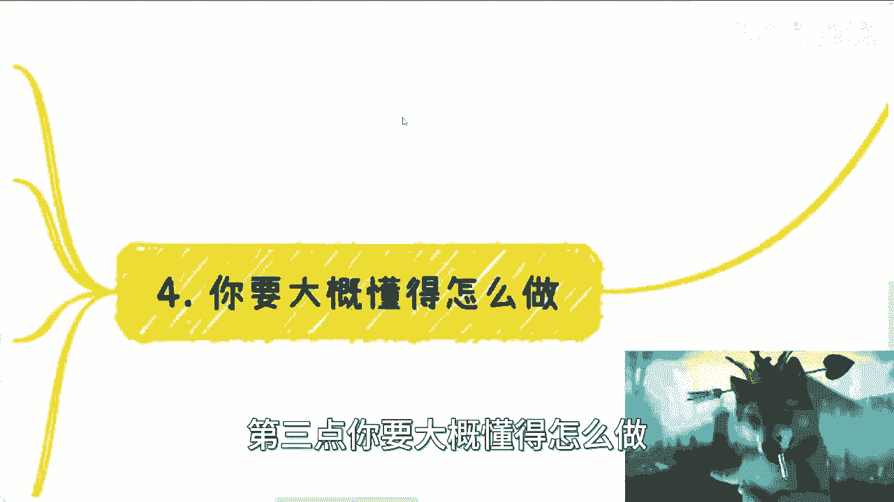

---

## 第三要点：掌握基础专业知识📚

上一节我们讨论了资源展示，本节我们来看看如何避免“穿帮”，即掌握必要的专业知识。

除了表达和资源，另一个关键是**懂得大概怎么做**。很多人担心：如果别人深入追问，自己露馅了怎么办？

避免穿帮的前提是**提前学习和了解**。如果你既想让人感觉厉害，又不愿学习，那是不现实的。

你需要付出努力去了解：

*   **合作流程**：企业间合作的基本步骤、合同怎么谈、方案（PPT）怎么写。
*   **行业知识**：参加某个领域的活动前，需了解该产业的上下游、关键角色。例如，参加金融会议，至少要知道一级市场、二级市场、期货、量化等基本概念。

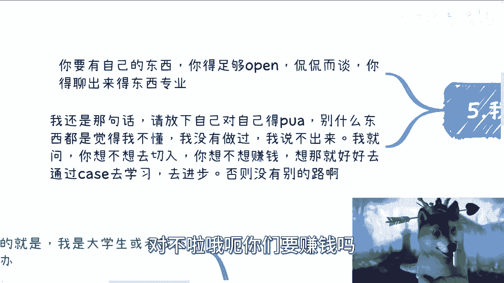

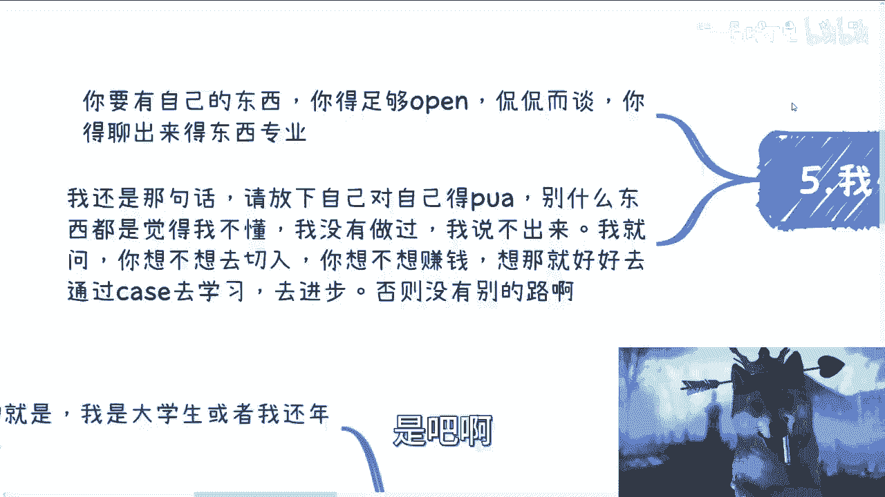

你的目标是，在开口交谈时，能让对方（特别是社交场合的多数人）感觉**专业**。商业世界如同“大鱼吃小鱼，小鱼吃虾米”，你只需要在你所处的层级显得足够专业即可。

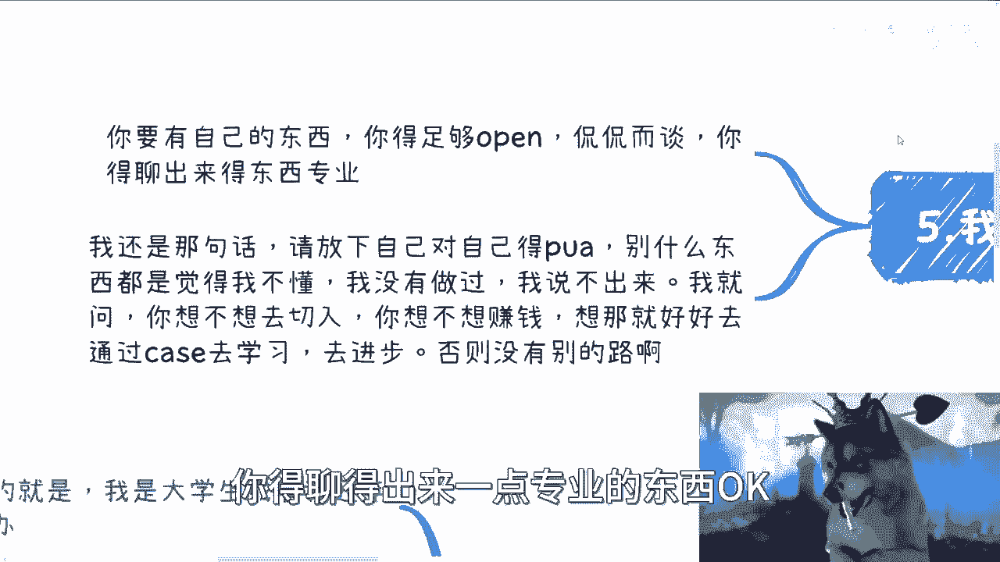

---

## 总结与行动指南🚀

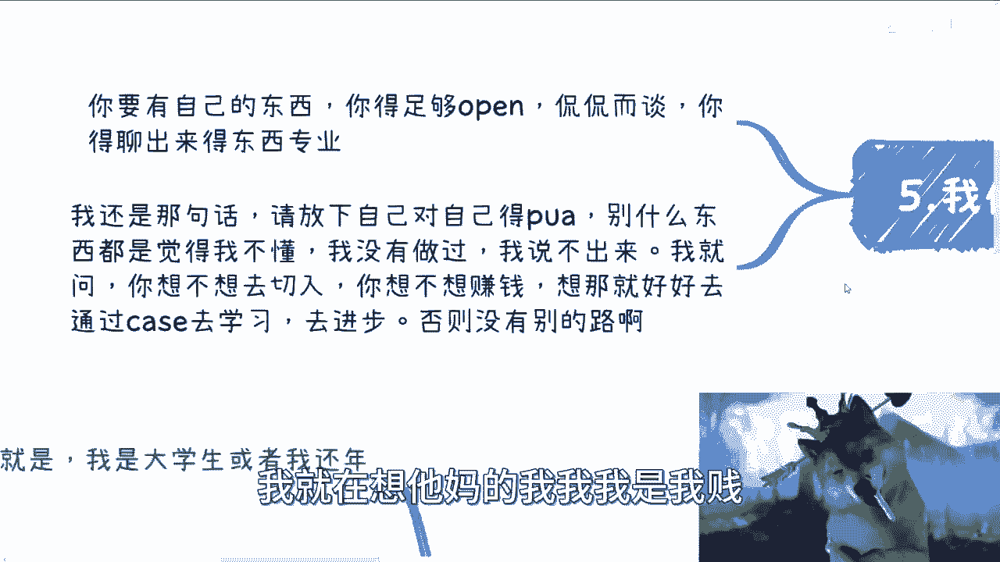

本节课我们一起学习了在社交中留下深刻印象的三个核心要点：

1.  **自信表达**：放下自我设限，准备成熟的话术，展现开放、自信的气场，并广泛吸收信息以支撑谈资。
2.  **资源展示**：通过组织活动或积累跨行业人脉，构建并展示你的“资源”网络，暗示你的连接价值。
3.  **知识储备**：针对目标领域，学习基础的专业知识和行业运作流程，确保交流时能展现一定的专业性，避免轻易“穿帮”。

**行动是下一步**：请准备一份详细的PDF或Word版自我介绍。并提前构思后续路径：是作为中介连接资源，还是自己成立公司承接业务？如果不懂，可以寻找懂行的人合作。不要试图所有事情都独自完成。

**核心公式**：深刻印象 ≈ **自信表达** + **资源暗示** + **专业感**。

放下不必要的心理负担，通过具体案例去学习、实践和进步。这是现阶段许多人拓展机会的可行路径。