# 大学生/研究生毕业找工作思路整理 - 课程01 🎯

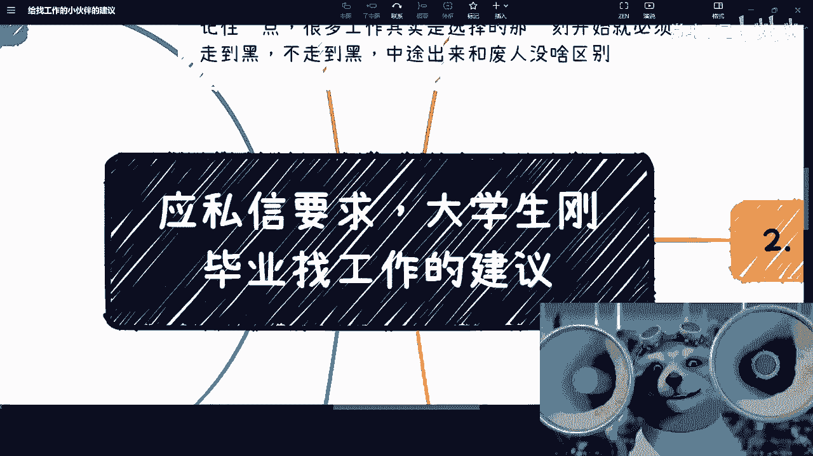

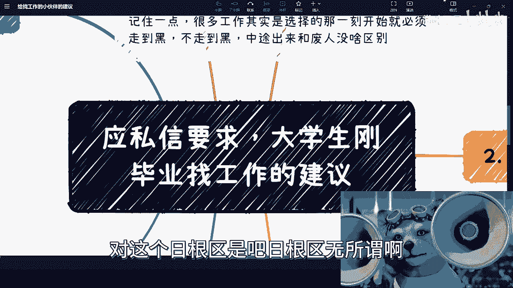

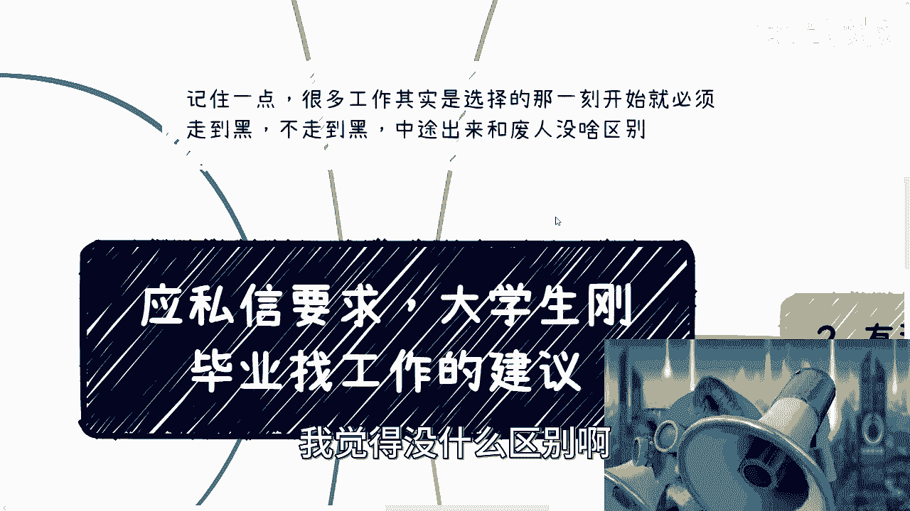

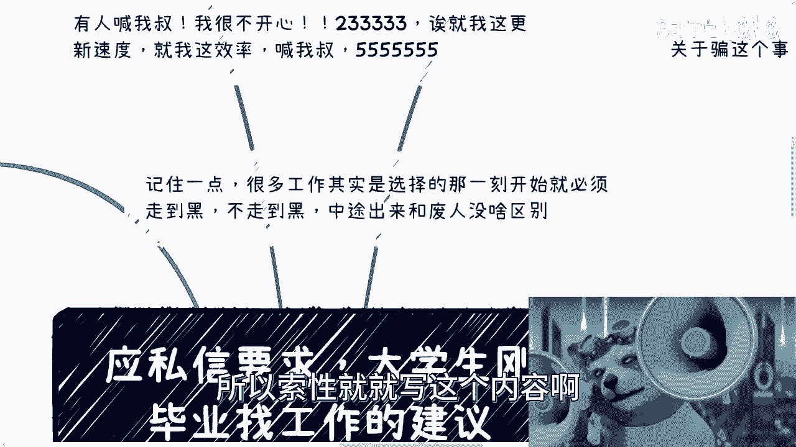

在本节课中，我们将要学习如何系统地梳理毕业找工作的思路。课程将涵盖方向选择、判断标准、公司/岗位优先级、考公与国企、工作后规划以及未来展望等核心问题，旨在为初入职场的同学提供一份务实的行动指南。

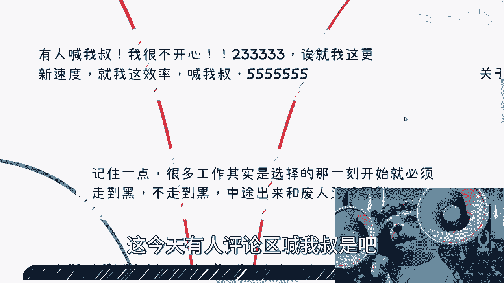

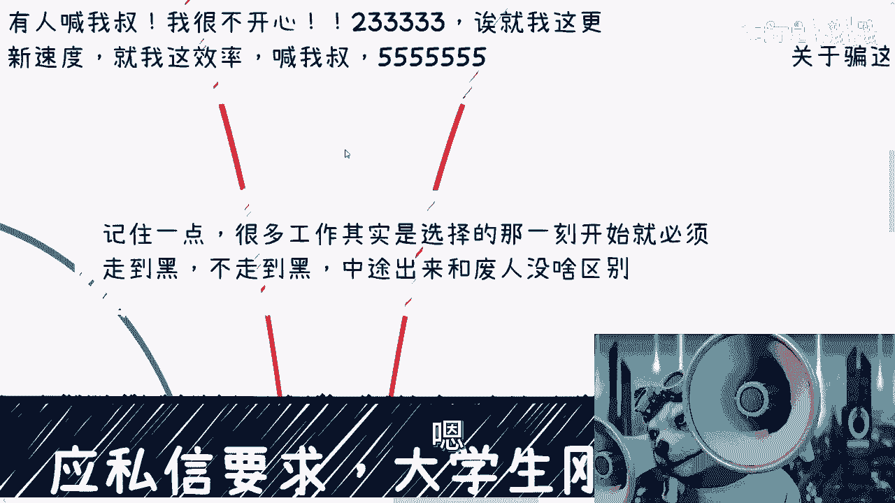

---

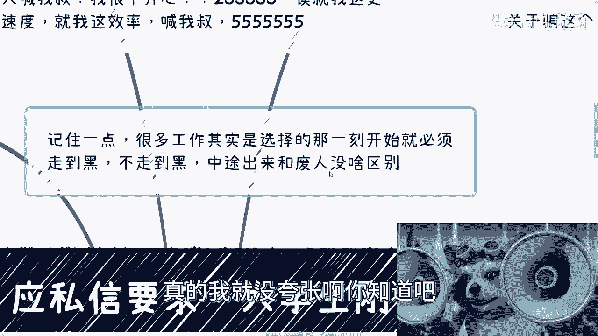

## 概述 📋

找工作是一个需要综合考量的决策过程。本节课程将拆解这一过程，从宏观趋势到微观选择，帮助你建立清晰的思考框架，避免盲目跟风或陷入无谓的纠结。

---

## 方向选择：兴趣、趋势与城市 🌍

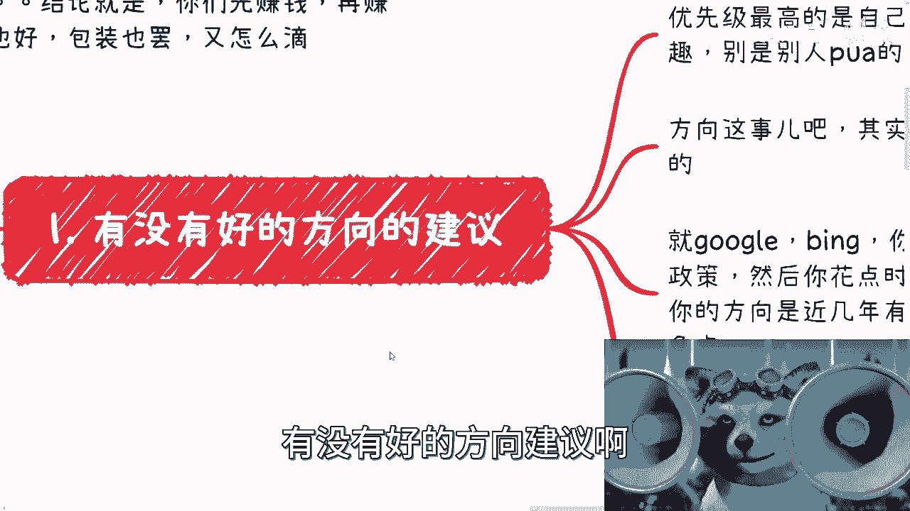

上一节我们介绍了课程概述，本节中我们来看看如何选择就业方向。

选择工作方向时，应优先考虑个人真实兴趣。如果兴趣不明确，可以暂时忽略此条。方向选择应结合趋势、政策与城市发展。

以下是选择方向的具体方法：

1.  **利用搜索工具**：使用搜索引擎，以“**行业关键词 + 城市 + 政策**”的格式进行搜索。例如：`人工智能 上海 扶持政策`。这有助于了解哪些城市对你感兴趣的行业有政策倾斜，机会相对更多。
2.  **接受不确定性**：工作环境、领导、公司规划等因素大多不可控。因此，不必过度纠结于寻找“完美”方向，长期来看差异可能没有想象中巨大。
3.  **选择通用性强的行业**：例如金融、计算机等行业，其技能和经验的扩展性较强，未来转行或调整方向的空间更大。相比之下，一些专业壁垒高或下行趋势明显的行业（如某些工科领域），局限性较大。

---

## 判断标准：行业、公司与岗位 🔍

上一节我们讨论了方向选择，本节中我们来看看如何建立有效的判断标准。

判断一份工作的优劣，可以从大到小，按行业、公司、岗位三个层面进行切入。

以下是具体的判断方法：

1.  **行业层面**：选择通用性强、发展面广的行业。可以通过参加行业活动、接触一线从业者（尤其是刚入职或转正不久的年轻员工）来获取最真实的一手信息。
2.  **公司层面**：研究目标公司的历史、部门状况和发展阶段。大公司体系完善，但岗位可能偏向“螺丝钉”；创业公司机会多，但风险也高。需根据个人追求（如稳定性、成长性、薪酬）进行权衡，避免无脑选择“大厂”或“国企”光环。
3.  **岗位层面**：岗位重要性次于行业和公司，但仍有影响。通常，运营、市场、销售等岗位更贴近市场和商业本质；而部分技术、产品、职能类岗位可能长期脱离一线，需注意其对个人综合能力培养的局限性。

---

## 优先级抉择：岗位 vs. 公司 ⚖️

上一节我们建立了判断标准，本节中我们来分析岗位和公司哪个更应优先考虑。

选择岗位优先还是公司优先，取决于个人特质与市场环境。

以下是两种策略的分析：

*   **公司优先策略**：如果你个人能力强、善于适应和“包装”自己，不介意频繁更换赛道，那么选择一家好公司作为平台是合理的。在多变的市场环境下，“落袋为安”（先获得一份工作）往往是稳妥的选择。
*   **岗位/行业优先策略**：如果你希望深耕某个领域，积累深厚的行业经验和人脉，为未来创业或发展副业打下基础，那么选择有成长性的岗位和行业更为重要。

需要警惕的是，对于多数普通劳动合同，不要轻信任何关于长期稳定或快速晋升的口头承诺。

---

## 关于考公、国企与“稳定” 🏛️

上一节我们讨论了公司岗位的优先级，本节中我们单独探讨一下常被问及的“稳定”选项。

考取公务员或进入国企、央企常被视为“铁饭碗”，但需要理性看待。

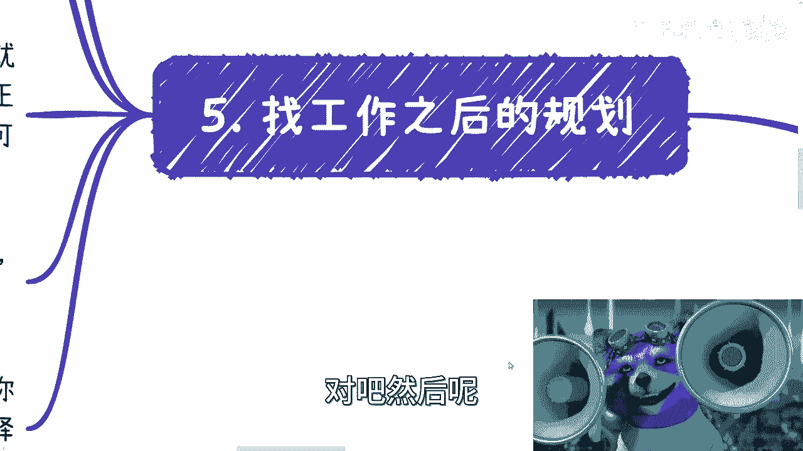

以下是需要思考的几点：

1.  **岗位性质**：许多基层岗位同样是“螺丝钉”，且晋升通道复杂。
2.  **时代变化**：过去的“铁饭碗”模式在未来未必持续，绝对的稳定并不存在。
3.  **个人背景**：需要客观评估自身及家庭在体系内的人脉与资源。对于没有特殊背景的普通人，合同工的本质不会改变，不应抱有不切实际的幻想。

---

## 工作后的初期规划 🚀

上一节我们分析了所谓“稳定”的路径，本节中我们来看看找到工作后应该立即做什么。

找到工作只是开始，后续的规划同样重要。

以下是工作初期建议采取的行动：

1.  **夯实专业或转型准备**：若非立志成为“多面手”，则应努力在自身领域做到精深，成为一个“优秀的电池”。同时要意识到，仅靠专业技能可能无法规避年龄危机。
2.  **积极拓展社交圈**：入职后，应主动在本地结识志同道合的朋友，尝试组建小团队。可以共同探讨“搞钱”思路、副业机会或资源共享。
3.  **避免无效内卷**：不建议将全部精力用于职场内卷。内卷的收益往往归于资本，且积累的资源可能无法随身带走。应思考如何积累属于自己的、可迁移的能力和资源。

---

## 未来规划：保持灵活，积累为王 📈

上一节我们制定了工作初期的计划，本节中我们展望更长期的未来。

在快速变化的时代，刻板的长远职业规划意义有限。

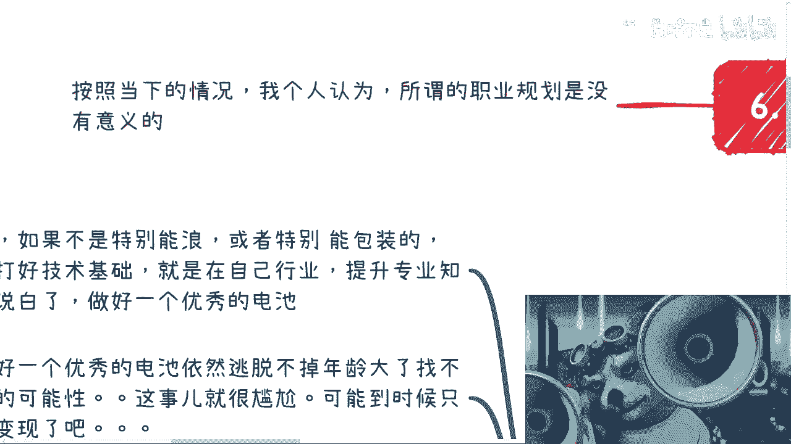

以下是关于未来规划的建议：

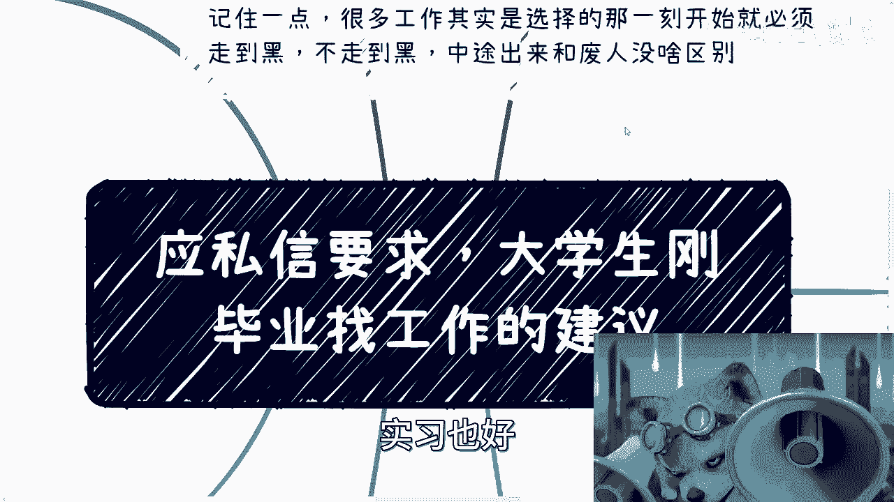

1.  **接受不确定性**：精细到年的晋升规划可能不敌市场变化。规划的重点不应是固定的职位路径，而是**能力与资源的积累**。
2.  **多元发展思路**：可行的路径包括：**主业副业并行**、**将主业当作副业来经营**（积累行业资源）、或**开拓多条收入渠道**以平衡风险。
3.  **厚积薄发，等待时机**：核心是持续学习与积累。当新的行业红利或机遇出现时，无论是直接投身其中，还是作为服务者、连接者参与，你都有能力抓住机会。

---

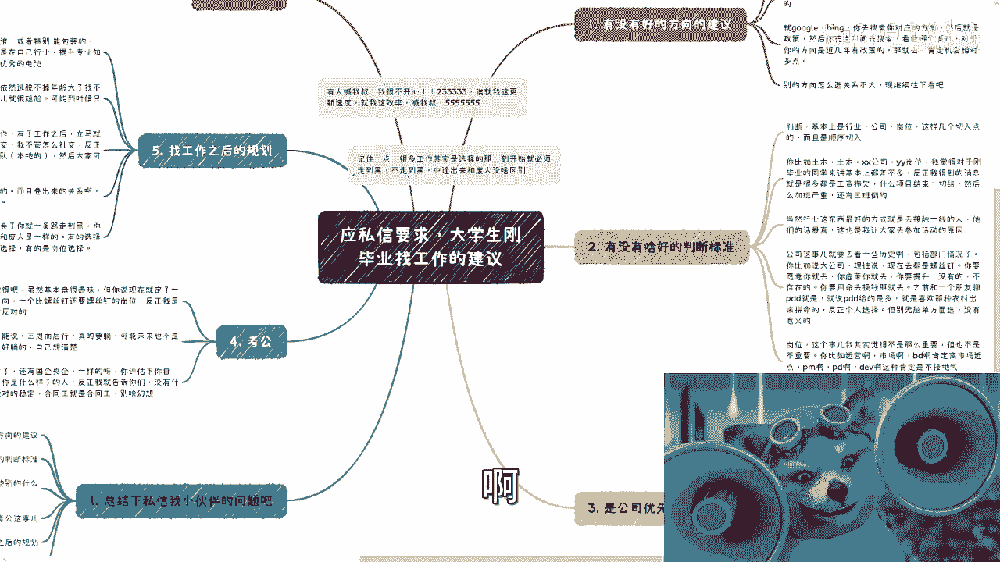

## 总结 💡

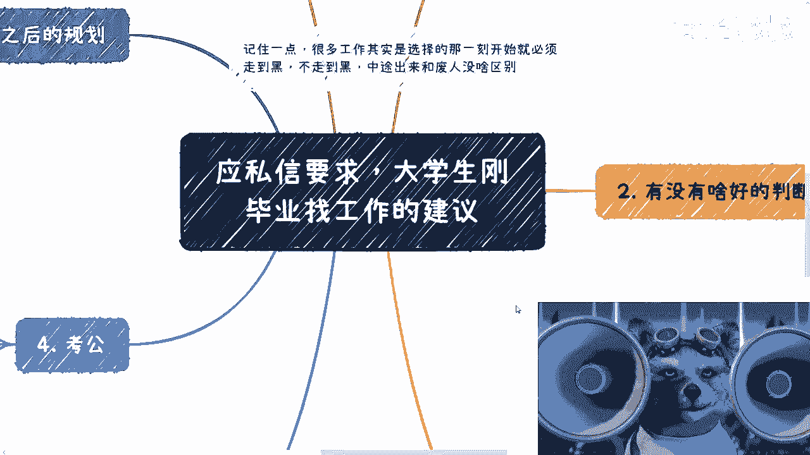

本节课中我们一起学习了毕业找工作的系统思路。我们强调了基于兴趣和城市政策进行方向选择，建立了从行业、公司到岗位的判断框架，分析了岗位与公司的优先级，理性探讨了考公与国企，并制定了工作初期及未来的行动方针。

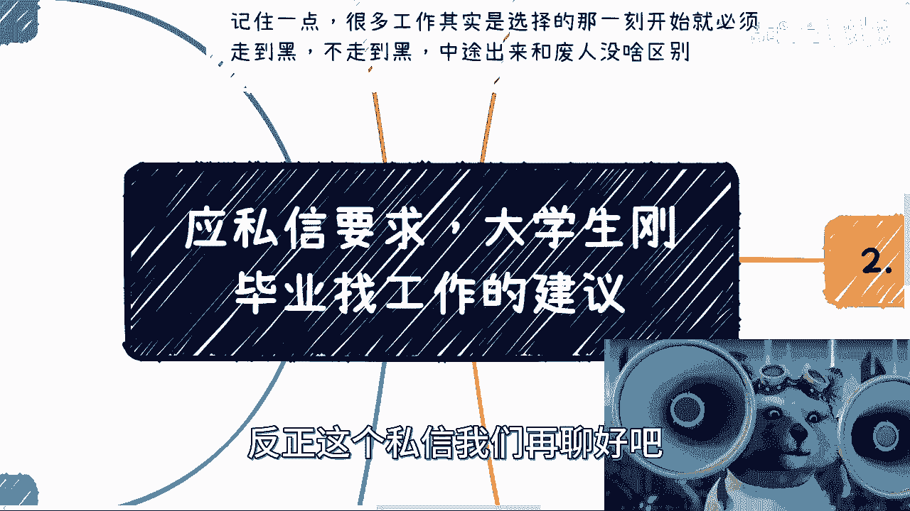

**核心要义**是：**放弃幻想，停止无谓纠结，主动搜集信息，大胆实践，并专注于积累可迁移的个人能力与资源**。你的每一个选择都应有自己的依据，切勿盲目听从任何单一建议。未来的道路属于那些有准备且敢于行动的人。