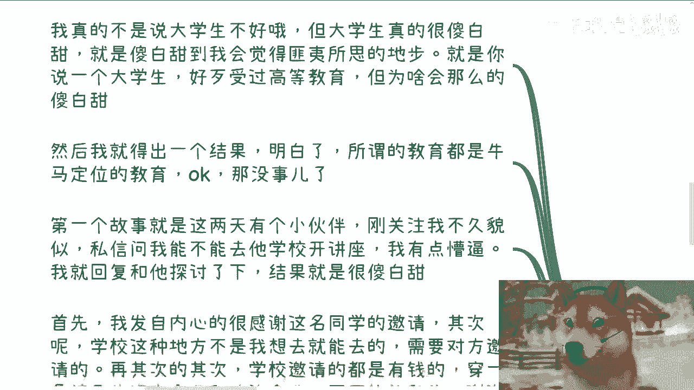
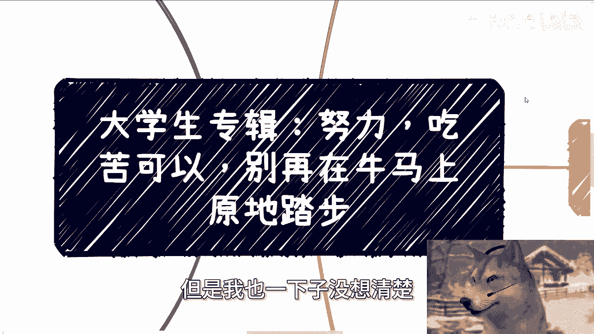
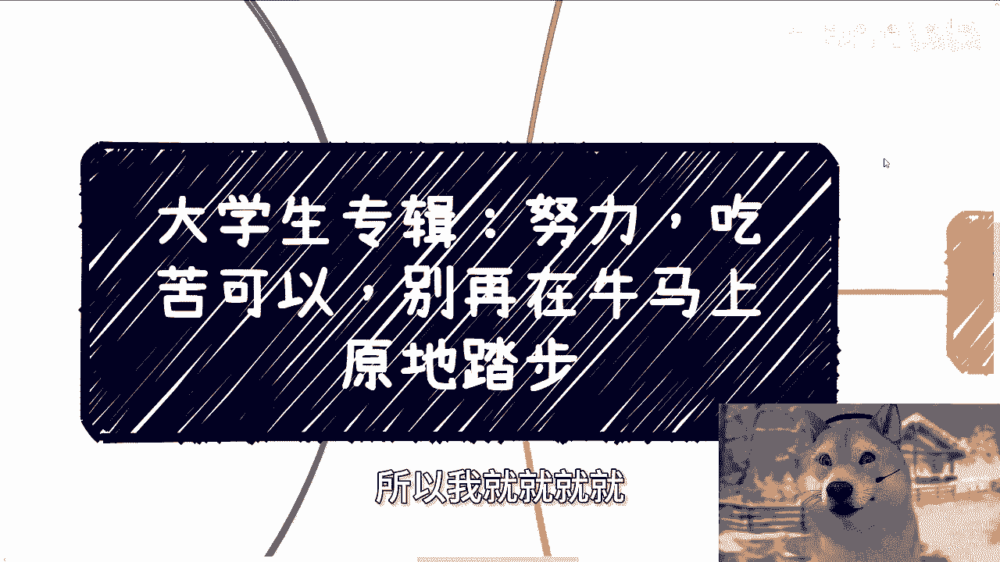
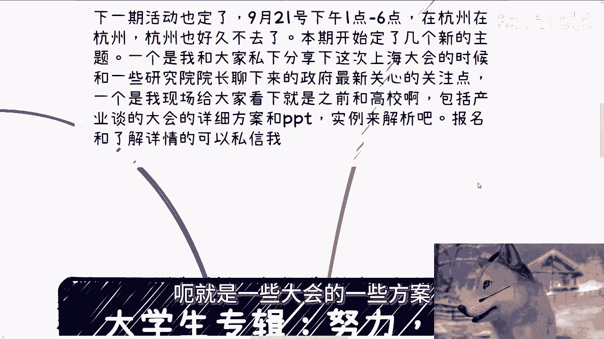
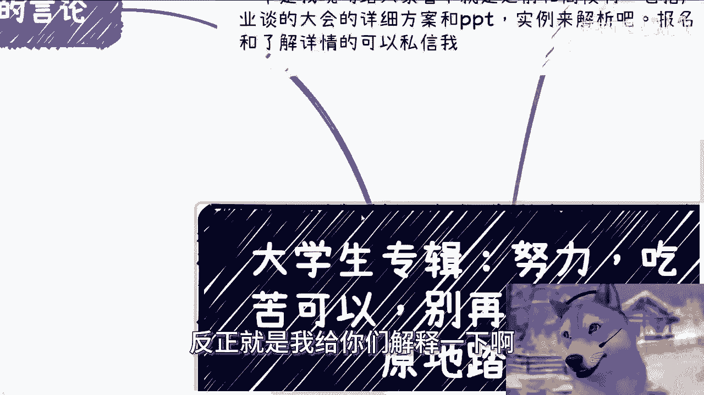
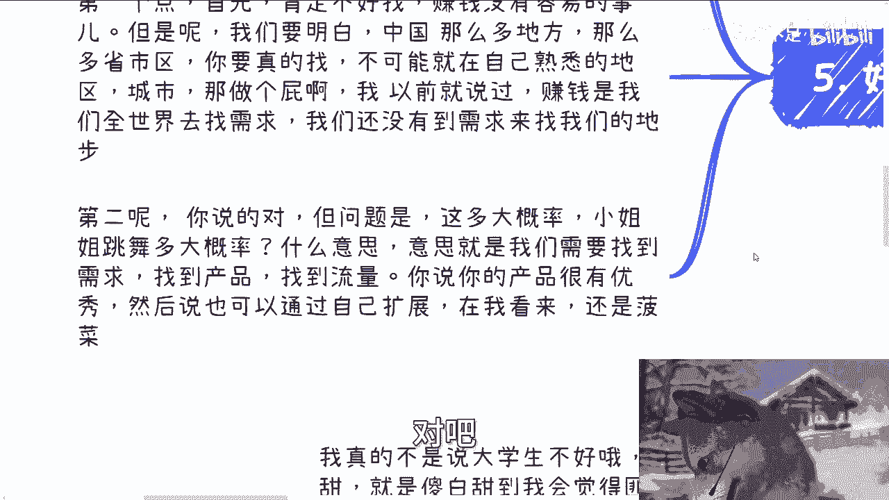
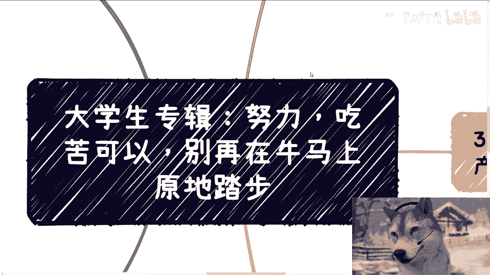
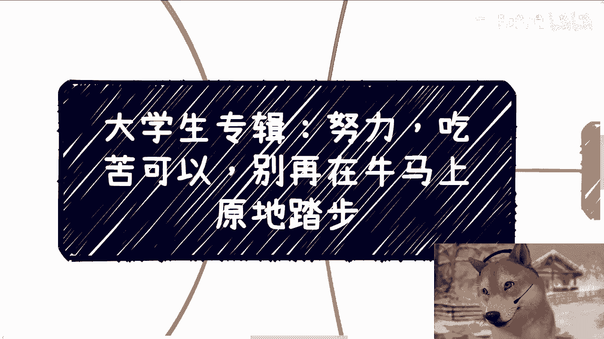
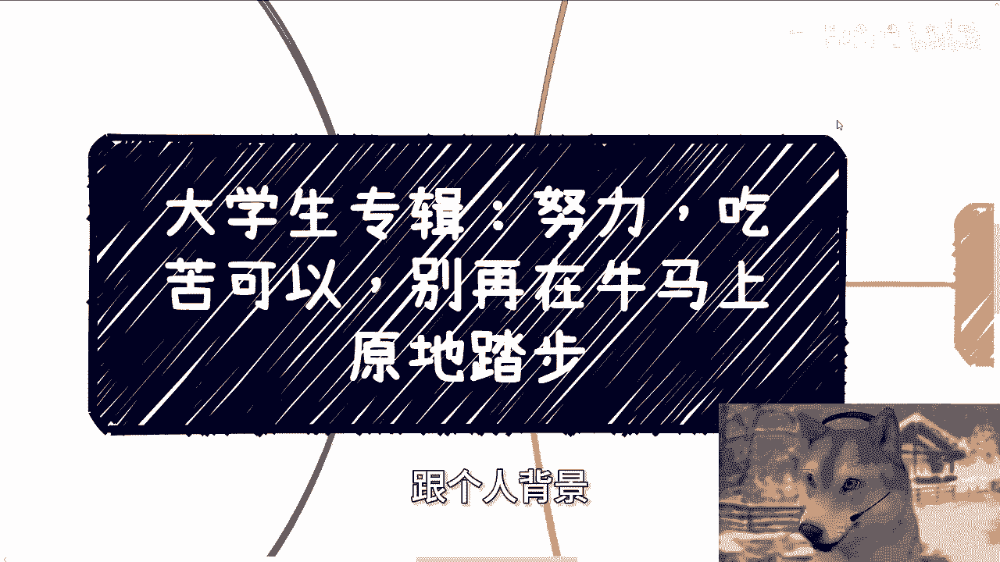

# 大学生专辑：努力、吃苦都可以，但别在牛马的道路上继续前进了 - P1 🐂🐎






在本节课中，我们将探讨一个核心问题：为什么许多大学生和职场新人付出了巨大努力，却依然难以摆脱“牛马”般的困境。我们将通过具体的故事和分析，揭示努力方向的重要性，并指出通往成功的正确路径。






## 引言：两个关于“傻白甜”的故事

上一节我们提出了核心问题，本节中我们来看看两个真实的故事，它们揭示了部分大学生在认知上存在的典型误区。


第一个故事是关于一次讲座邀请。一位刚关注我的同学私信邀请我去他的学校开讲座。我回复并与他讨论了此事。我必须明确指出，学校不是我这种人想去就能去的地方，它需要校方的正式邀请。其次，学校通常会邀请那些与它们有资本或政治关联的企业合作。像我这样经常对教育体系发表批评意见的人，几乎不可能收到此类邀请。这个例子说明，部分同学对社会运行的基本规则缺乏了解。


第二个故事发生在去年深圳的一次活动。一位从外地来的名校学生，我请他吃饭时好奇地问他，觉得我们当时使用的能容纳200-250人的场地一天租金是多少。他估计是两到三万。我的原话是：这种认知偏差，就像把10厘米的脖子伸成10米让人去割，而且还不觉得疼。这种对市场价格的严重误判，正是许多“有心之人”利用信息差获利的基础。拥有这种认知，很容易成为被收割的对象。


## 核心误区：在错误的道路上“努力”

上一节的故事反映了认知偏差，本节我们来剖析几种常见的、在错误方向上的“努力”模式。


以下是三种典型的“牛马式努力”：

1.  **社交方向错误**：许多从事开发、产品经理、项目经理等岗位的朋友，在交流后表示“懂了”，接下来的计划是“多参加技术会议、科研会议”。这恰恰是思维僵化的表现。既然目标是赚钱、了解社会、积累资源、打破现状，就应该去接触能带来这些改变的活动，例如创业者聚会、流量操盘手社群等，而不是继续沉浸在纯技术讨论的“牛马活动”中。行动前纠结“级别不够”、“怕被洗脑”等想法，本身就是失败的开端。**行动公式：要么做，要么不做，停止内耗。**

2.  **忽视产品与流量的本质**：无论个人多么优秀，创造的内容多么有干货，在当下的市场环境中，其传播力可能都不如一位小姐姐跳三分钟舞。这不是价值判断，而是客观现实。社会不会围绕“你认为的价值”运转。例如，淘宝上有商品叫“爱因斯坦的大脑”，销量10万+。它和跳舞视频的价值在于，它们精准击中了广大客户群体的**情绪价值**和**个人需求**，因此天然具备高流量属性。许多学生和初入社会的朋友，最大的特点是喜欢埋头苦干，尤其热衷于抠执行层的细节，并为此自我感动。但这接的是“牛马的地气”，方向错了。

3.  **没有产品与流量的盲目行动**：这是最普遍的问题。很多人做事既没有**优秀的产品**，也没有合作的**流量池**，就开始蛮干。当被问及产品有何独特卖点或多元变现可能时，回答往往是“我们在做人工智能和医疗”。这就像去澳门博彩，把成功寄托于极小的概率，而非坚实的商业逻辑。


## 什么是正确的方向：产品与流量

上一节我们指出了常见的错误，本节中我们来看看什么是正确的努力方向：即找到优秀的产品和确定的流量。


**优秀的产品**，其核心定义是：**具备变现能力，且变现逻辑天然符合社会固有规则与市场资金流向**。它不是指你认为的好产品，而是社会系统本身每年就必须为此花钱的东西。


例如：
*   **政府/企业采购**：如高精尖项目申报、产业园区服务、企业咨询培训等。这些领域每年都有固定的预算必须支出。
*   **职业资质认证**：符合特定行业晋升或准入规则的服务。


**公式：优秀产品 ≈ 找到社会固有的资金出口**

只要业务满足这个条件，就是优秀的产品。至于学历、团队背景、专利等，都可以通过资金进行包装。努力的方向，应该是去发现和对接这类“资金出口”。


**流量**，指的是**确定的流量池**，或者说“韭菜池”。你需要清楚：
*   合作方拥有多少用户？
*   用户分布在哪些公域或私域平台？
*   预期的转化率大概是多少？


**代码逻辑：寻找流量合作**
```python
if 拥有明确用户数据 and 转化率可预估：
    进行合作洽谈
else:
    行动风险极高，可能沦为“牛马”
```
没有经过验证的流量合作，任何行动都像是在赌博。


## 对常见反驳的回应

每当指出上述路径时，通常会遇到两种反驳观点，本节我们来逐一分析。


以下是两种常见的质疑及其分析：

1.  **“这种有固定资金出口的产品或流量合作不好找”**：承认，赚钱从来不容易。但中国乃至世界市场是多元的，有无数省、市、区及海外市场。**赚钱的逻辑是我们主动满世界去寻找需求，而不是坐等需求来找我们**。如果只在自己熟悉的城市找两三个机会，然后抱怨难找，那注定无法成功。


2.  **“优秀产品可以自己拓展流量或找融资（比如像《黑神话：悟空》）”**：这种可能性存在，但必须审视其**概率**。相比起来，满足广泛刚需（如娱乐、情绪价值）的产品（小姐姐跳舞）成功概率大得多。而一个技术或项目自主成功的概率可能极低。如果将其作为主要计划，本质上仍是一种概率极低的“博彩”行为，不具备可复制的指导意义。


## 总结与行动建议 🎯

本节课我们一起学习了努力方向的重要性。核心在于，无论是写代码、做产品还是做市场，如果想真正赚钱、摆脱“牛马”状态，就必须磨练以下能力：

1.  寻找并理解那些**符合社会固有规则**的**优秀产品**（即资金出口）。
2.  寻找并验证**确定的流量池**进行合作。


你所拥有的专业技能（一技之长）很重要，但它只是基础。在资本和政治面前，单一技能很少具备不可替代性。**努力的方向，不应该是将技能“磨成针”，而应该是用技能作为工具，去撬动“产品”和“流量”这两个杠杆。**




**最终公式：成功路径 = 找到固有资金出口的产品 + 链接确定的流量池**




---



**下期活动预告**：9月21日下午1-6点，地点杭州。我将私下分享近期与政府、高校交流获得的一手信息，并现场解析过往为高校及大型会议制定的详细方案。



如需进行个人职业规划、商业规划咨询，或已有创业/副业项目需要方向指导，请整理好个人背景与具体问题私信联系。