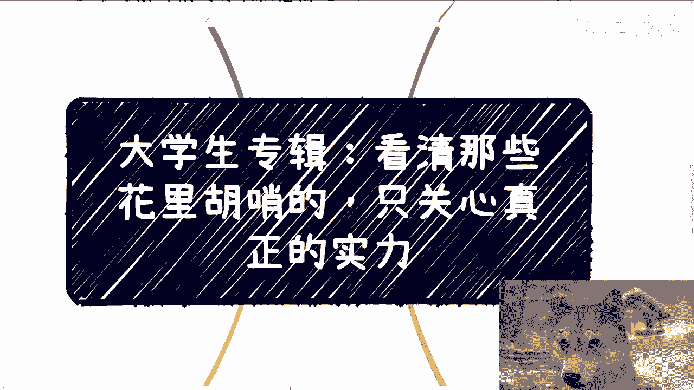
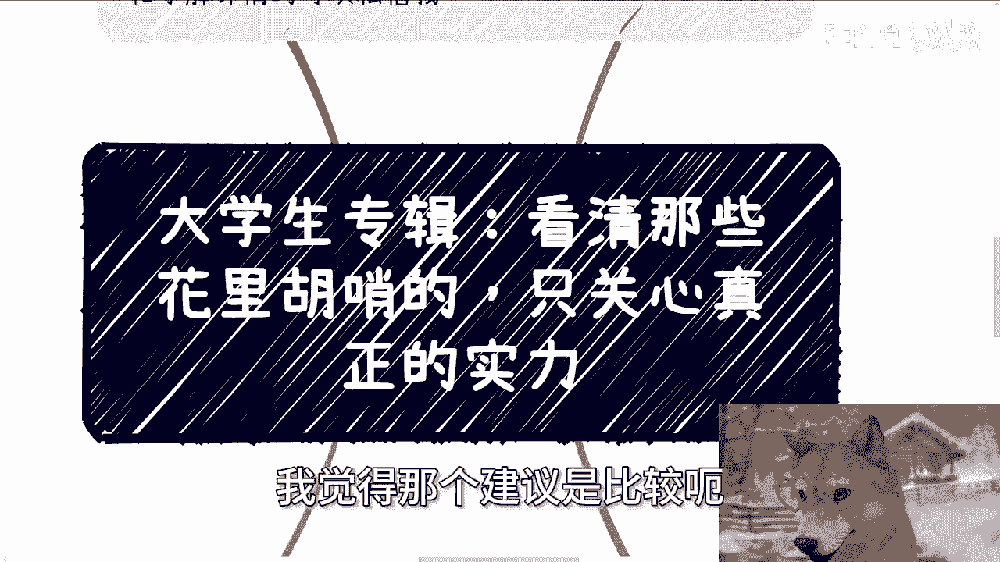
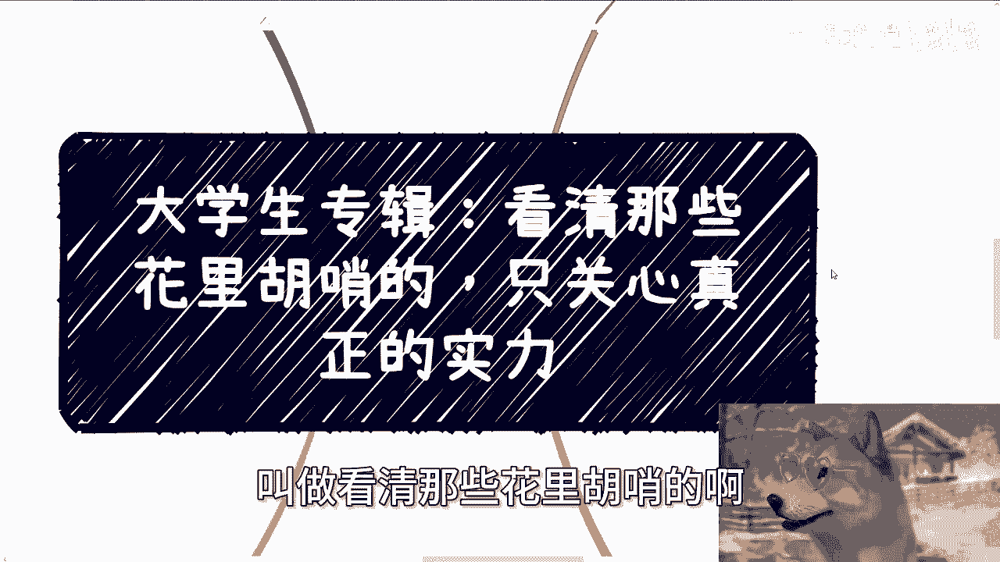
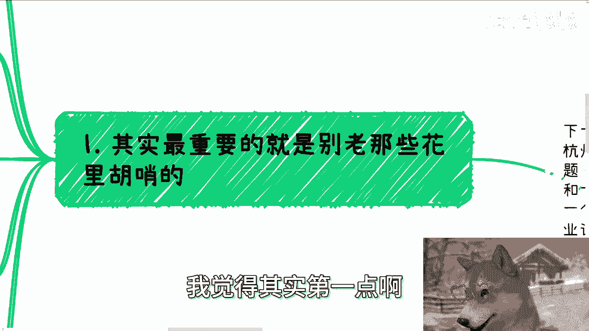
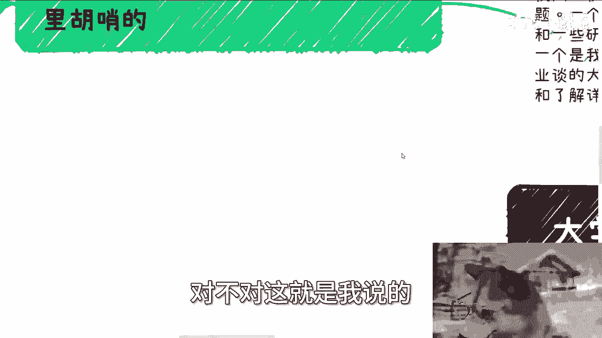
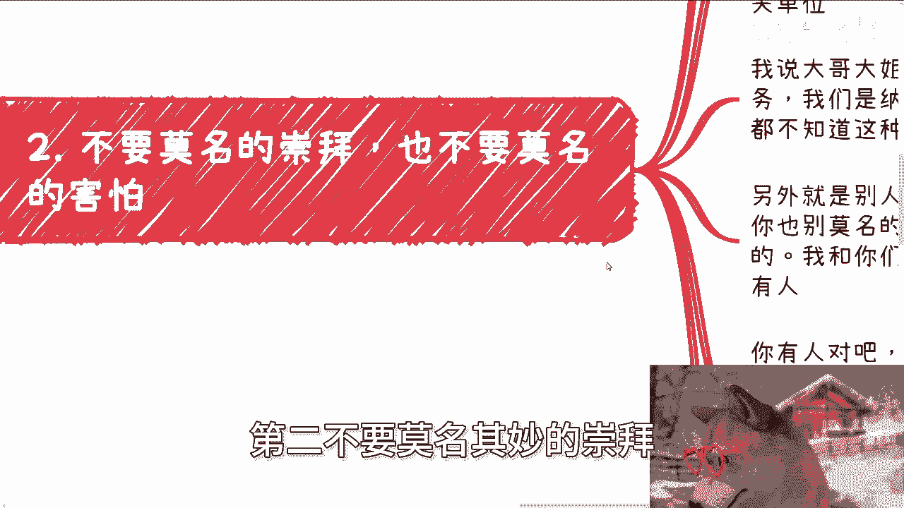
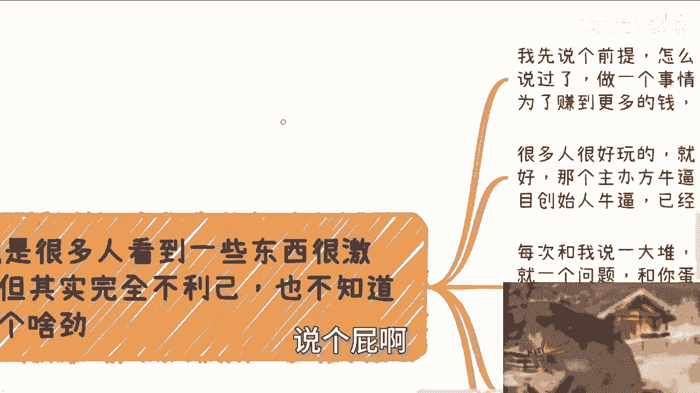
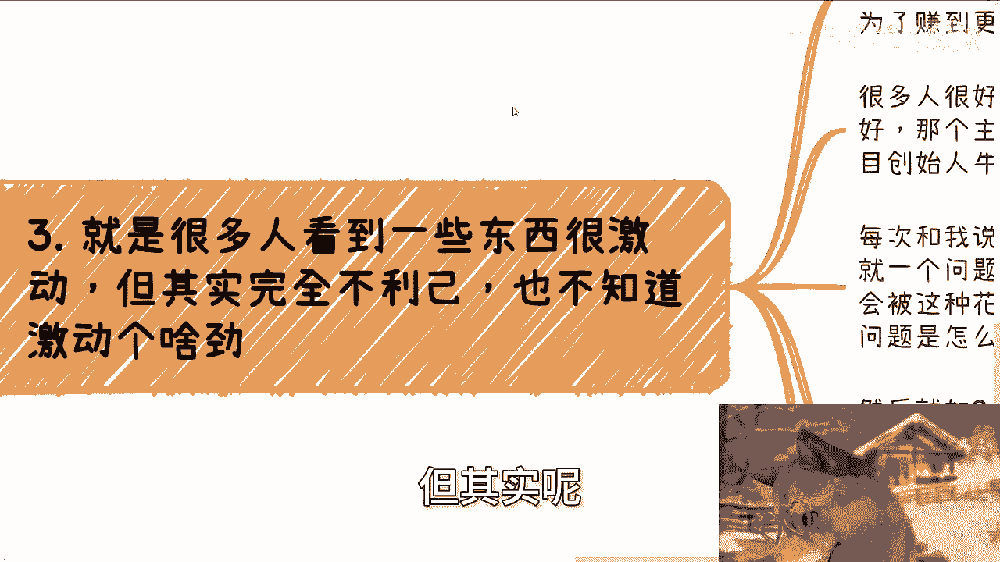
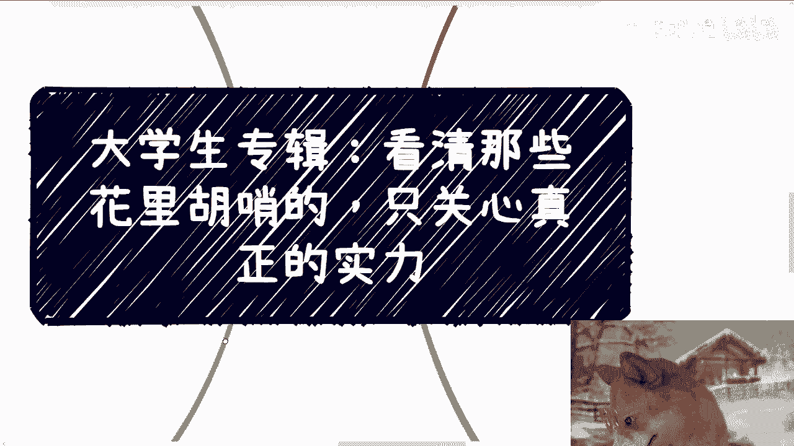
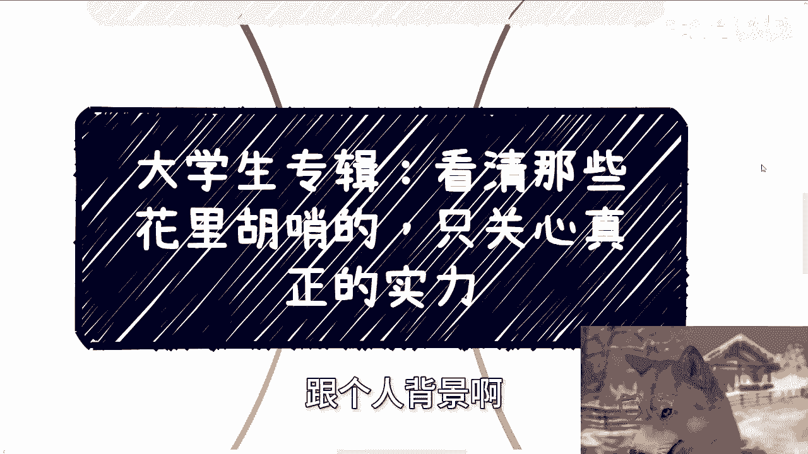

# 大学生专辑：看清那些花里胡哨的，只关心本质就好了 - P1 🧐



在本节课中，我们将要学习如何识别并摒弃那些看似“高大上”却华而不实的信息与机会，专注于能为自己带来实际价值的核心本质。这对于大学生和初入社会的职场新人尤为重要。



---

上一节我们介绍了本系列的核心目标，本节中我们来看看具体如何“看清花里胡哨”。

## 核心问题：为何要警惕“花里胡哨”？ 🤔

大学生和未深入接触社会的人，普遍存在一个通病：容易在脑海中幻想出许多看似“高大上”的事物，但这些事物往往没有实际用处。

在社会上，你接收到的信息或遇到的人，无非两种可能：
1.  对方所说的可能是真的，他或许取得了成功。但他的成功与你无关，盲目崇拜或依附对你没有好处。
2.  对方所展示的“成功”本身就是虚假的，他自己都未能获益。这种情况下，你更不应投入精力。

许多莫名的崇拜、羡慕或敬畏，既不能为你带来实际好处，也往往基于不落地的空谈。作为年轻人，追求自身发展、改善生活是首要目标。若自身尚未达到小康水平，却声称“不一定非要利己”，这种想法并不务实。

## 实践指南：如何穿透表象看本质 🔍

以下是识别和应对“花里胡哨”信息的几个关键步骤。

### 1. 质疑一切“光环”与名头 🏆

许多事物被用来“装点门面”，例如名校背景、创业大赛名次、培训证书、与某部门的合作经历等。关键在于，不要听到这些名头就轻易相信。






**核心方法**：要求对方提供**可验证、可量化**的证据。例如，当对方声称能带来“流量”或“资源”时，直接询问具体数据：能触达多少人？预计转化率是多少？能否提供过往案例的数据支撑？

公式可以概括为：
**可信度 = 可验证的证据 / 空洞的承诺**

### 2. 破除对权威的莫名恐惧与崇拜 😨➡️😤

许多人会对所谓的“权威机构”（如政府单位、大企业）产生不必要的恐惧或崇拜，觉得高不可攀。

你需要明确：我们是人民群众和纳税人，相关机构的本职是“为人民服务”。进行正当的商业接洽或社交认识是完全合理的，无需害怕。

**核心方法**：当对方以“上面有人”、“与某部门合作”作为筹码时，保持冷静，并追问细节：
*   具体是哪个部门、对接人是谁、什么职务？
*   合作的具体形式是什么？资金从何而来（任何官方支出必有预算名目）？
*   **能否提供相关的红头文件、活动方案或合作协议？**






通常，无法提供这些具体证据的声称，都值得高度怀疑。

### 3. 时刻以“是否利己”作为判断标准 ⚖️

做任何事情，应该有一个清晰的目标：要么赚钱，要么赚名（最终也是为了更好的发展）。不要为一些听起来很厉害，但与你个人成长或收益无关的事情激动。

**核心方法**：在接触任何机会时，问自己几个问题：
*   这个证书/活动/项目，**具体能为我带来什么**？（技能？人脉？收入？）
*   所谓的“好处”，是哪个**权威机构认可**的？是否有文件证明？
*   我的投入（时间、金钱）与可能的产出，**是否成正比**？

如果这些问题都没有明确答案，那么这件事很可能就是“花里胡哨”的陷阱。

### 4. 分清“合作”与“被利用”的界限 🤝❌🛠️


很多人抱有“先合作，从长计议”的想法，这没有错。但必须分清什么是真正的合作，什么是单方面被利用。



**核心方法**：真正的商业合作基于**价值互换**。在参与任何项目前，必须明确自己的角色和收益：
*   你的工作产出**能否被量化**？（例如，负责带来多少用户、完成多少销售额）
*   你的回报**是否清晰**？（是固定费用，还是明确的分润比例？）

用代码逻辑来理解：
```python
if 你的贡献无法量化 or 你的收益不明确:
    你的角色 = “工具人” # 可能被白嫖
else:
    你的角色 = “合作伙伴” # 存在价值交换的基础
```
即使初期需要从基础工作做起，也要清醒地认识到这只是起点，目标应是逐步向价值清晰的“合作”关系迈进，而非安于“工具人”的角色。

## 总结与行动建议 🎯

本节课中我们一起学习了如何穿透社会上的各种浮华表象，直击本质。

**核心总结**：
1.  **质疑精神**：对任何“光环”和承诺保持警惕，要求对方提供可验证的证据。
2.  **平等心态**：破除对权威的恐惧与崇拜，基于事实进行平等沟通。
3.  **利己原则**：始终以“是否对自己有利”作为决策的出发点，避免无效激动。
4.  **价值明晰**：分清合作与被利用的界限，确保自己的付出能获得明确回报。

**行动建议**：从今天起，在接触任何新机会、新信息时，有意识地运用以上方法进行过滤。节省下被“花里胡哨”事物消耗的时间与精力，专注于那些能真正为你个人成长和收益加分的事情上。这将帮助你更快地走向务实成功之路。

---


**下期活动预告**：9月21日下午1点至6点，在杭州有一场线下分享。将私下分享近期与行业嘉宾交流的洞察，并展示以往与高校、产业园合作的实际方案（PPT/Word）。如需报名或了解详情，可私信咨询。



**关于进一步咨询**：如果你在职业规划、商业合作、副业开拓或股权融资等方面有具体问题，希望获得更接地气、能减少弯路的建议，可以整理好你的具体问题和个人背景，再进行咨询。