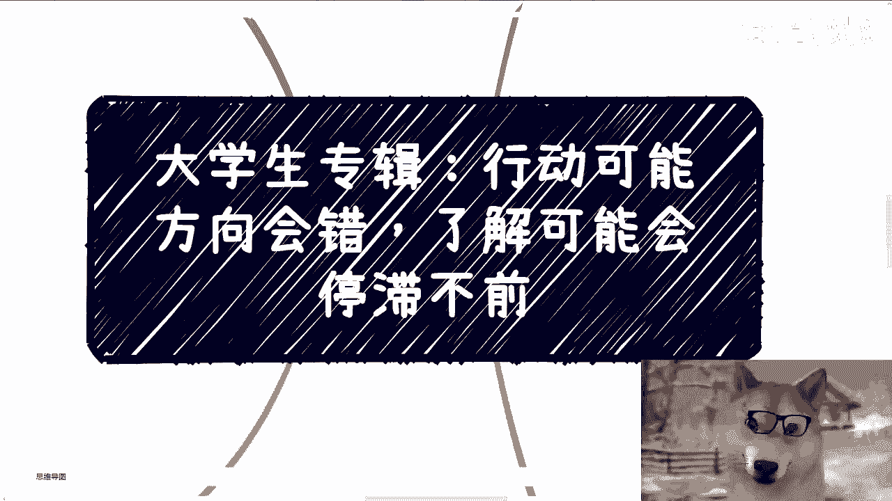

# 大学生专辑：行动与细节的平衡之道 - P1 🧭

在本节课中，我们将探讨一个普遍困扰大学生的问题：如何在“立即行动可能导致方向错误”与“深入了解细节可能导致拖延不行动”之间找到平衡。我们将通过分析问题的本质，并提供清晰的思考框架，帮助你做出更明智的决策。

---

## 问题概述：一个普遍的矛盾

昨天有同学提出了一个问题：行动可能方向会错，而了解细节又可能让人迟迟不行动。他认为这两者之间存在矛盾。

这是一个非常普遍且重要的问题。绝大多数人都有类似的困惑。问题的核心并不难解决，关键在于大多数人的关注点出现了偏差。

---

## 核心症结：缺乏自我与社会认知

问题的根源在于，我们作为普通个体，对社会和商业的真实运作方式了解甚少，甚至完全不了解。我们与社会、商业之间存在着巨大的**信息差**。

这种**信息差**导致了“无知”。而无知加上巨大的信息差，赋予了我们一个关键属性：**我们往往没有能力做出完全正确的判断**。我们基于自身有限认知所做的判断，很可能与实际情况相去甚远。

---

## 行动 vs. 细节：重新定义关注点

在明确了我们“缺乏判断能力”这一前提后，我们再来审视“行动”与“细节”。

### 关于行动

如果我们选择行动，至少能看到一个结果（成功或失败）。这本身就是一个有价值的反馈。而如果我们试图在行动前“深入了解”，就像范志毅评价国足时说的：“你有这个能力吗？” 很多时候，我们并不具备在行动前就洞察一切细节的能力。

### 关于细节

接下来，我们探讨“了解细节”这个行为。这里有两个关键问题：
1.  即便我们运气好，了解到了所谓的“细节”，我们如何辨别其真伪？
2.  我们为什么要了解细节？我们的**目的**是什么？

让我们通过一个例子来说明：

> 假设有一个100万的项目。甲方有20万回扣，执行方最低成本30万，中间商有50万利润空间。

以下是不同角色的思考逻辑：
*   **甲方**：普通人通常没有这个选项。
*   **执行方**：如果你纠结于“如何落地”的技术细节，对方可能会说：“先把30万（或预付款）打过来，细节好说。” 此时，你纠结的核心其实不是细节，而是**资金**和**风险**。
*   **中间商**：你只需关心如何拿到那50万利润中的部分，以及何时能拿到。其他细节（回扣、技术实现）与你无关。

这个例子揭示了一个核心原则：**我们要了解的，不是事情本身的所有细节，而是这件事能否帮助我们达到目的。**

---

## 决策的两层逻辑

基于以上分析，我们可以总结出清晰的决策逻辑：

**第一层**：如果一件事不能帮助你达到目的，那就不要做。
**第二层**：如果你连自己的目的是什么都不清楚，那就更不要盲目行动。

如果你既不清楚目的，也不确定事情能否达成目的，那么你了解得越多，只会越迷茫。这正是许多人当前的困境。

---

## 实例解析：自媒体与学业

为了让大家更直观地理解，我们以“做自媒体”和“攻读本硕博”为例。

### 案例一：做自媒体

*   **你的目的**：通常只有三个——用爱发电、求名、求利。
*   **立即行动是什么**：
    *   如果你很“牛”，就去寻找流量和合作方，展示自己。
    *   如果你不够“牛”，就去寻找“牛”的人合作（草船借箭）。
*   **在意细节是什么**：纠结于选择哪个平台、做长视频还是短视频、如何与合作方分润等。
*   **关键问题**：这些细节与你“求名”或“求利”的目的是否有**确定的、直接的关联**？如果没有，就不值得过度纠结。你应该去搞清楚“如何找到合作方”这类与目的强相关的问题，而不是空想细节。

### 案例二：攻读本硕博

*   **你的目的**：毕业、获得文凭、找到好工作、赚钱。
*   **立即行动是什么**：如果你已经手握多家公司的offer，承诺你毕业后即入职并给予高薪，那么你只需安心学习，达成毕业条件即可行动。
*   **在意细节是什么**：纠结于专业选择、技术学习、师生关系、同学社交等。
*   **关键问题**：这些细节与你“获得高薪offer”的目的是否有**确定的、直接的关联**？例如，你是否能确定“读了A专业，就一定能进入B公司获得C薪资”？如果不能确定，这就如同买彩票。你应该去主动建立这种确定性的关联（例如，通过参会、社交直接结识企业人士），而不是被动地纠结于不可控的细节。

许多人陷入困惑，正是因为他们的目的（如“好工作”）开关掌握在别人手中（如招聘方），自己却无法建立确定性的连接。

---

## 核心法则：以目的为导向

以上所有问题的通病，可以归结为一点：**做事缺乏目的导向，或者目的本身是不可控的**。

这就像投资理财，如果对方告诉你收益不确定，你可能亏损，你绝不会轻易投钱。然而，很多人在规划学业和职业时，却愿意为不确定的结果付出大量时间、精力和努力，这是不合理的。

“有野心、想赚钱”的本质，是去**掌握主动权**。如果当前的人和事你无法掌握，就不要死磕。应该去寻找那些你能掌握、能建立确定性联系的路径。

例如，一些海外学生通过参加行业会议，主动与项目方、公司人士建立关系，甚至提前达成毕业入职的意向，这就是在创造确定性。

---

## 总结与行动建议

本节课我们一起学习了如何平衡行动与细节的矛盾。核心要点如下：

1.  **认清现实**：承认我们与社会存在信息差，初始判断可能不准确。
2.  **明确目的**：在做任何事之前，首先想清楚你的**核心目的**是什么。
3.  **聚焦关联**：只去了解和探究那些与你的目的有**确定性直接关联**的“细节”。
4.  **主动创造确定性**：不要被动等待。通过主动社交、实践、合作等方式，为你想要的结果创造确定性的连接。
5.  **果断行动**：当目的清晰，且找到了与目的关联的行动路径时，就应果断行动，在行动中获取反馈并调整。

当你觉得无路可走时，往往不是世界限制了你，而是你限制了自己。阻碍你行动的，通常不是怕方向错或细节不明，而是**目的不清**和**缺乏创造确定性的努力**。

---
**下期活动预告**：9月21日（周六）下午1-6点，在杭州举行。将分享与政府研究院交流的最新动向，并解析过往的实验室及项目解决方案（PPT/Word）。报名或了解详情请私信。

如果你在职业规划、商业模型、副业创业、股权融资等方面有具体问题，欢迎整理好个人背景与问题后进行咨询。