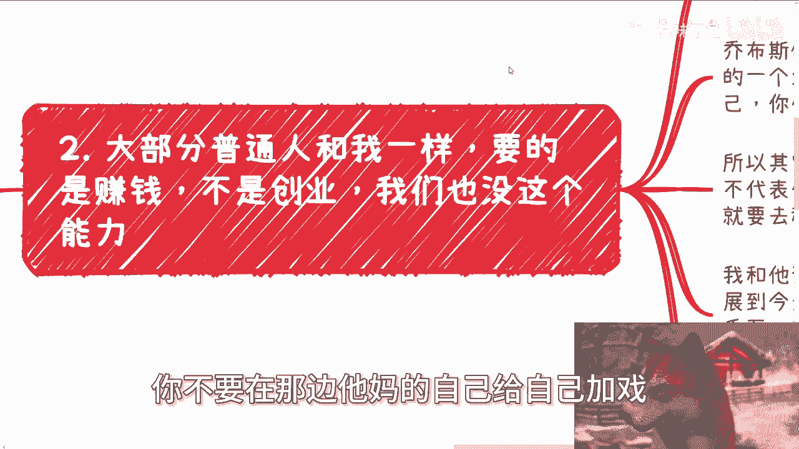
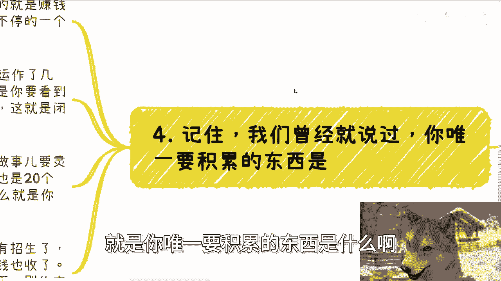

# 大学生专辑：赚钱唯一要积累的就是赚到钱这件事情本身 - P1 🧠💰

## 概述
在本节课中，我们将要学习一个核心概念：区分“创业”与“赚钱”。许多人对这两个概念存在混淆，导致在行动方向上产生偏差。我们将通过一个具体案例，清晰地定义两者，并指出对于大多数普通人而言，真正应该聚焦的目标是什么。

---

## 分清创业与赚钱

上一节我们介绍了本课程的主题。本节中，我们来看看为什么必须首先分清“创业”和“赚钱”。

一位咨询者曾与一些老板或创业者交流，对方不建议他创业，理由是当前市场环境复杂、需要前期投入、可能依赖家庭资源等。咨询者听完后得出的结论是：他需要先好好工作，积累资金和经验，然后再去创业。

这个推论过程存在逻辑跳跃。对方只是指出了创业的困难和风险，但这并不意味着“不能赚钱”或“只能通过工作积累”。很多人，尤其是大学生和初入社会的年轻人，容易将“暂时不适合创业”等同于“只能通过打工积累”，从而忽略了“赚钱”这条更直接、更可行的路径。

---

## 创业的定义与目标

上一节我们指出了常见的思维误区。本节中，我们来明确“创业”的具体含义。

**创业**的核心是创造属于自己的、独特的产品或服务，并将其具象化（如软件、硬件或某种商业模式）。目标是建立一项可持续的业务，其愿景可能包括服务特定人群、追求上市、持续融资或创造社会价值等。

例如，创建像拼多多、阿里巴巴、大疆这样的公司，或是开发一个全新的To B（对企业）、To C（对消费者）产品，这都属于创业。如果一个人说“我创业就是为了赚钱”，那么这个目标过于笼统和模糊。**创业 ≠ 赚钱**。创业是一个创造价值的过程，而赚钱是结果之一，但并非唯一路径，也并非最直接的路径。

---

## 赚钱的逻辑与路径

理解了创业的“重”，我们再来看看赚钱的“轻”。

对于绝大多数普通人而言，首要目标应该是 **赚钱**，而非创业。赚钱的核心是 **资源整合** 与 **商业逻辑** 的实践，它不要求你必须创造一个前所未有的新产品。

以下是赚钱的常见形式：
*   **平台电商**：在淘宝、拼多多等平台销售商品。
*   **内容创作与自媒体**：通过文章、视频、直播等方式吸引流量并变现。
*   **微商/直销**：代理或分销现有产品。
*   **信息服务**：提供咨询、培训、中介等服务。

这些活动的共同点是：利用现有平台和资源，解决一个具体需求，从而获得收入。它们可能一年产生几十万的流水，但这通常不涉及创造全新品牌或颠覆性服务，因此更准确地应称为“赚钱项目”，而非传统意义上的“创业”。

---

## 关于“积累”的真相

很多人认为，需要先在职场“积累”足够经验才能去赚钱或创业。这是一个需要澄清的关键点。

真正的积累，是积累 **赚钱的能力和经验本身**，而非单纯积累“打工”或“执行”的经验。

**核心公式**：
> **有效的积累 = 完成商业闭环的经验**

什么是商业闭环？它意味着一个从发现需求、整合资源、提供服务到最终获得客户付费的完整过程。例如，组织一场小型付费沙龙：
1.  制作宣传海报。
2.  招募到目标人数（如20人）并完成收费。
3.  成功举办活动，提供完整服务。
4.  活动结束，获得反馈与收入。

至此，一个完整的“赚钱”闭环就完成了。你所积累的，是“如何让一个项目从0到1收到钱”的真实经验。相反，在一个岗位上埋头苦干数年，可能只积累了“如何更好地执行指令”的经验，这与独立赚钱的能力关联甚微。

时代已经不同，过去的成功路径（如先打工再创业）依赖于特定的时代红利。在今天，**天时地利人和**远比单纯的“个人努力年限”更重要。对于想赚钱的人而言，最直接的积累就是立刻开始做一个能见到钱的小项目。

---

## 资本与融资的误解

有人会将“融资上市”与“技术或产品过硬”划等号，这同样是一种误解。

在金融和资本层面，规则是独立的。一级市场（融资）和二级市场（上市）的运作，高度依赖专业的**做市商**和金融团队。股价走势、市值管理往往与公司的实际经营状况没有直接关系。

资本最关心的永远是 **回报率** 和 **赚钱能力**，而不是技术有多炫酷或创始人学历有多高。如果“技术好”就能融资，那么社会上能融资的人会多得多。现实是，投资人评估的是项目的**盈利潜力和商业模式**，而非虚幻的情怀或光环。

---

## 核心总结：唯一要积累的就是赚钱本身

本节课中我们一起学习了如何区分创业与赚钱，并破除了关于积累的迷思。

最后，记住这个核心原则：**如果你的目标是赚钱，那么你唯一需要积累的东西，就是“赚到钱”这件事情本身。**

这意味着：
*   停止空想，立刻行动。
*   从小型、可闭环的赚钱项目入手。
*   在每一个项目中，都以“收到客户付款”为最低标准的闭环点。
*   你从成功或失败的项目中获得的、关于市场、人性和资源整合的真实洞察，才是最有价值的积累。

任何不能导向“实际收到钱”这个结果的所谓经验、实习或人脉，对于“赚钱”这个目标而言，价值都非常有限。请用实践代替空谈，用闭环验证想法，在真实的商业世界中积累你最宝贵的资产——赚钱的能力。

---
> **提示**：在实际操作中，如果涉及到与政府、高校、企业合作，或股权、融资等复杂问题，建议在厘清个人目标和背景后，寻求有针对性的专业意见，以少走弯路。