# 大学生专辑：看清那些花里胡哨的，只关心本质就好了 - P1 - 赏味不足 - BV1qctse4EF7

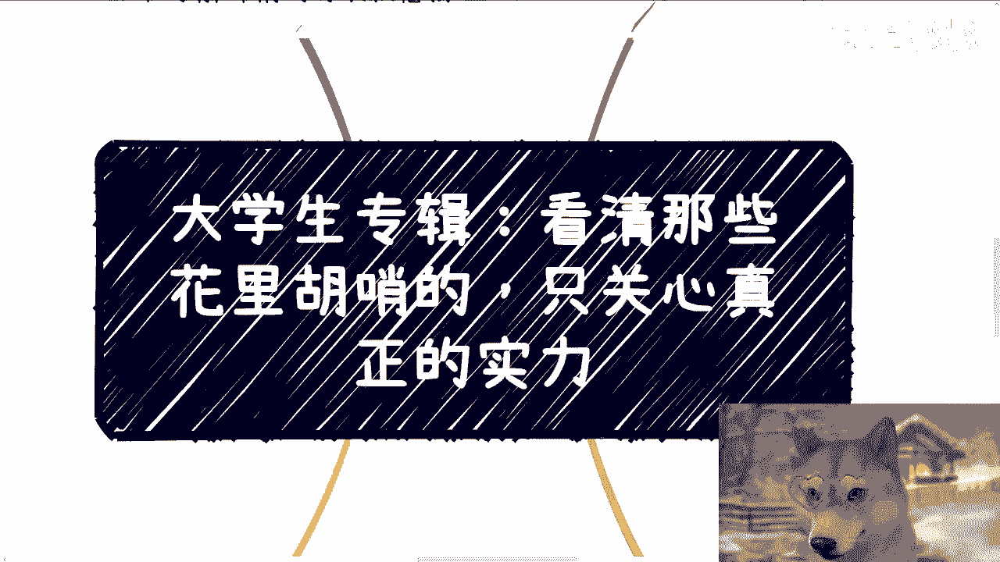

好大家好，那今天我们来继续讲第二个啊，昨天建议我已经给了啊，我觉得那个建议是比较额比较重要的啊。

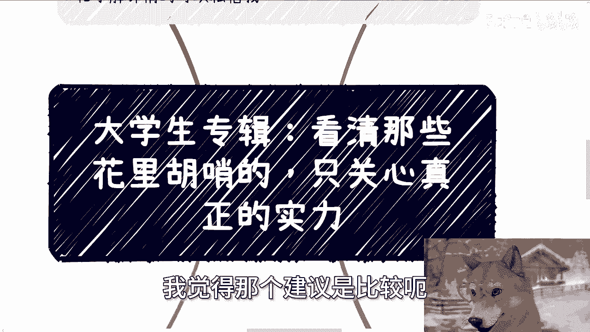

那么今天我们来讲第二个叫做，看清那些花里胡哨的啊。

只关心就是说真正的实力啊，我觉得这个也是最最怎么说呢，就是所有的大学生，还有所有的那些工作的牛马啊，就没有接触到社会的这些人通病啊，那么首先我先说一下下一期的活动啊，9月21号好吧。

下午一点到六点在杭州啊，然后呃本期呢一开始呢我定了几个新的主题，一个是我会私下跟大家分享一下，这次上海大会我跟一些院长啊，跟一些就其他人啊，就是聊就是你们看到一些嘉宾嘛对吧。

我跟他们聊私下聊的一些关注点啊，然后呃另外一个呢就是我现场会给大家看一下，就之前大概20年左右，我跟高校合作的啊，包括我跟产业园谈的一些大会的这个方案，主要就是PPT跟word好吧。

然后到时候我就就直接打打在那个嘛，就就直接打在那个PPT上面，反正到时候一边看一边讲吧好吧，那么报名跟了解详情的可以私信我啊，呃那么首先啊我觉得其实第一点啊。

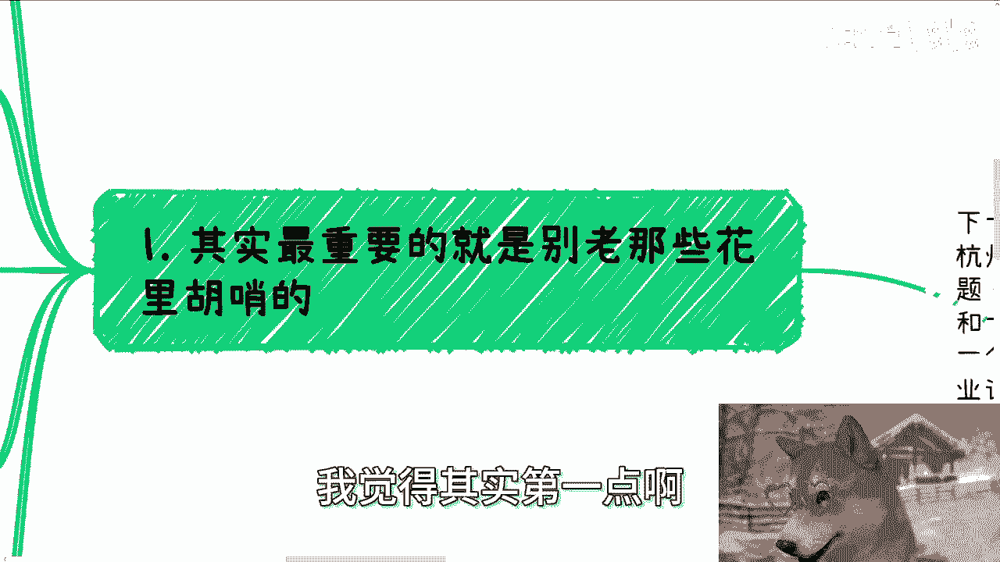

今天要讲的就是最重要的，就是别老那些老老去在意那些花里胡哨的啊，就你看啊，我在这地方也写了，就是大学生也好，各种没有与社会接过轨的牛马也好，它都是一个通病，就是自己脑子里面呢会歪歪出来很多。

高大上的东西，但其实那些高大上的东西并没有什么卵用啊，你们记住一点啊，就是说你们在社会上啊，碰到的人或接收到的信息，无非就两种可能性啊，啊对无非就两种可能性，第一种就是说他说的可能是真的啊。

他也许赚到了钱，他也许可以装这个逼，但是他赚不赚钱，他装不装这个逼，跟你没有什么关系，对不对，你不要在那边他妈自己脑补出来，觉得哦靠这个人牛逼对吧，我去抱他的大腿，我去做他的他妈大腿挂件。

那么跟你有什么卵关系，对不对，这是第一种可能性，第二种可能性就是他这个逼装出来，他自己都赚不到钱，那他妈的你就更别去跪舔了，对不对啊，那么就像我这个地方说的，就是事实上呢他根本就说你们很多的那种。

就是幕墙也好，或者来说呃羡慕也好，或者有些就莫名其妙的崇拜也好，就是这些东西根本不能给你们带来好处，或者就说对方根本就落不了地对吧，那有的人可能心里面啊就还是那种被PUA惯了，思想刚硬嘛。

他心里面就听到我说这句话，他就会哎就反复，就是那种这种下意识的就会有种反应，就是说诶那我也不见得一定要那个嘛，一定要利己嘛对吧，我也不见不见得，就像我这里说的，一定一定要给自己带来好处嘛。

那我就说大哥大姐，活着，你作为一个年轻人，你你不为自己带来好处，你干嘛啊，菩萨嘛，是不是诶，我妈奇了怪嘞对吧，我说不好听点，你自己生活我都不说财务自由了，你自己生活，自己的父母。

自己的很多方面都还没有达到一个小康水平，对吧，在这边说，哎我也不一定要利己，那你立什么立，他是啊，我早就说了，就是要是像这种想法的人越多对吧，那资本家越开心啊，然后呢你比如说啊，就好像我这地方也写了。

就好像清华北大可以装逼啊，各种创业大赛可以装逼，高校的培训结业证书可以装逼，我与某某某部门合作过可以装逼啊，就是说说白了退1万步来讲，所有什么东西只要讲出来啊，他妈的无论说啥。

反正就是就是这些大学生跟这些牛马都会信啊，这就是我说的，你要你们要看清这些花里胡哨的啊，其实跟我咨询的人里面也有很多花里胡哨的啊，然后花里胡哨说半天啊，这就是呃就是想向我证明啊，他很值得合作。

但问题是就我这种江湖老油条啊，我说的直白一点，你钱他妈的不打到我账户里面，我可能耳朵都不会来听你说什么，对不对啊，当然我说的这些人跟我讲花里胡哨啊，就是我也知道，就是他们不是故意的啊。

就是说他并不是要来诓我或者要来忽悠我，我相信他们不是，但是他们为什么会跟我说花里胡哨的呢，就是因为他们相信别人跟他们讲的，花里胡哨的啊，然后也就是说别人已经给他们，已经给他们下药了，已经框住他们了。

然后他们信以为真过来诓，我对不对啊，其实我就这么跟你讲啊，线下也有啊，跟我说什么啊，我们和活动合作啊对吧，当然也有邀请我去他们合作的啊，那么我就跟你们啊，咱们就实事求是来讲啊，你找我合作的啊。

我就会问他，我说那你给我带来什么呢，对不对，哎，你找我合作，我就得合作吧，那总不就没有这种道理吧，对不对，那我说你给我，你你能给我带来什么呢，对方说流量或嘉宾，我说好，嘉宾呢，我不缺啊，为什么。

因为并不是说越大咖的嘉宾越好，而是说看我们的活动到底需要什么样的嘉宾，而且更何况我也不认为你能带得来，比我找得到的咖位大的嘉宾，对不对，好像我找不到一样的，是我不想找吗，对是我不想找，哼对吧。

那另外流量的话，数据呢对吧，你说带来流量，你说数据呢多少呢，能有多少人买单呢，你给我个量化的东西，你不要来跟我讲，这些虚的呀，对不对，那我一旦问他多少能触及到多少人，能有多少转化率，对方都回答不上来的。

那有什么好说的呢，对不对啊，那么你比如说叫我去，那叫我去更是了，我问你们什么活动呢，主办方是谁呢对吧，对方就跟我说啊，我们可能是什么区政府办的，或者什么协会主办的高校主办的对吧。

我说当然在我这种江湖败类面前，我就问你跟区政府什么关系，你在活动当中什么角色，活动方案拿出来看一下啊，为什么，因为就我所接触到的所有的市省市区相关的，只要跟政府相关的。

跟高校相关的不可能没有活动方案的啊，你们你们去问问你们在公务员里面的同学，或者去看看政府做事情对吧，每天开会开什么会啊，就是做方案，每天每天word里面字体什么GB2312对吧。

各种各样的你字体都要去纠结，怎么可能做一个活动没有方案呢，对不对，你要但凡拿不出来，我会信你，我他妈标点符号我都不会信对吧，所以说我得跟你们讲，我不信，那是因为他妈我老油条了，但是你们也不要信你。

为什么，因为你们信了，对你们有什么好处呢，除了除了浪费时间给别人去他妈的呃，叫什么打白工，你还有什么好处呢，对不对，这就是我说的。

不要老是去，那就在这个地方写的，我你要看清那些花里胡哨的，你不要为了这些花里胡哨的去什么呃，买单对吧，甚就是花花自己的时间。

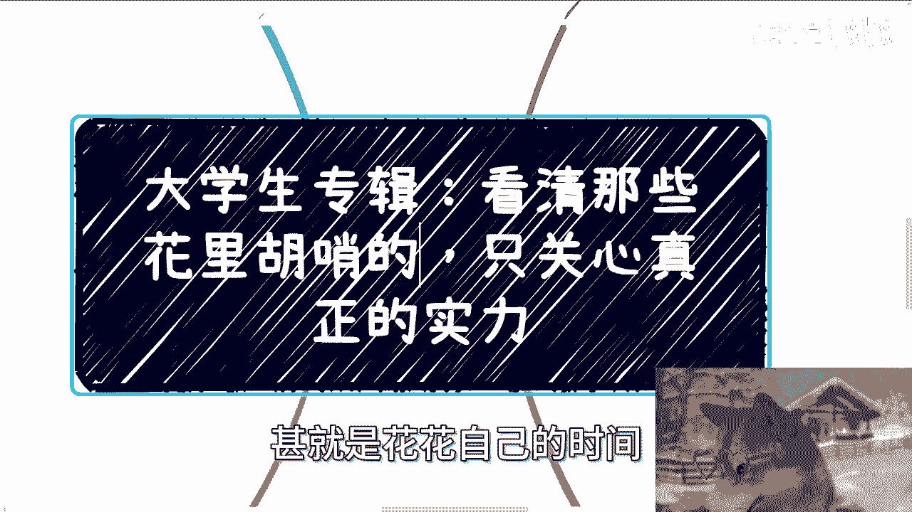

甚至付钱，这不有毛病吗，对不对啊，第二不要莫名其妙的崇拜。

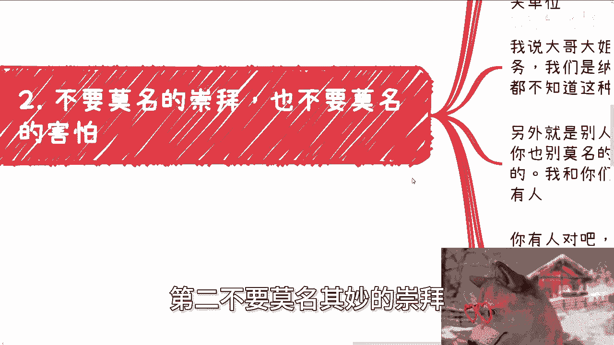

也不要莫名其妙的害怕，哎我跟你们讲啊，这这个故事就很有趣，这个故事大概是发生在去年吧，下半年的时候啊，你们知道最好玩的是什么，就很多人跟我表示，真的我不止一个人啊，甚至不止十个人啊，他说哎呀陈老师啊。

我要去什么协会，去什么创新中心，什么园区啊，我有点害怕他们的原话，就是说我有点害怕，说这种是不是老百姓不太好合作，我听完这个话，我他妈哼，我都不知道用什么表情或情绪对待他们，我就像我这边写的。

我有点觉得好笑，但我同时又觉得很悲哀，为什么，我说你们是不是搞反了啊，我说我们所在的国家，我们是老百姓，我们是人民群众，我们是纳税人对吧，我说你去合作的地方，或者你要去，就是说聊呃认识。

因为我们去的时候可能不见得是合作，我跟他们讲的就是你们要出去多拜拜码头对吧，多认识认识啊，多社交社交对吧，我说你们去的地方要么直接是公务员编制，要么就是直属单位是公务员的机关单位，对不对，我说大哥大姐。

你们是不是搞错了，唉他们叫什么，他们叫做为人民服务啊，我们是纳税人，哎诶你怕啥，你怕个锤子啊，哎我就不明白了，对不对，哎我都不知道这种内心的恐惧怎么来的，怎么了呢啊怎么了呢啊，不能去啊，不能认识。

不能合作啊，我退1万步来讲，我是个个人，我是个纳税人，我来合作，我来认识，怎么了呢，有什么问题呢，更何况如果我是一家企业，我是家民营企业，那你政府你当地区政府，不对吗，你拿到哪他妈都说得通啊，对不对。

你怕啥呢，我都不明白对吧，另外就是别人要说啊，跟什么大厂啊，或者跟什么政府合作，你也不要莫名的崇拜或者莫名的害怕，感觉好像没有办法去接触，或者所谓的高高在呃，高高在上，我跟你们讲。

我他妈就最喜欢别人跟我说，他上面有人，为什么你有人对吧，可以啊，我最好你说你有人了，我一套连招，第一拿文件，有门有门禁吗，活动门禁有吗，没有的吧，好没有，没关系，你说清楚关系，你对接的什么部门。

部门里的什么人，什么职务钱谁出，中国组织只要出钱，肯定是有名目的，名目是什么，对不对，我只要听到对方跟我说啊，卧槽他妈的，他跟学校合作，他跟政府合作，我不要太开心了，我就是无脑无脑一套连招，为什么。

因为我知道这种人肯定拿不出来，对不啦，就这么就这么简单，所以我觉得你们作为大学生，作为作为一些就是说牛马，你们其实就是他们去忽悠的对象，但是我为什么今天做这个视频，就是希望你们能明白，这他妈没有用啊。

切你就算信了又如何呢，能赚到钱吗对吧，他他妈我就像我说的，他妈自己什么都没有啊，那他要是给不出来呢，那你想啊，他要是给不出来，那说明他关系不到位啊，或者对接人就不行，他要是忽悠说文件有的不给外面人看。

哼那就更搞笑了，哎那他妈我都是外人了对吧，他就跟你说不给外人看。

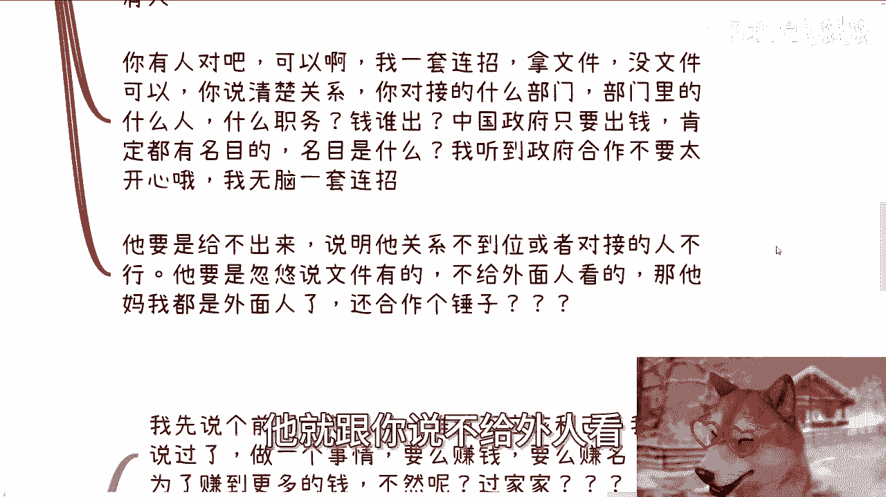

那你跟我都是外人了，还合作个锤子啊啊说个屁啊。

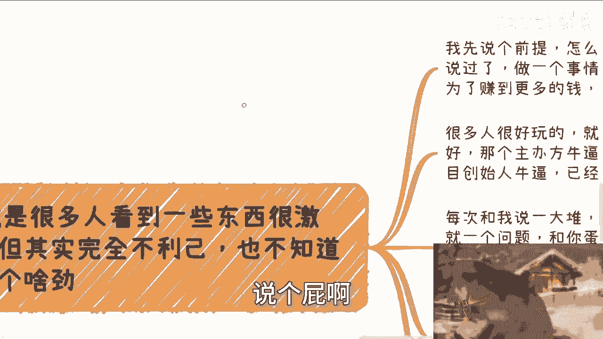

对不对啊，三就是很多人看到一些东西啊，很激动啊，但其实呢完全不利己啊。

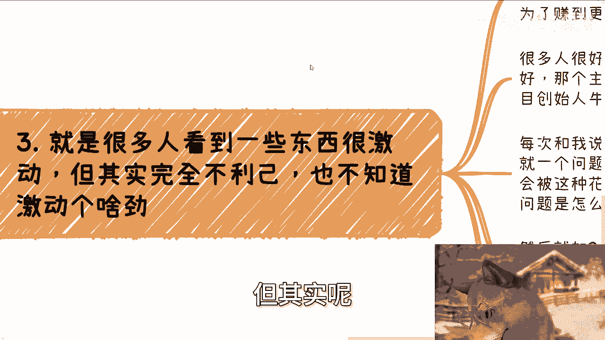

就像我说的完全不利己，也不知道激动个锤子啊，你你看啊，我先说前提啊，就是怎么了呢，呃我们做事情不利己怎么了，难道不应该利己吗，利他吗，我早就说过了，做个事情要么赚钱，要么赚名，赚钱就是为了赚钱。

赚名名也是为了赚到更多的钱，不然呢过家家诶，搞笑嘞，对不对啊，很多人很好玩，就是哇这个证书好哇，那个活动好哇，这个主办方牛逼哇，那个项目合伙人牛逼哇，这个项目创始人牛逼，已经财务自由了，哇哇哇哇哇对吧。

那每次跟我挖半天啊，我就说我我我我听完他们跟我介绍啊，或者跟我这个解释啊，我就是那种地铁老人看手机，我就有个问题跟锤子关系啊，哎奇了怪了，就是那种大学生跟牛马，他妈就是会喜欢被这种花里胡哨的吸引啊。

就就就你们知道吗，就那种抖音啊，或者其他平台上面什么，你看啊，我以前什么什么什么呃，什么身世很惨对吧，然后我突然之间做了一个什么东西，这么家财万贯，家缠万贯对吧，怎么样子。

哎你会看到他妈中国这帮牛马和这些大学生，就他妈喜欢这种东西，我也不知道为什么你喜欢这种东西，你妈买福利彩票不好吗，对不对，就像我说的，他就好像看到个救命稻草啊，但问题是怎么救命呢，是不是救你的命呢。

你妈一概不知道，就他妈在那边崇拜对吧，然后就如我上面我二里面写的这些东西，真假你都分不清楚，就各种花时间开始干活了，开始钻研了，开始合作了，能得到什么，你除了能得到被白嫖，你还能得到什么，对不对。

哎每次说到证书也是的，我说我就问证书对不对，谁认可哪个机关单位认可，你给我说出来呀，认可对不对，要认可有文件的呀，哪个东西都有文件呢，文件呢对吧，你都不知道，你就觉得有用，你如果要证书。

我去淘宝给你做他妈的批发还能便宜一点，一个几块钱的东西，你会要花几万，你妈的有毛病吗，对不对，一方面说自己哎呀很苦很穷，另外一方面怕蹭蹭蹭给他妈资本家掏钱，我也不知道脑子怎么想的啊。

第四很多人一种想法就是我先合作，从长计议，我跟你讲啊，我也说过这句话没有错，但是你记住一点，我他妈说的叫合作，不是先做太监，不是先做工具，不是先做舔狗对吧，什么叫合作，商业上什么叫合作，叫做相互有价值。

那什么叫有价值，就是你但凡做件事情，你自己都不清楚，结果你自己都无法把结果量化的，那只能叫工具，我举个例子，这就好像你今天参与一个项目，你做运营，或者你做市场市场营销对吧，好。

我就问你到底能接触到多少量，你能转化多少量，以及你到底在里面能获得多少钱，是固定的价格还是一个分润的比例，你知道吗，你但凡这里面有一个数据不清楚，你就是个工具，你不要跟我谈，跟别人合作。

你都远远没有到合作的这个级别对吧，你一顿操一顿操作猛如虎，花里胡哨，就知道说我平台很多，我工具很多，我MCN账号很多，然后呢，但凡你的结，但凡你的结果不能量化。

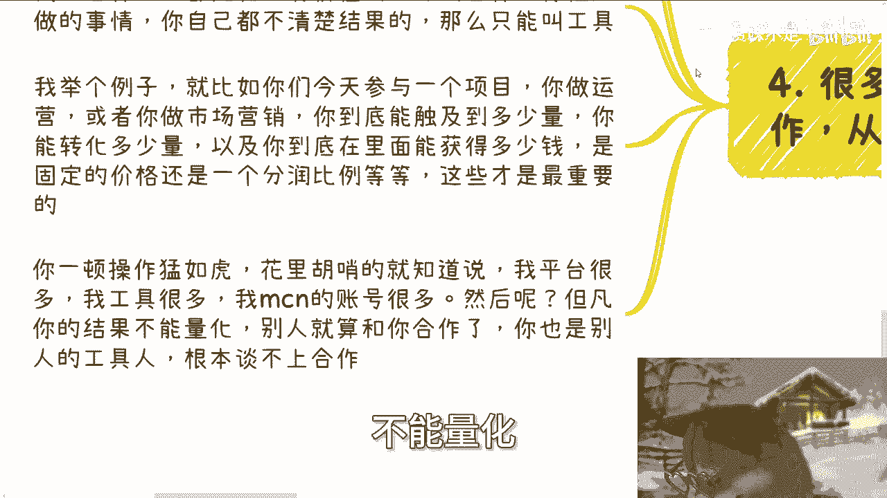

别人就算跟你合作，你也是别人的工具人，谈不上合作，明白吗，当然啊我在这个地方也提一点，就是说你们很多人去跟别人合作。

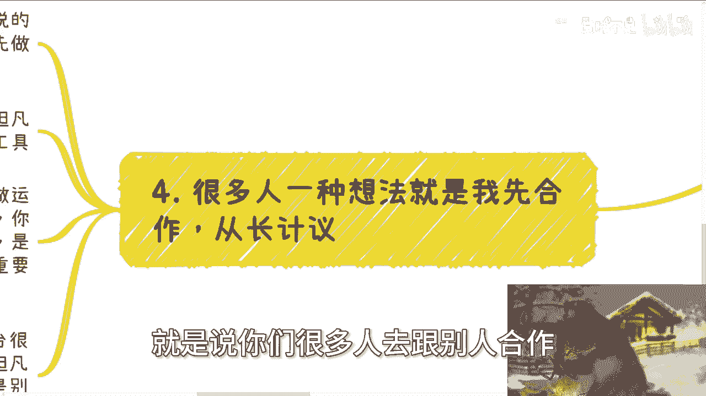

一开始的确啊我们实施从事实角度来讲，你说爱楚老师，我也的确只能先做太监，只能先做工具，只能真正舔狗，没有问题啊，我不是说你们要一步到位，而是说你们在跟别人合作时候，你不要把你自己太监这角这个角色工具。

这个角色舔舔狗，这个角色误认为你已经在跟别人合作了，那你这样的话永远是止步并不前的，只会原地踏步，你明白吗。

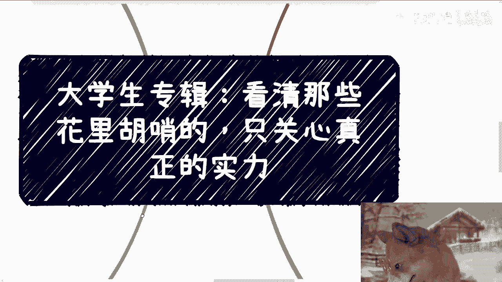

哦所以说就是我为什么一直一直说啊，我说大学生跟那些牛马本质上是一样的，是因为其实啊我我这么跟你们讲，跟我这个介绍他的这个这个项目背景的，或者跟我介绍他合作一些项目的人，有大学生，也有那种工作十几年的人。

给我描述都是一模一样的，你知道吗，都是那种就是爱唱啥，我我比如说我老家啊，这个有个堂哥啊，或者我我反正就他们的模式，就是说我在某某某地啊，有一个什么亲戚关系，或者跟我有一个发小。

或者有一个导师教授有个怎么样子啊，然后呢就说我们这个项目怎么样怎么样啊，这个呃这个这个叫什么，就是已经得到了国家扶持对吧，然后啊这个得到当地政府的扶持对吧，怎么样子，OK啊，全是屁话，我就问他。

我还是刚刚那套话，我就问他，我说那行啊，你跟他什么关系，血缘关系，亲属关系还是还是什么别的别的干爹对吧，然后他在那个那个那个那个项目里面，又是什么关系呢，他是什么职级呢，什么职称呢对吧。

然后你说政府扶持，政府怎么扶持呢，哪个名目扶持政府，哪个单位扶持了呢，一概不知哎，就是那种就是说就说我就问他，那我说这些信息谁跟你讲的哦，我们那个那个很牛逼的大哥啊，我们很牛逼的那个堂姐啊。

我们很牛逼的那个叔叔呵，就我我你知道吗，就是我听完这些话，我只会觉得什么呢，就是要么他是，要么你是，要么你们俩都是，对不对，就是他用那些虚头巴脑的，花里胡哨的东西来跟你讲，不是非蠢即坏，对不对。

那你又相信他的这些话，那你不是非蠢即坏啊，你坏不了，你只能蠢，对不对，唉我就觉得很奇怪，就是唉就是就是我我一直脑子当中有个疑问，就是我们大学四年，包括你们毕业写论文，难道老师跟整个社会教给大家的。

包括就是说你们做牛马啊，就是难道这个社会教给大家的，就是哦我今天听到一个东西，我今天做一件事情是不需要任何证明的，不需要任何的，就说呃验证的或者不需要量化的是吗，哎为为什么就是听风就是雨雨呢。

就是就是那种就是哎我我我我这个叔叔很牛逼，我我就问他那怎么牛逼，对吧啊，他就跟我说啊，A b c d e f g，那我说ABCDEFG里面哪些是你参与过的，哪些是你看到过这个实际东西的没有。

那我说怎么牛逼呢，那我说照你这么说法，你们这些人就跟就跟那个抖音上面，看到有一个人今天开了个账号，然后旁边这个嘛弄弄了一辆这个叫什么，就是劳斯莱斯和那个叫啥叫叫叫那个哎，那另外另外那个叫什么哦。

玛莎拉蒂对吧，那我说我说，那你们这个逻辑不就是抖音上面看到一个人，旁边放了一辆车，你也不知道这车是不是他的，你也不知道这车是不是租的，你也不知道怎么样，反正他说啥是啥，就跟这种人有什么区别呢。

对吧哎我操我他妈就不明白了，然后然后还会那种就是我说的还会那种，就是别人跟他说吹两句牛逼，他就怕了，就有种哇对方好到高大上高大上，什么东西啊，什么东西高大上了就对不对，你要我说我他妈在北京工作一年。

我我就这么说，别的地方我不我不管啊，北京这地方他妈的路上一个老走，这个随随便挖个老头都他妈能吹牛，哎，吹牛谁不会啊，对吧啊，所以我觉得就是说你要说建议啊，第二点建议就是把这些花里胡哨的东西，你都去掉。

因为你但凡去掉之后，你就能节省很多的时间，你就不会再浪费很多时间在这里面，因为大部分人做事情，你你会发现花个什么，一个季度，两个季度，三个季度，四个季度好了，111年两年就过去了，到最后一事无成。

为什么，不是因为他做的不好，不是因为这个呃对方做的不好，而是因为这些事情从一开始就不靠谱，只不过他自己不知道，他非要通过撞墙的方式去指导，那你人生能有多少次给你撞对吧行了。

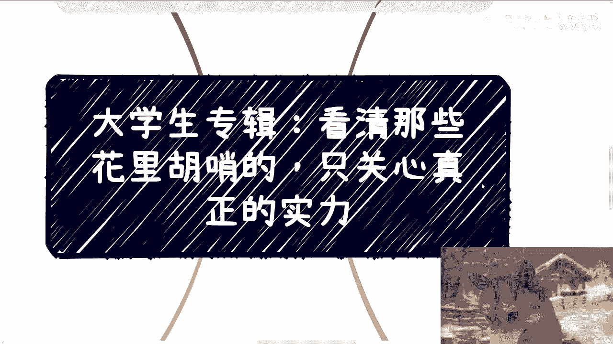

就这么着吧啊9月21号好吧，在杭州啊，在杭州，反正你们要详细了解的，再私信我啊，剩下的话就是说工作上面啊，就是职业规划啊，包括你们呃跟别人合作，包括一些副业，就商业规划。

那当然这里面可能涉及到一些业务逻辑啊对吧，融资啊，或者说股权分配啊等等等，你们希望啊通过跟我的一些沟通啊，能够给你们带来一些更直接地气的，或者说让你们少走点弯路的啊，一些这个结论的话，或者建议的话。

你们可以整理好对应的问题跟个人背景啊。

我们再来做咨询。