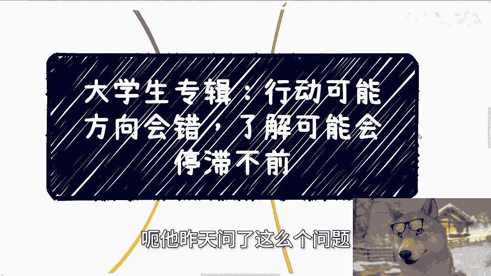
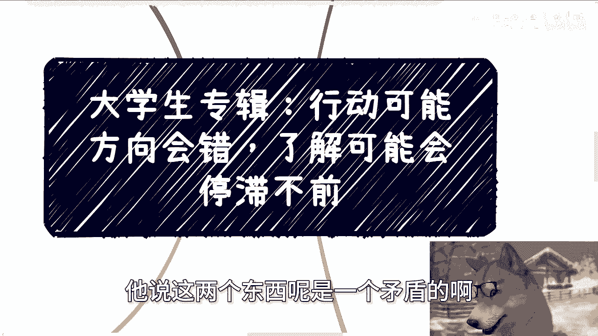
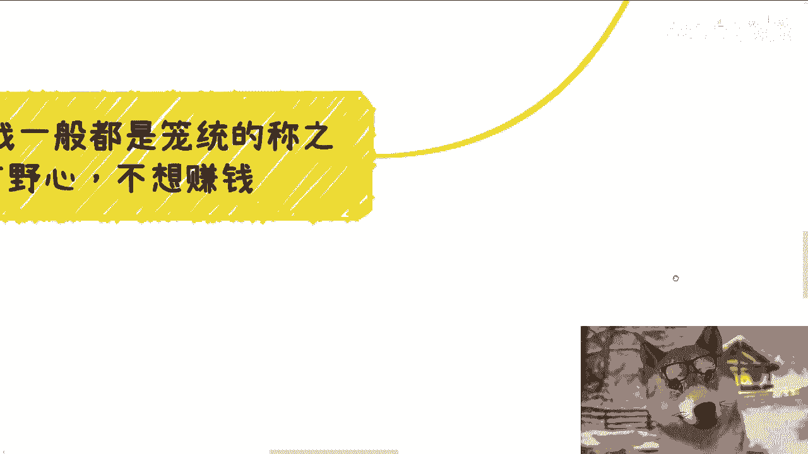
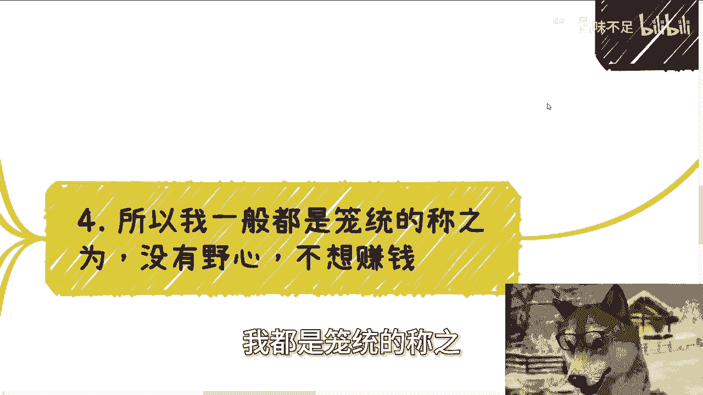
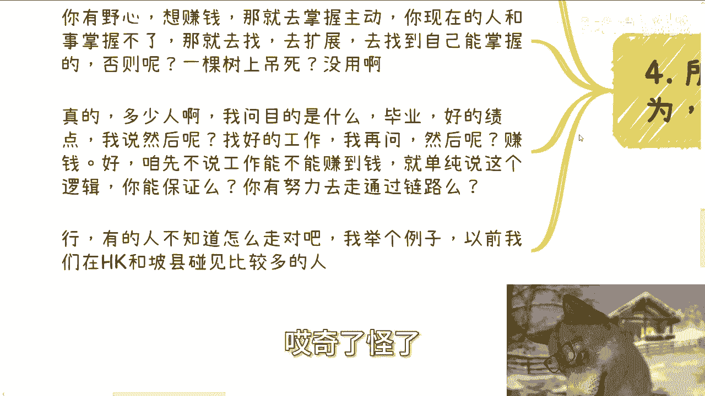
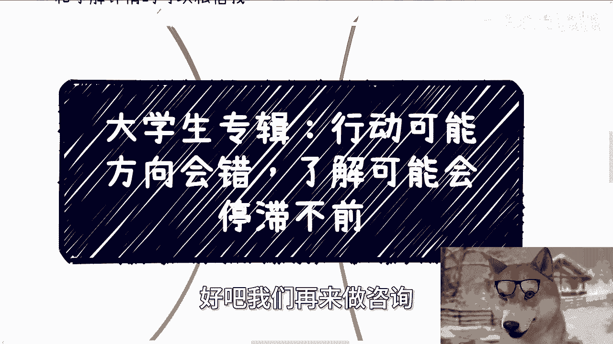

# 大学生专辑：行动可能方向会错，了解细节可能影响行动 - P1 - 赏味不足 - BV1qUtQeuEie

好这个大家好啊，今天我们这个主题呢啊，我觉得非常的interesting啊，也非常的重要，就是昨天呢有有小伙伴啊，就是在评论区还在私信我忘了，反正就是你们也可以看啊，呃他昨天问了这么一个问题。

他说行动方向，行动呢可能方向会错，了解细节呢可能就会就是说迟迟不行动啊，他说这两个东西呢是一个矛盾的啊。

那么他说这个矛盾这个当中怎么去平衡他啊，我觉得这个事情呢也非常的通用性，呃首先啊我们先说啊，下期活动已经定了，9月21号啊，就是礼拜六啊，这个下午一点到六点在杭州，那么本期呢定了几个新的主题。

一个呢是我会跟大家呃那个私下分呃，私下分享一下，这次上海大会时候跟一些研究院院长聊下来，政府最新关注的一些点，一个是我呃到时候现场会给你们看一下，就是20年二一年左右。

我跟高校啊跟呃政府这边谈的一些实验室啊，包括大会的一些呃解决方案啊，其实就是PPT啊和一些word，反正到时候就是一边给你们看一遍再解析吧，好吧啊，那么你们报名或者了解详情的，可以继续私信我啊。

那么今天啊接下来啊，这个主题非常重要非常重要啊，首先第一这是个通病啊，通病中的通病啊，你想啊原文是这么写的，他说老师去做一件不了解的事情，肯定先会尽可能的把它搞清楚，对吧好，但是呢没行动之前呢。

再怎么了解也肯定是不全面的啊，就想请教一下吕老师如何平衡，立刻行动导致的方向错误和深入了解，导致过于过于在意细节，而迟迟不行动之间的矛盾，哎呦好问题啊，牛逼啊，这事儿啊，我相信普罗大众，99。

999%都是这么个想法，也是也是这么个困惑，其实我跟你讲这个问题不难解决，为什么，因为所有的人的关注点都不对，所以你们会觉得很难解决啊，我觉得核心点是什么呢，主要是普罗大众对自己跟社会以及要做的事情。

了解不多，或者来说压根就没有了解啊，那么你看啊，我们一个个来分析，首先在整个这件事情当中，我们先要分析我们是谁，我们是谁呢，我们是普通老百姓，对不对，那么普通老百姓有什么特性呢，那就是对社会面是社会面。

商业面几乎都是不了解的，或者来说我们跟真正的社会面，跟商业面之间存在着非常大的信息差，对不对，好那么哎呀我这只狗子，我等一下啊，把它把它调整一下啊，好那么那么我们继续来讲啊。

那么我们简单来讲这些信息差导致什么，就是无知嘛对吧，那无知再加巨大的信息差，会让我们又又拥有一个特点，哎就这就跟打游戏一样了对吧，我们一个个点亮技能树啊，又拥有一个特性，特征属性是什么。

那就是我们根本没有能力做出正确的判断，也就是说往往我们认为正确的，都是以我们的认知为基础所做出来的判断，那他妈怎么可能正确呢，对不对，好，那么所以接下来啊，那么接下来才是正文啊，我们开始摆事实，讲道理。

就我们这种属性，我们的行动，如果我们行动了，我们至少能看到结果，对不对，就是失败或成功对吧哦，那么那么如果你要深入了解，就像范大将军说国足是一样的，你有这个能力吗，你没这个能力，你明白吗。

好那么接下来啊好，那么我们接下来再来说细节对吧好，有的人呢就是紧急，我们紧接上面的这个前提啊，大家不要忘记细节，一方面我们是一个没有判断能力的群体，那么我们怎么去了解细节对吧。

首先第一点第二点他就算天时地利人和，我们的运气特别好啊，狗屎运啊，那么我们就算了解到了，我们又怎么知道真假呢，对不对，好，那么其次以及我们为什么要了解细节，假设今天有个100万的项目，就这么说。

甲方回扣20万啊，执行方最低可以压到30万，中间商有50万的空间，对吧好，那我就请问你做哪一方，对不对好，首先啊由于我们的投胎技术不好，所以我们不可能有这个命做甲方，对不对。

好这个选项先pass pass掉对吧，其次你要了解细节，什么是细节，提问里面写的是了解细节，会影响我们做决策，会影响让我们这个迟迟不能够往前去行动，对吧好，那么如果是执行层的细节。

比如说这个项目到底怎么落地，用什么技术，大概需要怎么样的团队，他可能需要怎么样的资质，没问题，你要什么资质我都可以找你，要什么样的团队也都可以找你，要什么样的技术，我都可以找你。

他妈先给我把30万打过来，你要是觉得30万打不过来对吧好，那你先打个预付款，你打呀，你打了细节好说，对不对，那么问题在哪里啊，问题也就是说你纠结的应该是细节吗，不是你纠结的应该是钱。

或者来说或者来说从宏观角度来讲，你纠结的应该是你的目的，对不对，你去纠结这里面的细节，跟吊关系啊，对不对啊，那如果你选择中间那50万，那么也就意味着另外那20万的回扣，你不用管，30万的落地。

你也不用管其他各种细节，你都不关你什么吊事对吧，那么你只要关心这50万的事情，这50万当中你到底拿多少钱，以及什么时候能拿到不就好了吗，你要你还要了解什么细节，对不对啊，那么有的人要问了。

他说那这个也算细节，我们了解不了怎么办，那很简单啊，了解不了，说明消费不靠谱啊，对不对哦，你连什么时候拿钱，什么时候给钱都了解不了，那你还能了解什么，那么奇了怪了，对不对对吧，那既然生活不靠谱。

那你有什么好行动的，有什么好纠结的对吧，什么意思呢，意思就是说我们要去做一件不了解的事情，我们要去了解的并不是事情本身，而是要去了解我们能不能达到我们的目的，如果你们如果很简单，这当中就两层，第一层。

如果这件事情不能达到我们的目的，那我们就别做，第二层，如果我们都不知道我们的目的是什么，那我们有还做有更更别做了，对不对哦，你说我既不了解我的目的，我也不知道这事情能不能达到我的目的，然后说哎。

我他妈就在那边了解有什么好了解的哦，你目的也不清楚这事情能不能达到，你目的也不清楚，那你越了解不就越迷茫吗，这不就是你们现状吗，你想想是不是哦，好那么第三啊，那么说到这啊，有的人觉得卧槽。

这老师有点抽象啊，有点抽象，好，没问题啊，我们拿自媒体跟你们考本硕博来举例子，比如说做自媒体，你们做一个自媒体，立即行动跟在意细节分别是什么，做自媒体，你的目的就三个，要么纯做慈善，用爱发电。

要么为了名，要么为了钱没了，就这三个东西你还能要什么，对不对啊，好那么如果你是用爱发电，那么你随意不用纠结，因为你都用爱发电了，有什么好说的呢，而且在这个社会里面，你真的能用爱发电的。

结果跟过程只有一件事情可做，砸钱没什么好说的对吧，你做别的东西都徒劳砸钱啊，第二名和钱，其实我跟你讲差不多的，都是一个具体的结果，对不对，好，那么结果怎么来呢，很简单啊，你今天要做的吧。

我们就就拿你来讲啊，你今天要做好，无非就两种可能性，要么就是你很吊，要么就是你找很吊的人一起过来合作，显示出你很吊，对不对，第一种叫做你自身过得硬，第二种叫做草船借箭，对不对，狐假虎威，对不对，好。

那么你就去行动啊，好了呀，方阵已经很清楚了，你行动啊，有什么好犹豫的呢，你很吊，你就去找流量，找合作方啊，把你这个告诉更多的人啊，你不够吊，那你就去找吊的人来合作，那不就立即行动没了吗，有什么问题呢。

能错到哪里去呢，你纠结什么呢，对不对，那么如果在意细节是什么，那就是我可能选择什么平台，我可能到底是长视频，长视频，短视频呢对吧，我到底是跟合作方怎么分润呢，对吧，我我我我我到底跟别人怎么合作呢。

我怎么寻找我的合作方案等等等，好那么问题来了，这些细节就我们刚刚举例子，这些细节跟你要得到名，得到钱有什么直接关系有吗，你我跟你讲啊，你别说你别跟我说，你感觉有就具体的你告诉我什么情况下有。

比如说你做短视频，你是能得到什么数据，你你做长视频能得到什么数据，长视频比短视频能能多几万播放量，还是说能多几几万块钱收入对吧，你不要来跟我讲，你感觉有感觉有有卵用啊，对不对好。

那如果你不清楚或者你不知道，那么你就去搞清楚，而不是在那边纠结，哎呦卧槽他妈的这些细节我应该怎么做，你有什么好纠结的，都不清楚你纠结什么东西啊，你想想是不是对吧好，那么你本硕博其实也是一个逻辑。

立即行动跟在意细节分别是什么，请问你本硕博的目的是什么，好有的人说了啊，我我我目的是毕业啊，文凭找工作赚钱对吧，好没问题啊，我打个比方，如果今天你手上已经有十几个合作公司，他们说我们都很认可你。

我们觉得你很牛逼，只要你今年你只要你硕士毕业了，或者活博士毕业了，我们就可以愿意开给你多少多少钱，100万，200万，300万的offer，然后签多少年，那没问题啊，没问题啊，你你立即行动啊，对不对。

这就是我们说的你行动啊，否则呢，否则就是你行动了，你当然会迷茫，因为你不知道你得到什么，你知道你能得到一纸文凭，但是你不知道这个文凭能让你得到什么，所以你慌得一批对吧，所以你才困惑，对不对。

因为你不知道你目的是什么，你在那边纠结有什么好纠结的啊，再者我们说现在于细节细节是什么哦，我陈老师，我这个专业选的怎么样，技术应该怎么学，专业学的好不好，同学关系怎么处，老师关系怎么处对吧。

然后我学校里面有些艺术生对吧，有有些富二代，我怎么处好，那我还是那个问题，你的目的是什么，你刚刚所说的这些东西，跟你的目的有没有直接的关联对吧，有的人要说了，虽然和毕业可能无关。

但是跟找工作赚钱offer有关啊，那我就要问了哦是吗，有什么关，你到底告诉我有什么关联，我要的是确定的关系，如果你觉得有一个确定的关联性，就像我一开始说的，你今天得到某一个文凭。

你就能得到X分offer，那你去找，那你去学这个东西没问题，但是如果你没有这个关系，那请你去找，请你去拓展这个关系，以结果为导向，而不是在这边说空话来PUA你自己，对不对，你说啊，陈老师。

我觉得我的基点对吧，跟我的这个学校对吧，985211，跟我这个文凭呃，跟呃和我的最终的工作跟跟这个薪资有关系，什么关系，什么学校对吧，什么工作，你确定吗，你有没有确定的不确定。

不确定你跟买彩票博彩有什么区别，对不对，有什么意义呢，对吧我一而再再而三的强调啊，你们你们不要用这种你们的感觉，或者说整个面上面好像怎么样子说啊，这个学历好的人比较好找工作，薪资比较高。

学历差的人比较难找工作，学额薪资不高，然后呢跟你吊关系啊，艾玛奇了怪了，这就好像很多人很搞笑的问我，爱创老师那个大数据啊，跟医疗这个结合方向很好啊，我看到很多政策很扶持。

他说你觉得我学这个专业怎么样跟你吊关系啊，诶莫名其妙嘞啊，政策好跟你有什么关系啊，你要是跟我说，今天你已经搭搭上了一些，比如说产业园搭上了一些协会的关系，搭上了某些政府项目，然后你说哎这个这个东西哎。

政策很扶持的对吧好，那么我们接下来就可以讨论这个东西里面的，具体细节了，为什么，因为跟你有关系，什么关系都不知道，你在那边有什么好说的对吧。

所以啊，一般所有以上刚刚那些问题我都是笼统的称之。

为什么没有野心，不想赚钱，为什么，因为我不管你是大学生还是牛马，目前你们做事情就是太僵化，说白了就是我说的从来不以目的为导向，但是我不明白，就是我不明白，一个接受过9年制义务教育到高等教育的人。

他为什么做事情不以目的为导向对吧，或者来说他们做事情的目的都是自己不可控的，开关全部掌握在别人手上，我我就真的很觉得很奇怪，这就好像我每次问问他们，我说哎要不这样吧，你给我100万啊。

我我明年给你做理财，然后呢我就跟他说，我说哦这个理财的这个年化哦，我不确定的哎，也有可能会亏啊，我我我我不，我不是很确定，到底能10%还是负50%，然后呢那我就这么问，你们会给我这笔钱吗，不会吧。

对不对，你们只要是一个正常的四智智商，正常脑子都不会给我吧，对不对，但是就很奇怪，你们在做很多别的事情的时候，就是这样子的，没有结果导向，但是就愿意付出时间，付出精力，付出努力，哎我操那图什么诶。

那那你就跟就像我们刚刚说的啊，你说啊我图个好的工作，图个图个好的offer可以啊，你确定吗，这就像我跟你说的，诶，你给我100万，我给你，我给你量化呀，对不对，我给你投资呀，你图图有好的收益啊。

那你问我创世，你确定吗，哎我不确定做事情都不确定，凭什么我确定啊，那么搞笑呢，对不对，你想想是不是很可笑对吧，就是说你有野心想赚钱，什么意思，那就是去掌动掌握主动权，你现在的人和事。

我相信你们身边的人和事，大部分你们都是掌握不了的，那掌握不了没关系啊，不要去死抠啊对吧，掌握不了，我们就另辟蹊径，找一些我我能掌握的，那否则呢一棵树上吊死嘛，你吊死也没用啊对吧，我跟你讲真的多少人啊。

我问目的是什么，毕业好的基点，我说好，然后呢找好的工作，我说好，再然后呢赚钱好，咱就这么说啊，咱先不说你做牛马工作能不能赚到钱，就单纯说他的这个逻辑，你读书为了什么毕业好的基点，为了什么找好的工作。

找读呃，考到好的大学，为什么为了找到好的工作，好的工作为了什么，为了更多的薪资，那请问这个链路你确定吗，对不对，你又不确定你在那边PUA自己对吧，好那行，有的人啊就到这里啊，如果你们能听到这里。

有的人要说了，他说那我不知道怎么确定啊，对不对，好我给你们举个例子啊，我们以前18年，19年在香港跟新加坡开会的时候，我们见到过非常多的啊，就是海外的有好的学校，有不好的学校。

海外的那些学生在大会上面各种吹嘘啊，我就很直白的告诉你们不各种吹嘘，他们的目的也很简单，就是跟各种项目方，各种创业公司或者各种大公司的人打好关系，然后他们打好关系，追求的目的是什么。

就是现在在里面已经开始这个这个合作，一些东西，然后毕业的时候就顺理成章的就是顺，甚至都不用面试的，就直接进去工作了，这就是他们要的承诺，他们要的东西。

OK你今天说比如说他在NVIDIA找不到这些工作对吧，可以啊，那我去AWS找啊，aw s找不到，我去google找啊，google找不到，我再往下找啊，怎么了，他妈的全球这么多公司我找不到吗，这怎么然。

然后反过来就说我们国内的这些人怎么了，这不是方法吗，对不对啊，谁告诉你找工作只有面试这一条路的，谁告诉你找工作只有boss这边这一条路的，哎，奇了怪了。

我跟你们讲啊，所有东西都是有因有果的，我曾经的视频就给你们讲的很清楚，当你们觉得没有路可走，当你们觉得自己没有选择的时候，是你们自己造成的，不是这个世界造成的，因为你们有手有脚，谁阻拦过你们了吗。

没有只有你们自己阻拦你们自己，然后就在这个地方说哦，我可能行动了，我就怕方向错了哦，我要去了解细节，可能就会让我行动不浅，问题在哪，问题在于你根本就不知道你要什么对吧，真的你们仔细想想看啊，行好吧。

礼拜六啊，礼拜六杭州这个活动要报名额，了解详情的去私信我，那么剩下的话就是说呃工作内容呃，不是工作内容，就是职业规划啊，工作上面商业规划，副业包括呃创业，包括你们跟别人合作一些东西，在这里面涉及到一些。

比如说呃业务模型啊，商业链路啊，闭环啊，股权融资啊对吧，股权分配啊等等等，你们觉得不清楚的，或者还是说就是说呃能够让自己少走点弯路的，你们可以整理好对应的问题跟个人背景好吧。

