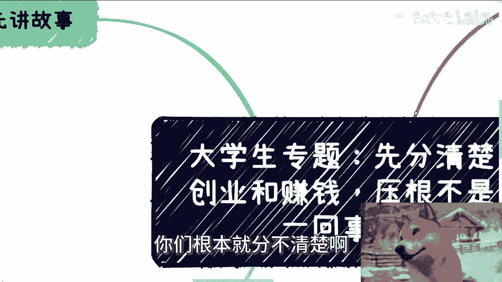

# 大学生专辑：赚钱唯一要积累的就是赚到钱这件事情本身 - P1 - 赏味不足 - BV1eoskewEMR

好大家好啊，这个明天又礼拜一了是吧，呃我刚刚把那个上海大会的这边，一部分的视频又上传了好吧，但还剩一些还剩一些。

明天我再给你们补上啊，然后的话呢就是我昨天唉昨天是哪回来来着。

昨天呃啊杭州杭州回来，我就有点感冒啊，就可能你们现在听上去这个声音啊，这待会还会咳嗽啊，哎呀这关系不大啊。

那今天我们继续来讲这个专题啊，叫做先分清创业跟赚钱啊，妈的压根就不是一回事，我还是那句话啊，这个专题不单单是给大学生的，所有的牛马都是一样的，因为他们对社会一无所知啊。

你们现在也许感觉你们懂得创业跟赚钱对吧。

或者你们自己分的清楚，但是我可以很明确跟你们讲，你们根本就分不清楚啊。

那我们先讲个故事啊，这几天有个咨询小伙伴跟我提到什么，他说他和一些老板啊或者创业者聊了一下啊，对方表示呢就是他他们相互肯定介绍，也认识了一下嘛，对方表示呢不建议他创业，说现在满地都是坑啊。

而且呢就是很很有可能性，也是要那个提前投入的啊，也可能要拼爸妈的资源等等等对吧，我说对方说的没有错，然而啊这位小伙伴得出的结论，就他妈让我很惊讶啊，我这边呢正好说一下，我个人感觉。

很多大学生跟牛马都他妈是这么想的，这位小伙伴是这么说的，他说背面给我的这个信息，意思就是说他现在只能好好的工作，然后在工作里面积累一段时间，有了一定的资金跟经验之后再去创业，我他妈听完就满脸问号。

就是你是怎么从我们刚刚说的，这位所谓的老板或者创业者给出来的一些情况，比如说不建议他创业，说满地都是坑对吧，说提前要投入啊，可能会拼上一代的资源等等等，从而得出这么个结论对吧，我就是地铁老人看手机啊。

我就问他，我说那你的目标是什么，他就说他想自己做点事情，然后有了一定的经验跟储备之后去创业，我说他妈你是太虚了，创业两个字太虚了，你直白一点，你到底要干嘛，对不对，他说我要赚钱，对吧好，那我就跟你。

那那接下来我们继续往下讲啊。

第二大部分的普通人跟我是一样的，要的是赚钱，不是创业，而且你们要明白一点，对于大部分的普通人，包括我在内，我们不配懂吗啊当然我说的这个不配，一方面是我们没这个能力，另外一方面是整个现代的社会。

整个这个时代也没有给我们这个天时地利人和，你不要在那边他妈的自己给自己加戏。

对不对啊，好，那么什么叫创业，我们举个例子，你做做拼多多ba at对吧，阿里巴巴对吧，百度啊，京东字节大疆，或者所有的那些比如说外贸公司，皮包公司对吧。

所有的那些to b to c to g端的产品和业务，你想做出来一些属于自己的产品跟服务，以把这个产品跟服务具象化，软件化，硬件化的服务，那么我们把这种东西称之为创业，那么你就像我问这位小伙伴。

我说你如果真的是要创业，你的目的是什么，还是说上市，还是说怎么样子，你总啊还是说就不停的融资，你总归得有个方向吧，对不对，你不能跟我说我的创业的目标就是赚钱，因为你创业这个词太太过笼统，太过模糊。

太过虚，你跟我说创业就为了赚钱，这句话也就是他妈就一句空话，对不对，有什么意义呢，我就问你，你怎么创，我就问你，你怎么赚，对不对，你这话说出来有什么用呢，你PUA你自己PUA，别人不关我吊事。

但是你跟我讲，我就会告诉你，你是个，对不对，没有意义啊，主要是嗯乔布斯做苹果叫什么叫创业对吧，创业创业，创业你就需要去创一个自己的业务和这个产品，而且是比较独特的业务跟产品，那你们自己问问自己。

你们是这个想法吗，啊啊所以其实你们跟别人聊啊，比如说他们不让你们创业是对的，但并不代表你们不能去赚钱啊，对不对，哎你说他得出这个结论，我相信你们很多人也会得出这个结论，就是哦可能我现在没有什么积累啊。

我也没什么资本啊，我好像不太适合创业，那他妈你们的逻辑对呀，但是为什么你们不去赚钱呢，那我就不明白了，对吧啊，那么我就跟他说，我说咱就这么讲，我跟他举例子啊，比如说淘宝发展到今天，自媒体发展到今。

今天电商发展到今天，微商发展到今天，直销电销会消发展到今天，我不说那种几个亿的，几千万的，甚至比如说几百万的，我都不说，咳咳咳，我们就这么来讲，一年小几10万，大几10万的中国满地都是吧，对不对。

那么我们就这么问，这小几10万大几10万的流水，他们难道是创造了自己品牌跟服务吗，没有吧，他们算创业吧，也不是吧，对不对，咱说的更直白一点，这些人更多的其实就是资源整合，无非是自己DIY的一个品牌。

然后就说借助平台的力量，借助互联网的力量把自己推销出去，这叫什么，这叫赚钱，这不能这不能叫传统意义上的创业，能明白吗啊，第三啊，然后还有跟我提所谓的这种积累的，你记住一点啊，如果有人能赚到钱。

或者有公司能赚到钱，那么一定是因为这个人懂得商业逻辑，懂得怎么整合资源，懂得人性，而不是TMD他在牛马的这个这个经验里面，或者在公司里面积累了多少经验，这他妈没有半毛钱关系，懂吗，哦你做了更多年的牛马。

你只能积累怎么做牛马的经验，能明白吗，听得懂吗，啊啊如果要说积累的话，一定要去积累对应的关系啊，那么但无论积累了什么，一定不是因为积累了牛马的经验，或者某些技术经验，这他妈不存在的啊，有的人又要问了。

你知道吗，有的人只以前问过了，他说哎，那以前一些人，一些公司不都是先做牛马再创业的吗，So，他妈我就问你们1990年跟二两千年一样吗，2000年跟2010年一样吗，2010年跟现在一样吗，对不对。

你时代都不一样，各个东西都不一样，这他妈有什么关系啊，啊以前很多的个人，很多企业，很多产品服务，为什么先做牛马，是因为他们当时没有这个时机，但是为什么后面又去创业了，是因为他妈的他们有了这个时机。

对不对，你个人努力占1%，剩下的就是天时地利人和，就是时代的红利跟土壤的红利没了啊，哦你们既然得出来的是哦，因必须先做牛马积累这种结论，我当然也不知道怎么回事啊，我只能说他妈应试教育做多了，对不对啊。

有人要问了，他说那一些公司融资甚至上市呢，是不是跟这个呃创始人之前的积累有关呢，我他妈就笑尿了啊，你们对这个社会是多么无知啊，我就告诉你们啊，无论我们说的是什么，金融这件事情永远是独立的对吧。

你比如说一级额不是一级市场，二级市场里面都有一个东西叫什么叫做市商，你不要真的以为你做得好了，你做的大了就能融资或者IPO了，你不要真的以为你的二级市场，二级市场上面的一些，比如说什么啊。

走K线图走势啊对吧，包括是市值啊，包括其他各种东西，真的跟你的产品服务，跟你的产品质量有关，有他妈半毛钱关系啊，啊这他妈都是有专业团队运作的好吗啊，我觉得都2024年了。

你们不要再天真的以为说噢我有什么学历，我能做的多么好了，我就能去融资了，这如果存在这种因果关系的话，那么我就这么说，今天整个中国这片土地上聪明的人多了，有技术的人多了，你去看到有他妈几个人融资的。

这么搞笑嘞，对不对，我就这么问你们，你们如果是投资人，你们关键是他技术不，还是关心他能不能赚钱，就这么简单，资本层面，金融层面不要谈这些虚的，没有虚的，对吧啊，第四记住啊，我们曾经再三强调过一件事情。

就是你唯一要积累的东西是什么啊。

如果你的目标是赚钱，那么你唯一要积累的东西就是赚钱，本身没什么好说的对吧，也就是我一直说的，你要做的就是不停的一个一个一个，一个一个一个赚钱的项目去做，做闭环结束不要他妈谈那些有的没的。

你所有的什么跟我说什么实习啊，去大厂啊，去什么地方啊，跟着什么大佬啊，全他妈屁话，跟赚钱有什么关系啊，你先赚到钱才叫跟赚钱有关系，明白吗啊也就是说你一我举个例子，也就是说你一年做五六个项目。

或者持续做一年做了几个项目，什么叫做闭环，什么叫做成功，那就是你已经要在这个项目里面，看到别人付钱了，付多付少再说，但是别人已经付钱了，那么这件事情就闭环了对吧，我举个例子，比如说当然啊。

你做事情一定要达到这个市场的均值啊，我们举个例子啊，比如说你做一场小沙龙市场，一般一场小沙龙的均值是什么，最少一般也就二十二十个人要有吧，对吧好，那么你你要么就是20个人都付费了。

要么就是说你去找托儿凑满20个人，你整个活动得他妈要闭环，什么叫闭环，就是你海报有来，你招生也招了，你有了现场的活呃，活动照片，你现场整个流程也给别人走完了，也相当于是给别人做服务，做完了钱也收了。

那么好，自至此为止，基本上就是一个闭环了，你们自己参考一下，举例反，举一反三，别的事情也是一样的，不要做很多东西都是那种什么哎呀，做了什么一两个月，两三个月看不到钱的。

那不叫闭环，你积累再多，这种经验也没有吊用啊，不要自己在PUA，自己人没有意义的，如果你们今天的目标就是为了赚钱，我告诉你们唯一一点，如果你们要积累的东西就是赚钱本身，请他妈先赚到钱，这叫积累，剩余。

只要没有看到钱的，全他妈是放屁，就这么清楚啊，如果来说你们剩下的听到别人跟你们讲，不是那么清楚的，要么他自己是，要么就是他为了忽悠你们而说的就这么简单，嗯好吧好那行吧。

那我们就今天这个内容就先讲这么多吧，然后剩下的话你们自己工作当中好吧，就直接规划你们的副业，或者说就是跟别人一起搞些什么项目啊，在这里面涉及到一些比如说呃政政府啊，高校啊，呃资本啊啊企业啊对吧。

涉及到一些股权融资啊对吧，估值啊等等等啊，呃业务方面等等等一些方面东西，你们要是觉得有任何问题，或者想呃找我沟通完了，尽可能少走点弯路的话，你们可以整理好对应的问题跟个人背景好吧。

