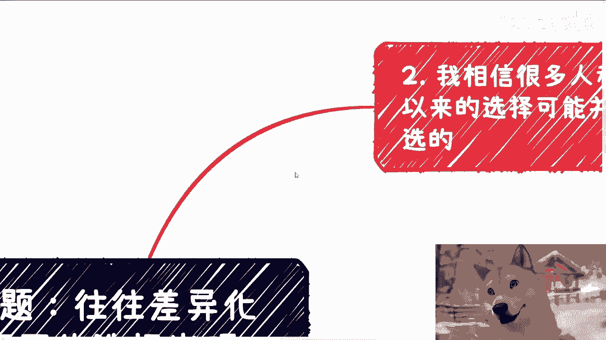
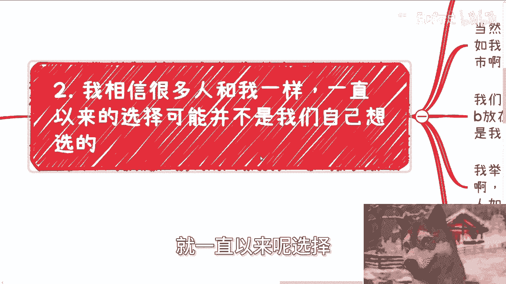
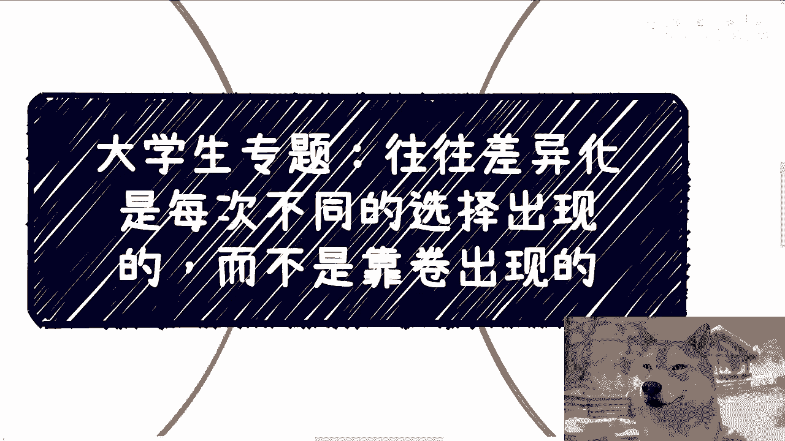

# 大学生专题：差异化选择与个人发展路径探索 - P1 🧭

在本节课中，我们将探讨一个核心观点：个人发展的转折点往往源于做出**差异化**的选择，而非在既定赛道上盲目“内卷”。我们将分析为何习惯性选择会限制可能性，并探讨如何通过改变日常决策模式来开拓新的路径。

---

## 概述：为何需要差异化选择？ 🤔

当前，许多发展路径（如高考、实习、求职）对大多数人而言是相似的。这些路径通常由上层规则制定者设计。如果始终遵循他人制定的规则做选择，个人很难脱颖而出。

**核心公式**可以概括为：
`转折点概率 ∝ 差异化选择的数量与质量`

这意味着，获得人生转折点的可能性，与你做出与众不同选择的次数和质量成正比，而非单纯的努力程度。

上一节我们提到了环境与规则的局限性，本节中我们来看看我们日常是如何做选择的。

---

## 选择的三重来源 🔍

我们日常所做的选择，其来源主要可分为以下三类：

1.  **自主选择**：基于个人真实意愿和理性判断做出的决定。
2.  **灌输性选择**：受社会、家庭、教育等外部环境影响，潜移默化形成的选择倾向，有时自己并未察觉。
3.  **未知选择**：世界上客观存在，但由于个人认知局限而未曾知晓的选项。

这些选择不仅存在于人生重大节点，更渗透在日常生活的方方面面，例如如何对待同事、选择城市、处理人际关系等。

理解了选择的来源后，一个关键问题随之浮现：我们为何总是重复同一种选择模式？

---

## 惯性选择的陷阱与反思 💡

许多人一生都在重复同一种选择模式，即使多次导致自己吃亏、浪费时间或感到疲惫。常见的思维是：“是不是我做得还不够好？” 例如，在合作中总是不计回报地付出。

这种惯性源于**潜意识习惯**，而非每次的理性权衡。当类似情境再次出现，我们几乎会不假思索地做出与过去相同的反应。

**核心反思**：
*   你为什么要这么做？（动机）
*   这么做确定能带来你想要的结果吗？（有效性）
*   如果结果不确定，为什么还要坚持这么做？（惯性）

大众的思维和恐惧是相似的。如果始终与大众做同样的选择，走同样的路，又怎能期望获得不同的结果？

既然惯性选择可能限制我们的发展，那么，我们可以尝试做出哪些不同的选择呢？

---

## 差异化选择的实践举例 🛠️

以下是几个打破常规的思考方向，并非标准答案，旨在提供启发：

*   **实习与求职**：并非所有人都必须卷入高竞争度的标准化实习。可以将这段时间用于执行一个自主规划的小型项目、学习特定技能或进行有目的的社交，从而获得与众不同的经验。
*   **人际关系**：减少在揣摩他人想法、讨好他人上的精力消耗。将节省下来的时间用于自我提升或休息，减少内耗。
*   **职业发展**：在技术领域，如果不想在“卷技术深度”的单一赛道上竞争，可以尝试“卷客户”或“卷需求”。例如，寻找被主流市场忽略的下沉市场、特定行业（如高校、中小企业）的需求，利用信息差或差异化服务能力建立优势。

这些例子表明，差异化不一定意味着彻底改变人生方向（如换工作），而可能只是**改变做事的方式、服务的客户、关注的领域或所在的城市**。

从更宏观的视角看，社会由多个“金字塔”（即不同领域、不同市场）构成。我们的目标不应局限于在单一金字塔内爬到顶端。

---

## 田忌赛马：在多金字塔中寻找优势 🏇

社会是多元的，由无数个大小不一、领域各异的“金字塔”（竞争体系）组成。

*   在A金字塔（如大厂技术岗）中，你可能只是中等水平。
*   在B金字塔（如特定行业软件服务）中，你的能力可能足以成为佼佼者。

**策略核心**：不是在一个拥挤的金字塔里死磕，而是并行探索多个金字塔，找到与自身特质（性格、技能、资源）更匹配的领域，从而在某个或某几个金字塔中取得相对优势。

这要求我们勇于尝试未知选项，打破“必须如何”的思维定式。每一次不同的选择，都是一次新的探索，都可能为你打开一扇未曾留意的大门。

---

## 总结与行动建议 📝

本节课我们一起学习了：

1.  **转折点源于差异化选择**：概率上，与众不同选择能创造更多可能性。
2.  **审视选择来源**：区分自主选择、灌输性选择和未知选择。
3.  **警惕选择惯性**：反思重复性吃亏行为背后的潜意识模式。
4.  **实践差异化**：在实习、人际、职业发展等方面尝试微小但不同的路径。
5.  **采用多金字塔策略**：在社会不同领域/市场中寻找适合自己优势的切入点，而非困于单一赛道内卷。

**行动起点**：从今天起，在面对下一次习惯性选择时（无论是答应一个不情愿的请求，还是遵循一条常规路径），先暂停片刻，问自己：“是否存在另一种做法？哪怕只是轻微的不同？” 并鼓起勇气尝试一次。

改变始于一个不同的选择。