# 大学生专题：能上能下的核心逻辑 - P1 🎯

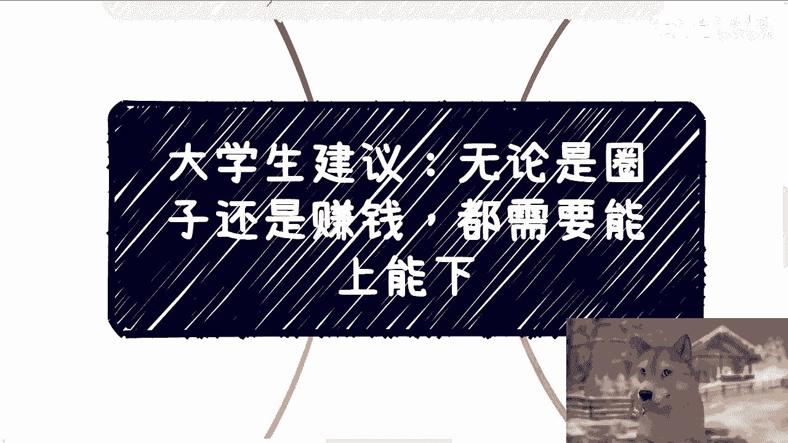

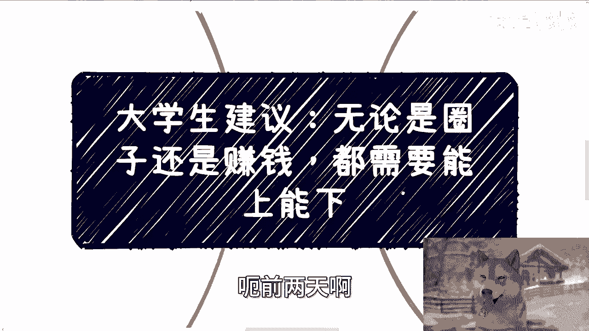

在本节课中，我们将探讨一个对大学生和初入社会的年轻人至关重要的课题：如何做到“能上能下”。我们将分析为何许多人难以放下身段，以及这种心态如何阻碍了个人对社会的全面认知、寻找发展机会和建立真正有价值的社会关系。理解并实践“能上能下”，是突破圈层、实现财富增长的基础。

## 一、 前提：摒弃先入为主的偏见 🧠

上一节我们明确了课程目标，本节中我们来看看理解“能上能下”的第一个前提。我们探索世界、了解社会和人类群体的过程，本质上是获取信息并形成认知。这个认知的深度，取决于我们是否被表象所蒙蔽。

核心在于，我们不能让任何先入为主的观念（“有色眼镜”）干扰我们的判断。一旦被表象迷惑，我们就无法触及事物的本质，并且会陷入“当局者迷”的困境。

以下是几种常见的先入为主观念：
*   见到领导或权威人士，内心自动“矮人一等”。
*   遇到外貌出众或年长者，下意识认为其“靠谱”。
*   面对高学历者（如985/211、QS名校背景），默认其“优秀”。

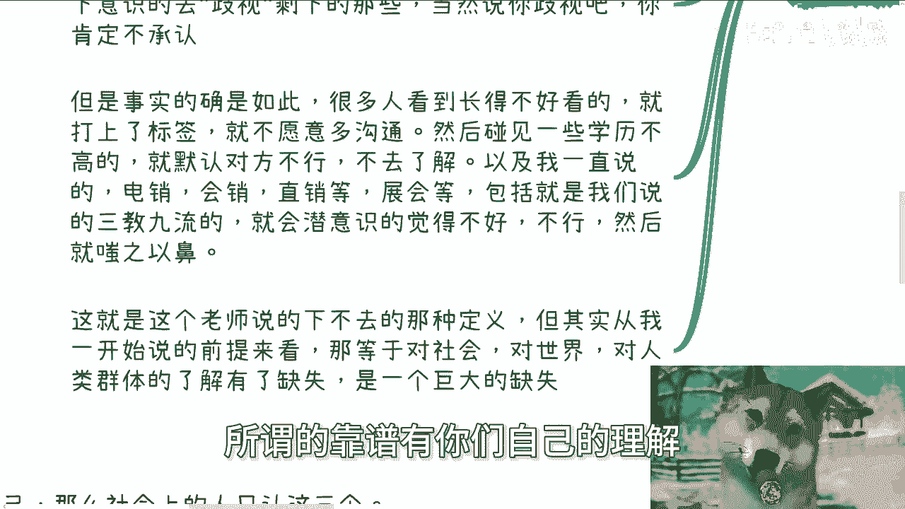

这种思维模式的危害是双重的：一方面，你会忽略这些“光环”背后可能存在的缺点；另一方面，你会**反向歧视**那些不具备这些光环的人。例如，轻视外貌普通者、调皮的学生、学历不高者，或是从事销售、展会等所谓“三教九流”行业的人。这种“下不去”的心态，导致你对社会和人群的认知存在**严重缺失**，你的判断停留在表象，从未触及本质。

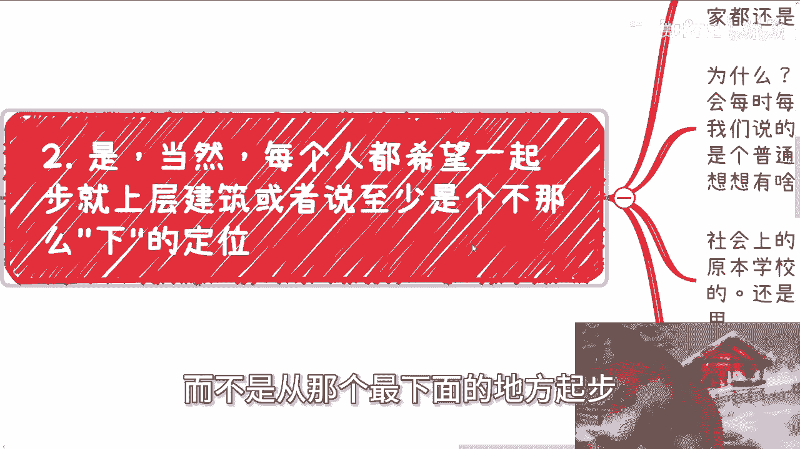

## 二、 现实：社会平等的起跑线与新规则 🏁

理解了认知偏见的问题后，我们来看看现实社会的运行规则。每个人都希望有一个高起点，但社会有其固有的框架和金字塔结构。对于绝大多数普通人而言，进入社会后，大家在一个更现实的层面是平等的。

社会运转遵循“一个萝卜一个坑”的原则。除非你是“二代”，否则社会没有义务为你预留一个中上层的坑位。你在学校或既定职场规则下获得的“优秀”，在社会的新游戏规则中，可能**不被认可**。

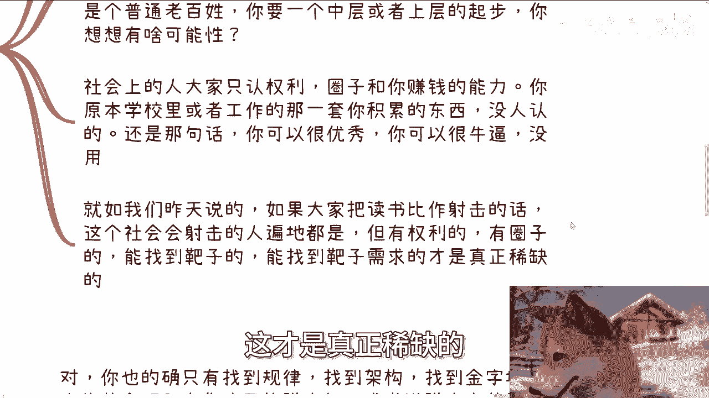

社会真正认可的是以下三样东西，其关系可以概括为：
**社会认可度 = 圈子 × 权势 × 赚钱能力**

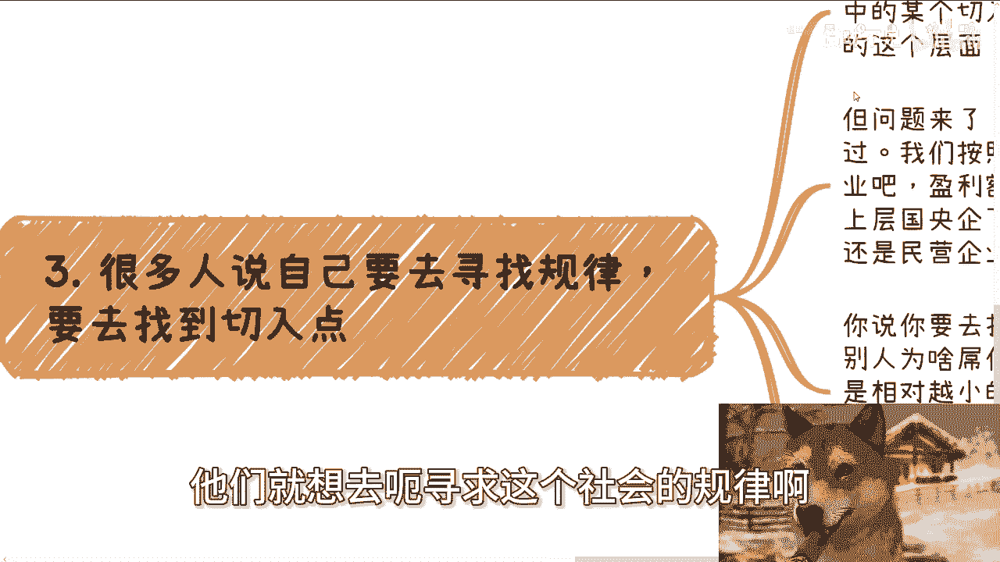

如果把读书比作学习射击，社会不缺“会射击的人”，但极度稀缺“能找到靶子并让靶子付钱的人”。后者需要的正是上述三种能力。

## 三、 路径：寻找切入点的正确姿势 🔍

既然知道了社会的核心规则，那么如何找到突破口呢？很多人想摆脱打工、寻求社会规律、找到切入点。这需要方法。

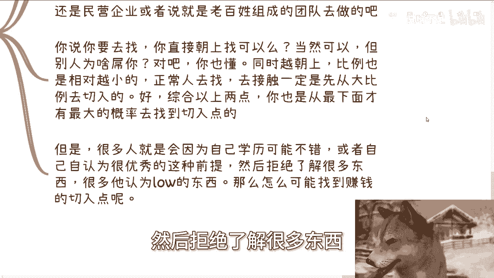

从宏观结构看，中国的经济主体是数量庞大的小微企业。上层任务最终需要由民营企业和老百姓团队来执行。如果你想寻找机会，直接冲向金字塔顶端成功率极低，因为越往上，机会越少，竞争门槛也越高。

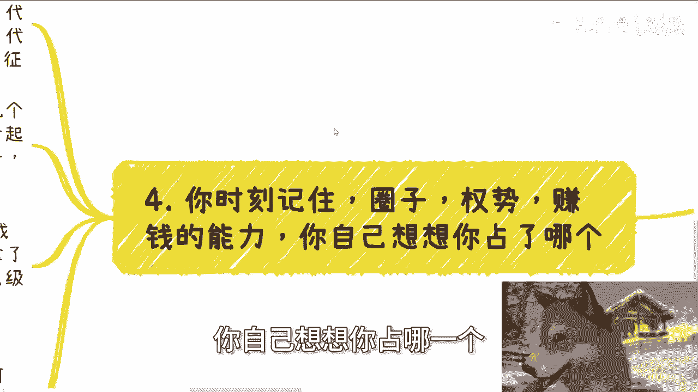

因此，一个基本的逻辑是：**最大的机会密度存在于最广阔的基层**。拒绝了解你认为“low”的事物，就等于拒绝了最大概率找到切入点的可能性。就像想赚聪明人的钱，首先要回答：聪明人为什么让你赚？

## 四、 核心：社会生存的三元要素 💎

最后，我们来深入剖析社会生存无法绕开的三个核心要素。你必须清醒地认识到自己在其中的位置。

社会上的人只认这三样东西：
1.  **圈子**：代表你的业务范围、眼界、认知、格局和资源。
2.  **权势**：代表你的社会地位、政治地位和资本地位。
3.  **赚钱能力**：指创造财富的自由度，而非出卖苦力的程度。

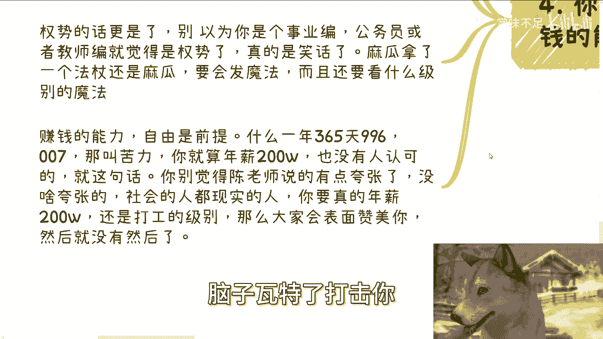

关于这三要素，有几点必须澄清：
*   **圈子的误区**：加了微信不等于有了圈子。没有利益绑定和平等合作，你只是圈外人。
*   **权势的误区**：拥有一个职位（如公务员、事业编）不等于拥有权势。就像麻瓜拿着魔杖也不会施法，关键是你能否运用职位创造影响。
*   **赚钱能力的误区**：高薪打工（如年薪200万）本质仍是出售时间的苦力。这不会为你带来真正的圈子和权势，旁人或许会表面赞美，但不会赋予你核心价值。

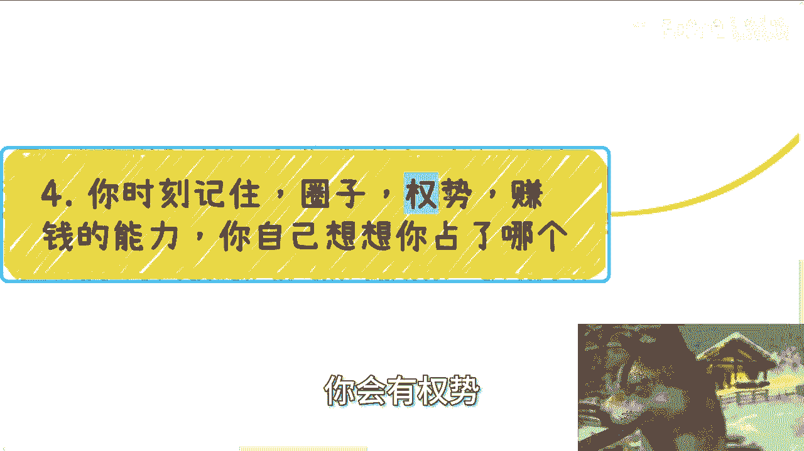

如果你的目标是想改变现状、脱离打工束缚或创造财富，那么你的努力方向必须围绕这三点展开。在这三点之外积累，很可能是无效努力。

---

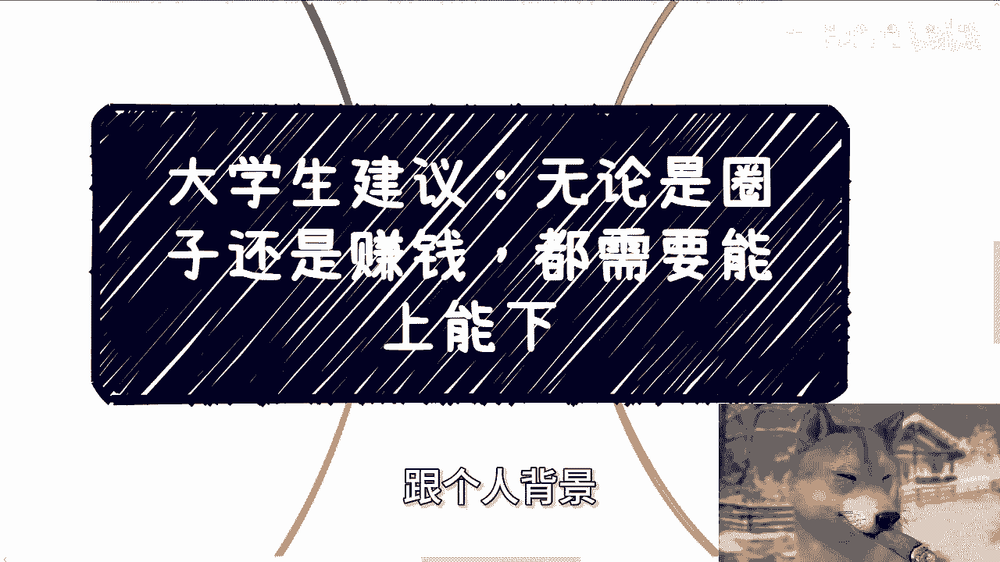

本节课中我们一起学习了“能上能下”的深层逻辑。我们从**摒弃偏见**开始，认识到全面了解社会的重要性；接着直面**社会现实**，理解了圈子、权势和赚钱能力才是硬通货；然后明确了寻找机会需要**深入基层**；最后牢牢掌握了社会生存的**三元要素**。总结来说，真正的“能上能下”，是心态上不自我设限，行动上深入现实，目标上紧盯核心价值。这是突破圈层、实现发展的第一步。