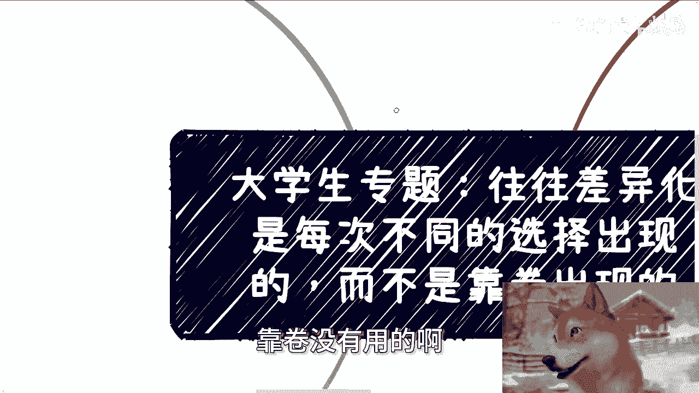
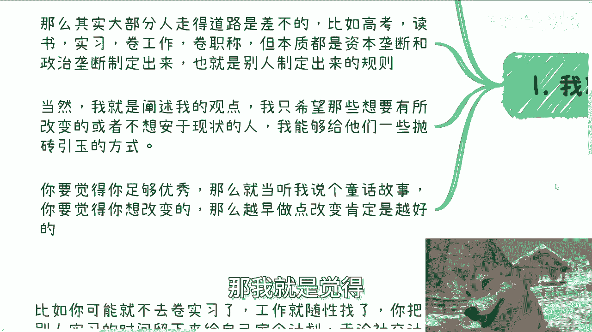
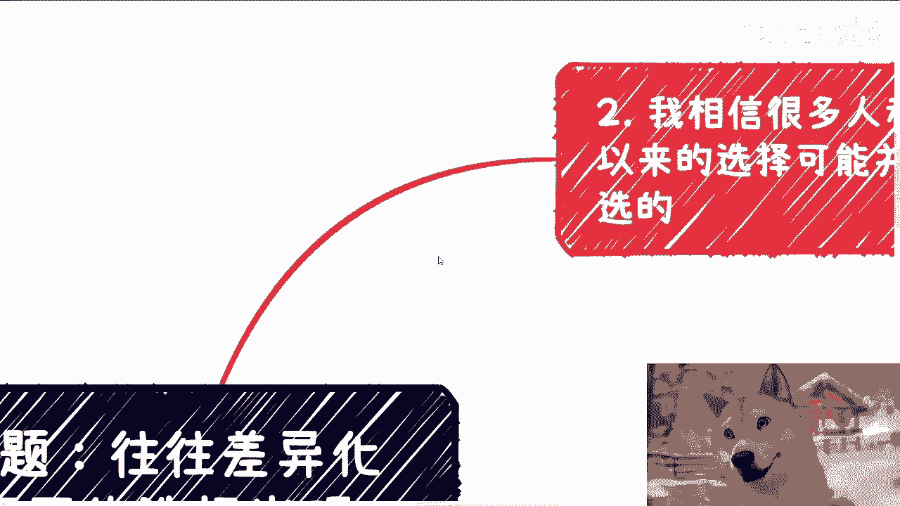
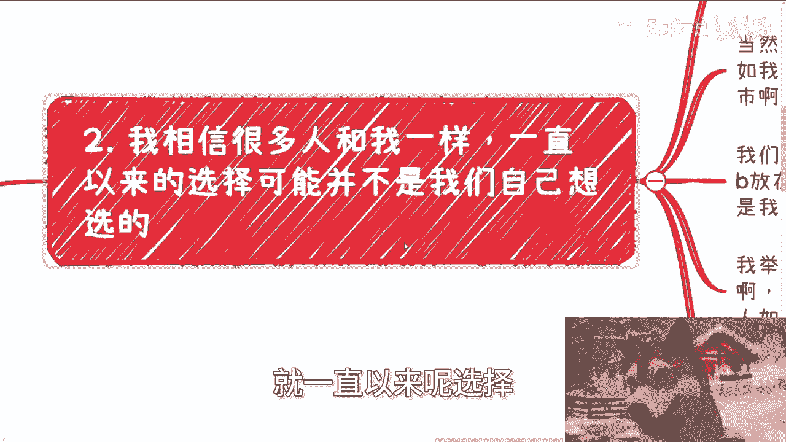
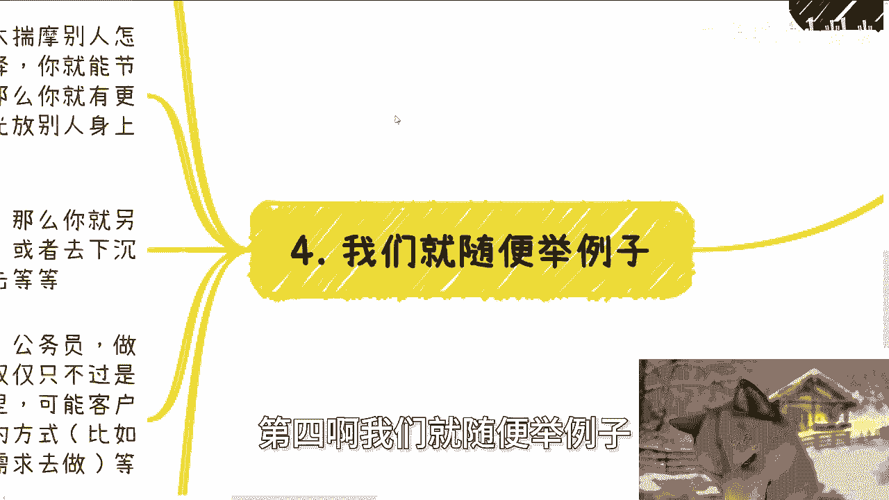

# 大学生专题：往往差异化是每次不同的选择出现的，而不是靠执着的卷 - P1 - 赏味不足 - BV1rstCeXEHJ

好啊大家好啊，这个今天叫什么杭州的活动啊，圆满结束，这个我哎呀晚上刚回到上海啊。

在高铁上正好给你们搞搞了一个哼主题啊，呃但这个主题我觉得很重要。

首先啊今天我们这个主题叫做往往差异化，这个选择啊，是每次不同选择的这个转折点的出现啊，你们说白了就是大家如果想要有一些转折点，我们就说就概率上啊，你要有这种转折性转折点的可能性，你靠的是差异化的选择。

你不是靠卷，靠卷没有用的好。

那么我先说个大前提啊，就是现在呢很多普通人其实要往上去卷嘛，咱就这么说，客观的说，咱就不要刚，对不对啊，不不要不要去叫什么，就是当喷子对吧，你你你你就说2024年是不是可能性就很少，很少对吧。

你你又不是2014年，你又不是2004年啊，虽然我不能说都是拼爹，但是拼的呢，他很多东西也的确不是我们自己这辈子啊，或者我们自己当下能控制的对吧，这你你们懂的也懂啊。

那么其实很多时候呢走道路是大差不差的，你比如说高考啊对吧，这个读书啊，实习啊对吧，卷工作啊，卷职称啊对吧，就就你从每个节点上其实每个人都差不多的，但是本质上这些每个人都差不多的东西，制定出来的。

是他们站在上面所给牛马制定出来的对吧，那也就用别人制定出来的规则，那么我们永远做的选择，都是跟着别人制定规规呃，出来制定出来的规则来走，你怎么能与就是脱颖而出，或者说你怎么能走出自己的路呢，这不可能的。

对不对啊，当然啊在这个地方呢，我也我我觉得我也得叠个甲对吧，就是说我只阐述我的观点啊，我只是希望就是那些能享有所改变的，或者不想安于现状的，我能给他们一些抛砖引玉的这种想法对吧。

那你要是觉得你足够优秀啊，或者说你爸妈对吧，你投胎投得很好，你爸妈有很大的积累，那你就当我说个童话故事啊，你要觉得你想改变，那我就是觉得就我们一直说那句话叫什么叫。

as soas possible对吧，咳咳ASAP啊。

那么第二我相信很多人呢其实和我一样，就一直以来呢选择他可能不是我们自己想选的。

就是你看啊，其实所谓的选择无非就三种，一种是自己想选的，第二种是别人灌输的，那当然我们可能我们可能被PUA的很深，我们自己未必觉得是别人灌输的，但客观来讲啊，就第二种是别人灌输的，第三种呢。

就是有很多选择是存存在于这个世界上的，但是我们不知道对吧好，那么当然啊，这种这三种选择，并不是说那种人设的重大选择啊，就你们不要老是往那种，什么很大的节点上去去想啊，而是说比如说我们日常对吧。

做对任何一件事情的这个看法，对同事啊，对朋友啊对吧，对做项目啊对呃，自己接下在什么城市啊对吧，找什么对象啊，啊对对室友啊对吧，各种大大小小的事情其实都算，那我们其实做选择的时候呢，并不是真的啊。

就比如说你说我们今天陈老师说做选择了啊，好你说我们做选择什么什么逻辑啊，是你面前放了一个A跟一个B啊，然后或者或者这么说吧，前面放了ABCDEFG，你说我来选，不是的，你要真的放在ABCDFG呢。

你其实还是会理性的去选的，但是往往很多时候你的选择呢它是一个惯性，也就是潜意识里面的习惯，我举个例子啊，你比如说很多人面对合作伙伴的逻辑是什么，就是哦要对合作伙伴好，要多送礼，要多吃饭对吧。

要多喝酒对吧，那别人但凡有有求于你，你一定要尽力帮忙对吧，这就是很多人的潜意识，就是我就这么说，你你别我不管你们现在听到这个例子，你们是怎么想的，但是如果现在就立马当当下。

别人真的某一天啊有一个微信一个语音过来，你你有的选吗，其实你没得选，就就是说你只能你你大部分就是说哦好的，我尽量帮忙，对不对，我帮你找找关系，巴拉巴拉巴拉对吧，但是你这种话说的时候。

其实就已经代表你的潜意识做了选择，但是你有理性的做吗，没有是吧啊好，那么第三啊，问题来了，那我们为什么一定一直要做同一种选择呢，对吧，就是我现在比如说在一开始我就想问，你活一辈子。

你现在比如说你活了20多年，30多年，那为什么你做的选择总是同一种选择，就是你看啊很多时候的选择，你会发现最后可能吃亏的是自己，浪费时间的，是自己搭上关系的，也是自己，吃力不讨好的也是自己。

你更别说赚钱了，赚钱他妈更赚不到了对吧，但普罗大众是什么，普罗大众就是你碰到一次两次问题，三次四次问题，他每次都会问自己，就说哎是不是我做的不到位啊，哪怕自己吃亏了啊，是不是我对别人不够好，是不是啊。

送礼不不够到位，但你仔细想想看，这种逻辑奇怪吗，对不对，我就问第一你为什么要对他好，第二你为什么要对他送礼，你对她好，能得出他能从他身上得到什么东西，你确定吗对吧，如果你不确定，那你为什么要对他好。

哎我就奇了怪了，对不对，那就如我们说的啊，这就好像无论什么事情，我们的选择都是有惯性都是一样的，就今天这合作方式如此，明天你对你同学也是如此，后天你对领导也是如此，对吧好，那有的人啊就要说了。

他说那楚老师，你这话说的不对啊，他说那世界上我们跟很多人，比如说我对他好也好，吃饭也喝酒也好，难道我都能拿到确定结果吗，是你这句话没有错，我们的确不可能都拿到，但是我有说我们都要拿到吗，我说的只是说。

我们在日常的各种各样的事情里面，我们只要去做对自己有意义的事情，别的事情你可以不做对吧，没让你说，你今天做这件事情一定要达到啊，你要不确定就可以不做，谁让你做了呢，哦做了吗，到最后吃亏嘛，也是你。

那你你你你说什么呢对吧，你每次沟通的时候，我就问他，那这个选择谁做呢，这不是你自己做的吗，你为什么要这么做呢，而且我就跟他说，当你下次碰到同样的事情时候，还是会这么做对吧，所以说我在这地方写的很清楚。

就是我其实并不是想告诉你们这种选择不好，或者来说一定要选种换一种选择好，我不是跟你们讲，就说啊，好像你这样不对啊，必须那样不是的，但是我只是抛出个问题，就是难道你们不好奇吗，就是人活着大家都还年轻。

就算一次两次违反了你的直觉，违反了你原本一直以来的潜意识的选择，那又如何呢，难道你不好奇他的结果吗，对不对，就有我跟你们讲啊，很多人的这种逻辑非常的神奇，就是他会觉得他说哎我做另外一种选择啊。

不行的那个我做不了，或者我做另外一种选择，唉，不行的那个那个那个呃那个可能我容易被骗，那我就很奇怪，你一直活到现在，大部分人其实都是按照一种直觉，按照一种三观去选择那个那个那个选项，你又没做过别的选择。

你怎么知道呢，哎我他妈奇了怪了对吧，而且而且你要这么想，大众想法都是一样的，我一开始就说了，谁都想从大众当中脱颖而出，但是你们有没有想过，如果普罗大众大部分人走的路其实是一样的路，其面对的恐惧。

面对的焦虑，面对的方式，大家的思维逻辑都差不多，那我就请问当大家都差不多的时候，你又怎么能跟别人不同呢，对不对，你有没有想过这个问题，好，第四啊。

我们就随便举例子，就就真的当聊天举例子啊，比如你可能就不去卷实习对吧，别人觉得不做不去实习，怎么说啊，哎呀不做实习对吧，我我找工作，人家可能看不上我，人家现在找工作都要实习的对吧，是没有错。

但是我不去卷可不可以啊，怎么了啊，我活着必须卷实习吗，谁告诉你的，那我工作就随心找了吗，行不了，没人说不行啊对吧，你把别人实习留下，留下来的时间给自己定个计划，无论社交上的计划还是短期项目。

盈利计划都行啊，就不管成不成功，你获得的经验跟你所见所得到的见识，你相比普罗大众相比，大刘来呃，就是就是随大流来讲，你都是不同于人家实习的嘛对吧，这就叫不同的选择，你就比如你可能不再讨好别人。

或者不再去揣摩别人怎么想的，就像我们说的这种合作方或者所谓的大佬，那么其实你每次做一次这样的选择，你就能节省下来很多的时间，你就能很少很多内耗，那么你就有更多的时间去利用，对不对，那你要我说。

哪怕你睡大觉，也比把时间消耗在别人身上靠谱吧，对吧好，那第三比如做开发的，别人都在卷代码，卷框卷框架卷模型，那你可以另辟蹊径啊，你说哎我可能就想着就是我不点技术了啊，我也不卷这个叫什么。

就是就是就是这个呃架构对吧，那我卷什么呢，我哎我就卷客户哎，我就尽可能的发挥自己的能动性，寻找，比如说高效客户对吧，一线城市找不到，找二线城市，二线城市找不到，找三线城市，对不对，或者下沉市场。

我去打信息差，什么信息差呢，就是我的能力可能不太行啊，但是呢就是说我在一线二线我可能不太行，但是我在三线四线我可以降维打击，对不对，一样的道理，那这种选择也是选择啊。

谁说卷一定就他妈的必须在一个地方卷的，每个人情况都不一样，对不对啊，那么我希望大家明白，就是说并不是说啊在你们的脑子里面，就是说啊我只有工作，我不工作，要么就公务员，我不公务员，要么就做老师。

教师编对吧，我不做老师，要么做医生对吧，要么是事业编对吧，呃我不做这些，我要么就创业，谁跟你讲的啊，你你要是这么就是宏观的框架上面，你这么定，我觉得没问题是没问题，但是问题是哼。

工作这两个词能概括所有的工作吗，公务员这三个词能概括所有的公务员吗，你不能一概而论的呀，对吧哦，那同样道理我那我就问了，那那那同样的大家，如果啊我就说从老百姓角度来讲，那那凭什么大家都是工作。

有的人一年就10万，有的人一年100万呢，唉他妈的按照你们这说法就就都叫工作呀，诶奇了怪了，对不对，所以说你有没有想过，就是有的时候，仅仅可能只是换一种做事情的方式，你可能并没有改变你想走的这个路线。

但是你比如说可能领域换了换，可能客户换了换，可能城市换了换，可能你做事情方式换了换，你像我这里又又打了个比方，比如你从闷头自己干活对吧，做事情呃变成了更多的去寻找需求，满足需求去做对吧。

你最终你就拿那个写代码来讲，他可能最终还在写代码，但是当他的行为逻辑不一样的时候，当他的写代码满足的是企业端，政府端，高效端，或者说是一些大客户端的时候，它的性价比就远远高于工作对吧，一样的道理呀。

你说你要脱颖而出，你要寻求改变，不是单单从宏观角度寻求改变，没有用的对吧，你就你像最近打黑神话，你你你你有没有这种感觉，就是你们所谓的改变，无非还是在如来的五指山上面，也不是五指山啊。

就就就这个手掌心上面，再按照他既定的路线往前走，无论你怎么卷对吧，其实你就这么想，我一直说社会是多元化的，是多个金字塔造成而形成的，为什么，因为一样的道理，就拿我们刚刚说那个代码的人来讲。

他今天卷工作是不是在一个金字塔里面，有优优等生啊，有有有做的好的，有中等有差的对吧，但同样的他今天去做一些，比如说大客户端的，比如说企业端啊，政府端啊对吧，就高效端的这种业务，那么对他来讲。

他虽然换了一个业务，换了个客户去做，但是在他当当他到那个业务的时候，他所在的那个业务领域也是个金字塔，也有人做的好，有人做的不好，也有人做的一般，对不对好，那你有没有想过我们要的是什么，要的是田忌赛马。

你说我们在一个金字塔里面往上卷，冲到最上面来的容易，还是说我在多个金字塔里面想办法，就是说哎我我可能有些金字塔里面呢，我可能冲的是中等，有的竞赛里面呢我可能冲的是能能中上的。

有的竞赛里面呢我可能做的比较差对吧，或者怎么样子，就这些东西不，你要明白，大部分不是因为我们的怎么说呢，就是说就是说努不努力造成的，而是我们每个人的确有每个人不同的风格，不同的性格。

不同的就是天赋吧对吧，你不能一概而论嘛对吧，所以说我在这地方也写了，就是我们可以尝试着并行，在多个不同的领域里面，找到不同的切入点的金字塔去尝试，那么我们就可能在某些金字塔里面走到中上，甚至优秀。

谁知道呢，你不去试，你怎么知道呢对吧，那么我们你看啊，我们讲完了之后，你再回到今天这个最大的主题上面，你所有的事情不去世，但是反而你说我想脱颖而出，你怎么脱颖而出，哎我他妈就奇了怪了对吧。

你你所以我就说你你有没有想过，有没有想过这么一个问题哦，好吧行啊，那反正就是就像我说的，我就是抛砖引玉啊，希望能给大家一些启发吧，啊咳行啊，那个就这么着吧，然后剩下的话就工作上面好吧，职业规划呃。

副业啊，创业啊，或者你们自己导跟导师做什么项目啊，这里面涉及到一些股权啊，期权啊，呃什么估值啊，融资啊，各种各样的东西啊，包括像今天线下可能有些活呃，就是他们做的一些产品啊，做一些服务。

像就是让我给他们review的，那就是就是帮忙给点意见啊，或者怎么样都行啊，你们可以整理好对应的问题跟个人背景好吧。

