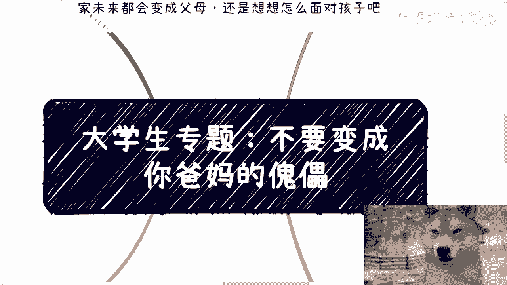
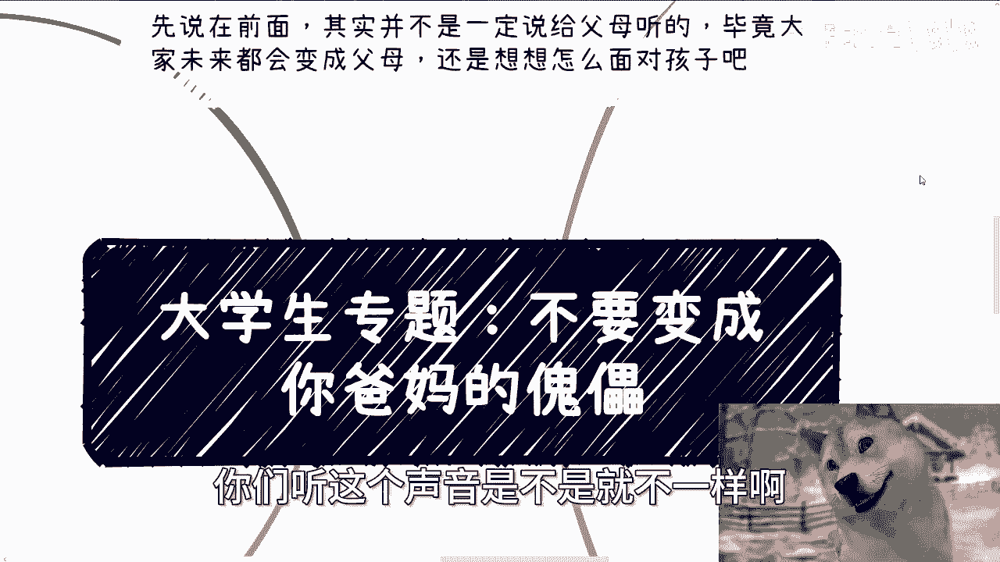
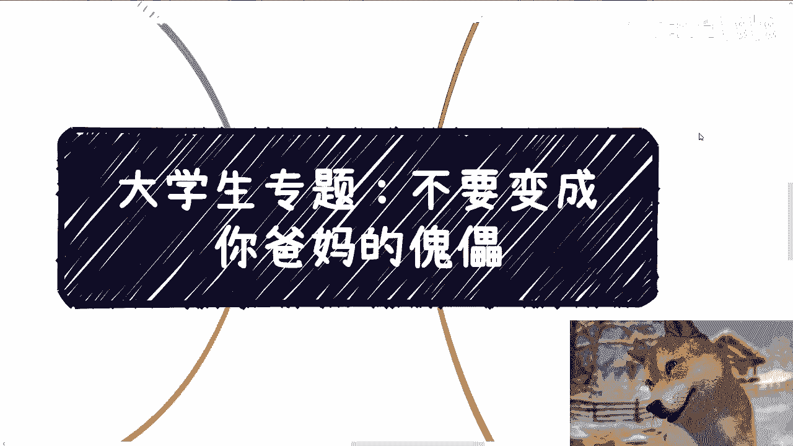
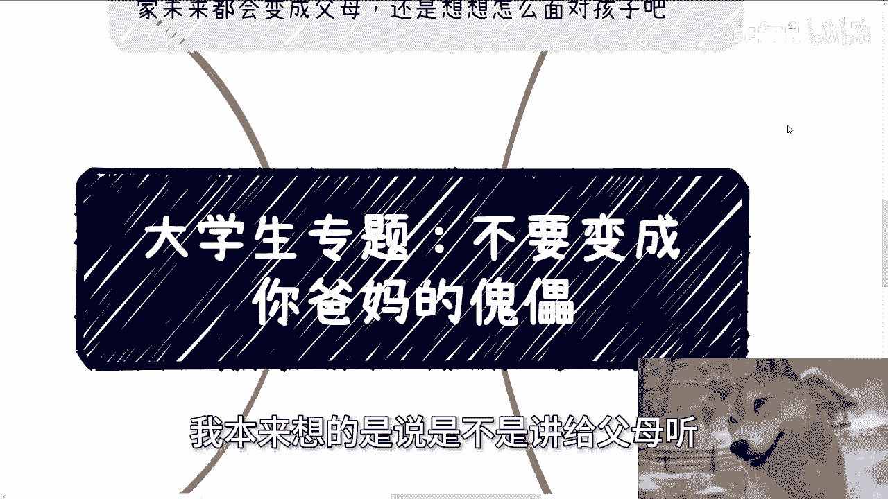
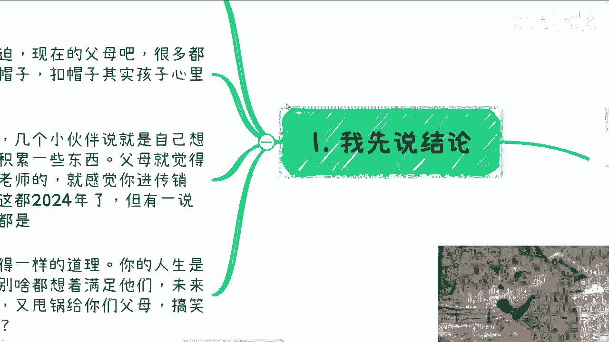
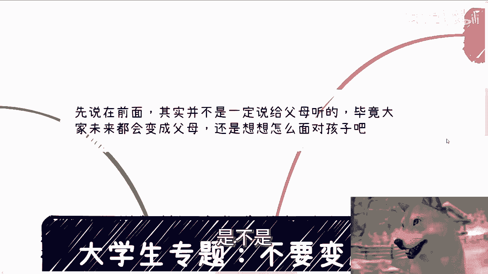
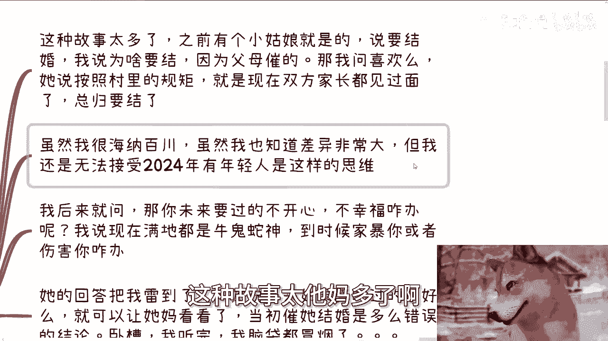
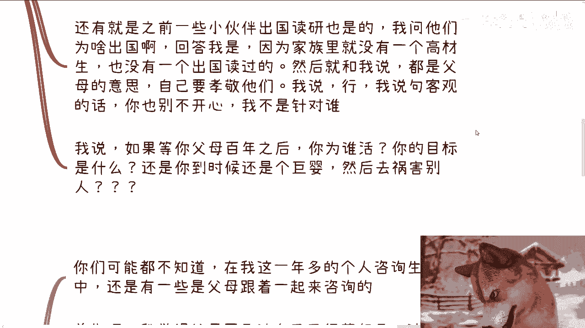
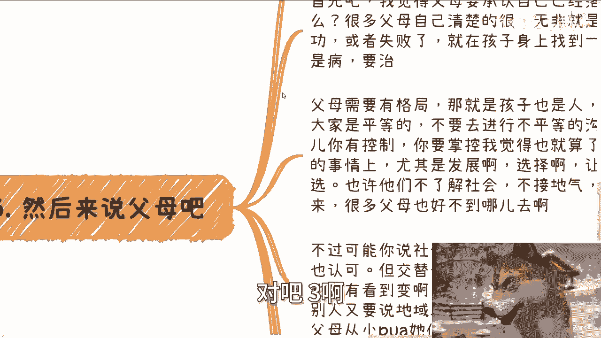

# 大学生建议：不要成为爸妈的傀儡 - P1 - 赏味不足 - BV1wPsvesEWV

好大家好，我觉得我今天感冒已经到高峰期了。

你们听这个声音是不是就不一样啊。

哎呀我给你们讲完，今天录完。

我待会下午就去医院看一下，首先啊我们今天这个专题啊。

叫做不要变成你爸妈的这个傀儡啊，呃本本身啊。

我一开始想讲这个内容的时候，我本来想的是说是不是讲给父母听。

但我后来想了一想呢，他他妈好像也不是一定讲给父母听，为什么，因为毕竟你们未来也早晚会变成父母，对不对。

那我觉得也也有道理啊，就大家一起走进来听一下，对不对啊，首先我先说结论啊。

就是从父母角度来讲，我觉得你得给出自己的观点，得给出自己的建议，得给出自己的想法，这都没问题，但是从客观的角度来讲，大家都是人，无非就是要沟通，而且我觉得要平等的沟通。

而不是那种强制性的控制欲望很强的沟通对吧，就就我这边也写了，你别想着控制或者强迫，就现在的父母啊，很多他妈的啊都属于自己，都他妈还没活的像个人了啊，就是呃呃不停的PUA自己孩子啊。

然后动不动呢就扣帽子扣帽子，其实我觉得在孩子其实很多人也不是孩子了，对不对，他妈大家都是成年人，对不对，你给一个成年人扣帽子，你让对方怎么想，而且还是那种不平等的，因为你是我爸，因为你是我妈。

所以给我扣帽子，谁呀，啊咳对吧，你比如说前两天在杭州的活动，几个小伙伴就说啊，就说他们自己想做点啥对吧，多赚点钱，多积累些东西，卧槽你要我说啊，这孩子哪里找啊，这种孩子什么地方找啊，人家多赚点钱。

多多积累点东西，就不不就是不想啃老吗，对不对，人家自己多想赚点钱，怎么了呢，我他妈不明白了啊，然后做父母的什么，做父母的就觉得必须考公务员，你不考公务员，就是不孝，哎你吊对不对啊，然后呢就觉得哎呀。

你必须学校里面要积累点东西，你现在学校里面不积累，不听老师的，就感觉进了传销，进了邪教了，哎奇了怪了哦，一切得如你意，不如你意，就他妈进传销进邪教了，怎么滴啊啊现在他妈2024年啊。

他妈不是1924年了，是不是，但我有一说一这种腐朽的父母，他妈的满地都是对吧，你叫他们父母就他妈的也就是生育整，剩下是什么养育之恩对吧，剩下什么我操全他妈是巨婴对吧，我觉得你从孩子角度来讲。

我觉得一样的道理就是你的人生是你的，又不是你父母的，你别想着什么都他妈满足他们，所谓还套了个帽子，满足他们就孝顺他们，哎奇了怪了，谁他妈告诉你的啊，未来过得不好了或者后悔了啊。

回头又要的又又得甩给给你们父母，我跟你讲，搞笑嘞，选择还不是你自己选的，是不是好。

第二我们先从孩子来讲啊，这种故事太他妈多了啊。

我就这么跟你们讲，我他妈都到现在为止做C端的咨询，做了也他妈快一年半了，两年时间了，对不对，卧槽这他妈简直就他妈故事会呀啊，要不是碍于我他妈有职业职业操守，对不对，我他妈是不是哎呀。

真的是之前有个小姑娘就是啊说要结婚，我说你为啥要结呢，他说父母催的好，那我说你跟那个男方见过吗，他说见过了啊，也就认识了大概大半年啊，那我说你你喜欢吗，你知道他怎么回答，他说按照我们村里的规矩。

就是现在双方家双方家长都见过面了。

那总归要结的，哎他妈什么叫总归要结的，我也搞不懂了啊，我甚至都觉得我他妈穿越回去了，对不对啊。

虽然我很我，我觉得我这个人还是很海纳百川的哦，虽然我也知道差异化很大。

但我还是无法接受，2024年有他妈年轻人是这种思维啊，我后来就问，那我说那你未来要是过得不开心不幸福咋办，我说现在满地都是牛鬼蛇神，到时候他妈家暴你或者伤害你怎么办，卧槽我只能说他的回答把我雷到了。

真的把我雷到了，他说未来如果真的过得不好，就可以让他妈看看，当初催她结婚是多么错误的结论，卧槽我听完我他妈CPU都烧了，对不对，咳哎但是我跟你们讲，还是那句话，有一说一这他娘的才是普罗大众啊。

还有就是一些小伙伴出国读研也是的，我问他们，我说为什么出国啊，回答我说，因为我们的家家家庭里面，家族里面没有一个高材生，也没也没有一个出过国读过书的嘶，我他妈已经开始满脸问号了，这有因果关系啊。

然后就跟我说，唉都是父母的意思，自己嘛从小都是很孝顺的对吧，我说你这叫孝顺，你确定你这不是巨婴，不是妈宝男对吧，我说行啊，我说这么说吧啊我听我，我其实跟他解释了半天，我发现他听不懂，我说那这样说吧。

我说句客观的，你也别不开心啊，我说我也不是针对你，我说如果等你父母百年之后，你接下来怎么活，你为谁活，你目标是什么，还是到时候的就他妈躺在那装死啊，还是还是他妈的祸害别人，哎我他妈奇了怪了。

对不对，咋滴啊，你父母一直陪着你啊，所有东西你父母做决定，卧槽我他妈无理无解了，都是一个硕士啦。

对吧三啊，然后我们就来说父母你们可能不知道啊。

在我这一年多的个人咨询人生生涯当中，卧槽他娘的，还有一些是父母跟着孩子一起来咨询的一个字，吊对吧啊，首先啊我觉得父母要承认啊，不得不承认啊，我觉得父母得自己得要承认自己已经落伍了，这有什么难的呢，对吧。

那很多父母自己清楚得很，无非就是别的地方不成功或者失败了，就在孩子身上找到一些控制权，我跟你讲，这他妈是病，这要治，但是我话又说回来，屏幕面前面的你们也是一样的，你们不要觉得好像怎么样。

你们以后很有可能也是这样，对你们的孩子，甚至不要说以后对你们的孩子，你们可能现在就是这样，对你们的对象，没办法的人，就这个样子啊，我不管你承认不承认，你内心有很多人内心就他妈这么黑暗，对不对。

他会给自己找无数种借口，但是他他妈就是不愿意承认啊，我跟你们讲，不要不承认，因为为什么，因为社会变化就很快，你们的父母肯定是比我大的对吧，你我是我就这么说，我的同学，我的同龄人现在都他妈落伍了。

更别说你们的父母了，妈的搞他妈蛋呢，在啊啊对吧，然后第二父母呢我觉得需要有格局，那么孩子也是人啊，大家都是人啊，大家要平等啊，不要进行不平等的沟通啊，对不对，我觉得一些小事你有控制对吧。

你说不要哎黄赌毒对吧，你要怎么样子，我觉得你要去掌控，没有问题，没毛病，你在一些红线一些小事上面去做没问题，但是在孩子的发展上面选择上面，包括他的未来一些职业发展啊，包括包括做事情上面。

你让他们自己去呗，对不对，哎，有什么不能自己做抉择的，就像我说的，他妈的还能陪一辈子啊，他妈搞他妈笑嘞是吧，我就这么说，也许啊孩子现在不了解社会，不接地气，然而在我看来，很多父母他妈也好不到哪里去呀。

那么搞笑嘞对吧哦，不过可能你说啊，有的人也会说，他说哎呀曹老师，社会正在正在交替啊，一个变化的过程，这句话我认可吗，我认可的没毛病啊，没毛病，但是你交替也好，变化也好，关键他妈是变呐，我没看到变呐。

我他妈看到的是什么，他穿越对吧，腐朽冥顽不灵，对不对，一些省市区我也不想说，我都不想说什么，省市区说了，他妈的到时候又要有人说了，哎妈陈老师他妈地域歧视对吧，我跟你讲，真的不下到现在不下五个人跟我说过。

父母从小PUA，他们说啊，高考只能考自己所在地区，出去就要被人骗了，你们什么都不懂，读完就要结婚对吧，结完婚就他妈生孩子，生完孩子就是你这辈子就圆满了对吧，不单单P父母在他妈PUA7大姑八大姨。

各种各样的爷爷奶奶啊，叔叔爷爷啊，叔叔那个阿姨都在PUA，这对吧，我说实话我听完我也只能无能为力啊对吧，谁都只能无能为力啊，能怎么办呢对吧，我只能说什么，我只能说他妈的投胎也是种技术活对吧。

但是呢话又说回来啊，父母是父母，我们是我们父母PUA，你们那是父母的问题，你们要被PUA，那是你们的问题，那他妈的没有一个人是无辜的，对吧啊，四，其实啊你看我整个这个专辑都是给大学。

但因为为什么会写这个专辑，就是因为之前有人跟我说，要给大学生一些建议，但是你们仔细想想，看到今天是我给你们建议吗，不是啊，我唯一想告诉你们的就是做自己，你别被这个社会，被家庭，被老师，被父母去PUA。

对不对，咳咳没了，你要说唯一的建议就是，这个你们知道的未必就是一切，你们知道的一切未必就是真的对吧，你们知道的未必就是一切，你们既然是年轻人，那么更多的东西需要你们自己去探索，你们有没有想过一个问题啊。

你们其实都比我小，如果你们都不去探索，都不去看，不去紧跟这个社会的这个发展进步，那他妈整个社会怎么可能发展啊，啊哦你们这些人年轻人都不去探索，不去改变未来，怎么改变，你指望我们改变吗，指望这帮老DER。

指望这些啊腐朽的人改变，你们自己想想看，逻辑通吗，对不对，但是改变的第一步是什么，改编第一步就是抛开原本知道的这些。

去睁开眼睛看看社会真实的样子是什么啊。

不要老是想着别人给你答案不存在的好吗啊，我再次跟你们强调啊，就是你们有些小伙伴来过我活动的，或者咨询过我的，有过我微信的，你们记住一点，你们只要给我发消息，我不回的，一定不是因为我没看到。

是因为你们问出来的问题，简直他妈的哼，就是叫什么叫做你们看似是一个大学生啊，或者是个成年人，但是，所有的思考没有自己的思考，所有问出来的问题也从来没有自己的举一反三，核心点从来不在问题上。

本身上面没什么好好好回的，怎么回法呢，好吧行啊，那就这么着啊，额那么剩下的话就直接规划啊，工作上面，那么是额商业规划副业啊，包括做一些其他的啊，一些相关的一些额这个合作啊。

或者在这里面有一些比如说什么股权啊，期权啊，合同啊对吧，或者相关的一些东西呃，你们可以整理好，如果你们觉得啊希望通过跟我的一些沟通啊，让你们能够少走点弯路，或者说整理呃，或者说能够让我给你们一些。

更接地气的建议的话，那么你们可以整理好对应的问题跟个人背景，好吧，我们再来做咨询。

