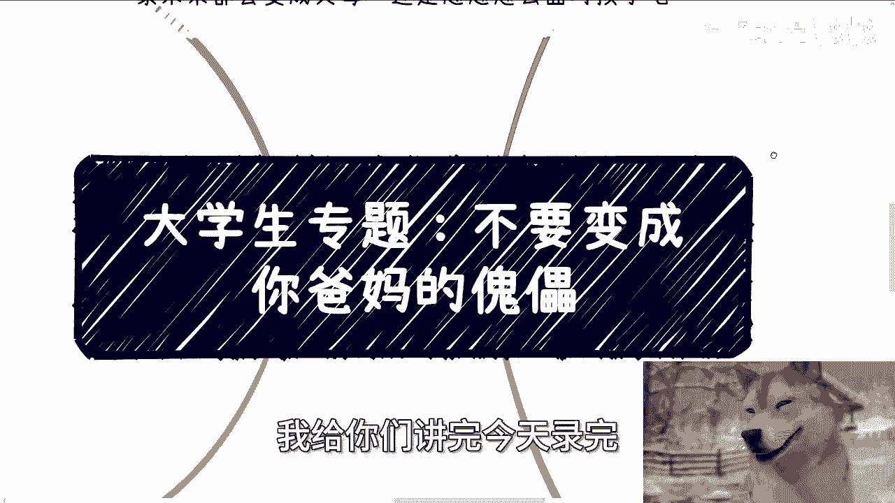

# 大学生建议-不要成为爸妈的傀儡---P1---赏味不足---BV1wPsvesEWV

在本节课中，我们将探讨大学生如何在与父母的互动中保持独立人格，避免成为父母意志的“傀儡”。我们将从父母和孩子两个角度分析问题，并提供核心的行动原则。

---

## 概述

本课程旨在帮助大学生理解与父母建立健康关系的重要性。核心观点是：父母可以给出建议，但不应强制控制；孩子需要为自己的人生负责，而非盲目顺从。双方需要进行平等沟通。

---

## 一、 核心原则：平等沟通，而非控制

上一节我们概述了课程目标，本节中我们来看看处理亲子关系的核心原则。

从父母的角度来说，提出自己的观点、建议和想法没有问题。但从客观角度看，双方都是人，需要进行沟通，并且必须是平等的沟通。

**核心公式**：**健康关系 = 平等沟通 ≠ 强制性控制**

许多父母自身的生活并不成功，于是试图在孩子身上寻找控制权。这是一种需要纠正的问题。同样，许多孩子未来也可能对自己的伴侣或子女犯下同样的错误。社会变化很快，父母辈的知识和经验很可能已经落伍。

---

## 二、 从孩子的角度：你的人生属于你自己

理解了核心原则后，我们从孩子的视角来具体分析。孩子需要明白，人生属于自己，而非父母。

以下是孩子需要警惕的几种常见情况：

*   **关于婚姻**：有人因为“父母催促”和“村里规矩”而结婚，并非出于自身意愿。这种将未来幸福作为证明父母错误的赌注的想法，是本末倒置的。
*   **关于学业与前途**：有人出国读研只是因为“家族里没有高材生”，完全遵从父母的意思，缺乏自我规划。这并非真正的孝顺。
*   **关于独立思考**：如果父母不在了，你为谁而活？你的目标是什么？不能永远依赖父母做决定。

**关键点**：盲目满足父母的所有要求，并冠以“孝顺”之名，是错误的。未来的选择后果需要自己承担。

---

## 三、 从父母的角度：承认局限，给予空间

从孩子的困境中，我们可以看到父母一方存在的问题。本节我们来看看父母应有的觉悟。

以下是父母应该做到的几点：

*   **承认落伍**：父母需要承认自己可能已经跟不上时代发展。试图在孩子身上寻找控制感，是一种心理问题。
*   **要有格局**：孩子是独立的人。沟通必须平等。在一些原则性小事上可以管教，但在孩子的发展、职业和人生选择上，应该让他们自己决定。
*   **停止PUA**：有些父母（乃至家族）会通过贬低、恐吓（如“离开本地就会被骗”）来操控孩子，要求其按固定模式（高考、结婚、生子）生活。这是腐朽的思想。

**核心代码**（比喻）：`if (社会在变化) { 父母.知识库.update(); } else { 家庭.矛盾.加剧(); }`

父母与孩子都需要改变。如果年轻人不去探索和改变，社会就无法进步。

---

## 四、 给大学生的唯一建议：做自己，去探索

上一节我们讨论了父母应有的改变，但改变的关键起点在于年轻人自身。本节是给大学生的核心建议。

我唯一想告诉你们的就是：**做自己**。不要被社会、家庭、老师或父母PUA。

**核心建议**：
1.  **你们知道的未必是一切**。
2.  **你们知道的一切未必是真的**。
3.  **你们需要自己去探索**。

改变的第一步，就是抛开原本被告知的一切，睁开眼睛去看社会的真实样子。不要总是期待别人给你答案。提出的问题应该经过自己的思考，能够举一反三，而不是直接索要解决方案。

---

## 总结

本节课我们一起学习了如何避免成为父母的“傀儡”。
1.  我们确立了**平等沟通**是健康亲子关系的基石。
2.  从**孩子**角度，明确了人生需要自己负责，不能盲目顺从。
3. 从**父母**角度，指出了承认局限、停止控制的重要性。
4.  最终，给所有大学生的核心建议是：保持独立思考，勇敢**探索真实世界**，为自己的人生做主。

**记住**：你的选择，最终由你承担后果。