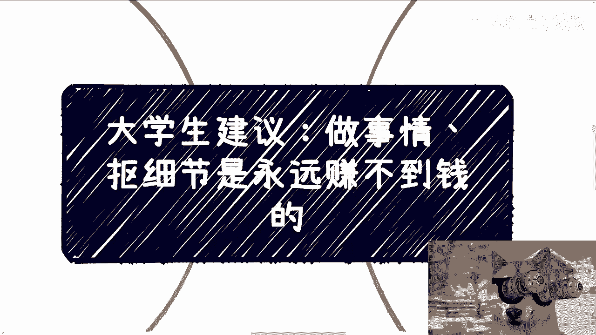
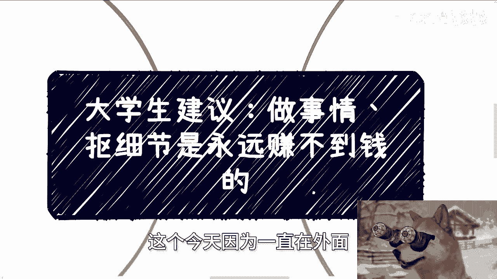
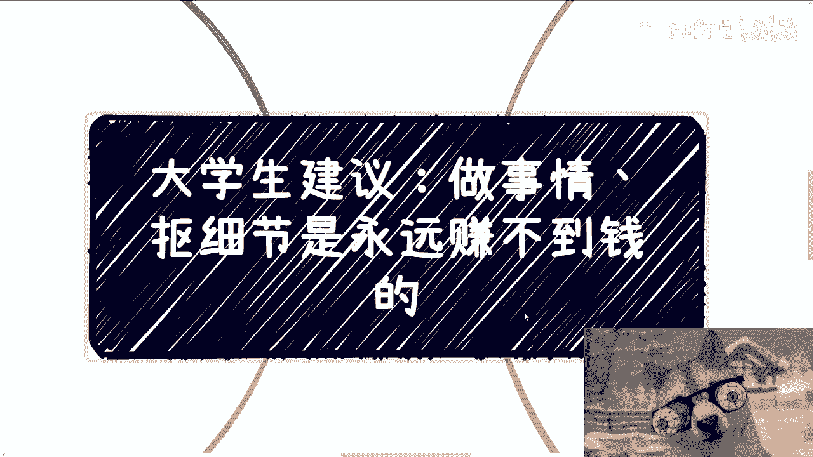
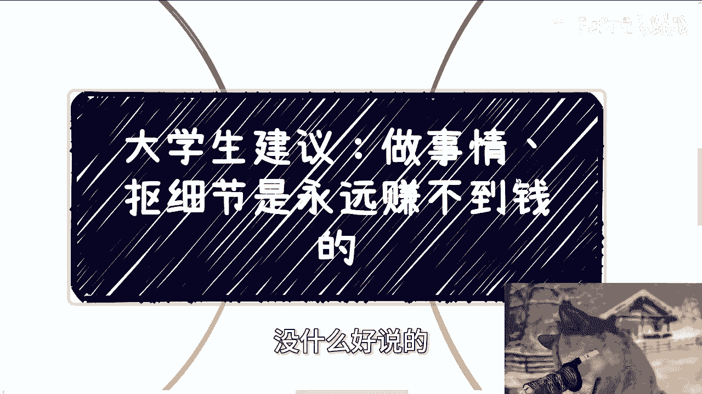
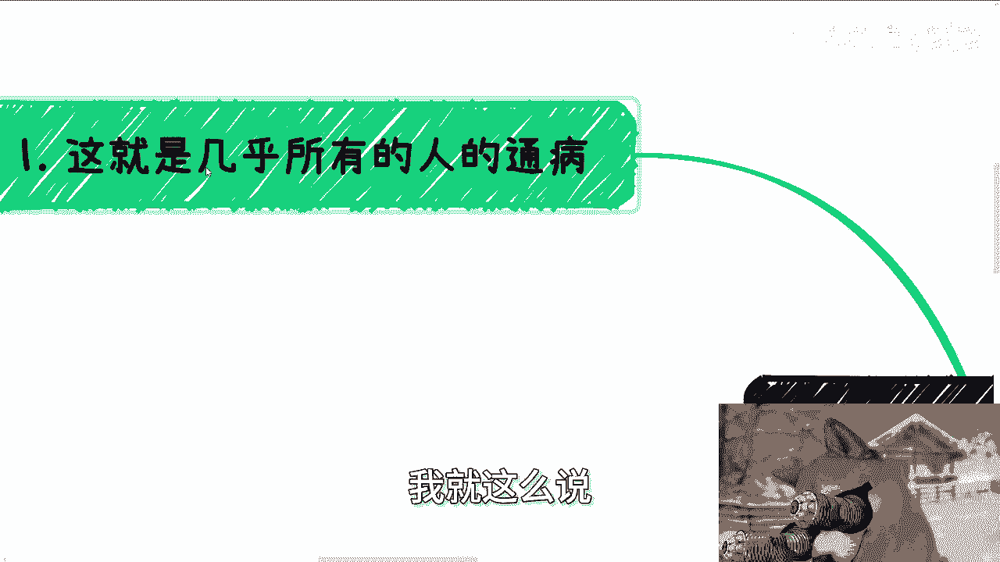
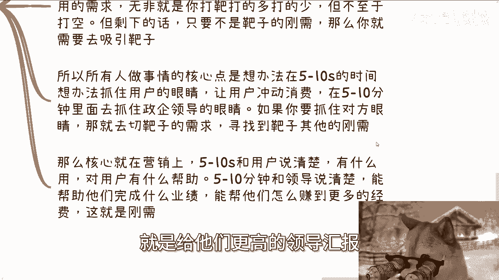
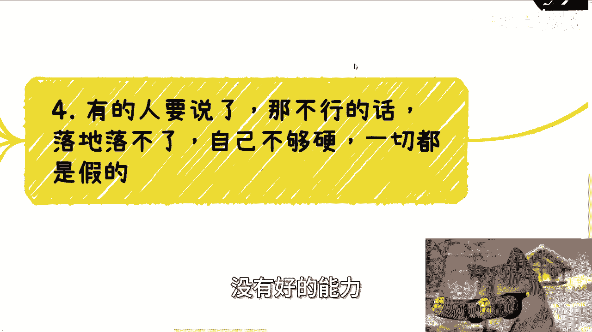
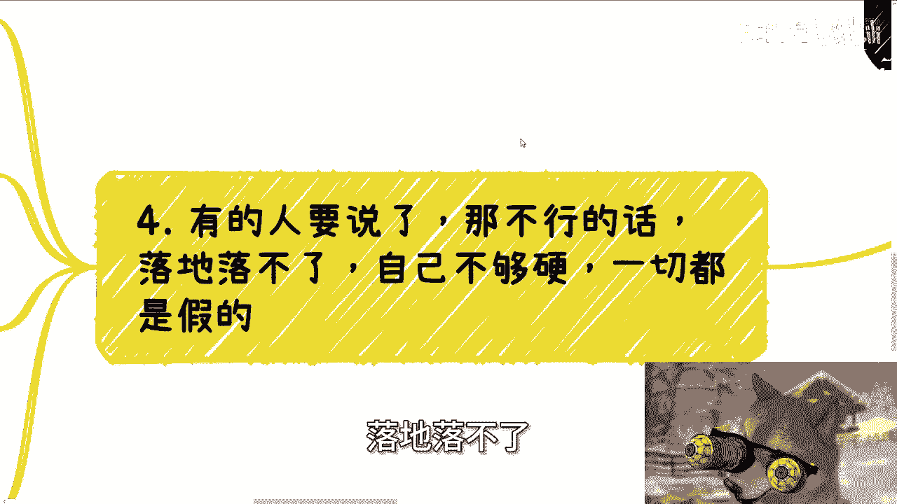
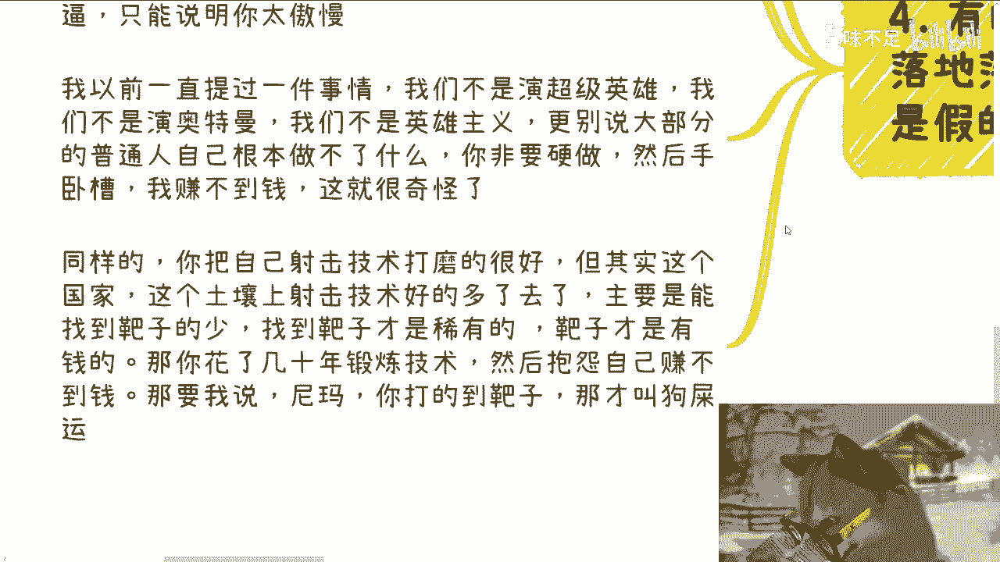
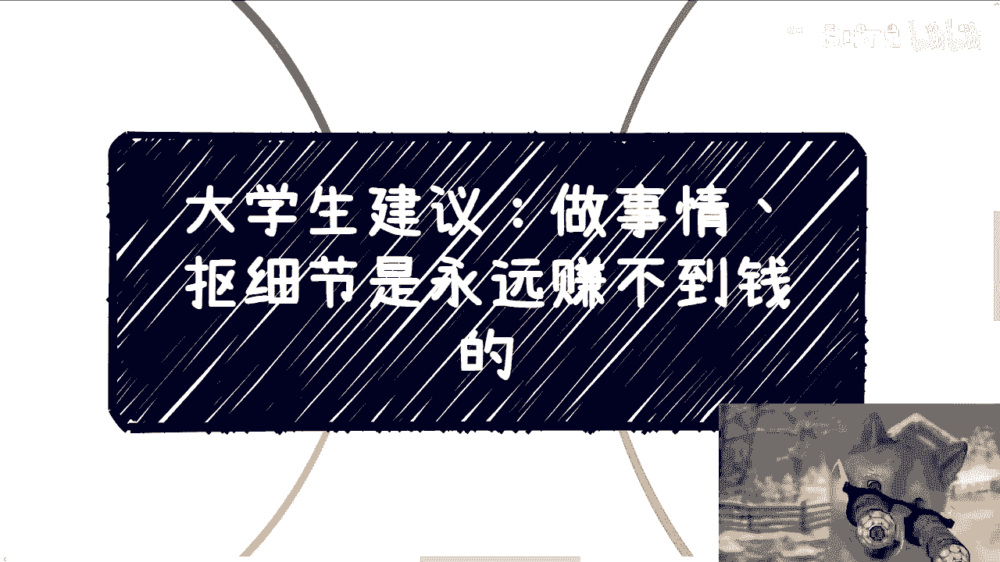

# 大学生建议：做事情、抠细节是永远赚不到钱的 - 课程 P1 🎯

在本节课中，我们将要学习一个核心观点：单纯地“做事情”和“抠细节”并不能带来财富。我们将通过比喻和分析，理解为什么找到市场需求（“靶子”）比打磨自身技能（“射击技术”）更为关键。

---

上一节我们介绍了课程的核心主题，本节中我们来看看为什么“做事情”本身无法赚钱。

这个观点非常直接且绝对。原因在于社会运行的规律就是如此。

首先，指出一个普遍现象。

以下是大多数人的通病：
*   关心细节，研究如何做事情。
*   花费大量时间打磨技术。

所有专注于打磨技术的人，都赚不到钱。这是基于当前社会环境得出的结论，与过去的情况不同。

---

上一节我们指出了普遍问题，本节中我们来看看一个常见的错误思维模式。

许多人提供方案时，都存在目标缺失的问题。

以下是典型的错误思路：
*   计划组建团队或利用技能开始做事。
*   当被问及“客户在哪”、“用户在哪”时，回答“我先做了再说”。

这就像在射击前不寻找靶子，而是准备“打了再看靶在哪”。这种行为缺乏目的性。做事情需要有明确的目标，分析出真正的市场需求是关键。磨练技术固然重要，但找到“靶子”在哪里更为关键。没有靶子，技术再好也无用。

---

上一节我们讨论了目标缺失的问题，本节中我们通过具体场景来分析如何吸引客户。

接下来，我们摆事实讲道理。无论是面向个人消费者（C端）、企业（B端）还是政府（G端），吸引客户的注意力时间都非常有限。

以下是不同场景下的注意力窗口：
*   **对B端/G端（企业/政府）**：尽管会议可能长达数小时，但对方真正能听进去的时间可能只有**5到10分钟**。
*   **对C端（个人消费者）**：在宣传产品或服务时，用户平均停留时间可能只有**几秒钟**。例如，短视频平台的最佳长度是30秒，因为用户停留时间往往只有5到10秒。

问题在于：你能否在5秒内向用户说清产品？能否在10分钟内让企业领导明白你的优势？显然，这非常困难。因此，仅仅打磨产品、抠细节、成为专家，就像练习打靶技术，虽然有用，但前提是你必须知道“靶子”（市场需求）在哪里。

---

上一节我们分析了注意力时间的限制，本节中我们探讨如何在这有限的时间内抓住客户。

核心在于切换视角，从“我能做什么”转向“客户需要什么”。

你需要在这极短的时间内抓住对方的眼睛：
*   **对C端**：在**5~10秒**内引发冲动消费。
*   **对B/G端**：在**5~10分钟**内说明你能为他们带来什么价值。

要实现这一点，就必须切入“靶子”的需求。例如，小姐姐跳舞3分钟之所以有效，是因为它切中了“靶子”的通用需求。同样，情感、男女权话题也容易引起广泛关注，因为它们是人类的基础需求。

然而，非常遗憾的是，你们在学校或岗位上锻炼的大部分技能和获得的学历，**都不是市场的直接刚需**。学历高低、技术强弱，与客户或领导的痛点无关。

**核心在于营销**：在短时间内向用户说清“有什么用”；向领导说清“能帮他们完成多少业绩、赚取多少经费、如何向上级汇报”。**这才是刚需**。

---

上一节我们明确了营销和需求的重要性，本节中我们来驳斥一种关于“自身能力”的常见误解。

有人会反驳：没有好的学历和能力，自身不够硬，一切都是假的。

这种想法是错误的。对于赚钱而言：

**最大的错误行为是：什么都自己做。**
**最厉害的行为是：自己什么都不做。**

如果你想通过拼命劳动来赚钱，那并不是高效的赚钱方式。如果你认为自己必须亲自落地、提供产品或服务，并因此得出“能力不行就赚不到钱”的结论，那是一种傲慢。

现实生活不是超级英雄电影。大部分普通人无法独自完成所有事。你凭什么认为你做了就能赚到钱？同样，射击技术好的人很多，但能找到“靶子”（付费方）的人很少。后者才是稀缺资源。

如果你磨练了几十年技术却抱怨赚不到钱，那很合理，因为磨练技术本身并不保证你能找到靶子。即使偶然成功，那也可能是运气，而非技术必然的结果。别人夸赞你技术好，有时可能是一种讽刺，而非赞美。

---

我希望你们不要只从字面理解“射击”和“靶子”。请将它们具象化，映射到各种实际事情上。道理已经描述得很清楚：**只要找不到“靶子”（市场需求），想赚钱就是痴人说梦**，无论你的“射击技术”（专业技能）多准。

---

本节课中我们一起学习了：
1.  **核心矛盾**：“做事情”、“抠细节”与“赚钱”没有必然联系。
2.  **关键比喻**：将专业技能比作“射击技术”，将市场需求比作“靶子”。
3.  **核心结论**：找到“靶子”（市场需求）比磨练“技术”更重要。
4.  **实践方法**：将有限的时间精力用于**识别需求**和**有效营销**，而非一味埋头苦干。
5.  **思维转变**：从“我能做什么”转向“市场需要什么”，从“亲力亲为”转向“整合资源”。

**总结公式：赚钱 ≠ 做事细节；赚钱 ≈ 找到需求 × 有效触达**

---

**附：咨询服务**
若在职业规划、商业规划、副业、合作分红、合同、估值融资或具体业务问题上有任何疑问，希望沟通以少走弯路，可以整理好具体问题与个人背景，以便进行咨询。